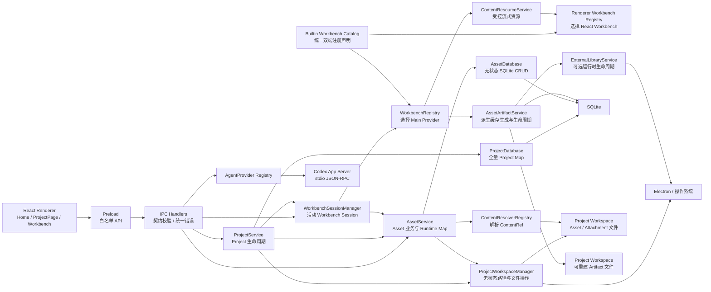

# Learning Companion 技术栈与架构基线

> 状态：当前基线
>
> 更新日期：2026-07-31
>
> 本文同时记录已经落地的实现和已经确认但尚未实施的架构。表格中的“已落地”
> 表示当前仓库已有生产代码；“已确定”表示技术方向已经确认，后续实现不得在
> 没有新设计决策的情况下偏离。

## 1. 产品定位

Learning Companion 是一个本地优先的桌面学习助手。核心体验不是传统聊天窗口，
而是在资料 Workbench 中阅读、选择内容、向 AI 提问，并把有价值的回答沉淀为
可回到原文位置的学习内容。

目标能力：

- 在应用内阅读和编辑 Markdown、纯文本等可编辑资料；
- 阅读 PDF、HTML、EPUB、图片、音频和视频等参考资料；
- 基于当前 Asset、页码、文字选区、区域或媒体时间点向 AI 提问；
- 让 AI 在 Project 范围内关联其他 Asset、Attachment 和长期学习信息；
- 把笔记、解释、思维导图和讲义保存为稳定、可迁移的本地内容；
- 默认复用用户 ChatGPT 账号下的 Codex 能力，不要求额外购买 OpenAI API 用量；
- 所有 Agent 修改都经过应用校验和用户审查，不允许 Agent 直接覆盖资料。

当前不建设云端业务后端，不把 ChatGPT 网页嵌入应用，也不通过 UI 自动化调用
ChatGPT。

## 2. 架构原则

### 2.1 本地优先

- Project、Asset、笔记、生成物、索引和应用状态默认保存在本机；
- 用户拥有资料文件，可以在文件管理器和其他应用中访问；
- 网络不可用或 AI 额度耗尽时，所有本地 Workbench 仍然可用；
- Project Workspace 可以移动和重新定位；
- 后续同步属于可选能力，不是本地数据可用性的前提。

### 2.2 数据与行为分离

Project、Asset、Attachment 和协议对象是纯数据。行为由 Database、Service、
Manager、Resolver、Provider 和 Repository 组合提供。

```text
Project / Asset
    纯数据，不持有数据库、文件系统或 Electron 行为

Database
    SQLite 持久化适配
    是否维护内存索引由具体领域契约决定

Service
    领域编排、生命周期串行化和运行时状态

Manager
    本次 Project/Asset 数据层中用于无状态的路径与文件系统操作

Resolver
    把持久化 ContentRef 解析为运行时 ContentHandle

Provider
    提供某种 Workbench 或 Agent 后端能力

Repository
    按稳定键保存和读取特定状态记录
```

组合优先于继承。模块通过小接口协作，不让数据对象逐步膨胀成同时负责状态、
数据库、文件和 UI 的大型类。

### 2.3 单一写入边界

- Renderer 不直接访问文件系统、SQLite、凭证或子进程；
- Electron Main 是 Project、Asset、Workbench 和 Agent 操作的可信写入者；
- Agent 不直接访问 SQLite；
- Agent 对原始 Asset 默认只有只读能力；
- 数据库更新和文件写入必须通过 Main 中的领域 Service；
- 文件写入使用 Revision 检查和原子替换，避免静默覆盖外部修改。

### 2.4 按领域选择事实来源

不要求所有数据都进入数据库，也不要求“删除数据库后能还原一切”。

- 资料正文和生成物正文：文件；
- Project、Asset、Anchor、关系和 Thread Ref：SQLite；
- 当前编辑内容和 Workbench Session：内存；
- 小型 Workbench State：SQLite JSON；
- 当前纯文本和 Markdown 恢复正文：SQLite BLOB，后续可迁移到恢复文件；
- Agent 编辑草稿和历史快照：应用管理的恢复文件；
- FTS、缩略图和解析结果：可重建缓存。

安全性来自能力和路径边界，而不是因为 SQLite 文件本身“不可修改”。

## 3. 总体运行结构



## 4. 语言、包管理和工程工具

| 领域 | 技术 | 状态 | 说明 |
| --- | --- | --- | --- |
| 开发语言 | TypeScript 6 | 已落地 | Main、Preload、Renderer 和共享协议统一类型 |
| 包管理 | pnpm 10 | 已落地 | 锁定依赖和原生模块安装行为 |
| 桌面运行时 | Electron 43 | 已落地 | macOS / Windows 桌面能力 |
| UI | React 19 | 已落地 | Home、ProjectPage 和 Workbench Host |
| 样式 | Tailwind CSS 4 | 已落地 | 主题、布局和组件样式 |
| 前端构建 | Vite 8 | 已落地 | 分别构建 Main、Preload 和 Renderer |
| 打包发布 | Electron Forge 7 | 已落地 | Package、Maker、原生依赖处理和 Fuses |
| 单元测试 | Vitest 4 | 已落地 | Main、共享协议、Renderer 和 Workbench 测试 |
| 静态检查 | ESLint 10 | 已落地 | TypeScript、React Hooks 和 Refresh 规则 |
| 类型检查 | `tsc --noEmit` | 已落地 | 独立于 Vite 的严格类型检查 |

常用命令：

```text
pnpm dev
pnpm typecheck
pnpm lint
pnpm test
pnpm check
pnpm package
pnpm make
```

提交前至少执行与改动范围匹配的测试；功能改动默认执行 `pnpm check`。

## 5. Electron 进程与安全

### 5.1 Main

Main 负责：

- Electron 生命周期和窗口；
- SQLite 与文件系统；
- Project、Asset 和 Workbench 生命周期；
- 文件选择器和系统 Shell；
- 自定义内容协议；
- Codex Runtime 和 App Server；
- IPC 参数校验和统一错误；
- 所有可信写入。

`src/main/index.ts` 只保留 Electron 生命周期、窗口创建与退出协调。
`src/main/bootstrap/create-application-runtime.ts` 负责装配 Database、Repository、
Service、Registry、Workbench 和 External Runtime；`ApplicationRuntime` 持有
应用级对象图，并集中负责 Workbench 关闭任务合并、后台任务停机和资源释放。
IPC 注册与清理位于独立的 `register-application-ipc.ts`，不再散落在入口文件中。

### 5.2 Preload

Preload 只暴露明确的 `window.learningCompanion` 白名单 API：

- 不暴露原始 `ipcRenderer`；
- 每个调用使用共享请求与响应契约；
- IPC 结果统一包装成功或结构化错误；
- Renderer 不能借 Preload 获得任意文件系统或进程能力。

### 5.3 Renderer

Renderer 负责：

- React UI；
- Home 和 Project 页面；
- Workbench React 组件；
- 用户输入、选区和临时 UI 状态；
- 调用 Preload API；
- 展示 Main 返回的领域结果。

Renderer 不负责：

- 推断可信文件路径；
- 直接读写 SQLite；
- 直接启动 Codex；
- 保存认证信息；
- 绕过 Main 修改 Asset。

### 5.4 Electron 安全配置

当前基线：

- `contextIsolation` 开启；
- Renderer Sandbox 开启；
- Node Integration 关闭；
- 导航和外部链接经过 Main 策略；
- Electron Fuses 禁止 RunAsNode、Node Options 和 CLI Inspect；
- 开启 Cookie Encryption；
- 开启 ASAR 完整性校验；
- 只允许从 ASAR 加载应用代码；
- HTML / EPUB 使用隔离 Frame，不获得 Learning Companion IPC。

## 6. 构建、ASAR 与原生依赖

### 6.1 Vite

Vite 不是 JavaScript 运行时，也不只是 TypeScript 编译器。它负责：

- 将 Main、Preload 和 Renderer 分别构建为 Electron 可运行产物；
- 处理 TypeScript、React JSX、CSS 和静态资源；
- 提供开发期热更新；
- 生成 `.vite` 构建目录供 Forge 打包。

TypeScript 类型正确性仍由 `tsc --noEmit` 检查。

### 6.2 Electron Forge

Forge 负责：

- 启动开发版 Electron；
- 调用 Vite 构建；
- 打包应用目录；
- 生成 macOS ZIP 和 Windows Squirrel 安装包；
- 应用 Electron Fuses；
- 处理原生依赖。

### 6.3 ASAR

应用代码和普通依赖进入 ASAR，以减少松散文件、提高分发完整性并配合 Electron
Fuses 校验。用户数据不属于应用包，因此不会进入 ASAR。

以下内容位于运行期外部目录：

- `settings.json`；
- SQLite；
- Project Workspace；
- Asset 文件；
- 缓存和恢复数据；
- Codex Runtime 的用户状态。

### 6.4 better-sqlite3

当前选择 `better-sqlite3 13`：

- 同步 API 与 Main 内的串行领域操作匹配；
- Node-API 预编译二进制减少本机编译；
- Drizzle 支持稳定；
- SQLite 事务、外键和 FTS5 适合本地应用。

打包策略：

- Forge 忽略对 `better-sqlite3` 的重编译；
- 只复制当前平台与架构的预编译 `.node`；
- `plugin-auto-unpack-natives` 把原生模块从 ASAR 解包；
- 提供开发和打包产物的原生模块 Smoke Test。

当前正式目标是 macOS 和 Windows。Linux 不是当前发布阻塞项。

## 7. 前端状态与组件策略

| 能力 | 技术 | 状态 |
| --- | --- | --- |
| 页面和 Workbench Host | React | 已落地 |
| 样式系统 | Tailwind CSS | 已落地 |
| 局部客户端状态 | React State / Hooks | 已落地 |
| 跨组件轻量状态 | Zustand | 已引入，按需使用 |
| Agent Provider UI 投影 | Zustand Vanilla Store | 已落地 |
| Project 响应式布局 | React Hook + Flex / Overlay | 已落地 |
| 无障碍基础组件 | Radix UI / shadcn/ui | 已选，尚未全面引入 |
| 动画 | Motion | 候选，按实际交互引入 |

不采用 Next.js。应用不需要 SSR 或服务端路由，Vite 与 Electron 的构建模型更
直接。

UI 原则：

- 页面组件不直接拼接文件路径；
- Home 只消费 Project Snapshot；
- ProjectPage 只消费活动 Project 的 Asset Snapshot；
- Main 返回完整 authoritative snapshot 修复长生命周期对话框造成的 Renderer
  漂移；
- 错误使用可见模态反馈，不能只记录 Main Console；
- Workbench 可以声明是否接入右键、选区、Overflow 和生成中心。

Home、Project 和 Settings 按 Feature 目录组织。页面组件只组合布局与子组件；
Project 会话、Asset 操作、Home 偏好与项目 CRUD、External Runtime 设置等有状态
编排分别进入专用 Hook。仓库根部的旧组件路径仅保留薄重导出，避免迁移期间扩大
调用方改动。

Project 页面采用 Workbench 优先的响应式布局：

- 宽屏默认左右栏内联展开，并限制两侧最大宽度；
- 中屏默认保留左侧资料栏，右侧生成中心以覆盖抽屉打开；
- 小屏默认收起两栏，左右抽屉互斥；
- 学习资料、生成中心、打开 Workspace 和设置四个图标入口始终存在；
- 覆盖抽屉支持遮罩和 `Esc` 关闭，关闭后焦点返回对应入口；
- 同一窗口模式内尊重手动展开状态，跨模式时恢复该模式默认状态；
- 布局只属于 Renderer 内存，不写入 Settings，也不引入拖动分栏。

`ProjectAssetPanel` 与 `GenerationCenter` 共享 `AssetList`、`AssetListItem` 和
`AssetActionsMenu`。Asset 的相对时间使用统一低频时间刻度显示 `just now`、
`N mins ago`、`N hrs ago` 或 `N days ago`，不回退到带年份的绝对日期。

## 8. Project、Asset 与数据行为分离

### 8.1 Project

```text
Project
    id / name / icon / workspacePath / createdTime / pinned

ProjectDatabase
    全量 Project Map
    SQLite CRUD

ProjectService
    列表和 Snapshot
    创建、打开、关闭、删除
    Workspace 切换
    生命周期串行队列

ProjectWorkspaceManager
    无状态路径与文件系统操作
```

`Project.workspacePath` 的真实内存所有者是 `ProjectDatabase` 中的 Project
Map。`ProjectService` 只编排修改，不私自保存另一份 Workspace 状态。

### 8.2 Asset

```text
Asset
    id / projectId / name / mediaType / creationKind / contentRef
    createdTime / lastUsedTime

AssetDatabase
    按显式 projectId 查询和写入
    无状态 SQLite CRUD

AssetService
    唯一活动 projectId
    带 availability 的 Runtime Map
    导入、刷新、Relink、删除、内容解析
```

Project 打开时加载该 Project 的 Asset；离开时卸载。当前只维护一个活动
Project 的 Asset Runtime Map，且该状态只属于 `AssetService`。加载时先让旧
Project 失活，在临时集合中完成数据库查询和 ContentRef 解析，全部成功且未被
更新请求替代后再原子提交；失败不会留下半加载状态。`AssetDatabase` 不保存
活动 Project，也不缓存 Runtime Snapshot。未来多窗口或后台任务明确需要后再
扩展。

`Asset.creationKind` 显式记录 Asset 的创建语义：

```ts
type AssetCreationKind = 'imported' | 'generated';
```

- `imported`：用户复制或链接进入 Project 的资料；
- `generated`：应用生成并作为正式 Asset 管理的内容；
- `copy | link` 描述文件导入方式，不替代 `creationKind`；
- SQLite 字段是 UI 分类的事实来源，不能根据文件目录反向猜测；
- 历史 Asset 通过数据库迁移统一补为 `imported`；
- `authored` 暂不提前加入，等独立笔记系统确定其生命周期后再设计。

ProjectPage 仍从 Main 获取当前 Project 的完整 Asset Snapshot 集合，只在
Renderer 做只读投影：左侧展示 `imported`，右侧生成中心展示按
`lastUsedTime` 降序排列的 `generated`。两侧点击使用同一个
`selectedAssetId` 和 Workbench 生命周期，重命名、显示文件、Relink 与删除也
复用同一套 Asset 操作。

### 8.3 命名约定

- `*.ts` 数据文件：纯数据、校验、创建和克隆；
- `*Database`：SQLite 持久化边界；是否维护内存索引必须由领域契约明确；
- `*Service`：领域编排，并可以持有运行时或生命周期状态；
- `ProjectWorkspaceManager`：无状态 Workspace 操作；
- `*Registry`：按稳定 ID 注册定义；
- `*Repository`：按稳定键保存记录；
- `*Provider`：某个可替换实现；
- `*Adapter`：两个既有契约之间的翻译。

“Manager 无状态、Service 有状态”是 Project/Asset 数据层的新局部约定。
`WorkbenchSessionManager` 按“管理活动 Session 生命周期”的既有语义保留，
不进行无关改名。

## 9. 文件位置与 Project Workspace

### 9.1 应用私有数据

```text
<Electron userData>/
├── config/settings.json
├── data/learning-companion.sqlite3
├── cache/
└── recovery/
```

`userData` 用于应用级设置、数据库、缓存和恢复，不作为用户资料的默认目录。

### 9.2 默认 Project 根目录

设置增加：

```ts
readonly defaultProjectWorkspace: string;
```

默认：

```text
<Documents>/Learning Companion/Projects
```

### 9.3 单个 Workspace

```text
<project workspace>/
├── assets/
│   ├── imported/
│   └── generated/
├── attachments/
└── .learning-companion/
    ├── workspace.json
    ├── artifacts/
    │   └── <assetId>/<producerId>/<revision>.<ext>
    └── .staging/
        └── artifacts/
```

- `workspace.json` 只保存 Project ID 和格式版本；
- SQLite 仍是 Project 和 Asset 元数据的事实来源；
- Project 改名不自动重命名 Workspace；
- Project 删除默认不删除 Workspace；
- Workspace 可以通过 Project 编辑界面切换；
- 切换只改变解析根目录，不移动文件。

## 10. ContentRef、Resolver 与 Handle

### 10.1 ContentRef

确认退役 `managed-json`。当前唯一生产引用是：

```ts
type LocalFileContentRef =
  | {
      readonly kind: 'local-file';
      readonly base: 'project-workspace';
      readonly path: string;
    }
  | {
      readonly kind: 'local-file';
      readonly base: 'absolute';
      readonly path: string;
    };
```

原则：

- ContentRef 是真实引用，不是内容容器；
- Workspace 内保存 `/` 分隔的相对路径；
- 外部链接保存平台绝对路径；
- availability 和 checkedTime 只存在于 Runtime Snapshot；
- 应用生成的 JSON、Markdown、HTML 和思维导图先落盘，再使用 `local-file`；
- 未来网络资料新增 `remote-url` 等独立引用类型；
- Resolver Registry 和 ContentHandle 扩展边界保持不变。

### 10.2 ProjectWorkspaceManager

`ProjectWorkspaceManager` 在 `app.whenReady()` 后创建为应用级单例，但不保存活动
Project。它接收显式 `workspacePath`，负责：

- 创建和校验 Workspace；
- Workspace marker；
- Workspace 目录选择；
- Add Asset 文件选择器默认路径；
- 相对与绝对引用分类；
- 相对路径安全解析；
- 导入复制与重名处理；
- 打开 Project Workspace；
- 定位已解析 Asset 文件。

原 `AssetShellService` 已由该 Manager 吸收并退役；
跨重启持久化的 `lastLocalAssetDirectory` 已由
`Project.workspacePath` 加 Main 进程内的按 Workspace 最近目录 Store 取代。
纯路径校验、Workspace portable path 转换和默认目录布局位于
`project-workspace-paths.ts`；它们通过显式 `path.posix` / `path.win32`
策略测试，不依赖执行测试的宿主平台。

### 10.3 Resolver

Resolver 需要 Project 上下文：

```ts
interface ContentResolveContext {
  readonly projectId: string;
  readonly projectWorkspace: string;
}
```

解析结果提供：

- 原 ContentRef；
- availability 和 checkedTime；
- Main 内可见的 resolved location；
- 按能力开放的 ContentHandle。

Workbench 不获得 Node 文件 API，也不把持久化相对路径当作绝对路径。

### 10.4 ContentHandle

当前能力：

```text
read-bytes
read-stream
write-bytes
watch
```

本地文件写入使用内容 Revision 和 `write-file-atomic`：

```text
读取内容和 Revision
→ 用户或 Workbench 修改
→ 写入时携带 expectedRevision
→ 外部内容已变化则拒绝覆盖
→ 原子替换
```

### 10.5 受控内容协议

二进制和流媒体不通过 IPC 整体复制。Main 注册：

```text
learning-content://resource/<opaque-token>
```

`ContentResourceService`：

- 按 Workbench Session 注册短期 Token；
- 支持完整内容和 HTTP Byte Range；
- Session 关闭时撤销 Token 和活动流；
- 不暴露真实文件路径；
- 为 PDF、图片、音频、视频、HTML 和 EPUB 提供统一访问通道。

## 11. Asset 导入、Relink 与删除

### 11.1 Add Asset

Add Asset 文件选择器第一次使用当前 `Project.workspacePath` 作为
`defaultPath`，成功选择后在 Main 进程内按 Workspace 记住所在目录；该记忆
不写入数据库或设置文件，应用退出后清空。请求始终携带发起操作时的
`projectId`。

- Workspace 内文件：直接保存相对引用；
- Workspace 外文件：默认复制到 `assets/imported`；
- 用户明确选择“链接原文件”：保存绝对引用；
- 所有用户导入路径显式写入 `creationKind: 'imported'`；
- 批量选择和拖放使用相同策略；
- 文件名冲突追加序号，不覆盖现有文件；
- Project 已切换时拒绝完成旧导入请求。

### 11.2 媒体类型

- 已知扩展名通过显式 MIME 映射；
- 未知扩展只做 UTF-8、GBK 文本内容探测；
- 可接受文本回退为 `text/plain`；
- 无法识别则为 `application/octet-stream`；
- Renderer 对 octet-stream 显示“未知类型”；
- Relink 必须保持与原 Asset 媒体类型兼容；
- Workspace 切换不重新计算媒体类型。

### 11.3 可用状态

运行时状态：

```text
available
missing
inaccessible
invalid
```

只有异常状态在左栏显示红色状态提示并把文件名标红。悬浮提示给出原因；点击后
Workbench 中显示更完整的错误和 Relink 操作。

### 11.4 删除

第一阶段：

- 删除 Asset 会删除数据库记录及其可重建 Artifact；
- 删除 Project 会删除数据库记录及其可重建 Artifact；
- 不自动删除原始 Asset 文件或整个 Workspace；
- Workspace 切换会清理旧 Workspace 中属于该 Project 的 Artifact；
- Artifact 清理会先取消并等待进行中的生成任务；
- UI 使用“从 Learning Companion 中移除”；
- 左栏通过显式选择模式支持全选和批量移除，日常浏览状态不常驻复选框；
- 批量移除由单次 Main IPC 顺序执行，返回成功项、失败项和完整 Asset 快照；
- 物理删除后续作为独立、二次确认的废纸篓操作。

## 12. External Runtime 与 Asset Artifact

### 12.1 External Runtime

大型可选依赖不进入基础安装包，由统一运行时框架按需安装：

```text
ExternalLibraryDefinition
    固定 ID、版本、平台包、官方 URL、大小和 SHA-256

ExternalLibraryRegistry
    注册应用内可信 Definition

ExternalLibraryService
    公开 API、任务互斥、Snapshot 和订阅

ExternalLibraryInstallationWorkflow / ExternalLibraryMigrationWorkflow
    下载安装事务，以及冲突分析、迁移、设置切换和回滚事务

ExternalLibraryPathManager
    受控路径、staging、跨盘复制、校验、提交和回滚

ExternalLibraryPaths
    可独立按 POSIX / Windows 策略验证的纯路径布局

ExternalLibraryInstaller
    macOS DMG / Windows MSI 平台安装细节

ExternalLibraryInstallationStore
    installation.json 读写与完整性验证
```

安装接口采用“任务接纳”语义：Main 创建并持有长期安装任务后立即返回
`downloading` Snapshot。关闭 Settings、切换页面或卸载某个 Renderer 视图不会
取消下载；只有用户明确取消或应用退出才会触发任务收尾。重复开始同一组件时复用
现有任务，不启动第二次下载。当前平台没有匹配安装包时返回稳定的
`unsupported` 状态，不把它误报成安装失败。

外部命令只有在原进程发出 `close` 后才释放调用者。POSIX 使用
`SIGTERM` 加宽限期后的 `SIGKILL`；Windows 通过绝对路径调用
`taskkill.exe /PID ... /T /F` 终止完整子进程树，并由 Windows-only
真实父子进程集成测试验证。

Renderer 端按以下职责分层：

```text
ExternalLibraryStore
    统一订阅 Snapshot、处理列表与事件竞争、暴露领域操作

ExternalLibraryRuntimeController
    应用根部常驻，把运行时状态迁移交给通知 Adapter

Settings / FirstRunOnboarding
    只消费 Store，不持有后台任务

NotificationStore / NotificationHost
    通用瞬时消息队列，不理解 LibreOffice
```

安装成功默认显示 5 秒通知；安装失败显示持久通知，并可定位到对应的 Settings
组件卡片。通知只存在 Renderer 内存，不写入 settings 或 SQLite。

`settings.json` 只使用 `completedOnboardingVersion` 记录统一首次设置流程。
版本 `0` 先介绍推荐的文档处理组件、预计体积和安装位置，用户可以开始后台安装、
更改位置或暂不安装；完成后进入版本 `1` 的 AI Provider 登录与选择步骤；选择或
跳过后写入版本 `2`，整套引导不再重复阻塞启动。未来引导结构变化时继续提升统一
版本，而不是为每个步骤增加独立布尔或版本字段。

首次引导状态只是展示决策，不是打开 Project 的安全前置条件。Renderer 无法读取
该状态时采用 fail-open：继续进入应用、显示非阻塞通知，并在下次启动重新检查；
不提供无法修复 Main/Preload 失配的全屏“无限重试”页面。

Provider 选择仍独立保存在 `selectedAgentProviderId`，登录凭证不进入 settings
或 SQLite。AI Provider 步骤完成后，不会因 Provider 未选择或凭证失效重复弹出；
重新登录和切换由设置中心的 `AI Provider` 页签承担。旧版
`completedAgentProviderOnboardingVersion` 只在读取时用于迁移，随后从文件移除。

设置项 `externalLibrariesPath` 默认位于：

```text
<Documents>/Learning Companion/externalLib
```

用户可以在设置中心更改路径。迁移采用“复制到 staging → 完整验证 → 提交目标
→ 最后更新 settings → 清理旧目录”的顺序；同名冲突由用户选择保留目标或替换
目标。Renderer 只获得运行时 ID、状态和进度，不能提供下载 URL、Hash、命令或
可执行路径。

当前首个 Definition 是 LibreOffice 26.2.5，固定支持：

- macOS arm64；
- macOS x64；
- Windows x64。

下载只接受 HTTPS 官方来源，并校验固定大小与 SHA-256。取消和超时会终止并等待
子进程实际退出，再清理 staging，避免外部进程继续写入已释放目录。

### 12.2 Asset Artifact

Artifact 是隐藏、可重建、用户不直接编辑的技术派生物。Office 预览 PDF、
缩略图、OCR 中间结果和媒体转码缓存都属于这一层。

```text
AssetArtifact
    assetId / producerId / artifactKey
    relativePath / mediaType
    sourceRevision / producerVersion / artifactRevision
    updatedTime
```

- 文件位于 Project Workspace 的 `.learning-companion/artifacts`；
- SQLite `asset_artifacts` 表只保存索引；
- Producer 先写隔离 staging，校验后再提交；
- 相同稳定键的并发生成会合并；
- 来源 Revision 或 Producer Version 变化会使缓存失效；
- 有效缓存可以在生成 Runtime 已卸载后继续使用；
- Asset 删除、Project 删除和 Workspace 切换会清理对应 Artifact；
- 文件删除失败会记录警告，索引仍按领域生命周期清理。

“机器生成”本身不决定它是不是 Artifact。用户确认并长期维护的思维导图、
讲义或 Markdown 是正式 Asset；只有它们的布局缓存、缩略图或导出预览才可能是
Artifact。

### 12.3 Office 预览

DOC、DOCX、PPT 和 PPTX 统一进入 `builtin.office` Workbench：

```text
Office Asset
→ 计算流式 SHA-256 Source Revision
→ 查询有效 PDF Artifact
→ 缓存缺失时检查并按需安装 LibreOffice
→ 隔离 LibreOffice UserInstallation 后无界面转换
→ 校验 PDF 输出
→ 通过 ContentResourceService 注册短期 URL
→ 复用 PDF.js 文档视图
```

Office Workbench 只读，不修改原文件。它复用 PDF 的分页、缩放、滚动和文字层，
但保留自己的 Workbench ID、状态键、命令和 `office.preview.*` Anchor 身份。
界面明确区分需要安装、需要转换、转换中、失败和可阅读状态。

## 13. Workbench 架构

Workbench 是用户阅读、编辑、选择内容并接入 AI 的主要交互平台，不只是
Preview。

### 13.1 双端结构

每个 Workbench 可以包含：

```text
src/workbenches/<id>/
├── shared.ts
├── main.ts
├── renderer.tsx
├── renderer-actions.ts
└── adapter / security / styles / tests
```

- `shared.ts`：Manifest、协议、状态和命令纯类型；
- `main.ts`：Main Provider，解析 ContentHandle、状态和命令；
- `renderer.tsx`：具体编辑器或查看器；
- `renderer-actions.ts`：向通用 Surface 贡献操作；
- Adapter：隔离第三方编辑器或查看器 API。

Workbench 内部功能可以完全不同。公共框架只固定生命周期、能力、协议和交互
设施，不把 PDF Viewer、Markdown Editor、Text Editor 写成同一种编辑器。

### 13.2 Registry 与 Session

- `src/workbenches/catalog/builtin-workbenches.ts` 是内置 Workbench ID、Manifest
  和双端注册描述的唯一目录；
- Main Provider 和 Renderer Loader 分别由 Catalog 注册，Catalog 本身不把双端
  可执行代码打入同一模块；
- Renderer Loader 继续动态导入具体实现，避免 Vditor 等重型依赖进入应用启动
  路径；
- 每个 Workbench View 位于独立错误边界内，第三方 Renderer 异常必须降级为
  可重试错误界面，不能卸载整个应用 Renderer；
- `unsupported` 是独立 Fallback，不作为普通内置项进入 Catalog；
- `WorkbenchRegistry` 按 `mediaType` 和 Content Capability 选择 Provider；
- 一个 `mediaType` 当前只选择一个内置 Workbench；
- Registry 为未来多个 Provider 和用户选择保留边界；
- `WorkbenchSessionManager` 维护唯一活动 Session；
- 打开新 Session 前关闭旧 Provider、流、Transport Binding 和待完成命令；
- 不支持或不可用内容进入 Unsupported Workbench。

### 13.3 Workbench State

`workbench_states` 保存小型 JSON，例如：

- PDF 页码和缩放；
- EPUB 阅读进度；
- 音视频时间点；
- 图片视图状态；
- Workbench 特定选项。

`workbench_state_data` 当前保存纯文本和 Markdown 的恢复正文等较大数据：

```text
assetId + workbenchId + dataKey → bytes
```

它不是所有 Workbench 的强制要求。PDF 等 Workbench 可以只使用小型 State，
也可以完全不保存正文数据。

## 14. Workbench Interaction Facilities

Workbench 可以声明是否接入公共交互设施，而不是 Host 根据 Workbench ID 写死。

### 14.1 Facility 角色

```text
transport
    renderer
    sandbox-frame

surface
    context-menu
    overflow
    generation-center

input
    text-selection

capture
    预留区域截图、录屏等未来输入
```

### 14.2 当前设施

- Renderer Transport；
- Sandbox Frame Transport；
- Overflow Surface；
- Context Menu Surface；
- Generation Center Surface；
- Text Selection Input。

Manifest 声明 Facility ID、版本和选项。Definition Registry 校验：

- 版本；
- Options；
- Event；
- Input；
- Transport Binding；
- Facility 依赖；
- Input 基数。

### 14.3 统一行为，不统一实现

- 纯文本、Markdown、PDF、HTML 和 EPUB 可以各自实现文字选区；
- HTML / EPUB 通过 Sandbox Frame Bridge 上报；
- 图片、音频和视频可以不声明文字选区；
- 未来图片区域、PDF 区域和音视频时间段使用新的 Input / Capture Facility；
- 右键菜单 Host、Overflow Host 和生成中心只负责通用 UI；
- Workbench Contribution 决定具体 Action；
- AI 生成能力通过 Workbench Interaction Snapshot 获得输入，不读取 Renderer
  内部状态。

## 15. 当前 Workbench 与依赖

| Workbench | 技术 | 定位 | 状态 |
| --- | --- | --- | --- |
| Plain Text | CodeMirror 6、iconv-lite | 可编辑、编码/换行、恢复与保存 | 已落地 |
| Markdown | Vditor WYSIWYG、CodeMirror 6 源码模式 | 可视化编辑、源码模式、恢复与保存 | 已落地 |
| PDF | PDF.js | 分页、文字层、选区、缩放 | 已落地 |
| Image | OpenSeadragon | 大图缩放和平移 | 已落地 |
| HTML | Chromium Sandbox Frame | 保留脚本与外部资源、隔离 IPC | 已落地 |
| EPUB | epub.js | 章节、阅读进度和 Frame 交互 | 已落地 |
| Audio | Chromium 原生 Media | 播放控制和进度恢复 | 已落地 |
| Video | Chromium 原生 Media | 播放控制和进度恢复 | 已落地 |
| Unsupported | 内置 Fallback | 不支持类型与不可用内容 | 已落地 |
| Mind Map | React Flow / Markmap | 可编辑生成型 Asset | 已确定，待实现 |
| Office | LibreOffice 26.2.5 → PDF.js | DOC/DOCX/PPT/PPTX 只读预览与文字选择 | 已落地，待真机文件验收 |

Markdown 后续解析、索引和导出优先使用 unified / remark / rehype。LaTeX 与
Mermaid 必须作为 Markdown Workbench 的正式能力设计，而不是临时字符串替换。
Vditor 的图标与 Mermaid Runtime 由单一 Loader 去重；脚本标签存在不代表
Runtime Ready。Adapter 只有在 Vditor `after` 和首个布局帧完成后才对外可用，
初始化支持 Abort、超时和重试，StrictMode 的旧实例只拥有自己的子宿主节点。

## 16. Attachment、Anchor 与 Relation

### 16.1 Attachment

Attachment 是依附于 Asset 的学习沉淀，例如：

- 用户笔记；
- AI 解释；
- 高亮；
- 书签；
- 媒体时间标记。

结构化元数据可以进入 SQLite：

```text
id / projectId / assetId / typeId / typeVersion
target / metadata / createdTime / updatedTime
```

`metadata` 仅用于小型、可校验的 JSON 索引信息。可选正文通过
`content = { ref, mediaType }` 引用 Project Workspace 内的相对文件；Attachment
正文不允许引用外部绝对路径。任意大 JSON `payload` 不得成为隐藏的内容数据库。
当前只收敛了共享数据契约，Attachment 表、Service 和真实 CRUD 仍待后续设计。

### 16.2 Anchor

Anchor 属于媒体内容语义，不属于某个 Renderer 实现：

```text
markdown.text-range
pdf.text-range
pdf.page-region
epub.cfi-range
media.time
media.time-range
image.region
```

Workbench 负责解释、绘制和跳转；Anchor Registry 负责类型校验和版本迁移。

### 16.3 Asset Relation

独立可打开的生成结果是 Asset，而不是 Attachment。Relation 表达：

```text
derived-from
references
supersedes
```

思维导图和讲义正文保存为 `assets/generated` 文件，数据库只保存 Asset 和关系
元数据。

当前生成中心已经使用真实 `creationKind === 'generated'` Asset 列表，不再展示
固定的“当前资料上下文”卡片，也不使用演示数据。通用生成按钮仍是占位能力；
Workbench 专属生成操作继续通过 Generation Center Facility Contribution
注册。真实生成服务和 Asset Relation 写入留在对应功能阶段实现。

## 17. SQLite 与检索

| 领域 | 技术 | 状态 |
| --- | --- | --- |
| 数据库 | SQLite / better-sqlite3 | 已落地 |
| ORM | Drizzle ORM | 已落地 |
| Project / Asset | SQLite + 内存 Map | 已落地 |
| Asset Artifact | Workspace 文件 + SQLite 索引 | 已落地 |
| Workbench State | JSON / BLOB 表 | 已落地 |
| Attachment / Anchor / Relation | SQLite 元数据 | 已确定，待实现 |
| Provider Thread Ref | SQLite | 已确定，待实现 |
| Memory | SQLite | 已确定，待实现 |
| 全文检索 | SQLite FTS5 | 已确定，待实现 |

SQLite 负责：

- 结构化查询；
- 外键和级联；
- 事务；
- 版本与关系；
- 快速首页和 Project 加载；
- 后续 FTS5 索引。

SQLite 不负责：

- 保存 Asset 正文；
- 保存 Agent 可直接修改的资料；
- 保存完整 Codex Conversation；
- 保存 ChatGPT Token 或 API Key。

## 18. Codex 与 Agent Provider

### 18.1 Provider 选择

第一阶段只实现 Codex Provider，使用应用管理的 Codex Runtime 和 App Server：

```text
Electron Main
→ 启动内置 Codex Runtime
→ stdio JSON-RPC
→ initialize
→ account/read / login
→ model/list
→ thread/start 或 thread/resume
→ turn/start
→ 流式事件
→ turn/completed
```

用户不需要预装 Codex Desktop 或 CLI。默认登录方式是 ChatGPT OAuth，不要求
OpenAI API Key。若本机已有有效的显式 `CODEX_HOME` 或 `~/.codex` 登录，
内置 Runtime 会直接复用；否则使用应用管理目录完成登录。实际模型和额度通过
App Server 动态读取，不在客户端硬编码。

不采用：

- ChatGPT 网页自动化；
- 把 ChatGPT UI 嵌入 Electron；
- 为每个 Asset 创建独立 Thread；
- 自建完整 Agent Loop；
- 自建完整 Conversation Store；
- 把 OpenCode 或 DeepSeek 伪装成 Codex 自定义 Provider。

### 18.2 Provider 状态生命周期

`AgentProviderService` 是应用级有状态 Service，按 Provider ID 独立保存最近一次
凭证快照、刷新状态、刷新错误、并发任务和 generation。状态读取采用
stale-while-revalidate：

```text
Renderer 读取设置
→ Main 立即返回上一份完整 Snapshot
→ Main 同时独立刷新每个 Provider
→ 任一 Provider 状态变化
→ Main 广播带单调 revision 的完整 authoritative Snapshot
→ Renderer Store 忽略相同或更旧的 Snapshot
```

- 首次没有缓存时，Provider 使用 `checking` 状态；
- 后续打开设置时立即显示已有卡片，不等待 Codex Runtime 查询完成；
- 不同 Provider 的刷新任务互不等待，快速 Provider 可以先完成；
- 同一 Provider 的并发刷新会合并；
- 手动刷新只指定一个 Provider；
- 有旧凭证时刷新失败会保留旧状态，并单独显示 `refreshError`；
- Provider Runtime 可以主动发出凭证失效事件，触发 Main 重检；
- OAuth 登录状态轮询属于 Main Service 生命周期，关闭或切换 Renderer 不会中断；
- Renderer 不保存 TTL、后台任务或认证真相，也不自行轮询；
- Renderer Zustand Store 先订阅事件再发起读取，并通过 `revision` 消除
  “新事件被旧 IPC 响应覆盖”的竞争。

IPC 只传完整 Snapshot 和 Provider 定向命令。设置页与首次引导共享同一个
Renderer 投影，因此一个 Provider 的检查状态只影响自己的卡片，不会让整个
Provider 列表进入统一骨架屏。

### 18.3 Provider 边界

应用定义 Provider 无关的最小领域接口：

```ts
interface AgentProvider {
  readonly id: string;

  getAccount(): Promise<AgentAccountState>;
  login(): Promise<AgentLoginResult>;
  listModels(): Promise<readonly AgentModel[]>;
  getUsage(): Promise<AgentUsageState>;

  startThread(input: StartAgentThreadInput): Promise<ProviderThreadRef>;
  resumeThread(ref: ProviderThreadRef): Promise<AgentThread>;
  startTurn(input: StartAgentTurnInput): AsyncIterable<AgentEvent>;
  interruptTurn(input: InterruptAgentTurnInput): Promise<void>;
}
```

Codex DTO 只存在于 Codex Adapter 中，不能泄漏到 Project、Asset、Workbench、
Attachment 或 Memory。

### 18.4 Project Agent Lane

每个 Project 固定两个长期 Lane：

| Lane | 责任 |
| --- | --- |
| `creator` | 生成和重做思维导图、提纲、讲义及其他 Project 级 Asset |
| `tutor` | 围绕当前 Asset、选区和相关资料连续答疑并沉淀笔记 |

Lane 是产品语义，Provider Thread 是执行实现。每个 Lane 按 Provider 保存不透明
Thread Ref。切换 Asset 不创建新 Tutor Thread。

Conversation、Compact 和完整消息历史由 Codex Runtime 管理；Learning Companion
只保存 Thread Ref 和可丢弃的 UI 显示缓存。

### 18.5 Turn Context

每一轮只组合必要现场：

```text
projectId
laneId
当前 assetId / workbenchId
文字、页面、区域或时间选区
用户显式引用的 Attachment
少量相关 Memory
```

不无条件上传整个 Project。其他内容通过受控工具按需读取。

### 18.6 AgentContextProjection

Agent 不读取 SQLite。Main 把允许读取的结构化数据投影为本轮只读视图：

```text
project.md
assets.json
notes.md
attachments.json
selected-content/
```

Projection 不是第二份事实来源。Agent 可以使用通用读取和搜索能力，但看不到
SQLite、其他 Project、应用设置或认证数据。

### 18.7 Agent 编辑会话

Markdown、HTML 等可编辑 Asset 使用比 VS Code 更严格的 Editing Session：

```text
原件只读
→ 记录 baseline 内容和 revision
→ 创建 Agent 可写草稿
→ Agent 修改草稿
→ Workbench Provider 计算 Diff 并校验
→ 用户接受或拒绝
→ 接受后再次检查原件 revision
→ 应用到内存 Working Copy
→ 原子保存原件
```

- Agent 永远不直接写原件；
- 原件外部变化时拒绝覆盖并进入冲突处理；
- 拒绝只删除草稿；
- 非可编辑 Asset 生成 Attachment Candidate 或 Generated Asset Draft；
- Agent 无权直接操作 SQLite。

## 19. Memory 与成本

Memory 位于全局层，不属于某个 Project、Asset、Lane 或 Provider。只保存跨学习
场景仍有价值的稳定事实，例如长期目标、薄弱点和讲解偏好。

- 完整 Conversation 不进入 Memory；
- `autoCapture` 是全局设置；
- Free / 经济模式默认关闭自动提取；
- 用户仍可显式“记住这件事”；
- 已有 Memory 可以继续被检索；
- 首版优先让主 Turn 输出候选，不为每轮额外调用模型。

成本策略：

- 复用长期 Thread；
- 使用 Codex Compact；
- 只注入必要上下文；
- 不运行无可见价值的后台 Turn；
- 模型和推理强度依据账号动态能力；
- 额度耗尽不影响本地学习功能。

## 20. 错误、并发和恢复

### 20.1 AppError

Main 下层抛出结构化 `AppError`，IPC 顶层统一转换：

```text
user
cancelled
internal
```

- Cancelled 不显示错误；
- User Error 显示明确原因和下一步；
- Internal Error 记录完整日志，并显示用户可理解的兜底信息；
- Renderer 使用可见模态错误，不依赖右上角短暂 Toast。

### 20.2 生命周期并发

- `ProjectService` 使用串行生命周期队列；
- `AssetService` 使用 lifecycle version 拒绝被替代的加载；
- Workbench Session 使用 sessionId 和 lifecycle version；
- 文件选择和批量导入携带发起时的 `projectId`；
- Workspace 切换先关闭 Workbench，再卸载和重载 Asset。

### 20.3 恢复

- Settings 使用临时文件加 rename 原子保存；
- Content 写入使用 Revision 和原子替换；
- 纯文本与 Markdown 有未保存恢复快照；
- Workbench 状态按 schemaVersion 持久化；
- Agent Editing Session 后续使用文件快照和 checkpoint；
- 数据损坏记录警告，在安全情况下恢复默认值；
- 不静默覆盖无法解析或版本不兼容的数据。

## 21. Project Workspace 切换

Home 的创建和编辑界面都展示 Workspace：

- 创建时默认使用 `defaultProjectWorkspace`；
- 用户可以选择已有目录；
- Project 编辑界面可以更换 Workspace；
- Project“在文件夹中打开”打开 Workspace；
- Add Asset 默认定位到 Workspace；
- Asset“在文件夹中显示”定位具体解析文件。

切换 Workspace：

```text
确认风险
→ 关闭活动 Workbench
→ 卸载当前 Asset
→ 清理旧 Workspace 的可重建 Artifact
→ 更新 Project.workspacePath
→ 校验 Workspace marker
→ 重新加载 Asset
```

相对 Asset 在新根目录重新解析，文件不存在时变成 Missing；外部绝对 Asset 不受
影响。切换不会移动文件，也不会重新计算媒体类型。

## 22. 测试基线

测试层次：

- 共享数据校验和 Clone；
- SQLite Migration、外键和 CRUD；
- Project 内存 Map 与 Asset 无状态持久化适配；
- AssetService 活动 Project、原子加载和并发替代；
- Service 生命周期和并发替代；
- ContentRef 路径解析；
- Windows / POSIX 路径策略；
- Content Resolver 和 Revision；
- Content Resource Byte Range；
- External Runtime 下载校验、安装、迁移、取消和回滚；
- External Runtime 后台任务接纳、重复请求和 Renderer 状态竞争；
- 全局通知去重、自动关闭、悬停暂停和持久错误；
- 首次引导版本迁移、完成写入和各运行时状态分支；
- Provider Main 缓存、独立刷新、登录轮询、失效事件和 stale completion；
- Provider Renderer 先订阅后读取、revision 竞争和订阅引用计数；
- Asset Artifact 命中、失效、生成并发与生命周期清理；
- Office Provider 状态与 PDF 文档视图复用；
- Workbench Provider、Adapter 和 Renderer；
- Workbench Catalog 双端注册完整性与 Manifest 一致性；
- ApplicationRuntime 装配、关闭任务合并与逆序释放；
- Sandbox 交互桥；
- IPC 校验与错误归类；
- Renderer Feature Hook、静态渲染与关键状态转换；
- Asset 创建类型迁移、分类投影、共享列表与相对时间边界；
- Project 宽/中/小布局默认状态、跨模式重置和小屏抽屉互斥；
- 生产源码静态依赖图循环检测；
- better-sqlite3 原生模块开发与打包 Smoke Test。

测试必须覆盖：

- Windows 盘符、UNC、大小写和不同卷；
- macOS / POSIX 相对路径；
- `..` 越界与符号链接；
- Workspace Missing 和重新定位；
- 导入期间切换 Project；
- Workbench 关闭时释放流和待完成命令；
- 外部文件变化导致 Revision 冲突；
- 不支持 Workbench 的 Fallback；
- Sandbox Frame 不能访问 Main IPC。

## 23. 已确认但尚未实施

以下已确认基座已经落地：

- `AssetDatabase` 无状态 SQLite CRUD 与 `AssetService` 单一 Runtime Map；
- Attachment `metadata + workspace content ref` 共享契约；
- 内置 Workbench Catalog 及 Main / Renderer 双端注册；
- Main Bootstrap、`ApplicationRuntime` 与集中 IPC 装配；
- Home、Project、Settings Feature 目录与职责 Hook；
- 文本编码和 Workbench Action 模块循环依赖消除；
- `Project.workspacePath` 与旧 Project 自动迁移；
- `settings.defaultProjectWorkspace`，默认位于 Documents；
- 不持有领域状态的 `ProjectWorkspaceManager`，以及独立的进程内文件选择目录 Store；
- 相对/绝对双形态 `LocalFileContentRef`；
- `managed-json` 生产契约和 Resolver 退役；
- 外部文件默认复制导入，领域接口支持显式链接；
- Project Workspace 创建、编辑、切换和打开；
- Add Asset 首次使用当前 Project Workspace，随后按 Workspace 记忆最近目录；
- “添加资料”默认复制、拖拽复制，以及低频“链接外部文件”入口；
- Asset 列表根据 `ContentRef` 显示“外部”等来源徽标；
- Project 和 Asset 移除记录时不删除真实资料文件；
- Asset 左栏显式多选及 Main 编排的部分成功批量移除；
- 通用 External Runtime 管理、设置 UI 与安全迁移；
- Main 持有的后台安装任务与 Renderer 全局 External Library Store；
- 通用全局通知设施与 External Runtime 通知 Adapter；
- 可跳过、可选择安装位置的首次运行推荐组件引导；
- LibreOffice 26.2.5 的 macOS / Windows 固定安装清单；
- Asset Artifact 文件空间、SQLite 索引和生命周期清理；
- DOC/DOCX/PPT/PPTX 转 PDF 的 Office Workbench；
- 固定版本、随应用打包且可复用已有登录的 Codex Runtime；
- Provider Registry、Codex Provider、凭证状态检查和 App Server 托管登录；
- Main Provider 独立状态缓存、authoritative Snapshot 事件与 Renderer 状态投影；
- `settings.json` 中用统一首次引导版本串联 External Library 与 AI Provider、
  独立保存 Provider 选择且不保存凭证的 AI 设置流程；
- 设置中心的 `AI Provider` 页签；
- Asset `imported | generated` 创建类型、历史数据迁移与双栏分类；
- 左右栏共享的 Asset 列表、操作菜单和相对时间；
- Workbench 优先的 Project 响应式布局与覆盖式侧栏；
- 生成中心真实 Generated Asset 列表。

以下方向已经确认但尚未实施：

- Workspace Missing 的 Home 状态与重新定位入口；
- 文件型 Attachment 正文；
- SQLite FTS5；
- Agent Lane、Provider Thread Ref 与 AI 工作区 UI；
- AgentContextProjection；
- Agent Editing Session；
- Memory；
- Mind Map Workbench；
- 真实生成服务、Generated Asset 创建流程与 Asset Relation 写入；
- 独立用户笔记系统，以及届时是否增加 `authored` 创建类型。

这些项目进入实现前仍需各自的实施计划和测试拆分，但不再重新讨论顶层方向。

## 24. 当前决策摘要

当前基线：

> Electron + React + TypeScript + Vite + Tailwind CSS + Electron Forge +
> SQLite/better-sqlite3 + Drizzle + 可注册 Workbench + 文件型 Project Workspace +
> 可选 External Runtime + Asset Artifact + Codex App Server。

核心边界：

> Project 和 Asset 是纯数据；ProjectDatabase 维护全量 Project Map，
> AssetDatabase 是无状态 SQLite 适配器，AssetService 独占活动 Asset Runtime
> Map；Service 编排领域生命周期；ProjectWorkspaceManager 无状态管理路径；
> ContentRef 只引用内容；Workbench 通过 ContentHandle 工作；Agent 只读原件并
> 通过审查会话提出修改。

在完成真实 MVP 和性能验证前：

- 不迁移到 Tauri；
- 不引入 Next.js；
- 不建设云端业务后端；
- 不依赖额外付费 Embedding API；
- 不把 ChatGPT Web 自动化作为产品能力；
- 不让 Agent 直接操作 SQLite 或覆盖 Asset 原件。

## 25. 关联设计文档

- `docs/superpowers/specs/2026-07-27-asset-workbench-architecture-design.md`
- `docs/superpowers/specs/2026-07-29-workbench-interaction-facilities-design.md`
- `docs/superpowers/specs/2026-07-30-codex-agent-runtime-and-lanes-design.md`
- `docs/superpowers/specs/2026-07-30-project-workspace-and-content-ref-design.md`
- `docs/superpowers/specs/2026-07-30-external-library-runtime-design.md`
- `docs/superpowers/specs/2026-07-30-asset-artifacts-office-preview-design.md`
- `docs/superpowers/specs/2026-07-30-background-runtime-install-and-notifications-design.md`
- `docs/superpowers/specs/2026-07-30-architecture-boundary-convergence-design.md`
- `docs/superpowers/specs/2026-07-31-responsive-project-generation-center-design.md`
