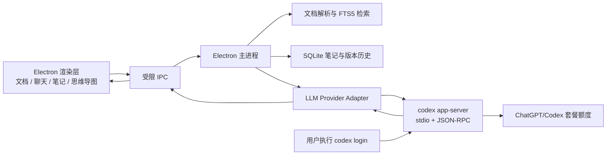

# Learning Companion 技术栈基线

> 状态：当前推荐方案
>
> 更新日期：2026-07-28

## 1. 产品目标

Learning Companion 是一个本地优先的桌面学习助手，核心体验包括：

- 在应用内阅读 PDF、Markdown、纯文本、网页和 EPUB。
- 基于当前页、章节或选区直接向 AI 提问。
- 在右侧实时显示流式回答，并附带可回跳的原文引用。
- 将问答结果自动整理为结构化笔记，支持撤销和版本历史。
- 从结构化笔记生成可编辑的思维导图。
- 默认复用用户自己的 ChatGPT/Codex 套餐额度，不要求用户额外购买 OpenAI API 用量。

## 2. 总体架构

采用本地优先的 Electron 桌面架构，不在 MVP 阶段建设云端后端。



架构原则：

- 渲染进程只负责 UI，不直接访问文件系统、数据库、凭证或子进程。
- Electron 主进程负责文档处理、SQLite、Codex 生命周期和权限校验。
- Codex 默认通过本机 stdio 通信，不开放网络监听端口。
- AI 只返回回答和结构化笔记变更建议，由应用校验并写入数据库。
- 所有重要自动变更均保留版本历史，并支持一键撤销。

## 3. 桌面与前端技术栈

| 领域 | 技术选择 | 用途 |
|---|---|---|
| 桌面框架 | Electron | 跨平台窗口、文件系统、快捷键、子进程和系统集成 |
| 打包发布 | Electron Forge | macOS、Windows 和 Linux 构建、签名与发布 |
| 构建工具 | Vite | 快速开发和前端资源打包 |
| 开发语言 | TypeScript | 统一主进程、Preload、渲染层和协议类型 |
| UI 框架 | React | 阅读器、聊天、笔记和思维导图界面 |
| 样式系统 | Tailwind CSS | Design Token 和界面布局 |
| 组件基础 | shadcn/ui + Radix UI | 无障碍、可定制的现代桌面组件 |
| 动画 | Motion | 面板切换、流式状态和微交互 |
| 可调整布局 | react-resizable-panels | 阅读区、聊天区和笔记区的多栏布局 |
| 本地状态 | Zustand | 阅读状态、选区、会话和临时 UI 状态 |

暂不采用 Next.js。当前产品是本地桌面应用，不需要 SSR；Vite 的运行模型和打包流程更直接。

## 4. 文档阅读与解析

| 文档类型 | 技术选择 |
|---|---|
| PDF | PDF.js |
| Markdown | Vditor（WYSIWYG）+ CodeMirror 6（源码）+ unified / remark / rehype（后续解析、索引与导出） |
| 纯文本 | 原生文本解析与虚拟列表 |
| EPUB | epub.js |
| HTML | Chromium 原生渲染（隔离 iframe，保留脚本与外部资源） |
| DOCX（后续） | Mammoth.js 或受控转换管线 |

每份文档需要生成稳定的来源锚点，例如：

```text
document_id / page / section / block_id / text_range
```

所有 AI 回答和笔记条目都应保存来源锚点，以支持点击引用后回到原文位置。

## 5. 笔记与本地数据

| 领域 | 技术选择 |
|---|---|
| 富文本编辑器 | Tiptap / ProseMirror |
| 本地数据库 | SQLite |
| ORM | Drizzle ORM |
| 全文检索 | SQLite FTS5 |
| 笔记格式 | 结构化 JSON AST + Markdown 导入导出 |
| 版本历史 | Append-only 变更记录 + 可撤销事务 |

笔记写入流程：

1. AI 返回结构化 `note_delta`。
2. 主进程验证操作类型、目标章节和来源引用。
3. SQLite 事务写入笔记和版本记录。
4. UI 对新增或修改内容进行短暂高亮。
5. 用户可以一键撤销自动变更。

禁止 AI 直接操作 SQLite 或覆盖完整笔记文件。

## 6. 思维导图

| 场景 | 技术选择 |
|---|---|
| 可交互思维导图 | React Flow |
| Markdown 快速生成 | Markmap |
| 静态分享与导出 | Mermaid / SVG / PNG |

思维导图应从结构化笔记 AST 生成，而不是直接从原始聊天记录生成。节点需要保留对应的笔记 ID 和来源锚点。

## 7. Codex 与 LLM 接入

默认 Provider 为本机 Codex：

```text
Electron Main
  -> spawn("codex", ["app-server"])
  -> stdio JSONL / JSON-RPC
  -> initialize
  -> thread/start 或 thread/resume
  -> turn/start
  -> 流式处理 item/agentMessage/delta
  -> turn/completed
```

选择 `codex app-server` 的原因：

- 官方定位是将 Codex 深度集成到自己的富客户端中。
- 支持认证、会话、线程、审批、取消和流式事件。
- 可以复用用户通过 `codex login` 保存的 ChatGPT 登录状态。
- 用户使用 ChatGPT 登录时消耗套餐内 Codex 用量，而不是 OpenAI Platform API 费用。
- 支持每个 Turn 的 `outputSchema`，可返回结构化回答、引用和笔记变更。

推荐的单次响应结构：

```json
{
  "answer": "给用户展示的回答",
  "citations": [
    {
      "source_id": "doc-1:p12:block-7",
      "label": "第 12 页"
    }
  ],
  "note_delta": {
    "operation": "append",
    "section": "目标章节",
    "markdown": "准备写入的笔记内容"
  },
  "mindmap_delta": []
}
```

其他接入方式的定位：

| 接入方式 | 定位 |
|---|---|
| Codex App Server | 产品核心交互层，首选 |
| Codex SDK | 后台批处理或较简单的程序化任务 |
| `codex exec --json` | 早期技术验证或一次性任务 |
| Apps SDK | 将应用放进 ChatGPT，不作为独立桌面应用的 LLM 后端 |
| Workspace Agents | 当前不适合需要立即取得回答的实时聊天 |
| ChatGPT UI 自动化 | 禁止采用，容易失效且存在合规风险 |

## 8. 阅读上下文与检索

每次提问只发送完成回答所需的最小上下文：

```text
文档 ID
当前页码和章节
用户选中的文字
选区前后的相关段落
FTS5 检索到的相关片段
当前笔记目录或相关笔记摘要
用户问题
```

MVP 先使用标题结构、来源锚点和 FTS5 检索，不依赖付费 Embedding API。后续若需要语义检索，可以增加本地 Embedding 模型。

## 9. 登录、额度与隐私

登录流程：

1. 应用执行 `codex login status`。
2. 未登录时，引导用户运行官方 `codex login` 浏览器登录流程。
3. 应用只消费 Codex 的状态和协议，不读取 `~/.codex/auth.json`。
4. 不上传、复制或共享用户的 ChatGPT 凭证。
5. 清晰展示套餐限额、限流、登录失效和工作区策略错误。

隐私边界：

- 文档原件、索引、笔记和历史默认保存在本机。
- 为回答问题而选取的文档片段会发送至 OpenAI。
- UI 必须向用户说明哪些内容会发送给模型。
- 默认使用只读沙箱，不授予 Codex 任意文件写入权限。
- 笔记数据库只能由主进程的受控接口修改。

## 10. Provider 抽象

虽然默认使用用户自己的 Codex 套餐，但业务层不得直接依赖 Codex 协议对象。定义统一适配器：

```ts
interface LLMProvider {
  getStatus(): Promise<ProviderStatus>;
  startConversation(context: LearningContext): Promise<Conversation>;
  sendTurn(input: LearningTurnInput): AsyncIterable<LearningEvent>;
  cancelTurn(turnId: string): Promise<void>;
}
```

计划支持：

- `CodexLocalProvider`：默认方案。
- `OpenAIApiProvider`：用户自愿配置 API 时的可选方案。
- `OllamaProvider`：本地模型和离线场景。

该抽象用于规避 Codex 产品能力、套餐政策或协议变化带来的单点风险。

## 11. Electron 安全基线

- 开启 `contextIsolation`。
- 开启 Renderer Sandbox。
- 禁止 Renderer 使用 Node Integration。
- 通过 Preload 暴露白名单 IPC，不暴露通用 `ipcRenderer`。
- 所有文件路径在主进程校验并归一化。
- 不允许远程网页直接调用本地 IPC。
- Codex 使用 stdio，不默认启动 TCP/WebSocket 监听。
- HTML 始终按原文运行在独立 iframe 沙箱中：允许文档自己的网络资源与脚本，
  但不授予同源、顶层导航或 Learning Companion IPC 能力。
- 文档问答默认使用只读 Codex Sandbox。

## 12. MVP 实施顺序

### 阶段一：技术验证

- Electron + React 三栏布局。
- 打开 PDF、Markdown 和纯文本。
- 选中文字后向 `codex app-server` 提问。
- 在右侧显示流式回答。
- 验证 ChatGPT 登录状态和套餐额度路径。

### 阶段二：可用 MVP

- 稳定的页码、章节和段落锚点。
- SQLite + FTS5 本地索引。
- Tiptap 笔记编辑器。
- 结构化 `note_delta` 自动写入。
- 来源引用、回跳、撤销和版本历史。
- 限流、取消、失败恢复和登录失效提示。

### 阶段三：增强体验

- React Flow 思维导图。
- EPUB 和网页正文阅读。
- 本地语义检索。
- 学习进度、复习卡片和知识关联。
- 可选的跨设备同步。

## 13. 当前决策摘要

当前技术基线为：

> **Electron + React + TypeScript + Vite + Tailwind/shadcn + Tiptap + SQLite/Drizzle/FTS5 + React Flow + Codex App Server。**

在完成 MVP 和真实性能测试前，不迁移至 Tauri，不建设云端后端，也不引入独立的付费 Embedding 或 LLM API 依赖。
