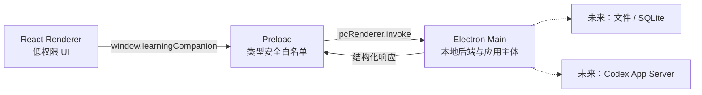

# Learning Companion 可运行空壳设计

> 状态：已确认
>
> 日期：2026-07-22

## 1. 目标

建立一个可以立即运行、检查和继续扩展的桌面应用空壳，验证以下最小闭环：

1. Electron 能创建原生桌面窗口并管理应用生命周期。
2. React 能在 Renderer 中渲染基础双栏界面。
3. Renderer 能通过类型安全的 Preload 白名单调用 Electron Main。
4. Main 能返回健康状态，Renderer 能显示“本地后端已连接”。
5. 开发、静态检查、测试和生产打包命令均可执行。

这一步只建立工程和安全边界，不实现文档阅读、笔记数据库或 LLM 接入。

## 2. 选型结论

采用单仓库的 Electron Forge 方案：

- Electron Forge：桌面应用开发、打包和后续发布入口。
- Vite：Main、Preload 和 Renderer 的开发构建。
- React：Renderer UI。
- TypeScript：所有进程以及共享协议的统一语言。
- Tailwind CSS：基础布局和后续设计系统的样式底座。
- Vitest：共享协议与无界面逻辑的单元测试。
- ESLint：代码静态检查。
- pnpm：依赖和脚本管理。

不采用 monorepo。当前只有一个桌面应用，提前拆分多个 package 会增加配置成本。后续出现独立服务、插件 SDK 或共享包时再迁移。

## 3. 架构



Electron Main 是本地后端，不额外启动 HTTP 服务。Renderer 是 Chromium 页面，不直接获得 Node.js、文件系统或子进程能力。Preload 只负责把经过允许、具有明确类型的方法暴露给 Renderer，不承载业务逻辑。

## 4. 模块职责

### Electron Main

- 创建和销毁应用窗口。
- 处理 macOS、Windows 和 Linux 的基础生命周期差异。
- 注册命名明确的 IPC Handler。
- 返回应用健康状态。
- 为后续文件、SQLite 和 Codex 能力预留模块边界。

### Preload

- 使用 `contextBridge` 暴露 `window.learningCompanion`。
- 将每个前端方法映射到一个固定 IPC Channel。
- 不暴露完整的 `ipcRenderer`、Node.js 模块或任意 Channel 调用入口。
- 不保存状态，不实现业务规则。

### React Renderer

- 渲染应用标题、阅读区占位、助手区占位和连接状态。
- 在启动时调用一次 `healthCheck()`。
- 明确展示连接中、连接成功和连接失败三种状态。
- 不直接导入 Electron 或 Node.js API。

### Shared Contract

- 定义 IPC Channel 常量。
- 定义 `HealthCheckResponse` 和 Renderer 可用 API 类型。
- Main、Preload 和 Renderer 复用同一份类型，避免协议漂移。

## 5. 首个数据流

```text
React App 挂载
  -> window.learningCompanion.healthCheck()
  -> Preload 调用 ipcRenderer.invoke("app:health-check")
  -> Main Handler 构造 HealthCheckResponse
  -> Preload 将 Promise 结果返回 Renderer
  -> React 显示本地后端连接状态
```

健康响应只包含非敏感信息：

```ts
interface HealthCheckResponse {
  status: "ok";
  appVersion: string;
  platform: NodeJS.Platform;
  timestamp: string;
}
```

`timestamp` 使用 ISO 8601 字符串，避免跨 Context 传输复杂对象。

## 6. 目录结构

```text
learning-companion/
├── docs/superpowers/specs/
├── src/
│   ├── main/
│   │   ├── ipc/
│   │   └── index.ts
│   ├── preload/
│   │   └── index.ts
│   ├── renderer/
│   │   ├── components/
│   │   ├── App.tsx
│   │   ├── index.css
│   │   └── main.tsx
│   └── shared/
│       └── ipc.ts
├── index.html
├── forge.config.ts
├── vite.*.config.ts
└── package.json
```

文件应保持短小且职责单一。只有实际产生多个实现时才继续增加抽象层。

## 7. 安全边界

BrowserWindow 使用以下默认值：

- `contextIsolation: true`
- `nodeIntegration: false`
- `sandbox: true`
- 配置限制性 Content Security Policy
- 阻止 Renderer 导航到未授权地址
- 阻止未校验的新窗口创建

Preload 每项能力都必须是一个具体方法。未来增加文件、Codex 或笔记操作时，Main 必须校验调用来源、参数结构、文件路径和权限，不能把通用 IPC 或 Shell 执行接口暴露给 Renderer。

## 8. 错误处理

- Renderer 的健康检查初始状态为“正在连接”。
- 成功时展示版本、平台和“本地后端已连接”。
- IPC Promise 拒绝或响应不符合预期时展示“本地后端连接失败”。
- 错误详情只写入开发控制台，界面不显示堆栈或本机敏感路径。
- Main 的初始化错误应记录清晰上下文并终止启动，避免半初始化状态。

当前空壳不加入全局错误总线、重试框架或日志服务。

## 9. 测试与验证

自动验证包括：

- `pnpm typecheck`：检查 Main、Preload、Renderer 和共享类型。
- `pnpm lint`：检查源码和配置。
- `pnpm test`：运行 Vitest 单元测试。
- `pnpm package`：生成当前平台的未签名应用包。

人工冒烟验证包括：

1. 执行 `pnpm dev` 后桌面窗口正常打开。
2. 页面展示阅读区和助手区占位。
3. 页面最终显示“本地后端已连接”。
4. 关闭窗口后开发进程能正常退出。

首版测试重点是共享协议、健康响应构造和 UI 状态映射，不引入复杂的 Electron 端到端测试框架。

## 10. 非目标

本次明确不实现：

- PDF、Markdown、EPUB 或网页阅读器。
- ChatGPT、Codex App Server 或 OpenAI API 接入。
- SQLite、笔记编辑器、全文检索和版本历史。
- 思维导图。
- 自动更新、安装包签名、公证和发布流水线。
- 用户账户、云同步和遥测。
- 完整视觉设计或 shadcn/ui 组件库初始化。

这些能力继续遵循 `TECH_STACK.md`，但不进入空壳提交。

## 11. 验收标准

空壳完成时必须同时满足：

1. 新环境执行 `pnpm install` 后可以使用 `pnpm dev` 启动应用。
2. Electron 窗口中可见 React 双栏占位界面。
3. Renderer 不能直接访问 Node.js。
4. 类型安全的健康检查 IPC 能成功往返。
5. 连接异常具备明确的界面状态。
6. 类型检查、Lint、测试和生产打包全部通过。
7. Git 变更按设计文档和工程脚手架拆成独立中文提交。
8. 仓库 `origin` 指向 `https://github.com/wu-tian807/learning-companion.git`。
