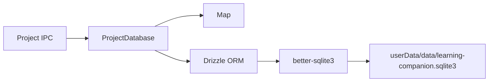

# Project 组合式内存模型与 SQLite 同步设计

## 目标

将当前同时包含数据、修改方法和 IPC 转换方法的 `Project` 类，重构为纯数据快照；由 `ProjectDatabase` 组合内存容器与 SQLite 持久化能力，并成为 Main 进程内唯一允许修改 Project 的入口。

本阶段只处理 Project：

- 应用启动时一次性把全部 Project 加载到内存。
- 首页和 IPC 从内存读取 Project。
- 新建、修改和删除通过 `ProjectDatabase` 同步写入 SQLite 与内存。
- 保留 `name`、`icon`、`createdTime` 和 `pinned`。
- 不设计 Source 和 Asset 的加载、卸载与持久化。
- Project 不再保存 `sources` 或 `assets` 集合。

## 组合优先的收益

组合优先在这里不是为了避免所有类，而是为了让数据与行为拥有清晰边界：

- `Project` 只描述数据，不知道 SQLite、Drizzle、IPC 或 React。
- `ProjectDatabase` 组合数据库连接、内存 Map、ID 生成器和时钟。
- 持久化实现可以替换，Project 数据结构和调用方接口不需要随之改变。
- 所有修改只能经过同一个容器，避免对象被直接修改后忘记持久化。
- 单元测试可以注入固定 ID、时间和临时数据库，不依赖 Electron 窗口。
- Source 和 Asset 后续可以采用不同的缓存策略，不会迫使 Project 一起改成动态加载。

这比让 `Project` 自己拥有 `save()`、`rename()` 或数据库连接更符合单一职责，也避免 Active Record 对基础设施的耦合。

## 方案比较

### 方案 A：纯 Project + 写穿 ProjectDatabase

`Project` 是只读数据，`ProjectDatabase` 内部维护 `Map<string, Project>`，每次写操作先提交 SQLite，成功后替换内存快照。

优点：

- 数据结构最轻。
- 内存与数据库一致性边界明确。
- CRUD 按 ID 访问高效。
- 最适合当前“启动时加载全部 Project”的产品行为。

缺点：

- 必须禁止调用方获得可变内部引用。
- 后续若出现多个进程同时写数据库，需要增加刷新或事件同步机制。

### 方案 B：Project Active Record

每个 `Project` 实例带 `rename()`、`save()` 和 `delete()`，实例直接操作数据库。

优点是调用形式直观；缺点是数据对象依赖数据库生命周期，测试和序列化更重，也容易出现多个实例代表同一行但状态不同。本项目不采用。

### 方案 C：每次操作直接查询 SQLite

不维护内存容器，首页和每个操作都直接查询数据库。

优点是结构最少；缺点是与用户确认的内存模型不符，也无法为后续 Main 内的 Project 状态监听提供稳定对象来源。本项目不采用。

最终选择方案 A。

## 架构边界



Renderer 和 Preload 只能通过白名单 IPC 访问 Project。它们不能接触：

- `ProjectDatabase`
- SQLite 文件路径
- better-sqlite3 或 Drizzle 实例
- 内存 Map

SQLite 是持久化事实来源，Map 是 Main 进程当前运行周期内的写穿缓存。

## 文件安排

```text
src/main/
├── database/
│   ├── database-context.ts
│   ├── initialize-database.ts
│   ├── migrations/
│   │   └── 0001-create-projects.ts
│   └── schema/
│       └── projects.ts
└── projects/
    ├── project.ts
    ├── project-database.ts
    └── project-database.test.ts
```

职责划分：

- `database-context.ts`：定义 Main 内共享的 Drizzle 和 better-sqlite3 连接上下文，并提供关闭能力。
- `initialize-database.ts`：创建数据库目录、打开连接、配置 SQLite、执行版本化迁移。
- `migrations/`：只保存数据库结构演进，不包含业务 CRUD。
- `schema/projects.ts`：Drizzle 的 projects 表结构，并声明 SQLite 时间戳、布尔值和 TypeScript 字段名之间的转换。
- `project.ts`：纯数据类型、创建和更新输入类型，以及创建不可变快照的纯函数。
- `project-database.ts`：组合 Map 与数据库操作，对外提供 Project API。

当前用户新建的 Source 相关文件不在本阶段修改。

## Project 数据模型

```ts
export interface Project {
  readonly id: string;
  readonly name: string;
  readonly icon: string;
  readonly createdTime: Date;
  readonly pinned: boolean;
}

export interface CreateProjectInput {
  readonly name: string;
}

export interface UpdateProjectInput {
  readonly name?: string;
  readonly icon?: string;
  readonly pinned?: boolean;
}
```

设计约束：

- `id` 和 `createdTime` 创建后不可修改。
- `name`、`icon` 和 `pinned` 是允许更新的白名单字段。
- `CreateProjectInput` 不接收 icon，继续符合“图标由应用或后端模型选择”的产品要求。
- 骨架阶段创建 Project 时使用内部默认图标，未来图标选择器只需替换该依赖。
- `createdTime` 在内存中使用 `Date`，进入 IPC 时转换为 ISO 8601 字符串；Drizzle schema 负责它与 SQLite 整数时间戳的转换。
- Project 不包含 Source、Asset、数量或 UI 排序状态。

`Project` 使用普通对象而不是带成员方法的 class。运行时创建的对象执行浅冻结；因为当前所有字段都是标量或 `Date`，返回给调用方时仍需复制 `Date`，避免通过 `setTime()` 修改内部状态。

当前数据库行和 Project 的字段结构几乎一一对应，因此不增加独立的 row mapper。Drizzle schema 直接把 `created_time` 映射为 `createdTime: Date`、把 SQLite `0/1` 映射为 `pinned: boolean`；查询结果再经过 `project.ts` 的快照函数完成校验、复制和冻结。只有未来数据库结构与内存结构明显分化时，才引入 mapper。

## 数据库表

第一版 projects 表：

```text
projects
├── id           TEXT PRIMARY KEY
├── name         TEXT NOT NULL
├── icon         TEXT NOT NULL
├── created_time INTEGER NOT NULL
└── pinned       INTEGER NOT NULL DEFAULT 0
```

约束：

- `name` 和 `icon` 的长度、空白规则在进入 `ProjectDatabase` 时校验。
- `pinned` 只接受 SQLite 整数 `0` 或 `1`。
- `created_time` 保存 Unix epoch 毫秒。
- 不加入 `source_ids`、`asset_ids` 或 JSON 列。

未来 Asset 表通过 `project_id` 外键引用 projects。关系数据只在数据库中保留一份，不在 Project 行中重复维护 ID 数组。

## ProjectDatabase 接口

```ts
export interface ProjectDatabase {
  initialize(): void;
  list(): readonly Project[];
  get(id: string): Project | undefined;
  add(input: CreateProjectInput): Project;
  update(id: string, changes: UpdateProjectInput): Project;
  delete(id: string): void;
}
```

具体实现接收组合依赖：

```ts
interface ProjectDatabaseDependencies {
  readonly createId: () => string;
  readonly now: () => Date;
  readonly defaultIcon: () => string;
}
```

生产环境分别使用 `randomUUID()`、`new Date()` 和内置默认图标；测试注入固定值。容器内部使用 `Map<string, Project>`，`list()` 根据 Map 生成数组，不在数据层承担 UI 排序。

虽然文件名为 `project-database.ts`，它在架构上的准确角色是 Project 的写穿 Store。保留该命名是为了符合当前项目语义，调用方只依赖它公开的接口。

## 初始化流程

```text
app.whenReady()
  → createAppPaths(userData)
  → initializeDatabase(databaseFile)
  → new SqliteProjectDatabase(databaseContext)
  → projectDatabase.initialize()
  → registerProjectHandlers(projectDatabase)
  → createMainWindow()
```

`ProjectDatabase.initialize()`：

1. 拒绝在已有内存数据的情况下重复初始化；已经成功初始化时再次调用直接返回。
2. 一次性查询全部 Project 行。
3. 使用 `project.ts` 的快照函数验证、复制并冻结每一行。
4. 先构建临时 Map。
5. 全部行转换成功后，才把临时 Map 设为当前容器。

任何数据库打开、迁移或行转换错误都会阻止 Project IPC 和窗口创建。Project 数据损坏时不能静默恢复为空列表，否则会让用户误以为数据丢失。

## 读取和写穿流程

### 读取

- `list()` 返回新数组和 Project 快照。
- `get()` 返回 Project 快照或 `undefined`。
- 调用方永远拿不到内部 Map 或内部 Project 引用。
- ProjectDatabase 未初始化时调用任意 CRUD API 都抛出明确错误。

### 新建

1. 校验并规范化名称。
2. 通过组合依赖生成 ID、时间和默认图标。
3. 构造下一份 Project 快照。
4. 在 SQLite 事务中插入 Project。
5. 插入成功后写入 Map。
6. 返回独立快照。

### 修改

1. 按 ID 从 Map 找到当前 Project。
2. 只接受 `name`、`icon`、`pinned` 白名单字段，并拒绝空更新。
3. 校验字段并构造完整的新 Project 快照。
4. 在 SQLite 中按 ID 更新，确认恰好影响一行。
5. 更新成功后，用新快照替换 Map 中的旧快照。
6. 返回独立快照。

IPC 可以继续保留 `rename` 和 `setPinned` 两个明确命令；handler 将它们转换成 `update(id, changes)`。这样 Renderer 的意图清楚，数据容器又不需要为每个字段增加一套持久化流程。

### 删除

1. 确认 Map 中存在目标 ID。
2. 在 SQLite 事务中删除，确认恰好影响一行。
3. 删除成功后再移除 Map 项。

所有操作都遵循“数据库先成功，内存后更新”。写入失败时内存保持旧值，不执行补偿性写回。

## IPC 迁移

`Project` 不再负责 `toSummary()`。IPC 层增加纯映射函数，将 Project 转换成共享协议中的 `ProjectSummary`：

```text
Project → ProjectSummary
Date    → ISO string
```

现有 `ProjectSummary.sources` 属于临时 UI 契约，本阶段由 IPC 映射为空数组，以保证 Project 模型不重新耦合 Source。等 Asset 模型确定后，单独把共享契约迁移为 `assetCount` 或 Asset 摘要查询。

该过渡会让新创建或从空数据库加载的 Project 暂时显示 0 个资料，属于本阶段预期行为。

## 数据库初始化与生命周期

数据库路径加入 `AppPaths`：

```text
<Electron userData>/data/learning-companion.sqlite3
```

初始化时：

- 递归创建 `data` 目录。
- 使用 better-sqlite3 打开数据库。
- 启用 `foreign_keys`。
- 使用 WAL journal mode。
- 按数据库版本顺序执行内置迁移。
- 构造共享 `DatabaseContext`。

Main 进程是唯一写入者。退出时先移除 IPC handler，再关闭数据库连接。Renderer 刷新或多窗口不会创建新的数据库连接。

Drizzle 负责类型安全查询和 schema 定义；better-sqlite3 负责同步 SQLite 驱动。第一版迁移文件导出固定版本号和 SQL 语句，`initialize-database.ts` 在事务中比较并更新 SQLite `user_version`。迁移通过 TypeScript 静态导入进入 Main bundle，不在运行时从 ASAR 中查找外部 SQL 文件。业务模块不能自行创建表。

## 错误处理

- 重复 ID：数据库插入失败，Map 不变化。
- 未知 ID：在访问 SQLite 前返回“找不到指定的 Project”。
- 非法名称或图标：在访问 SQLite 前拒绝。
- 空更新：拒绝，避免产生无意义 SQL。
- SQLite 更新或删除影响行数不是 1：视为数据库与 Map 不一致并抛错，Map 不变化。
- 数据库初始化或迁移失败：记录不含用户内容的错误并阻止窗口进入可编辑状态。
- 数据库关闭失败：记录错误，但不在退出阶段尝试重新打开。

本阶段不实现跨进程写入、外部数据库文件变更监听或自动冲突合并。

## 测试

### 纯数据与映射

- Project 创建后各字段符合规范化结果。
- Date 和 Project 快照不会共享可变引用。
- Drizzle schema 可正确转换 SQLite 时间戳和 pinned 整数。
- 非法数据库行不能进入内存 Map。

### ProjectDatabase

- 初始化一次性加载全部 Project。
- `list()` 和 `get()` 不暴露内部状态。
- add 成功后数据库和 Map 同时出现记录。
- update 成功后数据库和 Map 同时替换记录。
- delete 成功后数据库和 Map 同时移除记录。
- 写入失败时 Map 保持旧状态。
- 未初始化、未知 ID、空更新和非法字段被拒绝。
- 重复初始化不重复加载或覆盖运行中状态。

### 集成与回归

- 使用临时 SQLite 文件执行真实 CRUD 测试。
- `pnpm typecheck`、`pnpm lint` 和 `pnpm test` 通过。
- `pnpm smoke:native` 通过。
- `pnpm package` 后原生 SQLite 冒烟验证通过。
- Electron 重启后 Project 能从数据库恢复。

## 实施边界

本轮框架骨架包括：

- Project 纯数据化。
- 数据库路径和 DatabaseContext。
- projects schema 与首个迁移。
- ProjectDatabase 的初始化和 CRUD 写穿实现。
- Project IPC 改用 ProjectDatabase。
- 删除旧的 `InMemoryProjectRepository` 及其测试。

本轮不包括：

- Source、Asset 表和缓存。
- Project 与 Asset 的外键查询。
- AI 图标生成或选择。
- 数据库备份、导入、导出。
- 数据库损坏恢复 UI。
- 云同步和多进程写入。

## 验收标准

- `Project` 是没有成员方法的纯只读数据结构。
- 所有 Project 修改只能通过 `ProjectDatabase`。
- 应用启动时全部 Project 从 SQLite 加载到唯一 Map。
- 成功的 CRUD 同时反映在 SQLite 和内存；失败时内存不产生半更新。
- Renderer 无法访问数据库、文件路径或内部 Map。
- Project 不包含 Source 或 Asset 数据。
- macOS 和 Windows 打包仍能加载 better-sqlite3。
