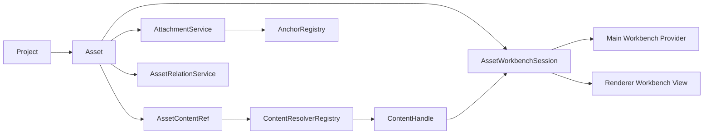
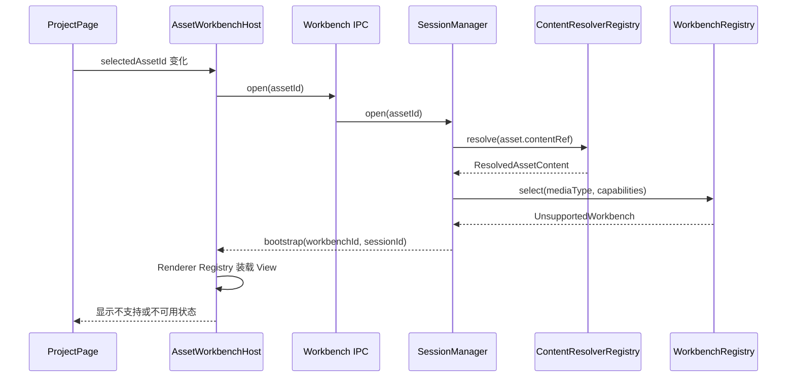

# Asset 与资料工作台架构设计

> 日期：2026-07-27
>
> 状态：第一阶段已实施

## 目标

为 Learning Companion 建立一套可扩展的 Asset 与资料工作台骨架，使不同媒体类型能够拥有完全不同的阅读、编辑和 AI 交互能力，同时保持 Asset、内容来源、工作台、学习沉淀和派生关系彼此解耦。

第一阶段只搭建完整架构骨架和一条可运行的兜底链路：

- 现有本地文件 Asset 继续能够加载、检查状态、重新定位和在文件夹中显示。
- Project 页面中栏由统一的 `AssetWorkbenchHost` 接管。
- 尚未实现的媒体类型统一落入 `UnsupportedWorkbench`。
- 纯文本、Markdown、PDF 和思维导图只预留独立模块目录，不注册未完成能力。
- Attachment、Anchor、Relation、Workbench State 和 managed JSON 先定义稳定边界，不在本阶段持久化真实业务数据。

## 核心边界

系统按五个正交维度拆分：

```text
Asset             决定“它是谁、语义类型是什么”
ContentResolver   决定“内容在哪里、怎样安全取得”
AssetWorkbench    决定“用户怎样阅读、编辑和交互”
Attachment        决定“用户沉淀了什么”
Anchor            决定“沉淀内容附着在哪里”
AssetRelation     决定“不同 Asset 之间是什么关系”
```

这些维度不互相替代：

- 思维导图是可以独立打开的内容，因此是 Asset，而不是 Attachment。
- AI 对某段内容的解释是依附于原 Asset 的学习沉淀，因此是 Attachment。
- PDF 页码和 Markdown 文本范围都是 Anchor，但数据结构可以不同。
- 阅读位置、缩放比例和光标位置属于 Workbench State，不属于 Attachment。
- 完整对话历史未来由 Conversation 模型维护；被用户固化的回答可以转化为 Attachment。

## 总体结构



Renderer 不直接访问文件系统、SQLite 或 Node API。Main 进程负责解析内容引用、校验命令、持久化数据和管理工作台生命周期；Renderer 只负责显示与用户交互。

## Asset

### 持久化模型

Asset 是纯数据，不包含文件访问行为或 Renderer 状态：

```ts
interface Asset {
  readonly id: string;
  readonly projectId: string;
  readonly name: string;
  readonly mediaType: string;
  readonly contentRef: AssetContentRef;
  readonly createdTime: Date;
  readonly lastUsedTime: Date;
}
```

约束：

- `mediaType` 表示内容的语义格式，使用标准 MIME 或应用自有 vendor MIME。
- `mediaType` 创建后不可修改。
- `contentRef.kind` 创建后不可修改。
- Relink 只允许更新同一种 `contentRef.kind` 的定位信息，并继续要求新内容与原 `mediaType` 兼容。
- Relink 默认保持 Asset 名称不变。
- 数据库对象之间统一使用 ID 引用。

### AssetDatabase 与 AssetService

`AssetDatabase` 保持当前“一个活动 Project 的 Asset Map”设计，负责：

- 从 SQLite 加载当前 Project 的 Asset 纯数据。
- 卸载当前 Project 的内存 Map。
- Asset 的增删改查与 SQLite 同步。
- 不直接解释某种内容来源，也不直接承担 Renderer 展示状态。

`AssetService` 组合 `AssetDatabase` 和 `ContentResolverRegistry`，负责：

- 导入本地文件并生成 Asset。
- 解析 Asset 的 `contentRef`。
- 刷新一个或全部 Asset 的运行时可用状态。
- Relink、在系统文件管理器中显示等内容相关操作。
- 向 ProjectService、WorkbenchSessionManager 和 IPC 返回适合使用的 Asset 快照。

`ProjectService` 仍然是 Project 工作区总编排器。它通过 `AssetService` 加载和卸载 Asset，不绕过 Service 直接拼接内容解析逻辑。

## Content

### AssetContentRef

`AssetContentRef` 只描述持久化的内容来源：

```ts
type AssetContentRef =
  | {
      readonly kind: 'local-file';
      readonly path: string;
    }
  | {
      readonly kind: 'managed-json';
      readonly contentId: string;
    };
```

第一阶段真实使用 `local-file`。`managed-json` 只建立类型和 Resolver 边界，不创建内容表，也不允许用户创建此类 Asset。

未来可在不修改 Asset 主体结构的前提下增加：

- `managed-binary`
- `remote-url`
- `web-snapshot`

### 运行时状态

文件是否缺失、无权限或无效是检查结果，不是内容引用本身：

```ts
interface ResolvedAssetContent {
  readonly ref: AssetContentRef;
  readonly status: AssetContentStatus;
  readonly handle?: ContentHandle;
}

interface AssetContentStatus {
  readonly availability:
    | 'available'
    | 'missing'
    | 'inaccessible'
    | 'invalid';
  readonly checkedTime: Date;
}
```

第一阶段 IPC 仍可把 `contentRef` 和 `status` 组合为方便 Renderer 使用的快照，但 Main 进程内部不得继续把运行时状态持久化到 `AssetContentRef`。

### ContentResolver

Resolver 按 `contentRef.kind` 注册，而不是按 `mediaType` 注册：

```ts
interface ContentResolver<TRef extends AssetContentRef = AssetContentRef> {
  readonly kind: TRef['kind'];
  resolve(ref: TRef): Promise<ResolvedAssetContent>;
}
```

`ContentResolverRegistry` 的职责：

- 每种 `kind` 只能注册一个 Resolver。
- 重复注册立即失败。
- 未知 `kind` 返回明确的领域错误。
- Resolver 输出统一的运行时状态和能力句柄。

`local-file` Resolver 复用现有路径归一化、可用性检查和文本编码探测能力。`managed-json` Resolver 先依赖抽象的 Repository 契约，不在第一阶段注册到生产 Registry。

### ContentHandle

工作台不取得裸文件路径并自行访问 Node API，而是通过能力句柄读取内容：

```ts
type ContentCapability =
  | 'read-text'
  | 'write-text'
  | 'read-bytes'
  | 'write-bytes'
  | 'watch';

interface ContentHandle {
  readonly capabilities: ReadonlySet<ContentCapability>;
  readText?(): Promise<ResolvedTextContent>;
  writeText?(content: string): Promise<void>;
  readBytes?(): Promise<Uint8Array>;
  writeBytes?(content: Uint8Array): Promise<void>;
  close(): Promise<void>;
}
```

方法是否存在必须与 `capabilities` 一致。第一阶段只要求本地文件 Handle 能安全关闭；具体读写能力按后续 Workbench 需求逐项实现，避免提前设计一个过大的通用文件接口。

“Parser”不进入通用核心接口。PDF.js、remark 或其他解析器属于具体 Workbench 的内部实现，可以位于 Main 或 Renderer，取决于安全边界和运行环境。

## AssetWorkbench

### 命名

统一称为“资料工作台”：

- `AssetWorkbenchModule`
- `AssetWorkbenchRegistry`
- `AssetWorkbenchSession`
- `AssetWorkbenchSessionManager`
- `AssetWorkbenchHost`

它不仅用于预览，还承载阅读、编辑、选区、AI 提问、Attachment 展示和媒体特定操作。

### 按 mediaType 选择

Workbench 按 `mediaType` 匹配，不按 Asset ID 保存模式：

- 当前每个 `mediaType` 只有一个启用的内置 Workbench。
- 未来允许同一 `mediaType` 注册多个 Workbench。
- 用户未来选择的是某个 `mediaType` 的默认 Workbench，不是某个 Asset 的 Preview Mode。
- 找不到匹配项时始终使用 `UnsupportedWorkbench`。

### Manifest

共享 Manifest 只描述宿主需要理解的能力：

```ts
interface AssetWorkbenchManifest {
  readonly id: string;
  readonly version: number;
  readonly supportedMediaTypes: readonly string[];
  readonly requiredContentCapabilities: readonly ContentCapability[];
  readonly supportedAnchorTypes: readonly string[];
}
```

Registry 注册时验证：

- Workbench ID 唯一。
- Manifest 版本有效。
- MIME 列表不为空。
- Main Provider 和 Renderer View 使用同一个 Workbench ID 和协议版本。

### 双端契约

每个 Workbench 由共享契约、Main Provider 和 Renderer View 三部分组成：

```text
shared     Manifest、Bootstrap、Command、Event 类型和运行时校验
main       文件/数据库访问、命令执行、持久化和生命周期
renderer   具体界面、编辑器、选区与交互
```

Host 只固定以下生命周期：

```ts
open(request): Promise<WorkbenchBootstrap>
command(request): Promise<WorkbenchCommandResult>
close(request): Promise<void>
```

具体 Workbench 自己定义 Bootstrap、Command 和 Event 的结构并进行运行时校验。核心层不建立包含 PDF、Markdown、思维导图全部操作的巨型联合接口。

所有 Workbench 共用一组受限 IPC 通道，模块不能自行向 Renderer 暴露任意 `ipcRenderer` 或 Node 能力。

### Session

`AssetWorkbenchSession` 是打开一个 Asset 时的运行时组合：

```ts
interface AssetWorkbenchSession {
  readonly id: string;
  readonly asset: Asset;
  readonly content: ResolvedAssetContent;
  readonly workbenchId: string;
  readonly attachments: readonly AssetAttachment[];
  readonly state: WorkbenchState | undefined;
}
```

第一阶段只维护一个活动 Session，与当前“一个活动 Project”模型一致：

- 选择新 Asset 时关闭旧 Session，再打开新 Session。
- 离开 Project 时先关闭 Workbench Session，再卸载 Project Asset。
- 异步打开被新的选择替代时返回 `OPERATION_SUPERSEDED`，Renderer 忽略旧结果。
- `ContentHandle.close()` 在正常关闭和失败回滚时都必须执行。

### Workbench State

Workbench State 保存阅读器自身状态，例如页码、缩放、滚动位置和光标位置：

```ts
interface WorkbenchStateRecord {
  readonly assetId: string;
  readonly workbenchId: string;
  readonly schemaVersion: number;
  readonly payload: JsonValue;
  readonly updatedTime: Date;
}
```

状态键为 `assetId + workbenchId`。第一阶段使用空 Repository，不做 SQLite 迁移；接口保留读取、保存和删除能力。

## Attachment 与 Anchor

### Attachment

Attachment 是依附于 Asset 的持久化学习沉淀：

```ts
interface AssetAttachment {
  readonly id: string;
  readonly projectId: string;
  readonly assetId: string;
  readonly typeId: string;
  readonly typeVersion: number;
  readonly payload: JsonValue;
  readonly target: AssetAttachmentTarget;
  readonly createdTime: Date;
  readonly updatedTime: Date;
}
```

`typeId` 表示“是什么”，例如：

- `user-note`
- `ai-explanation`
- `highlight`
- `bookmark`

`AttachmentRegistry` 按 `typeId + typeVersion` 注册校验、迁移和展示定义。第一阶段只实现 Registry 和空 Service，不定义真实 Attachment 类型，也不创建数据库表。

### Anchor

Anchor 表示 Attachment 附着的位置：

```ts
type AssetAttachmentTarget =
  | {
      readonly scope: 'asset';
    }
  | {
      readonly scope: 'content';
      readonly anchorType: string;
      readonly anchorVersion: number;
      readonly anchorPayload: JsonValue;
    };
```

`anchorType` 属于媒体内容语义，而不属于某一个 Workbench 实现。例如：

- `markdown.text-range`
- `pdf.text-range`
- `pdf.page-region`

这样用户未来切换同一 `mediaType` 的 Workbench 时，Anchor 仍有机会被新 Workbench 解释。

`AnchorRegistry` 负责 Anchor 的校验和版本迁移；具体 Workbench 负责定位、绘制、跳转和编辑。Workbench Manifest 必须声明自己支持的 Anchor 类型。

### AttachmentHost

Renderer 的 `AttachmentHost` 负责选择 Attachment 的展示组件；Workbench 只决定 Attachment 在内容中的位置与触发方式。第一阶段 Host 接受空列表并不渲染内容。

## AssetRelation 与应用内生成内容

独立生成、可以在左侧 Asset 列表中打开的内容仍是 Asset。例如思维导图：

```text
mediaType  = application/vnd.learning-companion.mindmap+json
contentRef = { kind: 'managed-json', contentId: '...' }
```

它通过 Relation 与来源 Asset 建立关系：

```ts
interface AssetRelation {
  readonly id: string;
  readonly projectId: string;
  readonly fromAssetId: string;
  readonly toAssetId: string;
  readonly relationType:
    | 'derived-from'
    | 'references'
    | 'supersedes';
  readonly createdTime: Date;
}
```

`AssetRelationService` 第一阶段只定义查询和 Mutation 接口，并提供空实现；不创建数据库表，不生成思维导图。

## Main 与 Renderer 的职责

### Main

- `AssetDatabase`：Asset 纯数据与活动 Project Map。
- `AssetService`：内容解析和 Asset 高层操作。
- `ContentResolverRegistry`：按内容来源选择 Resolver。
- `WorkbenchRegistry`：注册 Main Provider。
- `WorkbenchSessionManager`：编排打开、命令和关闭。
- `AttachmentService`：加载和持久化 Attachment。
- `AttachmentRegistry`：解释 Attachment payload。
- `AnchorRegistry`：解释 Anchor payload。
- `WorkbenchStateRepository`：存取工作台状态。
- `AssetRelationService`：管理 Asset 关系。

### Renderer

- `AssetWorkbenchHost`：按 `workbenchId` 装载 View，管理加载、失败和切换状态。
- `RendererWorkbenchRegistry`：注册 Renderer View。
- `AttachmentHost`：装载 Attachment 展示组件。
- 各具体 Workbench View：实现媒体特定 UI。

Main 和 Renderer 的 Registry 独立运行，通过共享 Manifest、协议版本和 Workbench ID 对齐，避免把 React 代码打入 Main bundle。

## 目录结构

第一阶段目标结构：

```text
src/
├── main/
│   ├── assets/
│   │   ├── asset.ts
│   │   ├── asset-database.ts
│   │   └── asset-service.ts
│   ├── content/
│   │   ├── content-ref.ts
│   │   ├── content-handle.ts
│   │   ├── content-resolver-registry.ts
│   │   └── resolvers/
│   │       ├── local-file/
│   │       └── managed-json/
│   ├── attachments/
│   │   ├── attachment.ts
│   │   ├── attachment-service.ts
│   │   ├── attachment-registry.ts
│   │   └── anchor-registry.ts
│   ├── workbench/
│   │   ├── workbench-registry.ts
│   │   ├── workbench-session.ts
│   │   ├── workbench-session-manager.ts
│   │   └── workbench-state-repository.ts
│   └── relations/
│       └── asset-relation-service.ts
├── shared/
│   └── workbench/
│       ├── manifest.ts
│       ├── protocol.ts
│       ├── attachment.ts
│       └── anchor.ts
├── renderer/
│   └── workbench/
│       ├── AssetWorkbenchHost.tsx
│       ├── renderer-workbench-registry.ts
│       └── AttachmentHost.tsx
└── workbenches/
    ├── unsupported/
    │   ├── shared.ts
    │   ├── main.ts
    │   └── renderer.tsx
    ├── plain-text/
    ├── markdown/
    ├── pdf/
    └── mindmap/
```

为避免共享定义重复：

- `src/shared/workbench/attachment.ts` 和 `anchor.ts` 保存可跨 IPC 的纯数据契约。
- `src/main/attachments/attachment.ts` 只提供 Main 领域创建、校验和克隆函数，复用共享契约。

`plain-text`、`markdown`、`pdf`、`mindmap` 在第一阶段只放置说明文件以让 Git 保留目录；没有实现和注册，不会被 Registry 误判为可用能力。

## 第一阶段运行链路



现有 Project 页面行为保持：

- 没有选择 Asset：显示空状态。
- Asset 缺失、无权限或无效：显示对应错误和现有恢复入口。
- 内容可用但尚无已注册 Workbench：显示 `UnsupportedWorkbench`。
- 选择另一个 Asset、返回 Home 或卸载页面时关闭当前 Session。

本阶段不实现 Workbench Command 的业务命令，但 IPC、运行时校验、Session ID 校验和关闭流程必须可用。

## 错误处理

- 共享 IPC 继续使用现有 `AppError` 和统一错误封装。
- 未知 `contentRef.kind`：`CONTENT_RESOLVER_NOT_FOUND`。
- Resolver 已重复注册：启动期直接失败。
- 无匹配 Workbench：不是错误，使用 `UnsupportedWorkbench`。
- 缺少 Workbench 要求的内容能力：不启动该 Workbench，回退 `UnsupportedWorkbench` 并提供原因。
- Session 不存在或 ID 过期：返回明确的 Session 错误，不把命令发送给新 Session。
- 工作台协议校验失败：作为无效请求处理。
- 打开失败时必须关闭已经创建的 `ContentHandle`。
- 关闭操作保持幂等；清理失败记录日志，但不得让 Renderer 永久卡在旧 Session。
- Attachment、Relation 和 managed JSON 的空实现返回空结果或明确的“不支持写入”领域错误，不使用裸 `throw new Error('Not implemented')`。

## 测试策略

### Domain 与 Registry

- Asset `mediaType` 和 `contentRef.kind` 的不可变约束。
- Content Resolver 注册、重复注册、未知 kind 和正确分派。
- Workbench 注册、Manifest 校验、按 MIME 选择和兜底选择。
- Main 与 Renderer Registry 的 Workbench ID 一致性。
- Attachment Type 与 Anchor Type 的独立注册和版本校验。

### Session

- 打开 Asset 后建立唯一活动 Session。
- 切换 Asset 时先关闭旧 Handle。
- 被替代的异步打开不能覆盖新 Session。
- 缺失内容和缺少能力时正确兜底。
- Close 幂等并释放资源。
- 过期 Session 命令被拒绝。

### Renderer

- Host 的未选择、加载、失败和已打开状态。
- 根据 Workbench ID 装载正确 View。
- 未知 Workbench ID 使用安全兜底。
- ProjectPage 选择变化和卸载时正确开关 Session。
- AttachmentHost 在空列表时不产生多余 UI。

### 回归

- 现有本地文件导入、重命名、删除、刷新、Relink 和在文件夹中显示保持可用。
- Project 打开、关闭与级联删除顺序保持不变。
- 执行完整 `pnpm check`。

## 第一阶段不做

- 纯文本、Markdown、PDF、EPUB 或思维导图的真实阅读与编辑。
- Attachment、Relation、Workbench State 和 managed JSON 的数据库迁移。
- UserNote、AI Explanation、Highlight 等具体 Attachment 类型。
- PDF/Markdown Anchor 的真实定位与迁移。
- 第三方 Workbench 动态发现、安装、沙箱和权限系统。
- 同一 MIME 多 Workbench 的用户设置 UI。
- 多窗口或同一 Project 的多个并行 Workbench Session。
- Conversation、Codex 和 AI 提问接入。

## 后续实施顺序

1. **全骨架与兜底链路**：完成本设计中的目录、契约、Registry、Session、Host 和 UnsupportedWorkbench。
2. **Plain Text Workbench**：实现 UTF-8/GBK 文本读取、编辑和文本范围 Anchor。
3. **Attachment 最小闭环**：实现 `user-note` 与文本范围 Anchor 的持久化和展示。
4. **Markdown 与 PDF Workbench**：分别实现媒体特定编辑、选区和 Anchor。
5. **Managed JSON 与 Relation**：实现应用内 Asset 和思维导图派生链路。
6. **第三方扩展**：需求稳定后再设计插件发现、隔离和权限模型。

## 第一阶段实施结果

2026-07-27 已完成本设计的第一阶段骨架：

- 已建立共享协议、Manifest、Attachment、Anchor 和 Relation 契约及注册表。
- 已将 Asset 持久化数据与运行时内容状态拆开，由 `AssetService` 组合 `AssetDatabase` 和 `ContentResolverRegistry`。
- 已实现本地文件 Resolver，并为 managed JSON 保留 Repository 与 Resolver 边界；现有 SQLite 表结构无需迁移。
- 已建立 Main Workbench Registry、单活动 Session Manager、空 State Repository、受限 IPC 和 Preload API。
- 已建立 Renderer Registry、`AssetWorkbenchHost`、空 `AttachmentHost` 和完整的 `UnsupportedWorkbench` 双端链路。
- 纯文本、Markdown、PDF 和思维导图目录只保留说明文件，没有注册未实现能力。
- Project 页面已实际通过 `Asset → ContentResolver → Session → Main Provider → Renderer View` 链路打开中栏。

与设计相比没有架构边界变化。现有 `AssetFileService` 被保留为系统文件选择和“在文件夹中显示”的薄封装，由 `AssetService` 调用；它不再承担 Asset 数据加载或状态管理。

验证结果：

- `pnpm check`：33 个测试文件、128 个测试全部通过。
- `pnpm smoke:native`：Electron 下 `better-sqlite3` 加载和读写通过。
- `pnpm package`：macOS arm64 生产包构建通过。
- `pnpm verify:package:native`：打包后的原生模块位于 `app.asar.unpacked` 并可正确加载。
- Electron 实际界面完成 Home → Project、Asset 切换、Unsupported 兜底显示和 Project → Home 往返验证，未出现运行时错误。
