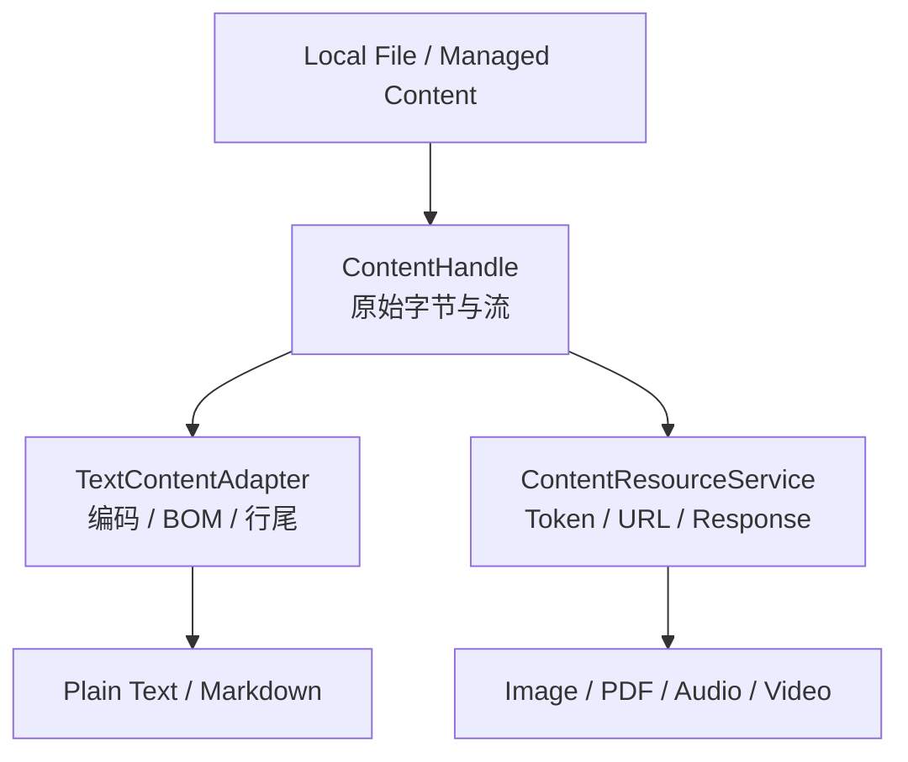
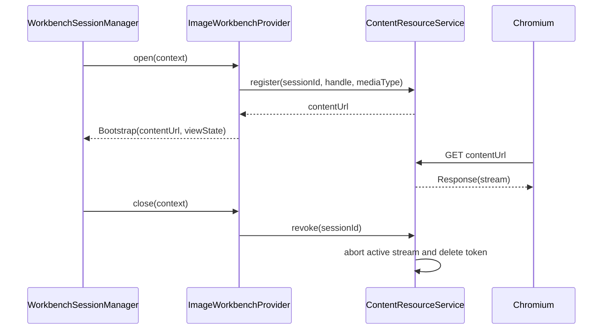

# 统一内容资源通道与 Image Workbench 设计

> 日期：2026-07-28
>
> 状态：已确认，待实施

## 目标

第一批新增一个只读 Image Workbench，并借此把内容访问层收敛为格式无关的字节资源模型。

本阶段需要实现：

- Plain Text Workbench 从 `ContentHandle.readText/writeText` 迁移到统一字节接口，但用户可见行为保持不变。
- Electron Main 提供不监听网络端口的 `learning-content://` 安全内容协议。
- Image Workbench 使用 OpenSeadragon 显示静态栅格图片。
- 图片视图支持缩放、平移、旋转、适应窗口、实际大小和状态恢复。
- 内容 URL 与 Workbench Session 同生命周期，不暴露本地文件路径。

本阶段不实现：

- SVG。SVG 未来进入 HTML/SVG 的受控渲染路径。
- GIF。当前不承诺支持，未来可在 Video Workbench 阶段重新评估。
- 截图、框选、OCR、AI 图片分析、Attachment 和生成中心。
- HTTP Range、`206 Partial Content`、媒体 Seek 和 PDF 分块加载。协议与字节流接口为这些能力保留扩展位置，但本阶段只返回完整顺序流。
- Office 格式。

## 核心决策

### 统一底层资源，不统一表现形式

所有内容来源统一暴露原始字节、只读字节流和受控替换能力；具体格式由上层 Adapter 或 Workbench 解释。



Plain Text Renderer 继续接收已经解码的字符串，并通过 Workbench Command 保存。它不直接 `fetch()` 内容 URL，也不通过自定义协议写入文件。

### 不采用的方案

- 不把图片编码成 Base64 放进 Workbench Bootstrap。Base64 会增大体积，并在 Main、IPC 和 Renderer 之间复制大字符串。
- 不为 Workbench IPC 增加专用二进制 Payload。当前共享协议保持 JSON，二进制资源由 Chromium 的标准资源加载链路取得。
- 不向 Renderer 暴露 `file://` URL 或本地绝对路径。
- 不通过 `PUT learning-content://...` 保存文本。写操作继续由 Main 端 Workbench Command 校验、串行化并执行。

## 统一 ContentHandle

### 能力

移除格式特化能力：

```ts
'read-text'
'write-text'
```

统一为：

```ts
type ContentCapability =
  | 'read-bytes'
  | 'read-stream'
  | 'write-bytes'
  | 'watch';
```

### 契约

```ts
interface ByteRange {
  readonly start: number;
  readonly endExclusive: number;
}

interface ResolvedByteContent {
  readonly content: Uint8Array;
  readonly revision: string;
}

interface ResolvedByteStream {
  readonly stream: ReadableStream<Uint8Array>;
  readonly byteLength: number;
  readonly revision?: string;
}

interface WriteByteContentRequest {
  readonly content: Uint8Array;
  readonly expectedRevision: string;
}

interface WriteByteContentResult {
  readonly revision: string;
}

interface ContentHandle {
  readonly capabilities: ReadonlySet<ContentCapability>;

  readBytes?(): Promise<ResolvedByteContent>;
  openByteStream?(range?: ByteRange): Promise<ResolvedByteStream>;
  writeBytes?(
    request: WriteByteContentRequest,
  ): Promise<WriteByteContentResult>;
  close(): Promise<void>;
}
```

本阶段 `ByteRange` 只建立类型边界。`ContentResourceService` 不解析请求的 `Range` Header，也不向 `openByteStream` 传入范围。

`LocalFileContentHandle` 实现：

- `readBytes`：读取完整字节并计算 SHA-256 revision。
- `openByteStream`：以只读文件流返回完整内容，并提供文件总长度。
- `writeBytes`：比较当前文件 revision，匹配后使用 `write-file-atomic` 原子替换并返回新 revision。
- `close`：中止由该 Handle 创建且仍在进行的活动流。

`ManagedJsonContentHandle` 继续保留，但改为统一字节接口：

- 读取时把 JSON 序列化为 UTF-8 字节。
- 写入时只接受合法 UTF-8 和合法 JSON。
- 它当前不注册到生产 Resolver，不扩大本阶段产品范围。

## TextContentAdapter 与 Plain Text 迁移

`TextContentAdapter` 位于 Main 的 `content` 模块，负责：

- 从 `readBytes` 获得完整字节和 revision。
- 自动探测 UTF-8、GBK，或按用户指定编码重新打开。
- 检测 BOM 和 LF/CRLF。
- 解码为编辑器字符串。
- 保存时恢复行尾并按目标编码重新编码。
- 检查编码损失。
- 通过 `writeBytes` 执行带 expected revision 的原子替换。

建议契约：

```ts
interface TextContentAdapter {
  read(
    handle: ContentHandle,
    request?: ReadTextContentRequest,
  ): Promise<ResolvedTextContent>;

  write(
    handle: ContentHandle,
    request: WriteTextContentRequest,
  ): Promise<WriteTextContentResult>;
}
```

Plain Text Workbench 的变化仅限 Main：

- Manifest 要求 `read-bytes` 和 `write-bytes`。
- Provider 使用注入的 `TextContentAdapter`。
- 草稿恢复、保存、编码切换、行尾切换、视图状态和 Renderer UI 不改变。

迁移完成后删除 `ContentHandle.readText/writeText`，避免本地文件 Handle 同时承担存储和文本语义。

## 安全内容协议

### 注册

在 `app.ready` 之前使用 `protocol.registerSchemesAsPrivileged` 注册：

```ts
{
  scheme: 'learning-content',
  privileges: {
    standard: true,
    secure: true,
    supportFetchAPI: true,
    corsEnabled: true,
    stream: true,
  },
}
```

不启用 `bypassCSP`。应用 Ready 后由 `protocol.handle()` 注册实际处理器。

`standard` 为未来 HTML/EPUB 相对资源解析留下基础；`stream` 允许 Chromium 把响应按流处理。

### URL 与注册记录

Renderer 只取得：

```text
learning-content://resource/<random-token>
```

Main 维护：

```ts
interface ContentResourceRegistration {
  readonly token: string;
  readonly sessionId: string;
  readonly handle: ContentHandle;
  readonly mediaType: string;
  readonly abortController: AbortController;
}
```

Token 使用 `randomUUID()` 生成。URL 不包含 Asset ID、文件名、本地路径或内容来源类型。

### 请求处理

本阶段只接受：

- `GET`：返回完整顺序流。
- `HEAD`：返回与 GET 相同的元数据，不返回 Body。

拒绝：

- 未知方法：`405 Method Not Allowed`。
- 未知、已撤销或格式错误的 Token：`404 Not Found`。
- Handle 不具备 `read-stream`：`409 Conflict`，并记录内部错误。
- 文件在请求前已经不可访问：返回明确错误响应，同时 Workbench 显示资源不可用。

成功响应包含：

```text
Content-Type: <Asset mediaType>
Content-Length: <byte length>
Cache-Control: no-store
X-Content-Type-Options: nosniff
Access-Control-Allow-Origin: *
Referrer-Policy: no-referrer
```

Token 是短期 Bearer Capability。允许匿名跨源读取该 URL 是为了让 OpenSeadragon 使用匿名跨源图片而不污染 Canvas；安全边界由不可猜测 Token、活动 Session 和及时撤销共同保证。

### 生命周期



`ContentResourceService` 不拥有也不关闭 `ContentHandle`。Handle 的生命周期仍由 `WorkbenchSessionManager` 统一协调；Session 销毁时，Provider 撤销内容 URL，Manager 同时负责关闭 Handle。

## Image Workbench

### 模块

```text
src/workbenches/image/
├── shared.ts
├── shared.test.ts
├── main.ts
├── main.test.ts
├── renderer.tsx
└── workbench-menu.tsx
```

通用内容服务：

```text
src/main/content/
├── content-resource-service.ts
├── content-resource-service.test.ts
└── register-content-protocol.ts
```

### Manifest

```ts
const imageWorkbenchManifest: AssetWorkbenchManifest = {
  id: 'builtin.image',
  version: 1,
  protocolVersion: WORKBENCH_PROTOCOL_VERSION,
  supportedMediaTypes: [
    'image/png',
    'image/jpeg',
    'image/webp',
    'image/bmp',
  ],
  requiredContentCapabilities: ['read-stream'],
  supportedAnchorTypes: [],
};
```

### 双端职责

`ImageWorkbenchProvider`：

- 校验匹配原因和 `read-stream` 能力。
- 为 Session 注册临时内容 URL。
- 读取并验证 `ImageWorkbenchStateV1`。
- 返回 URL 和状态。
- 接收 `image:save-view-state`。
- 关闭时撤销临时 URL。

`ImageWorkbenchView`：

- 创建、更新和销毁 OpenSeadragon。
- 使用临时 URL 加载图片。
- 管理缩放、平移、旋转、Resize 和快捷键。
- 把 OpenSeadragon 坐标转换成稳定状态。
- 将 `...` 菜单 Portal 到现有标题栏。
- 显示加载、成功和解码失败状态。

Renderer Registry 使用动态 import 注册 `builtin.image`，Main Registry 注入相同 Manifest 的 Provider。

## Image WorkbenchState

### 契约

```ts
interface ImageWorkbenchViewState {
  readonly mode: 'fit' | 'actual-size' | 'manual';
  readonly centerX: number;
  readonly centerY: number;
  readonly scale: number;
  readonly rotation: 0 | 90 | 180 | 270;
}

interface ImageWorkbenchStateV1 {
  readonly viewState: ImageWorkbenchViewState;
}
```

- `centerX/centerY` 使用归一化图片坐标。
- `scale` 表示一个图片像素对应多少 CSS 像素。
- `scale = 1` 表示实际大小。
- `fit` 在容器尺寸改变时重新适应窗口。
- `actual-size` 保持 1:1 和观察中心。
- `manual` 保持用户倍率和观察中心。

非法、未知版本或超出合理范围的状态回退到：

```ts
{
  mode: 'fit',
  centerX: 0.5,
  centerY: 0.5,
  scale: 1,
  rotation: 0,
}
```

### 保存时机

- 缩放、平移或旋转结束后 debounce 500ms。
- 选择适应窗口、实际大小或重置视图时立即保存。
- Renderer 卸载时提交最后一次状态。
- `AssetWorkbenchHost` 已串行化命令并在关闭前等待命令队列，因此最后一次保存应先于 Session 关闭。

## UI 与交互

### 初始显示

- 大图片缩小到完整可见并居中。
- 小图片使用实际大小，不默认放大导致模糊。
- 用户尚未手动调整时，容器 Resize 会重新适应窗口。
- 手动调整后，Resize 保持归一化中心和倍率。

### 画布交互

- 滚轮：以指针为中心缩放。
- 左键拖动：平移。
- 双击：放大一级。
- 触控板：支持平移和缩放。
- `Ctrl/Command + 0`：适应窗口。
- `Ctrl/Command + 1`：实际大小。
- `+` / `-`：缩放。
- `R`：顺时针旋转 90°。
- `Shift + R`：逆时针旋转 90°。
- `Escape`：保留为未来结束框选模式，当前无可见效果。

### 浮动工具条

画布底部中央常驻弱化工具条：

- 缩小。
- 当前缩放百分比。
- 放大。
- 适应窗口。
- 顺时针旋转。

点击缩放百分比提供：

- 适应窗口。
- 实际大小。
- 25%、50%、100%、200%、400%。

### 标题栏菜单

现有 `...` 菜单包含：

- 适应窗口。
- 实际大小。
- 顺时针旋转。
- 逆时针旋转。
- 重置视图。
- 分隔线。
- 在文件夹中显示。

不显示 AI、截图、OCR 或生成中心的禁用菜单项。

### 状态与错误

- 左下角弱化显示图片宽度、高度和格式。
- 加载期间显示轻量 Loading。
- 解码失败时在画布内显示原因和“刷新 / 重新定位”。
- 资源请求失败时使用现有 `userMessageFromError` 和统一错误弹窗。
- 打开期间文件被删除时，下一次请求或刷新进入 Asset 不可用流程。

## 错误处理

Main 使用领域错误表达：

- Session 已过期。
- Token 不存在或已撤销。
- ContentHandle 能力与 Manifest 不匹配。
- 本地文件在读取前丢失或无权限。
- WorkbenchState 数据损坏。
- 状态保存失败。

协议层把错误转换成最小 HTTP 状态，不把文件路径、底层异常和数据库信息写入响应 Body。详细原因只记录在 Main 日志中。

Renderer 区分：

- 内容 URL 请求失败。
- 浏览器无法解码图片。
- OpenSeadragon 初始化失败。
- 视图状态保存失败。

保存视图状态失败不卸载已经显示的图片，但需要通过统一弹窗告知用户本次视图位置可能无法恢复。

## 测试

### 单元测试

统一 ContentHandle：

- 本地文件 readBytes 返回原始字节和稳定 revision。
- writeBytes 拒绝过期 revision。
- writeBytes 原子替换后返回新 revision。
- openByteStream 返回正确长度和完整字节序列。
- close 中止活动流。

TextContentAdapter：

- UTF-8、带 BOM UTF-8、GBK。
- LF、CRLF 和混合行尾。
- 编码损失。
- 外部修改冲突。

Plain Text 回归：

- 现有 Provider 测试迁移到字节 Handle 后全部保留。
- 编码切换、保存、恢复草稿和冲突检测行为不变。

ContentResourceService：

- 注册、解析、撤销 Token。
- GET、HEAD、未知方法。
- 未知和过期 Token。
- 正确的 MIME、长度、安全响应头。
- Session 关闭时中止活动流。
- 不在 URL 和响应中暴露本地路径。

Image Workbench Main：

- Manifest 与 Payload 校验。
- 缺少能力时拒绝打开。
- 打开时注册、关闭时撤销 URL。
- V1 状态读写和非法状态回退。

### Renderer 测试

- Loading、成功和失败状态。
- 工具条和标题栏菜单命令。
- 快捷键。
- 状态转换和 500ms debounce。
- Resize 时 fit/manual 行为。
- 卸载时销毁 OpenSeadragon。

### Electron 集成验证

使用实际 PNG、JPEG、WebP、BMP 样本验证：

- 导入并打开。
- 滚轮缩放和拖动平移。
- 旋转、适应窗口和实际大小。
- 切换 Asset 后旧 Token 失效。
- 返回 Home 再进入后状态恢复。
- 删除文件后刷新得到明确错误。
- 重新定位同媒体类型图片后恢复到合法位置。
- macOS 与 Windows 打包版本都能通过自定义协议加载图片。

特别验证工作台根节点和 OpenSeadragon 容器具备稳定的 `h-full min-h-0` 高度链，避免重现 Plain Text 滚动容器高度断链问题。

## 实施顺序

每个改动单独提交并在提交前自测：

1. 统一 ContentHandle 字节接口，并把 Plain Text 迁移到 TextContentAdapter。
2. 实现 ContentResourceService 和 `learning-content://` 协议。
3. 实现 Image Workbench 共享契约与 Main Provider。
4. 接入 OpenSeadragon、Renderer UI 和状态恢复。
5. 完成 Electron 实机和打包验证，修复集成问题。

## 完成标准

- Plain Text Editor 所有既有能力和测试保持通过。
- `ContentHandle` 不再包含 `readText/writeText`。
- Renderer 无法获得图片本地路径。
- 关闭 Workbench 后内容 Token 不再可用。
- PNG、JPEG、WebP、BMP 能通过 Image Workbench 稳定显示。
- 缩放、平移、旋转、适应窗口、实际大小和状态恢复可用。
- 未支持格式仍进入 Unsupported Workbench。
- `pnpm check` 通过。
- macOS 与 Windows 的 Electron 打包路径均完成验证。
