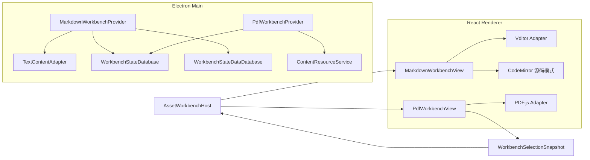
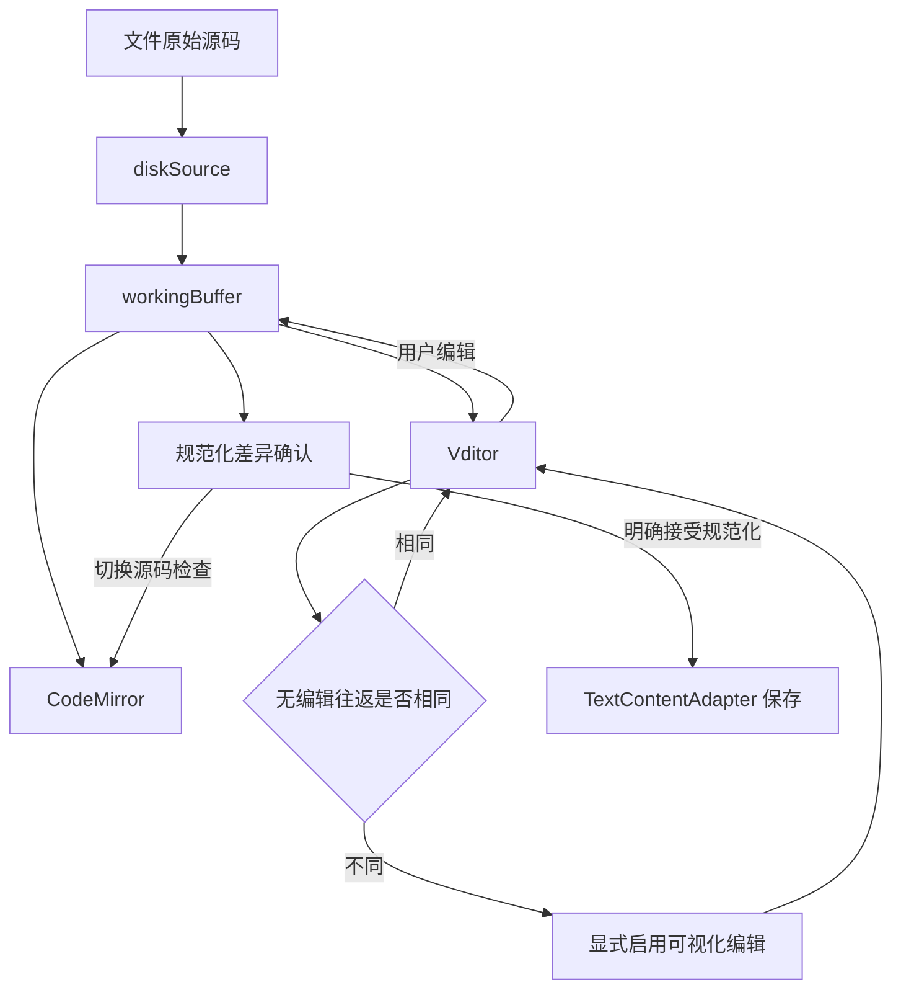
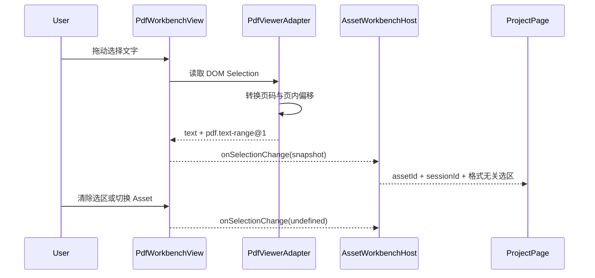

# Markdown 与 PDF Workbench 设计

> 日期：2026-07-28
>
> 状态：已确认，待实施

## 目标

在现有 Asset Workbench 架构上一次新增两个正式工作台：

- 可编辑的 Markdown Workbench；
- 只读的 PDF Workbench。

本阶段优先完成可靠的显示、编辑、分页、文本选择、状态恢复和本地资源加载。AI 问答、Attachment 持久化、截图、OCR 和生成中心不在本阶段实现，但 PDF 文字选区需要形成稳定 Anchor，并通过格式无关的 Workbench 选区出口向上层报告，为后续 AI 和笔记闭环提供基础。

## 范围

### Markdown Workbench

本阶段实现：

- 默认 WYSIWYG，支持切换到 Markdown 源码模式；
- 显式保存、未保存恢复和外部修改冲突检测；
- UTF-8、GBK、BOM、LF 和 CRLF；
- CommonMark、GFM、Front Matter、代码块、LaTeX 与 Mermaid；
- 源码保真保护和保存前规范化差异确认；
- 编辑模式、源码模式、滚动位置、选区和大纲状态恢复；
- 本地打包 Vditor 运行资源，不请求外部 CDN。

本阶段不实现：

- Markdown 相对路径本地图片解析；
- 自动加载远程图片；
- 图片上传、粘贴落盘或 Attachment；
- AI 写作、AI 修改或生成中心；
- Markdown WYSIWYG 选区 Anchor。

### PDF Workbench

本阶段实现：

- 连续滚动和单页翻页两种阅读模式；
- 页码、上一页、下一页和直接跳页；
- 缩放、适应宽度、适应整页、实际大小和旋转；
- 文档目录、缩略图和全文搜索；
- 普通文字 PDF 的选中与复制；
- 连续滚动模式的跨页文字选择和 `pdf.text-range@1` Anchor；
- PDF 内部链接、只读批注显示和密码 PDF；
- 阅读状态恢复；
- PDF.js Worker、CMap、Standard Fonts、WASM、ICC 和 Viewer 资源全部随应用打包。

本阶段不实现：

- PDF 内容编辑；
- 新增、修改或保存批注；
- PDF 表单保存；
- 数字签名；
- OCR；
- 截图、框选、录屏和 AI 问答；
- HTTP Range 与 `206 Partial Content`。

## 依赖选择

### Markdown

采用：

- `vditor@3.11.2`：WYSIWYG Markdown 编辑、LaTeX、Mermaid、GFM 和常用扩展语法；
- `@codemirror/lang-markdown`：CodeMirror 6 源码模式的 Markdown 语言支持；
- `diff-match-patch`：只用于生成保存前展示的源码规范化差异。

Vditor 官方提供 WYSIWYG、即时渲染和分屏预览三种模式，并内置数学公式、Mermaid、CommonMark 和 GFM 支持。本产品只使用 WYSIWYG 能力，源码模式由现有 CodeMirror 统一承担。

不采用 Milkdown Crepe 的原因：

- LaTeX 支持较好，但源码切换、Mermaid 编辑和差异确认仍需要较多自定义工作；
- 当前阶段的目标是尽量复用成熟的完整 Markdown 能力。

不采用 MDXEditor 的原因：

- Rich Text、Source 和 Diff 切换成熟；
- 但 LaTeX 和 Mermaid 需要额外建立自定义节点和编辑器，首版集成成本高于 Vditor。

### PDF

采用固定版本 `pdfjs-dist@6.1.200` 的 Display 与 Viewer 层：

- `PDFViewer`；
- `PDFLinkService`；
- `PDFFindController`；
- PDF Worker；
- Text Layer；
- Annotation Layer。

不直接嵌入未经修改的 PDF.js Generic Viewer，也不使用浏览器内置 PDF 插件。界面、状态、Session、资源 URL、错误处理和选区上报都由本产品控制。

## 总体架构



两个工作台保持独立：

- Markdown Main 复用文本读写能力，但不继承 Plain Text Provider；
- PDF Main 复用安全内容资源服务，但不依赖 Image Provider；
- Workbench Core 不增加 Markdown AST、Vditor、PDF.js Page 或 PDF.js EventBus 等格式特定类型；
- Renderer 通过现有动态 Loader 加载模块；
- Main 与 Renderer 使用相同 Manifest 和共享 Payload 校验器。

## 模块结构

```text
src/workbenches/
├── markdown/
│   ├── shared.ts
│   ├── shared.test.ts
│   ├── main.ts
│   ├── main.test.ts
│   ├── renderer.tsx
│   ├── renderer.test.tsx
│   ├── markdown-editor-adapter.ts
│   └── workbench-menu.tsx
└── pdf/
    ├── shared.ts
    ├── shared.test.ts
    ├── main.ts
    ├── main.test.ts
    ├── renderer.tsx
    ├── renderer.test.tsx
    ├── pdf-viewer-adapter.ts
    └── workbench-menu.tsx
```

通用选区契约扩展现有共享 Workbench 模块，不建立 PDF 专用 Host：

```text
src/shared/workbench/
├── anchor.ts
└── selection.ts
```

## 本地运行资源

Vditor 默认可从 CDN 加载渲染资源，本产品必须覆盖该行为。

构建时将以下资源复制进 Renderer 产物：

- Vditor `dist`；
- PDF.js Worker；
- PDF.js CMap；
- PDF.js Standard Fonts；
- PDF.js WASM；
- PDF.js ICC Profiles；
- PDF.js Viewer 图片和必要样式。

开发版和打包版都从应用自身 Origin 读取资源：

```text
Renderer bundle
├── vendor/vditor/...
└── vendor/pdfjs/...
```

禁止：

- 运行时访问 unpkg、jsDelivr 或其他 CDN；
- 使用 `file://` 暴露 Asset 原始路径；
- 放宽 CSP 允许任意脚本或 Worker 来源。

PDF Worker、`cMapUrl`、`standardFontDataUrl`、`wasmUrl` 和 `iccUrl` 都显式指向打包后的固定 URL。CSP 只增加运行所需的最小 `worker-src` 和资源类型白名单。升级 PDF.js 前必须重新验证选区索引算法和这份静态资源清单。

## Markdown Workbench

### Manifest

```ts
const markdownWorkbenchManifest: AssetWorkbenchManifest = {
  id: 'builtin.markdown',
  version: 1,
  protocolVersion: WORKBENCH_PROTOCOL_VERSION,
  supportedMediaTypes: ['text/markdown'],
  requiredContentCapabilities: ['read-bytes', 'write-bytes'],
  supportedAnchorTypes: [],
};
```

Markdown WYSIWYG 选区到源码 Anchor 的稳定映射不在本阶段实现，因此 Manifest 暂不声明 Anchor 支持。后续不得用脆弱的 DOM 节点序号假装稳定 Anchor。

### Main Provider

`MarkdownWorkbenchProvider` 负责：

- 使用 `TextContentAdapter` 读取和保存 Markdown；
- 维护每个 Session 的 `diskSource`、`workingBuffer` 和规范化状态；
- 保存独立 WorkbenchState；
- 定时把恢复内容写入 WorkbenchStateData；
- 校验编码、行尾、视图状态和命令 Payload；
- 使用 revision 防止覆盖外部修改；
- Session 关闭前落盘最后一份恢复内容；
- 保存成功后清除恢复内容。

它不负责：

- 创建或控制 Vditor；
- 渲染 Markdown；
- 计算 DOM 选区；
- 决定 UI 是否展示差异确认弹窗。

### 状态

```ts
interface MarkdownWorkbenchStateV1 {
  readonly viewMode: 'wysiwyg' | 'source';
  readonly sourceViewState?: {
    readonly anchor: number;
    readonly head: number;
    readonly scrollTop: number;
  };
  readonly wysiwygScrollTop: number;
  readonly wordWrap: boolean;
  readonly outlineVisible: boolean;
  readonly recovery?: MarkdownRecoveryState;
}

interface MarkdownRecoveryState {
  readonly dataKey: string;
  readonly baseRevision: string;
  readonly encoding: 'utf-8' | 'gbk';
  readonly lineEnding: 'lf' | 'crlf';
  readonly hasByteOrderMark: boolean;
  readonly editedFrom: 'source' | 'wysiwyg';
  readonly normalizationPending: boolean;
  readonly updatedTime: number;
}
```

恢复正文使用 UTF-8 存进 WorkbenchStateData。State 表只保存索引和元数据。

非法、未知版本或超出范围的状态回退到：

```ts
{
  viewMode: 'wysiwyg',
  wysiwygScrollTop: 0,
  wordWrap: true,
  outlineVisible: false,
}
```

### Markdown Buffer 状态机

运行时明确区分：

```ts
interface MarkdownSessionBuffer {
  readonly diskSource: string;
  readonly workingBuffer: string;
  readonly lastEditMode: 'source' | 'wysiwyg';
  readonly normalizationState: 'clean' | 'requires-confirmation';
}
```

- `diskSource`：当前 revision 对应的磁盘源码，只在保存成功或明确重新打开后变化；
- `workingBuffer`：编辑器当前准备保存的内容，也是恢复快照的正文；
- `normalizationState`：是否必须经过专用确认命令才能保存。



规则：

1. 初始化 Vditor 时屏蔽 `input` 回调。
2. Vditor Ready 后立即读取一次 Markdown 输出，与 `workingBuffer` 比较。
3. 两者相同只表示“无编辑初始化没有改写”，不承诺后续 WYSIWYG 操作不会规范化其他源码。
4. 两者不同时，WYSIWYG 默认保持只读，并显示源码规范化说明；用户必须显式选择“以可视化模式编辑”才能启用输入。
5. Source 模式从干净状态产生的修改使用 `markdown:sync-source-buffer`，Main 保持 `normalizationState='clean'`。
6. 任何来自 WYSIWYG 的第一次修改使用 `markdown:sync-wysiwyg-buffer`；Main 无条件设置 `normalizationState='requires-confirmation'`，Renderer 不能通过 Payload 把它改回 `clean`。
7. WYSIWYG 修改后的 `workingBuffer` 切到源码模式时保持不变，`requires-confirmation` 也不会因为切换或继续源码编辑而自动清除。
8. 普通 `markdown:save` 遇到 `requires-confirmation` 必须拒绝。
9. 只有用户查看差异并执行语义明确的 `markdown:save-normalized`，Main 才允许写入并清除确认状态。
10. 用户取消保存时，`diskSource` 和磁盘文件保持不变，`workingBuffer` 与恢复快照保留。
11. 保存成功后令 `diskSource=workingBuffer`，清除确认状态，并用新 revision 重新建立 WYSIWYG 往返基线。

本阶段不尝试通过模糊 Patch 自动把 Vditor 改动套用到原始源码。该算法在列表、表格、HTML 和 Mermaid 块上容易误改，违反源码保真目标。

本阶段对“源码保真”的可兑现承诺是：

- Source 模式不会格式化用户未修改的源码；
- 单纯打开、渲染或切换模式不会写文件；
- WYSIWYG 引起的整文档重新序列化绝不静默保存；
- 无法保证任意 WYSIWYG 编辑仍逐字节保留所有未编辑源码，因此必须展示差异并由用户明确接受。

模式切换是一次序列化边界。切换前先把当前内容立即同步到 Main，目标编辑器以最新 `workingBuffer` 初始化。Vditor 与 CodeMirror 不共享 Undo 栈；切换后目标模式建立新的本地 Undo 历史，文件恢复能力由 Main 的 `workingBuffer` 与 Recovery 保证。

### 保存与恢复

- 每次有效输入都立即把 `markdown:sync-source-buffer` 或 `markdown:sync-wysiwyg-buffer` 加入 AssetWorkbenchHost 的命令队列；
- Main 更新内存 `workingBuffer` 后再 debounce 持久化恢复正文，Renderer 不 debounce IPC Buffer 同步；
- Workbench 关闭时 Host 等待所有已经排队的同步命令，Main Provider 再强制持久化最新 `workingBuffer`；
- 显式保存通过 `expectedRevision` 原子替换文件；
- 外部修改导致 revision 冲突时拒绝覆盖；
- 恢复内容与磁盘内容相同时自动清除；
- 恢复内容基于旧 revision 时提示磁盘内容已经变化；
- `normalizationPending` 随恢复内容持久化，重启不能绕过确认。

### Renderer

`MarkdownEditorAdapter` 封装：

- Vditor 创建、Ready 和销毁；
- `setValue` 与 `getValue`；
- 初始化回调抑制；
- 选区浮动工具条；
- Mermaid、LaTeX 和代码块渲染；
- 大纲；
- WYSIWYG 滚动状态；
- 本地资源基址；
- HTML 清理和 Mermaid 安全配置。

React 组件不直接散布 Vditor 内部 DOM Class 和全局 API。

源码模式复用 CodeMirror：

- Markdown 语法高亮；
- 搜索替换；
- 撤销重做；
- 自动换行；
- 现有文本右键菜单；
- 选区和滚动状态恢复。

### UI

标题栏：

```text
[编辑 | 源码]  [保存]  [...]
```

WYSIWYG 模式采用居中的文档画布。源码模式占满 Workbench 内容区。

状态栏示例：

```text
未保存 · UTF-8 · LF · WYSIWYG
```

发生规范化风险时追加：

```text
保存前需要检查源码规范化
```

`...` 菜单：

- 显示或隐藏大纲；
- 自动换行；
- 使用指定编码重新打开；
- LF / CRLF；
- 查看规范化差异；
- 在文件夹中显示。

差异确认提供：

- 返回编辑；
- 切换到源码检查；
- 明确接受规范化并保存。

### Markdown 安全

- 原始 HTML 经过清理；
- 删除 `script`、事件处理属性、危险 URL 和可执行嵌入；
- Mermaid 使用严格安全配置；
- 外部链接交给系统浏览器；
- 远程图片默认阻止自动加载；
- 相对路径图片显示明确占位；
- Vditor 不启用缓存到 LocalStorage；
- 编辑器内容不发送到网络。

## PDF Workbench

### Manifest

```ts
const pdfWorkbenchManifest: AssetWorkbenchManifest = {
  id: 'builtin.pdf',
  version: 1,
  protocolVersion: WORKBENCH_PROTOCOL_VERSION,
  supportedMediaTypes: ['application/pdf'],
  requiredContentCapabilities: ['read-stream'],
  supportedAnchorTypes: ['pdf.text-range'],
};
```

### Main Provider

`PdfWorkbenchProvider` 负责：

- 校验 `read-stream` 能力；
- 为 Session 注册临时 `learning-content://resource/<token>`；
- 读取和校验 PdfWorkbenchState；
- 保存视图状态；
- Session 关闭时撤销临时 URL；
- Token 撤销后中止活动流。

它不解析 PDF，不接触 PDF.js 对象，也不保存 PDF 密码。

### 状态

```ts
type PdfReadingMode = 'continuous' | 'paged';

interface PdfWorkbenchStateV1 {
  readonly readingMode: PdfReadingMode;
  readonly pageNumber: number;
  readonly pageOffsetRatio: number;
  readonly scaleMode:
    | 'page-width'
    | 'page-fit'
    | 'actual-size'
    | 'custom';
  readonly customScale: number;
  readonly rotation: 0 | 90 | 180 | 270;
  readonly sidebar: 'closed' | 'outline' | 'thumbnails';
}
```

默认状态：

```ts
{
  readingMode: 'continuous',
  pageNumber: 1,
  pageOffsetRatio: 0,
  scaleMode: 'page-width',
  customScale: 1,
  rotation: 0,
  sidebar: 'closed',
}
```

状态使用页码和页内相对比例，不保存绝对滚动像素。

### 分页机制

PDF 页是正式模型，不把整份 PDF 转成一张无限长画布。

连续滚动模式：

- 页面垂直排列；
- PDF.js 只优先渲染视口附近页面；
- 当前页取视口内占比最大的页面；
- 上一页、下一页滚动到目标页；
- 页码输入直接跳转；
- 记录当前页与页内相对位置。

单页翻页模式：

- 使用 PDF.js Page Scroll Mode；
- 一次以一个页面容器为主要视图；
- 上一页、下一页、PageUp 和 PageDown 明确翻页；
- 缩放后页面大于视口时允许页内滚动；
- 只支持当前页内的浏览器原生文字选择；
- 不实现双页或书籍对开模式。

PDF.js Page Scroll Mode 不同时保留相邻页面的可选 Text Layer，因此跨页拖选只在连续滚动模式支持。切换阅读模式会清除当前临时选区，但不改变当前页。两种模式共用缩放、旋转、搜索和页内选区能力；本阶段不实现单页模式的“累计多页选区”交互。

### PDF Viewer Adapter

`PdfViewerAdapter` 封装：

- Worker 初始化和销毁；
- PDF Document LoadingTask；
- PDFViewer；
- EventBus；
- PDFLinkService；
- PDFFindController；
- Text Layer；
- Annotation Layer；
- Page、Scale、Rotation 和 Scroll Mode 转换；
- 加载进度；
- 密码回调；
- 选区到 Anchor 的转换。

React 只消费稳定事件和命令：

```ts
interface PdfViewerAdapterEvents {
  readonly onReady: (document: PdfDocumentSummary) => void;
  readonly onViewStateChange: (state: PdfWorkbenchViewState) => void;
  readonly onSelectionChange: (
    selection: WorkbenchSelectionSnapshot | undefined,
  ) => void;
  readonly onError: (error: PdfViewerError) => void;
}
```

### 文字选择

文字选择是本阶段的正式基础能力，而不是只依赖浏览器复制。

新增格式无关的共享契约：

```ts
interface WorkbenchSelectionSnapshot {
  readonly text: string;
  readonly target: ContentAnchorTarget;
}

interface WorkbenchSelectionEnvelope {
  readonly assetId: string;
  readonly sessionId: string;
  readonly selection: WorkbenchSelectionSnapshot | undefined;
}
```

`AssetWorkbenchHost` 为具体 View 提供：

```ts
onSelectionChange(
  selection: WorkbenchSelectionSnapshot | undefined,
): void;
```

Host 使用当前 Bootstrap 的 `assetId` 和 `sessionId` 包装成 `WorkbenchSelectionEnvelope` 后再上报 ProjectPage。ProjectPage 只接受仍与当前 Asset 和 Session 匹配的事件；旧 View 的异步清理事件不能覆盖新 Workbench 的选区。

Host 和 ProjectPage 只理解：

- 选中文字；
- Anchor Type、Version 和 JSON Payload。

它们不理解 PDF 页、PDF.js TextItem 或 DOM Range。

PDF Anchor：

```ts
interface PdfTextPositionV1 {
  readonly pageNumber: number;
  readonly offset: number;
}

interface PdfTextRangeAnchorV1 {
  readonly documentIdentity: {
    readonly fingerprint: string;
    readonly modifiedFingerprint?: string;
  };
  readonly start: PdfTextPositionV1;
  readonly end: PdfTextPositionV1;
  readonly quote: {
    readonly exact: string;
    readonly prefix: string;
    readonly suffix: string;
  };
}
```

`fingerprint` 和可选 `modifiedFingerprint` 来自当前 `PDFDocumentProxy.fingerprints`。解析已有 Anchor 时必须先比较当前文档身份：

- 完全匹配时才允许使用页码和偏移直接定位；
- 不匹配时标记 Anchor 为 `stale`；
- `quote` 只能在同一文档身份内辅助修复偏移，不能静默把旧 Anchor 命中重新定位后的另一份 PDF。

`pdf/shared.ts` 必须提供 `isPdfTextRangeAnchorV1` 和创建函数，并由 AnchorRegistry 注册版本 1 校验器。仅满足通用 `JsonValue` 不能视为合法 PDF Anchor。

包装为：

```ts
{
  scope: 'content',
  anchorType: 'pdf.text-range',
  anchorVersion: 1,
  anchorPayload: PdfTextRangeAnchorV1,
}
```

#### 页内偏移

Anchor V1 的 offset 单位固定为 JavaScript UTF-16 code unit。

每页以实际完成渲染的 Text Layer 可选文本序列建立 `PageTextIndex`：

- 使用与 Text Layer 相同的 `includeMarkedContent: true` 和 `disableNormalization: true` 参数取得文本数据；
- 不读取 PDF.js 未公开的 `textDivs` 或 `textContentItemsStr` 内部字段；
- Text Layer 渲染完成后，从公开 DOM Range 能力建立文本节点到页内 UTF-16 偏移的映射；
- Marked Content 包装节点、`br`、空文本节点和 Range 端点落在元素节点时，由 Adapter 归一化到相邻可选文本位置；
- 反向拖选先按文档顺序规范化 start/end；
- 双向文本、竖排、连字、代理对和组合字符仍按 Text Layer 实际可选择字符串计数；
- 页间分隔符不属于任意页面 offset，跨页选区正文使用单个 `\n` 连接页面片段；
- 缩放和旋转后重建相同算法的 PageTextIndex。

跨页选区记录不同的起止页，只在连续滚动模式生成。

Adapter 在上报 Anchor 前必须使用 PageTextIndex 反解 start/end，并与浏览器实际选区做空白规范化后的校验。两者不一致时仍允许浏览器复制，但不得生成可能指向错误内容的 Anchor；该页记录为可诊断的 Text Layer 映射失败。

`quote` 用于后续重新定位：

- `exact` 保存选中文字；
- `prefix` 和 `suffix` 保存邻近上下文；
- Anchor 解释器优先使用页内偏移；
- 偏移失效时可使用引文做二次匹配。

当前 Session 中的选区是临时状态，不直接写数据库。未来创建 Attachment 或向 AI 提问时再持久化或传给 Main。

扫描版 PDF 没有 Text Layer 时不能生成文字 Anchor。首版不伪造 OCR 文本或坐标 Anchor。

### PDF UI

标题栏：

```text
[搜索]  [...]
```

底部浮动工具条：

```text
[上一页] [12 / 186] [下一页] | [-] [125%] [+] [适应宽度]
```

搜索：

- `Command/Ctrl + F`；
- 当前结果和总结果；
- 上一个和下一个；
- 跨页高亮；
- Escape 关闭。

快捷键：

- `Command/Ctrl + 滚轮`：缩放；
- `+` / `-`：缩放；
- `Command/Ctrl + 0`：适应宽度；
- `Command/Ctrl + 1`：实际大小；
- PageUp / PageDown：相邻页面；
- Escape：关闭搜索或临时浮层。

`...` 菜单：

- 连续滚动；
- 单页翻页；
- 显示缩略图；
- 显示文档目录；
- 适应宽度；
- 适应整页；
- 实际大小；
- 顺时针旋转；
- 逆时针旋转；
- 在文件夹中显示。

选中文字后首版提供：

- 系统复制；
- Workbench Selection 上报。

不显示无功能的 AI、笔记或 Attachment 按钮。

### 链接与密码

- PDF 内部链接由 PDFLinkService 处理；
- `RendererWorkbenchViewProps` 增加通用 `onOpenExternal(url)` 回调；
- AssetWorkbenchHost 通过 Preload 的窄接口请求 Main 打开外部链接；
- Main 使用 Electron `shell.openExternal`，调用前只允许合法的 `http:` 和 `https:` URL；
- PdfViewerAdapter 只调用传入回调，不直接依赖 `window.learningCompanion`；
- 其他 Scheme 默认拒绝；
- 外部链接不得在 Electron Renderer 内导航。

密码 PDF：

- 密码输入 UI 位于 Renderer；
- 密码只交给当前 PDF.js LoadingTask；
- 不通过 IPC；
- 不写 WorkbenchState、日志或数据库；
- Session 关闭后从内存释放；
- 密码错误保留输入界面并允许重试。

### PDF 资源与性能

首版继续使用现有完整顺序流：

- `Content-Length` 可用；
- PDF.js 可以消费流并显示加载进度；
- 不声明 `Accept-Ranges`；
- 不解析 Range Header；
- 不返回 `206`。

大文件优化在独立阶段实现，不在这两个 Workbench 的首版同时扩大 ContentResourceService 协议范围。

## Workbench Selection 生命周期



Asset 切换、Workbench 关闭和页面卸载时必须清除旧选区。Host 以当前 Bootstrap 身份过滤事件，避免右侧功能误用上一个 Asset 的文字，也避免旧 View 的异步清理覆盖新选区。

## 状态与命令

Markdown 和 PDF 使用独立命令前缀：

```text
markdown:sync-source-buffer
markdown:sync-wysiwyg-buffer
markdown:save
markdown:save-normalized
markdown:discard-recovery
markdown:set-view-state
markdown:set-view-options
markdown:reopen-encoding

pdf:save-view-state
```

不新增巨型通用 `workbench:save` 或 `workbench:set-page` 命令。

Renderer 继续通过 AssetWorkbenchHost 的串行命令队列执行命令。Buffer 输入不在 Renderer debounce，关闭 Session 前等待队列完成；Provider `close()` 随后把最新内存 Buffer 强制写入恢复仓库。只有数据库恢复写入与纯视图状态保存允许 debounce。

## 错误处理

### Markdown

- 编码无法解码；
- 保存存在编码损失；
- 文件被外部修改；
- 恢复内容与磁盘 revision 冲突；
- Vditor 初始化失败；
- Mermaid 或 LaTeX 单个块渲染失败；
- 规范化风险未确认；
- WorkbenchState 保存失败。

单个 Mermaid 或公式块失败只在块内显示错误，不卸载整份 Markdown。

### PDF

- 文件损坏或不是合法 PDF；
- 密码错误；
- Worker 初始化失败；
- CMap 或字体资源缺失；
- 内容流读取失败；
- PDF.js 不支持的特性；
- 搜索或视图状态保存失败；
- Text Layer 无法建立选区索引。

密码错误继续停留在密码输入界面。视图状态保存失败不关闭已打开文档。致命加载错误显示刷新、重新定位和在文件夹中显示。

底层错误继续通过现有 `AppError` 和统一 Renderer 错误弹窗兜底，不向用户暴露文件路径、数据库结构或堆栈。

## 测试

### Markdown Shared 与 Main

- Manifest 与 Payload；
- V1 State 校验和非法回退；
- UTF-8、GBK、BOM、LF 和 CRLF；
- Buffer 同步、定时恢复持久化、恢复和清理；
- 外部修改冲突；
- 编码损失；
- Source/WYSIWYG 两类同步命令的状态转移；
- Main 收到 WYSIWYG 修改后强制要求规范化确认；
- 普通保存不能绕过 `markdown:save-normalized`；
- 规范化 Pending 状态跨重启保留；
- Session 关闭前保存恢复内容。

### Markdown Renderer

- Vditor 初始化不触发脏状态；
- 安全与不安全往返；
- 不安全往返默认只读和显式启用可视化编辑；
- WYSIWYG 与源码切换；
- 保存差异确认；
- 模式切换后的 Buffer 与 Undo 边界；
- CodeMirror 选区与滚动恢复；
- Mermaid、LaTeX、代码块和 Front Matter；
- 单个块失败不影响文档；
- Vditor 销毁；
- React StrictMode 双初始化防护；
- 运行时不发出外部网络请求。

### PDF Shared 与 Main

- Manifest、Bootstrap 和 State 校验；
- 默认状态和非法回退；
- 内容 URL 注册；
- Session 关闭撤销 Token；
- 状态保存；
- 非 PDF 或缺少能力时拒绝匹配。

### PDF Renderer

- Worker 初始化和销毁；
- 连续滚动与单页翻页；
- 页码跳转；
- 缩放、适应和旋转；
- 目录和缩略图；
- 搜索与高亮；
- 密码输入和错误重试；
- Text Layer 选择；
- 页内 Anchor；
- 连续模式跨页 Anchor；
- 单页模式只产生页内 Anchor；
- UTF-16 offset、反向选择、Marked Content 和元素端点；
- 双向文本、竖排、连字、代理对和组合字符夹具；
- 文档 Fingerprint 不匹配时 Anchor 进入 stale；
- Text Layer 映射校验失败时只复制、不生成 Anchor；
- 清除选区；
- 旧 Session 选区事件不能覆盖当前 Session；
- 扫描页不生成文字 Anchor；
- 外部链接不在 Renderer 内导航；
- 状态 debounce 和卸载前提交。

### Electron 集成验证

Markdown 样本：

- CommonMark；
- GFM 表格与任务列表；
- Front Matter；
- HTML 块；
- LaTeX；
- Mermaid；
- UTF-8 与 GBK；
- 会被 Vditor 规范化的边界样本；
- 应用重启后的恢复。

PDF 样本：

- 多页文本 PDF；
- 中文 PDF；
- 带目录和链接的 PDF；
- 扫描版 PDF；
- 密码 PDF；
- 损坏 PDF；
- 大型 PDF；
- 连续模式跨页文字选择；
- 单页模式页内选择。

共同验证：

- 关闭 Workbench 后旧资源 URL 失效；
- Asset 切换清除旧选区；
- 返回 Home 再进入恢复状态；
- 开发版和打包版不访问 CDN；
- PDF Worker、CMap、Standard Fonts、WASM、ICC 和 Annotation 图片均来自本地；
- macOS 本地打包资源完整；
- Windows CI 或真实 Windows 设备打包资源完整；
- `pnpm check`；
- `pnpm package`；
- `pnpm smoke:native`；
- `pnpm verify:package:native`。

## 实施边界

本阶段允许为了通用选区出口对 `RendererWorkbenchViewProps`、`AssetWorkbenchHost` 和 ProjectPage 做最小扩展。

不允许：

- 为 PDF.js 或 Vditor 细节修改通用 Workbench Bootstrap；
- 把 PDF 页码加入 Asset；
- 把 Markdown Buffer 加入 Asset；
- 在 Renderer 访问绝对路径；
- 把密码、恢复正文或大段选区写入普通设置 JSON；
- 为未来 AI 提前实现无调用方的菜单和 IPC；
- 在同一阶段顺带实现 Range、OCR、Attachment 或 Markdown 相邻资源树。

## 完成标准

- `.md` 和 `.markdown` 打开真实 Markdown Workbench；
- WYSIWYG、源码模式、保存和恢复可用；
- LaTeX 与 Mermaid 在本地资源条件下可编辑和显示；
- 单纯打开或切换模式不会静默改写 Markdown；
- 任何 WYSIWYG 修改必须经用户查看差异并明确接受后才能保存；
- Source 模式保存不会格式化未修改源码；
- PDF 支持连续滚动和单页翻页；
- PDF 页码、跳页、搜索、缩放、旋转、目录和缩略图可用；
- 带文字的 PDF 可以选中和复制；
- PDF 选区能生成合法 `pdf.text-range@1` Anchor；
- 连续模式跨页选区、单页模式页内选区和 Asset 切换行为正确；
- PDF Anchor 包含文档身份，重新定位到不同 PDF 后不会静默命中；
- 扫描版 PDF 不伪造文字选区；
- Vditor、PDF Worker、CMap、Standard Fonts、WASM、ICC 和 Annotation 图片不依赖网络；
- Renderer 不获得本地路径；
- 所有现有 Plain Text 与 Image Workbench 回归测试通过；
- macOS 本地打包验证通过；
- Windows CI 或真实 Windows 设备验证通过后才能宣称 Windows 完成。
