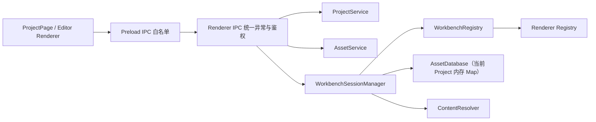

# 纯文本 Workbench（Text Editor）交互增强设计

> 日期：2026-07-28  
> 状态：待实现  
> 版本：v1

## 1. 目标

在现有 Project/Asset 工作台链路上，完成 Plain Text Editor 的第一阶段交互闭环，核心目标有三：

1. 提升滚动体验，确保鼠标滚轮与触控板滑动自然、可拖拽滚动条，且不会出现卡顿或丢失焦点。
2. 实现可用的右键菜单，覆盖常用文本编辑操作（撤销/恢复、剪切/复制/粘贴、全选、查找）。
3. 为未来工作台能力预留接口（例如 AI 交互与工作台特有菜单动作），避免后续迁移成本。

此阶段不实现：

- Markdown 专用语义功能（例如目录树/标题导航）
- PDF 式高亮与注释
- 自定义 Workbench 菜单主题
- 深度跨窗口协同编辑

## 2. 现状与边界

现有架构已完成 `Asset -> Workbench Session -> Renderer Workbench View` 路径：

Plain Text Workbench 目前已经作为 `unsupported` 流程之外的基础模块存在，重点放在“编辑器内交互体验”而非新数据模型；因此本设计只在 Renderer 内部增强交互，并通过已有 IPC 错误通道展示结果。

## 3. 设计方向对比与决策

### 方案 A（推荐）：纯前端自定义菜单 + CodeMirror 事务

- 右键事件由 React 容器层捕获并绘制 menu overlay。
- 所有命令都走当前 `EditorView` 的 transaction/command（undo/redo/cut/copy/paste/search）。
- 适合后续扩展：可按 workbench 注入“动作组”（AI、代码格式化、文件导出等）。

### 方案 B：直接绑定系统原生菜单（Electron）

- 与 OS 一致性高，但定制能力受限，且难以嵌入未来 AI/工作台动作面板。
- 与现有 React 菜单占位逻辑不一致，后续迁移成本更高。

决策：采用方案 A。

### 滚动行为方案

- 保留 CodeMirror 6 的原生滚动能力，不引入自定义滚动动画。
- 通过主题与容器配置保证滚动条稳定、可见可拖拽、并降低滚轮/触控抖动对编辑体验影响。

## 4. 组件与职责

### 4.1 Text Editor Host（Renderer）

新增/强化 `src/workbenches/plain-text/renderer.tsx` 的职责：

- 渲染 CodeMirror 编辑器。
- 管理 context menu 的显示状态。
- 管理菜单 action 与 selection 关系。
- 对外输出 `WorkbenchCommand`（由 Workbench Host 调度）。
- 维护滚动与恢复逻辑（`scrollTop`）到 ViewState。

### 4.2 编辑命令层（Renderer）

统一通过内部函数（无 Side Effect 在主进程）处理命令：

1. `undo` / `redo`：调用 `undo`/`redo` 命令。
2. `cut` / `copy` / `paste`：优先走 `editor.dispatch` + 命令实现；
3. `find`：打开 CodeMirror 内置搜索面板；
4. `selectAll`：全量选择。

### 4.3 滚动层（CodeMirror 配置）

从容器级别提供以下约束：

- 编辑区域使用稳定布局，避免菜单开启时抖动。
- 允许键盘/触控板自然滚动；必要时补充 `scrollbar-gutter: stable`。
- 记录恢复滚动位置，支持项目切换回退后恢复到上一次位置。
- 保留行高字体缩放设置，保证大文档中滚动线性。

### 4.4 右键菜单层

菜单由三层组成：

1. 基本编辑组
2. 搜索组
3. AI 扩展组（预留）

渲染状态只关注当前 `selection` + `editor view`，不直接读取 Asset 内容。关闭时清理临时状态，避免悬挂引用。

## 5. 交互规范

### 5.1 触发规则

- 在编辑器主滚动容器监听 `onContextMenu`。
- 右键坐标用于菜单定位（偏移边界避免超出窗口）。
- 点击外部区域、按 `Esc`、编辑器滚动或失焦关闭菜单。
- 当用户连续快速操作时，菜单进入“短暂禁用”状态防抖，避免重复执行同一命令。

### 5.2 选择行为

- 若鼠标位于当前选区内，菜单操作基于既有选区执行（剪切/复制可见）；
- 若鼠标位于选区外：先将光标移动到点击点再打开菜单，避免误剪/误复制。

### 5.3 命令可用性

- `Undo`/`Redo`：依赖 CM history 可用性决定按钮可点击。
- `Cut`/`Copy`：无选区时禁用 `Cut`，`Copy` 可保留默认行为（无选区时可复制空字符串，不触发修改）。
- `Paste`：优先保持当前文档编码语义，不做富文本内容注入。
- `Find`：打开搜索面板并聚焦关键字输入。
- `Select All`：永远可用。

### 5.4 失败提示

所有操作若异常（例如剪切板读写失败、查找面板异常）统一转换为 AppError，通过现有 “中上提示弹窗”展示，确保用户可见。

## 6. 与现有系统的接口关系

本次设计只新增 Editor 内部交互，不要求新增数据库字段。

- 现有 Project/Asset 生命周期维持不变。
- ViewState 继续用 `workbenchState`（或现有兼容字段）记录：
  - `scrollTop`
  - `selection anchor/head`（仅编辑器会话内恢复）
- 代码执行错误继续走现有 `Error Boundary` 与统一 Error IPC 映射。
- 如需剪贴板 IPC（未来可替换），新增 `ClipboardService` 的白名单 API 保持“主进程实现 + 预加载桥接”的既有安全边界。

## 7. 数据与状态

### 7.1 运行态状态

- `menuOpen`: `boolean`
- `menuPosition`: `{ x: number; y: number }`
- `menuAnchor`: 当前 anchor 信息（用于关闭后清理）
- `isReadonly`: 工作区当前是否可编辑
- `isBusy`: 菜单命令执行节流

### 7.2 持久态（已有）

- `scrollTop`, `selection`: 保留在现有 WorkbenchState。
- 无需新增字段。

## 8. 错误与边界

1. 纯文本读取后文件内容不是文本：仍走现有 unsupported/异常链路，不在本次更改里重新分类。
2. 剪贴板访问失败：
   - 在菜单内给出不可用提示；
   - 仅回滚该动作，不影响编辑器内容。
3. 右键菜单与拖拽/滚动冲突：
   - 右键按下时以菜单打开优先，但滚动条拖拽动作保持原生交互。
4. 大文档：
   - 使用 CodeMirror 6 的虚拟渲染机制，不一次性加载全量 DOM。
5. 长按右键与重复点击：
   - 通过命令节流防止重复执行。

## 9. 测试计划（实现后）

- 滚动体验
  - 鼠标滚轮可连续滚动，触控板自然平滑
  - 滚动条可拖拽，拖拽过程中 selection 不丢失
  - 保存/恢复 `scrollTop` 后再次打开同一 asset 位置信息一致
- 右键菜单
  - 在选区内/外右键打开行为正确
  - Undo/Redo 的 enabled 状态随历史变化
  - Cut/Copy/Paste 命令有效
  - Find 打开搜索面板且可检索
  - 菜单外点/ESC/滚动关闭
  - 错误弹窗出现时不崩溃且不锁死编辑器
- 兼容性
  - macOS、Windows 下行为一致（菜单定位、键位提示）
  - 与现有 `project` 切换逻辑无冲突
- 自检目标
  - `pnpm check` 不新增类型/lint 失败项
  - 不影响现有 UnsupportedWorkbench fallback

## 10. 分步实施建议（供写实施计划）

1. 调整 `theme` 与编辑器容器，强化滚动和滚动条体验。
2. 在 renderer 内部引入 `ContextMenu` overlay 及定位逻辑。
3. 接入命令分发（undo/redo/cut/copy/paste/selectAll/find）。
4. 完善 selection 与失焦/关闭逻辑，加入命令禁用态。
5. 对齐统一错误弹窗策略，补充异常自恢复。
6. 补充必要的回归测试样例并整理截图/手工验证步骤。

## 11. 结论

此设计先在纯文本编辑场景把“阅读流畅度”和“基本编辑可用性”一次性打通，保证后续 Markdown/PDF/其它 Workbench 具备可复用的菜单与交互接口。先行做对滚动和菜单，不仅提升 MVP 使用体验，也会减少后续每个编辑器重复造轮子。
