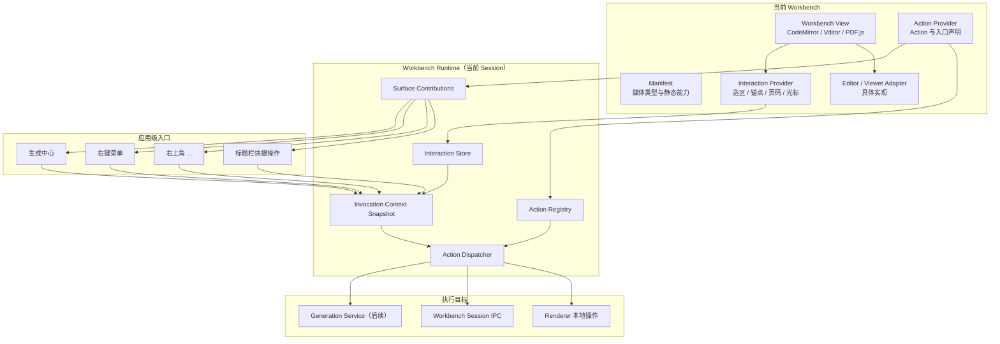

# Workbench Action 与交互入口统一架构设计

> 日期：2026-07-28
>
> 状态：已实施；2026-08-20 增补受控标题栏快捷操作 Surface

## 1. 背景

当前资料工作台存在四类受控交互入口：

1. 资料工作台标题栏中的高频快捷操作；
2. 标题栏右上角的 `...`；
3. 编辑器或查看器内部的右键菜单；
4. Project 页面右侧的生成中心。

目前四个内置 Workbench 分别通过 `headerActionsTarget` 和
`createPortal()` 渲染自己的标题栏菜单，纯文本和 Markdown 源码模式
也分别维护了相似的右键菜单。生成中心仍为占位实现，虽然
`WorkbenchSelectionEnvelope` 已经可以把 PDF 选区上报到
`ProjectPage`，但该状态尚未被生成中心消费。

如果继续由各 Workbench 分别维护入口 UI，基础编辑操作、错误处理、
菜单行为和未来 AI Action 会被重复实现。另一方面，CodeMirror、
Vditor、PDF.js 和图片查看器的内部能力差异很大，不能通过一个统一
编辑器接口强行抹平。

本设计采用“行为与入口分离”的方式：Workbench 提供能力、Action 和
交互上下文，应用外壳拥有四个 UI 入口，并通过统一 Runtime 将二者连接。

## 2. 目标

- 统一四个内置 Workbench 的右上角 `...`。
- 允许媒体 Workbench 通过受控数据声明少量高频标题栏操作，而不是注入
  React 节点或 Portal。
- 统一纯文本、Markdown 源码和 Markdown WYSIWYG 三个编辑面的右键菜单。
- 让生成中心能够读取当前 Workbench、Asset、Session、选区和锚点。
- 同一个 Action 可以被多个入口复用，而不重复执行逻辑。
- 保留各 Workbench 对编辑器或查看器内部能力的完全控制。
- 为选区提问、生成笔记、知识卡片和思维导图预留统一扩展点。
- Workbench 切换或卸载后不残留旧回调、旧菜单和旧选区。
- 让目录结构明确区分跨进程契约、Renderer Runtime、通用 UI 和
  媒体特化实现。

## 3. 非目标

本轮不实现：

- 真实 LLM 或 Codex 调用；
- 真实的思维导图、摘要、知识卡片生成；
- 生成任务队列和历史记录；
- 把 PDF、HTML、图片和音视频强行套入 Editor Action Preset；
- 第三方 Workbench 插件加载；
- 任意 React 节点形式的菜单扩展。

生成中心只接入 Contribution 和 Interaction Context，继续使用空状态
或禁用状态表达尚未实现的工具。

## 4. 方案比较

### 4.1 各 Workbench 独立实现各个入口

优点是局部实现直接，不需要新增 Runtime。缺点是菜单样式、生命周期、
选区处理、AI Action 和错误处理会持续复制，当前代码已经出现该问题。

### 4.2 完全通用的字符串命令注册表

所有入口只接收 `{ label, enabled, run }`。该方案灵活，但会丢失
checkbox、radio、选区能力和不同执行来源的类型约束，容易出现菜单可见
但底层状态不匹配的问题。

### 4.3 Action Registry + Surface Contribution + Interaction Context

本设计选择该方案。

- Action Registry 维护唯一 Action ID 和执行行为。
- Surface Contribution 决定 Action 在哪个入口以及如何展示。
- Interaction Context 提供当前 Asset、Session、选区和锚点。
- Workbench Adapter 封装 CodeMirror、Vditor 或查看器的具体操作。
- 应用级 Host 统一渲染菜单和生成中心。

该方案既能复用行为，又不会要求不同查看器实现相同的内部接口。

## 5. 总体关系



Workbench 不再直接渲染外部菜单。它只注册 Action、Contribution，
发布 Interaction，并通过 Adapter 执行内部操作。

## 6. 四个入口的语义边界

### 6.0 标题栏快捷操作

只承载当前 Workbench 的少量高频、短标签操作，例如图片的“框选解释”、
标注索引开关与标注可见性。Workbench 仍只提交 Action、Contribution 和
受控 Presentation 数据；`WorkbenchHeaderActionsHost` 统一生成按钮、
disabled/busy 状态和 ARIA 属性。

标题栏 Surface 必须由 Manifest 显式声明 `core.surface.header`。不允许
Workbench 传入 ReactNode、DOM 目标或 Portal，因此新增标题栏能力不会反向
依赖 Host 实现。

### 6.1 右上角 `...`

只用于当前 Workbench 的设置、视图选项和文档级操作，例如：

- 自动换行和行号；
- 编码和换行符；
- Markdown 大纲；
- PDF 阅读模式、侧栏、缩放和旋转；
- 图片适应窗口、实际大小和旋转；
- 在文件夹中显示。

该入口不放 AI 生成操作，默认不依赖当前选区。

### 6.2 右键菜单

用于当前点击位置或选区的即时操作，例如：

- 撤销和重做；
- 剪切、复制和粘贴；
- 查找和全选；
- 后续的解释选区、询问 AI 和固化笔记。

右键菜单打开时必须冻结 Interaction Context。点击菜单造成编辑器失焦
后，Action 仍然使用打开菜单时的选区和锚点。

查看器类 Workbench 同样使用 Runtime 提供的菜单宿主，但菜单内容由各自
声明：PDF 面向页码与文字选区，HTML 面向原始 DOM 的选区、链接和媒体，
图片面向视野，视频面向时间点与画面。它们不复用文本编辑器的
撤销、剪切、粘贴等通用预设。沙箱 HTML 的右键上下文由主进程只读捕获，
经白名单事件传给 Renderer；HTML 本身仍不能访问 Preload 或应用 IPC。

### 6.3 生成中心

用于持续可见、可配置、可能长时间运行的生成任务。它由两类工具组成：

- Project 或应用级的全局生成工具；
- 当前 Workbench 贡献的媒体特化工具。

同一个生成 Action 可以在右键菜单中快速执行，也可以在生成中心中通过
完整配置执行。两种入口共享 Action ID、上下文校验和底层执行逻辑，但
允许不同的 Presentation。

## 7. 核心数据契约

### 7.1 Action

```ts
interface WorkbenchAction {
  readonly id: string;
  readonly enabled: boolean;
  readonly execute: (
    context: WorkbenchInvocationContext,
  ) => Promise<void> | void;
}
```

Action ID 在当前 Runtime 内必须唯一，并使用带 Workbench 或应用命名空间
的稳定名称，例如 `plain-text.toggle-word-wrap`。Owner 只负责成组管理
Action 的生命周期，不为 Action ID 提供隐式命名空间。执行行为由当前
Renderer Workbench 注册，可以调用本地 Adapter、现有
`executeCommand()` 或后续受限的 Generation IPC。

### 7.2 Contribution

```ts
type WorkbenchSurface =
  | 'header'
  | 'overflow'
  | 'context-menu'
  | 'generation-center';

interface WorkbenchContribution {
  readonly actionId: string;
  readonly surface: WorkbenchSurface;
  readonly group: string;
  readonly order: number;
  readonly presentation: WorkbenchActionPresentation;
}
```

首版 Presentation 支持：

- 普通 Action；
- checkbox；
- radio；
- 生成工具卡片的静态描述。

普通 Action、checkbox 和 radio 的 Presentation 可以携带帮助文本或
禁用原因。分组标题和分隔线由 `group` 与 `order` 推导，不注册成虚假的
Action。

不允许 Workbench 向通用菜单注入任意 React 节点。需要复杂配置的生成
工具以后在生成中心的受控详情区域中扩展，不污染通用菜单。

### 7.3 Owner 与生命周期

Workbench 通过以下语义注册：

```ts
runtime.registerContributions(ownerId, {
  actions,
  contributions,
});
```

- 同一个 `ownerId` 再次注册表示原子替换；
- Workbench 状态变化时可以更新 `enabled`、checkbox 和 radio 状态；
- Owner 卸载时自动注销；
- Action ID 冲突、Contribution 指向不存在的 Action 时立即拒绝注册；
- Runtime 以当前 Session 为作用域，不使用跨窗口的全局单例。

### 7.4 Interaction Context

`shared/workbench/interaction.ts` 先定义不包含 Session 身份的交互快照：

```ts
interface WorkbenchInteractionSnapshot {
  readonly target?: ContentAnchorTarget;
  readonly selection?: WorkbenchSelectionSnapshot;
}
```

再由当前 Runtime 加入可序列化的 Session 身份：

```ts
interface WorkbenchInteractionContext
  extends WorkbenchInteractionSnapshot {
  readonly projectId: string;
  readonly assetId: string;
  readonly workbenchId: string;
  readonly sessionId: string;
}
```

`WorkbenchSelectionSnapshot` 继续使用稳定 Anchor 表达来源位置，并允许
以后扩展文字、PDF 区域、图片矩形、音视频时间段和思维导图节点。
Renderer 专用的编辑器实例、DOM Range 和回调不得进入该共享契约。

### 7.5 Invocation Context

执行时复制当前 Interaction 并加入入口来源：

```ts
interface WorkbenchInvocationContext
  extends WorkbenchInteractionContext {
  readonly origin:
    | 'header'
    | 'overflow'
    | 'context-menu'
    | 'generation-center';
}
```

Invocation Context 是不可变快照。右键菜单在打开时创建，生成中心在用户
确认生成时创建，右上角菜单在点击 Action 时创建。

## 8. Renderer Runtime

Runtime 是当前 `AssetWorkbenchHost` 下的 Session 级容器，负责：

- 注册和注销 Action；
- 注册和筛选 Contribution；
- 保存当前 Interaction；
- 管理打开的右键菜单及其快照；
- 生成 Invocation Context；
- 检查 Action 是否仍属于当前 Session；
- 统一执行、busy 和错误上报。

Runtime 使用作用域化 Store，而不是进程级单例。这样未来多个 Electron
窗口可以拥有独立的活动 Project 和 Workbench。

现有 `WorkbenchSelectionEnvelope` 的防旧 Session 逻辑保留，并迁移到
Runtime Store。切换 Asset 时先清理旧 Interaction，再装载新 Session。

## 9. 通用菜单模型

`WorkbenchMenu` 统一负责：

- action、checkbox 和 radio 的 ARIA 语义；
- 分组、标题、分隔线和快捷键提示；
- disabled 与帮助文本；
- 点击外部和 Escape 关闭；
- 异步 busy；
- 视口边界修正；
- macOS 和 Windows 快捷键标签；
- Action 抛错后的统一上报。

`WorkbenchHeaderActionsHost` 与 `WorkbenchOverflowHost` 固定安装在资料
工作台标题栏。前者只渲染受控快捷按钮，后者渲染分组菜单。

`WorkbenchContextMenuHost` 在当前 Workbench Host 内只安装一次，并通过
Portal 渲染到应用顶层；Workbenches 不再自己创建 Portal。

## 10. 编辑器 Action Preset

通用编辑器能力定义为：

```ts
interface EditorActionAdapter {
  getState(): EditorActionState;
  undo(): void;
  redo(): void;
  cut(): Promise<void>;
  copy(): Promise<void>;
  paste(): Promise<void>;
  selectAll(): void;
  find(): void;
  captureInteraction(): WorkbenchInteractionSnapshot;
}
```

`editor-action-preset.ts` 基于 Adapter 生成统一的：

- 撤销；
- 重做；
- 剪切；
- 复制；
- 粘贴；
- 全选；
- 查找；
- 预留的 AI Action 分组。

适配关系：

- 纯文本和 Markdown 源码共用 CodeMirror Adapter；
- Markdown WYSIWYG 使用 Markdown 目录内的 Vditor Adapter；
- 不支持的基础操作保持显示但置灰，保证三个编辑面的菜单结构稳定；
- PDF 和图片本轮不实现 `EditorActionAdapter`。

Adapter 负责保存和恢复编辑器特有选区。通用菜单不得访问 CodeMirror
State、Vditor 实例或 DOM Range。

## 11. 文件结构

```text
src/
├── shared/
│   └── workbench/
│       ├── manifest.ts
│       ├── protocol.ts
│       ├── anchor.ts
│       ├── attachment.ts
│       ├── selection.ts
│       └── interaction.ts
│
├── renderer/
│   ├── workbench/
│   │   ├── host/
│   │   │   ├── AssetWorkbenchHost.tsx
│   │   │   ├── AttachmentHost.tsx
│   │   │   ├── WorkbenchOverflowHost.tsx
│   │   │   └── WorkbenchContextMenuHost.tsx
│   │   ├── runtime/
│   │   │   ├── WorkbenchRuntimeProvider.tsx
│   │   │   ├── workbench-runtime-store.ts
│   │   │   ├── workbench-action-registry.ts
│   │   │   ├── workbench-invocation.ts
│   │   │   └── use-workbench-contributions.ts
│   │   ├── actions/
│   │   │   ├── workbench-action.ts
│   │   │   ├── workbench-contribution.ts
│   │   │   └── editor-action-preset.ts
│   │   ├── editor/
│   │   │   ├── editor-action-adapter.ts
│   │   │   └── codemirror-action-adapter.ts
│   │   ├── ui/
│   │   │   ├── WorkbenchMenu.tsx
│   │   │   └── workbench-menu-model.ts
│   │   ├── renderer-workbench-registry.ts
│   │   └── workbench-lifecycle.ts
│   └── generation/
│       └── GenerationCenter.tsx
│
└── workbenches/
    ├── plain-text/
    │   ├── renderer.tsx
    │   ├── renderer-actions.ts
    │   ├── main.ts
    │   └── shared.ts
    ├── markdown/
    │   ├── renderer.tsx
    │   ├── renderer-actions.ts
    │   ├── markdown-editor-adapter.ts
    │   ├── main.ts
    │   └── shared.ts
    ├── pdf/
    │   ├── renderer.tsx
    │   ├── renderer-actions.ts
    │   ├── pdf-viewer-adapter.ts
    │   ├── main.ts
    │   └── shared.ts
    └── image/
        ├── renderer.tsx
        ├── renderer-actions.ts
        ├── main.ts
        └── shared.ts
```

各 Workbench 的 `workbench-menu.tsx` 在迁移完成后删除。

## 12. 执行与错误处理

统一 Dispatcher 按以下顺序执行：

1. 根据 Contribution 找到 Action；
2. 检查 Action 属于当前 Runtime Owner；
3. 检查 Invocation 的 Session 与活动 Session 一致；
4. 检查 `enabled`；
5. 设置该 Action 的 busy；
6. 执行 Action；
7. 将异常转换为统一用户错误；
8. 清理 busy，并根据 Presentation 的关闭策略关闭入口。

规则：

- 用户取消不显示错误；
- 本地编辑 Action 失败也必须经过统一错误上报；
- busy 按 Action 隔离，不锁住整个 Workbench；
- 重复点击同一个 busy Action 被忽略；
- Workbench 卸载时打开的菜单立即关闭；
- 过期 Session 的本地和 IPC Action 均拒绝执行；
- 后续生成任务使用可序列化快照，不长期持有 Renderer Adapter。

## 13. 数据流示例

### 13.1 Markdown 右键复制

1. CodeMirror 或 Vditor Adapter 捕获右键位置和选区；
2. Runtime 冻结 Interaction；
3. Context Menu Host 显示 Editor Preset；
4. 用户点击复制；
5. Dispatcher 校验 Session 和 Action；
6. Adapter 恢复选区并写入剪贴板；
7. 菜单关闭。

### 13.2 PDF 修改阅读模式

1. PDF Workbench 注册连续滚动和单页翻页 radio Action；
2. Overflow Host 按当前状态渲染；
3. 用户选择模式；
4. Dispatcher 调用 PDF Adapter；
5. PDF Workbench 保存新的 View State；
6. Contribution 状态更新。

### 13.3 后续解释选区

1. Workbench 发布文字或区域选区及 Anchor；
2. 同一 Action 同时贡献给右键菜单和生成中心；
3. 右键菜单以默认参数快速执行；
4. 生成中心允许用户修改范围和参数；
5. Generation Service 使用同一 Invocation Context；
6. 结果写入 Attachment 或创建新的 Asset。

## 14. 迁移范围

本轮完成：

- 新建 Runtime、Action、Contribution、Interaction 和通用菜单骨架；
- 将 `AssetWorkbenchHost` 改为 Runtime Provider；
- 将 Generation Panel 移到独立 `GenerationCenter`；
- 迁移纯文本、Markdown、PDF 和图片的右上角菜单；
- 迁移纯文本和 Markdown 源码右键菜单；
- 为 Markdown WYSIWYG 添加相同基础右键菜单；
- 让纯文本和 Markdown 发布标准选区；
- 将 PDF 已有选区接入 Runtime；
- 为 PDF、HTML、图片和视频注册各自的右键菜单 Contribution；
- 将图片高频操作迁移为 `header` Contribution，删除图片 View 到 Host 的
  Portal 依赖；
- 为 HTML 沙箱、PDF 当前页、图片视野和视频时间点冻结媒体特化锚点；
- 删除 `headerActionsTarget`；
- 删除 Workbench 菜单 Portal 和四个 `workbench-menu.tsx`；
- 保持现有保存、恢复、编码、阅读状态和图片操作行为。

## 15. 测试策略

### 15.1 单元测试

- Action 注册、替换、冲突和注销；
- Contribution 排序、分组和 Surface 筛选；
- Contribution 引用不存在 Action 时拒绝注册；
- Invocation Context 的不可变快照；
- 过期 Session 拒绝执行；
- Action 级 busy 与错误恢复；
- Interaction Store 忽略旧 Session 更新；
- CodeMirror 和 Vditor Adapter 的能力映射；
- 通用菜单 action、checkbox、radio 和 disabled 语义。
- 标题栏 Contribution 的 Facility 校验、排序、busy、disabled 与调用来源。

### 15.2 Renderer 集成测试

- 切换 Asset 后旧 Action、菜单和选区被清理；
- 四个 Workbench 的右上角菜单显示正确；
- 三个编辑面的右键菜单结构一致；
- WYSIWYG 点击菜单后选区仍可用于复制、剪切和粘贴；
- 生成中心只显示当前 Workbench 的 Contribution；
- Workbench 加载失败时不会残留入口。

### 15.3 回归测试

- 纯文本保存、恢复、编码和换行符；
- Markdown WYSIWYG/源码切换、保存、恢复、公式和 Mermaid；
- PDF 文字选择、分页、连续滚动、目录和缩放；
- 图片缩放、适应窗口和旋转；
- Project 与 Workbench 生命周期串行化。

### 15.4 手工 Electron 验收

- macOS 与 Windows 快捷键提示正确；
- 菜单不超出工作台边界；
- 鼠标、键盘和屏幕阅读器语义可用；
- 操作失败显示统一确认弹窗；
- 不再存在 Workbench 自己渲染的标题栏 Portal；
- 生成中心能正确感知当前 Asset 和选区，但不会发起 AI 请求。

## 16. 验收标准

- 四个内置 Workbench 不再接收 `headerActionsTarget`。
- 四个旧 `workbench-menu.tsx` 被删除。
- 三个编辑面共用同一右键菜单组件和 Editor Action Preset。
- PDF、HTML、图片和视频共用菜单宿主，但不共用 Editor Action Preset。
- 纯文本和 Markdown 源码共用 CodeMirror Adapter。
- Workbench 卸载后 Registry 中没有其 Action 或 Contribution。
- 标题栏只渲染受控 Contribution；Workbench View 不依赖 Host Portal。
- 右键 Action 使用打开菜单时的稳定选区。
- 生成中心读取统一 Runtime Context，不直接读取编辑器实例。
- 所有现有自动化测试通过，新增 Runtime 与菜单测试通过。
- `pnpm lint`、`pnpm test` 和 `pnpm package` 通过。
- 本轮没有真实 AI 网络调用，也不改变现有数据库结构。
