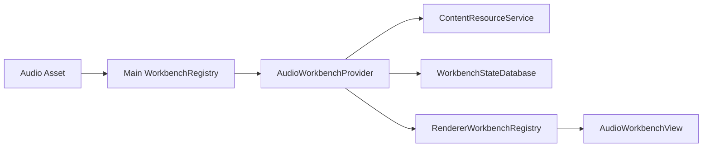
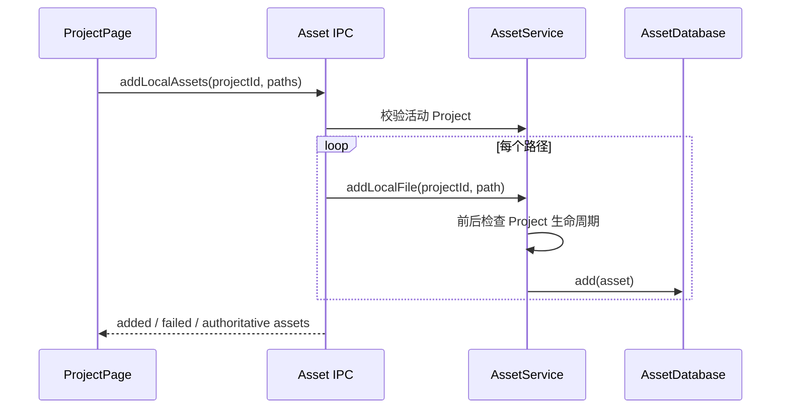

# Audio Workbench 与 Project 导入边界设计

> 日期：2026-07-29
>
> 状态：已确认，待实施

## 1. 背景

Learning Companion 已经具备图片、Markdown、PDF、视频、HTML 和 EPUB
等内置 Workbench，并建立了统一的内容资源通道、Workbench Session、
状态仓库和 Action Surface。

本轮新增 Audio Workbench。它首先承担稳定的音频播放能力，同时为后续
语音转写、逐句时间轴、音频区间提问和音频笔记保留主体空间。

Asset 批量导入目前只携带文件路径，实际写入目标取决于 Main 端当时激活
的 Project。虽然用户在文件选择窗口打开期间切换 Project 的概率较低，
但请求缺少目标 Project 身份，语义不够明确。本轮一并固定该边界。

## 2. 目标

- 新增独立的 `builtin.audio` Workbench。
- 支持常用本地音频格式的识别和播放。
- 保存并恢复播放位置、音量、静音状态和播放倍速。
- 支持当前时间点锚点，为以后扩展音频区间做好准备。
- 接入现有右上角菜单、右键菜单和生成中心 Contribution 架构。
- 主体区域不显示波形，预留给后续转写、章节和逐句文本。
- Asset 批量导入显式携带 `projectId`，禁止跨 Project 误写。
- 继续使用受控内容资源 URL，不向 Renderer 暴露本地路径。

## 3. 非目标

本轮不实现：

- 音频波形；
- 语音转写和说话人识别；
- 音频区间拖选；
- 音频剪辑、录音或格式转换；
- AI 音频理解、摘要或笔记生成；
- 通用 Audio/Video Workbench 抽象；
- 第三方 Workbench 加载。

AI 相关 Action 可以以禁用 Contribution 预留，但不得伪装成已经可用。

## 4. 方案选择

### 4.1 独立 Audio Workbench

本设计采用该方案。

Audio 与 Video 共享底层的 `ContentResourceService`、浏览器媒体能力、
Workbench State Repository 和 Action Runtime，但分别维护自己的
Manifest、Provider、Renderer、状态契约和测试。

优点：

- 符合当前一个媒体类型选择一个 Workbench 的注册模型；
- Audio 可以独立发展转写、逐句文本和时间轴；
- Video 可以独立发展截图、画面理解和片段操作；
- 不需要为了少量重复代码提前建立不稳定的媒体抽象。

### 4.2 合并为通用 Media Workbench

该方案可以复用部分播放状态和事件处理，但 Audio 与 Video 的主体交互
即将明显分化。当前抽象会同时包含视频画面和音频转写的可选分支，增加
耦合，因此不采用。

### 4.3 引入第三方音频播放器或波形库

首版没有波形、剪辑或复杂时间轴需求。Chromium 原生媒体能力已经覆盖
格式解码、播放、进度、音量和辅助功能，因此不增加播放器依赖。

## 5. 模块结构

新增：

```text
src/workbenches/audio/
├── shared.ts
├── main.ts
├── renderer.tsx
├── renderer-actions.ts
├── shared.test.ts
├── main.test.ts
└── renderer.test.tsx
```

各文件职责：

- `shared.ts`：Manifest、状态、Payload、Command 和时间锚点契约；
- `main.ts`：资源注册、状态读取与保存、Session 释放；
- `renderer.tsx`：音频播放 UI、媒体事件、状态持久化和 Interaction；
- `renderer-actions.ts`：右上角、右键菜单和生成中心 Contribution；
- 测试文件分别验证共享契约、Main Provider 和 Renderer。

Main 与 Renderer 注册入口继续使用现有注册表：



## 6. 媒体类型

Asset 扩展名映射增加：

| 扩展名 | Media Type |
|---|---|
| `.mp3` | `audio/mpeg` |
| `.wav`、`.wave` | `audio/wav` |
| `.m4a` | `audio/mp4` |
| `.aac` | `audio/aac` |
| `.flac` | `audio/flac` |
| `.ogg`、`.oga`、`.opus` | `audio/ogg` |
| `.weba` | `audio/webm` |

`audioWorkbenchManifest.supportedMediaTypes` 与该映射保持一致。具体编码
能否播放最终仍由当前平台的 Chromium 解码器决定。无法解码时 Renderer
显示明确的用户错误，不把文件降级为纯文本或未知类型。

## 7. Main 端 Provider

`AudioWorkbenchProvider` 依赖：

- `ContentResourceServiceApi`；
- `WorkbenchStateDatabase`；
- 可注入的 `now()`，用于测试保存时间。

打开流程：

1. 校验 Workbench 匹配结果、Media Type 和 `read-stream` 能力；
2. 从 `workbench_states` 读取并验证 `AudioWorkbenchStateV1`；
3. 通过 `ContentResourceService.register()` 创建 Session 级资源 URL；
4. 返回只含资源 URL 和视图状态的 Bootstrap Payload。

关闭流程：

1. 从 Provider 的活动 Session 集合移除当前 Session；
2. 调用 `ContentResourceService.revokeSession()`；
3. Content Handle 仍由 `WorkbenchSessionManager` 统一关闭。

Provider 不读取本地路径，也不直接持有数据库对象。

## 8. 状态契约

```ts
interface AudioWorkbenchViewState {
  readonly currentTime: number;
  readonly volume: number;
  readonly muted: boolean;
  readonly playbackRate: number;
}

interface AudioWorkbenchStateV1 {
  readonly viewState: AudioWorkbenchViewState;
}
```

状态使用现有 `WorkbenchStateDatabase`，键仍为：

```text
assetId + workbenchId
```

约束：

- `currentTime` 必须是非负有限数字；
- `volume` 范围为 `0..1`；
- `muted` 必须是布尔值；
- `playbackRate` 范围为 `0.25..4`；
- 无记录、版本不匹配或 Payload 无效时恢复默认状态；
- 接近媒体尾部的历史位置在重新打开时从头开始，避免打开后立即结束。

播放进度使用短延迟合并保存。Seek、音量、静音和倍速变化立即保存。
Workbench 卸载前捕获并保存最终状态。

## 9. 时间锚点

定义：

```text
anchorType: audio.time-range
anchorVersion: 1
```

Payload：

```ts
interface AudioTimeRangeAnchorV1 {
  readonly startSeconds: number;
  readonly endSeconds: number;
}
```

首版“标记当前时间”生成：

```ts
{
  startSeconds: currentTime,
  endSeconds: currentTime
}
```

使用区间结构而不是单点结构，是为了以后添加拖选、逐句转写和片段提问时
不需要迁移 Anchor 类型。

## 10. Renderer 与页面布局

Audio Workbench 使用原生 `HTMLAudioElement` 作为播放引擎。

页面分为：

1. 主体内容区：不绘制波形，保留给后续转写、章节和逐句文本；首版只显示
   克制的占位状态；
2. 底部播放器区：原生播放控制、当前时间、总时长和明确的倍速选择。

Renderer 负责：

- 监听 metadata、error、timeupdate、seeked、volumechange 和
  ratechange；
- 恢复 Main 返回的播放状态；
- 通过 Workbench Command 保存状态；
- 把当前时间点发布为 `WorkbenchSelectionSnapshot`；
- 注册 Audio 特化 Action；
- 将媒体错误转换成明确的中文消息；
- 清理计时器、事件监听和媒体播放状态。

资源 URL 必须通过 `isAudioWorkbenchPayload()` 校验，并以
`learning-content://resource/` 开头。无效 Payload 不挂载播放器。

## 11. Action 与入口

### 11.1 右上角 `...`

- 标记当前时间；
- 播放倍速；
- 在文件夹中显示。

右上角不放 AI 生成操作。

### 11.2 右键菜单

- 播放 / 暂停；
- 标记当前时间；
- 在文件夹中显示；
- 禁用占位：“解释这一段”；
- 禁用占位：“从这里生成学习笔记”。

右键菜单打开时冻结当前时间锚点，后续执行不得因为播放继续进行而改变
Action 的调用上下文。

### 11.3 生成中心

首版可以贡献禁用的 Audio AI 工具卡片，但不实现调用。未来生成工具从
Invocation Context 取得当前 Asset、Session 和时间锚点。

## 12. Project 导入身份

共享请求改为：

```ts
interface AddLocalAssetsRequest {
  readonly projectId: string;
  readonly paths: string[];
}
```

数据流：



约束：

- Renderer 使用当前页面的 `projectId`，而不是从其他可变状态推导；
- IPC 校验 `projectId` 和路径数组；
- `AssetService.addLocalFile()` 接收预期 `projectId`；
- 操作开始前和异步媒体检测后都验证活动 Project 与生命周期版本；
- Project 已切换时抛出 `OPERATION_SUPERSEDED`，不得写入新 Project；
- 单个文件自身的权限、格式或可用性错误仍进入 `failed`，保留部分成功；
- Project 生命周期错误终止整个批次，不继续把剩余文件作为普通失败处理；
- 成功响应中的 `assets` 只来自请求指定且仍然活动的 Project。

## 13. 错误处理

Audio Renderer 区分：

- 载入取消；
- 资源读取中断；
- 浏览器无法解码；
- 当前 Chromium 不支持容器或编码；
- 元数据载入超时；
- 状态保存失败。

无法播放不会删除 Asset，也不会改变 Asset Media Type。用户仍可刷新、
重新定位或在文件夹中显示原文件。

导入过程中：

- 文件级错误继续汇总为部分失败；
- Project 不匹配、Session 已失效或操作被替代属于批次级生命周期错误，
  由统一 IPC 错误层反馈给 UI。

## 14. 测试

### Asset 导入

- 请求必须包含合法 `projectId`；
- 正常批量导入继续返回完整权威列表；
- 文件选择期间 Project 改变时不写入新 Project；
- 批次中途 Project 改变时终止剩余写入；
- 文件级失败不影响其他文件。

### Audio Shared

- Manifest 支持列表和能力正确；
- 默认状态、合法状态和非法状态验证；
- Bootstrap Payload 只接受安全资源 URL；
- 保存命令和结果验证；
- 时间区间 Anchor 验证。

### Audio Main

- 注册带正确 Media Type 的资源 URL；
- 恢复合法状态并回退非法状态；
- 保存合法视图状态；
- 拒绝错误媒体类型、能力和命令；
- 关闭时撤销 Session。

### Audio Renderer

- 渲染安全的原生 Audio 元素；
- 不把本地文件路径写入 DOM；
- 无效 Bootstrap 不挂载播放器；
- 媒体错误返回明确消息；
- metadata 已提前完成时仍能正确协调状态；
- 注册的 Action 和 Contribution 符合入口边界。

实施结束后执行：

```bash
pnpm check
```

实际打包验证不包含在本轮默认自测中；如果修改影响 Forge 配置或原生依赖，
再追加 macOS 和 Windows 构建验证。
