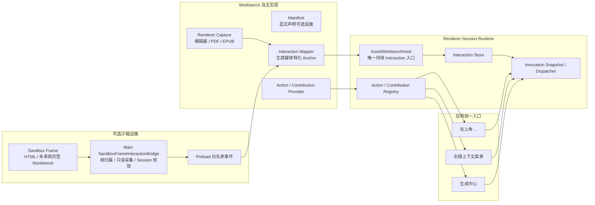

# Workbench 可选交互设施统一设计

> 日期：2026-07-29
>
> 状态：待实现

## 1. 背景

当前 Workbench 已经拥有一套可复用的 Action 与 Surface 架构：

- Workbench 注册 Action 和 Contribution；
- `WorkbenchOverflowHost` 渲染标题栏右上角的 `...`；
- `WorkbenchContextMenuHost` 渲染统一右键菜单；
- `WorkbenchRuntime` 保存当前交互快照，并为 Action 创建不可变的
  Invocation Context。

这套结构的方向正确，但交互信息进入 Runtime 的路径还不统一：

1. 纯文本和 Markdown 会直接调用 `runtime.publishInteraction()`；
2. PDF 和 EPUB 通过 `onSelectionChange()` 交给
   `AssetWorkbenchHost` 发布；
3. HTML 因为运行在不带 `allow-same-origin` 的沙箱 iframe 中，使用
   HTML 专用 Main IPC，并且只有打开右键菜单时才顺便更新选区；
4. 图片、音频和视频可以打开右键菜单，但音视频为了表达当前时间点，
   暂时构造了并非真实文字选区的 Selection；
5. Workbench Manifest 没有明确声明是否支持 `...`、右键菜单和文字
   选区，开发者很容易只完成一半接入。

结果是同一种用户行为存在多条调用链，沙箱能力无法复用，功能是否接入也
只能靠阅读实现代码判断。

本设计把这些能力统一为一组“可选交互设施”。统一的是声明、生命周期、
安全边界和输出契约，不统一各 Workbench 内部如何识别选区、锚点或媒体
上下文。

## 2. 目标

- 每个 Workbench 必须明确声明是否接入 `...`、右键菜单和文字选区。
- Workbench 可以选择 Renderer 本地捕获，也可以使用 Main 端沙箱帧桥接。
- 所有持续交互状态最终输出为同一个
  `WorkbenchInteractionSnapshot`。
- 所有右键菜单仍由统一 Host 渲染，并冻结打开菜单时的交互上下文。
- `...`、右键菜单和生成中心继续共享 Action/Contribution，不重复行为。
- HTML 的文字选区在完成鼠标或键盘选择后立即可用，不再依赖右键动作。
- HTML 专用 IPC 被通用沙箱帧交互事件替代。
- 旧 Session、错误帧和其他 Workbench 的事件不能污染当前 Runtime。
- 内置 Workbench 的能力矩阵能够通过契约测试检查，减少以后漏接公共能力。

## 3. 非目标

本轮不实现：

- AI 生成服务和真实生成中心；
- 图片框选截图、音视频片段截取；
- 通用 DOM 编辑器接口；
- 允许沙箱页面访问 Preload、Node.js 或应用 IPC；
- 第三方插件的安装、权限确认和动态代码执行；
- 把所有媒体的选区强制抽象成文字。

当前 `WorkbenchSelectionSnapshot` 仍只表示带 Anchor 的文字选区。图片区域、
音视频时间段等先使用 `target` 表示当前交互目标，等其真实功能设计完成后
再扩展 Selection 的判别联合类型。

## 4. 方案比较

### 4.1 每个 Workbench 独立接入

Workbench 自己监听事件、维护选区、渲染菜单并决定 IPC。

优点是局部实现直接。缺点是 HTML、EPUB、PDF 和未来的新沙箱查看器会重复
处理 Session、防越权、事件校验和菜单生命周期，当前不一致正是由此产生。

### 4.2 全局 Interaction Manager 接管所有实现

公共管理器直接理解 CodeMirror、Vditor、PDF.js、epub.js 和 iframe DOM，
并为所有 Workbench 计算选区。

优点是调用入口看似统一。缺点是公共层会耦合所有媒体实现，新增 Workbench
必须修改中央管理器，且无法表达 PDF 页码、EPUB CFI、HTML Frame URL 等
差异。

### 4.3 可选设施契约 + 可替换捕获器

本设计选择该方案。

- Manifest 明确声明交互能力和捕获来源；
- Workbench 自己或公共捕获器产生原始交互；
- Workbench Adapter 把原始信息映射为自己的 Anchor；
- Host 是持续 Interaction 的唯一发布入口；
- Runtime 和通用 Host 负责 Action 执行与菜单展示；
- Main 端沙箱桥只处理跨安全边界的原始浏览器信息，不理解媒体语义。

这样既能让新 Workbench 复用安全和生命周期设施，也不会把不同查看器写死
在同一个实现中。

## 5. 总体架构



关键边界：

- `Renderer Capture` 和 `SandboxFrameInteractionBridge` 是可替换的信息来源；
- `Interaction Mapper` 属于具体 Workbench，因为只有它理解媒体 Anchor；
- `AssetWorkbenchHost` 负责补充并校验当前 Session 身份；
- `WorkbenchRuntime` 不理解 CodeMirror、PDF.js、EPUB CFI 或 HTML DOM；
- 三个 UI Surface 只消费 Contribution 和 Runtime Context。

## 6. Manifest 能力声明

`AssetWorkbenchManifest` 增加必填的
`interactionCapabilities`。每个字段都必须写出，避免新增 Workbench 时
因忘记配置而静默缺失能力。

```ts
type WorkbenchInteractionCapture =
  | 'renderer'
  | 'sandbox-frame';

interface WorkbenchInteractionCapabilities {
  readonly overflow: boolean;
  readonly contextMenu:
    | false
    | {
        readonly capture: WorkbenchInteractionCapture;
      };
  readonly textSelection:
    | false
    | {
        readonly capture: WorkbenchInteractionCapture;
        readonly publish: 'settled' | 'explicit';
      };
}
```

语义如下：

- `overflow: true` 表示 Workbench 允许向 `overflow` Surface 提供
  Contribution。按钮是否实际出现仍由当前 Contribution 数量决定；
- `contextMenu: false` 表示 Workbench 禁止打开公共右键菜单；
- `capture: 'renderer'` 表示 Workbench 在 Renderer 内自行监听事件；
- `capture: 'sandbox-frame'` 表示该能力依赖 Main 端沙箱帧桥；
- `textSelection.publish: 'settled'` 表示鼠标释放、键盘选择完成或编辑器
  选区稳定后自动发布；
- `textSelection.publish: 'explicit'` 表示只在 Workbench 明确动作后发布。

当前内置 Workbench 全部使用 `settled` 或不启用文字选区，不需要引入
高频指针移动事件。

`target` 不受 `textSelection` 开关限制。图片、音频和视频可以发布当前
视野、时间点等 `target`，但不能再伪造文字 Selection。

### 6.1 契约一致性

Runtime 和测试按以下规则检查：

- `overflow: false` 时注册 `overflow` Contribution 是契约错误；
- `contextMenu: false` 时注册 `context-menu` Contribution 或调用
  `openContextMenu()` 是契约错误；
- `textSelection: false` 时发布带 `selection` 的 Interaction 是契约错误；
- 声明 `sandbox-frame` 时，Main Provider 必须为当前 Session 提供对应
  Binding；
- Renderer Module 和 Main Provider 继续引用同一份 Workbench Manifest，
  不复制两份能力配置。

运行时遇到旧 Session 或不匹配事件时直接丢弃。开发者契约错误写入日志，
并在单元测试中失败，不向普通用户显示难以理解的内部错误弹窗。

## 7. Renderer Interaction 入口

`RendererWorkbenchViewProps` 的：

```ts
onSelectionChange(selection)
```

替换为：

```ts
onInteractionChange(interaction)
```

Workbench 只传不含身份信息的 `WorkbenchInteractionSnapshot`：

```ts
interface WorkbenchInteractionSnapshot {
  readonly target?: ContentAnchorTarget;
  readonly selection?: WorkbenchSelectionSnapshot;
}
```

`AssetWorkbenchHost` 验证当前 `assetId` 和 `sessionId` 后调用
`runtime.publishInteraction()`。它是持续交互状态的唯一入口。

各 Workbench 不再直接调用 `runtime.publishInteraction()`。这样可以统一：

- 旧 Session 防护；
- Workbench 卸载时清空状态；
- Manifest 能力校验；
- 未来对 Interaction 的节流、审计和调试。

右键菜单是一次性的事件，仍由 Workbench 在准确的事件时机调用：

```ts
runtime.openContextMenu(
  sessionId,
  position,
  interaction,
  options,
);
```

Runtime 会先更新当前 Interaction，再冻结右键菜单的
Invocation Context。这样打开菜单导致编辑器失焦后，Action 仍然读取打开
瞬间的选区和 Anchor。

## 8. `...`、右键菜单和生成中心

三者继续使用已有的 Action/Contribution 模型，不引入第二套菜单注册 API。

### 8.1 右上角 `...`

调用链已经符合目标：

```text
Workbench ActionBundle
  -> useWorkbenchContributions()
  -> WorkbenchActionRegistry
  -> WorkbenchOverflowHost
  -> runtime.invokeCurrent('overflow')
```

`WorkbenchOverflowHost` 根据 Contribution 自动显示或隐藏，不接受 Workbench
注入的 React 菜单节点。Manifest 的 `overflow` 只声明是否允许接入，
Contribution 决定当前实际内容。

`...` 主要承载视图、编码、换行、缩放、重新加载等文档级操作，不放常规
AI 生成操作。

### 8.2 右键上下文菜单

Workbench 负责捕获右键位置和媒体上下文，公共层负责：

- 读取 `context-menu` Contribution；
- 冻结 Invocation Context；
- 统一菜单样式、键盘语义、视口边界和滚动；
- 执行 Renderer Action、Workbench Main Command 或后续 AI Action；
- 在 Workbench/Session 切换时关闭菜单。

### 8.3 生成中心

生成中心仍只消费同一份 Contribution 和当前 Interaction。后续实现时，
Workbench 可以把同一个 Action 同时贡献到右键菜单和生成中心，两处共享
Action ID、Anchor 和 Session 校验。

公共设施不要求 Action 一定运行在 Renderer 或 Main。Action 自己决定调用
本地 Adapter、`executeCommand()`，还是未来的 Generation Service。

## 9. Main 沙箱帧交互桥

### 9.1 通用 Binding

`WorkbenchProviderOpenResult` 增加可选的 Main-only Binding：

```ts
interface SandboxFrameInteractionBinding {
  readonly kind: 'sandbox-frame';
  readonly rootUrl: string;
  readonly events: readonly (
    | 'context-menu'
    | 'text-selection'
  )[];
}
```

Binding 不进入数据库，也不作为 Workbench 业务数据暴露。它只在当前
Workbench Session 生命周期内有效。

`WorkbenchSessionManager` 在 Provider `open()` 成功后注册 Binding，在
Session 关闭、被替代或打开失败回滚时注销。注册和注销必须与 Content
Resource 的授权周期一致。

### 9.2 `SandboxFrameInteractionBridge`

Main 端新增通用 `SandboxFrameInteractionBridge`，职责仅包括：

- 保存 `sessionId -> rootUrl + events` 的活动 Binding；
- 绑定当前 BrowserWindow 的 `webContents` 浏览器事件；
- 根据 Frame 的父链确认事件属于哪一个已注册根帧；
- 从焦点 Frame 只读取得浏览器选中文字；
- 限制字符串长度、校验坐标和 URL；
- 去重连续相同的 Selection；
- 通过白名单 IPC 发送带 `sessionId` 的原始交互事件；
- Window、Frame 或 Session 销毁后释放监听和缓存。

它不负责：

- 创建 HTML、EPUB 或 PDF Anchor；
- 判断某个 Action 是否可用；
- 渲染菜单；
- 访问 Asset、Attachment 或数据库；
- 向沙箱页面暴露任何本地能力。

### 9.3 通用事件

HTML 专用 `HtmlContextMenuEvent` 和 `onHtmlContextMenu()` 被替换为：

```ts
type WorkbenchFrameInteractionEvent =
  | {
      readonly kind: 'text-selection';
      readonly sessionId: string;
      readonly frameUrl: string;
      readonly text?: string;
    }
  | {
      readonly kind: 'context-menu';
      readonly sessionId: string;
      readonly x: number;
      readonly y: number;
      readonly frameUrl: string;
      readonly selectionText?: string;
      readonly linkUrl?: string;
      readonly mediaType:
        | 'none'
        | 'image'
        | 'audio'
        | 'video'
        | 'canvas';
      readonly sourceUrl?: string;
    };
```

Preload 只暴露：

```ts
onWorkbenchFrameInteraction(listener): Dispose
```

并在事件进入 Renderer 前完成结构校验。Workbench 再根据
`sessionId`、Manifest 能力和自身媒体语义，把事件映射为
`WorkbenchInteractionSnapshot`。

### 9.4 Selection 采集

沙箱页面继续不使用 `allow-same-origin`，也不获得 Preload。Main 端在以下
稳定时机采集 Selection：

- 鼠标释放后；
- 键盘选择操作完成后；
- 右键菜单打开时。

采集使用固定、不可拼接用户输入的只读脚本，从当前 `focusedFrame`
读取 `globalThis.getSelection()`。执行结果按不可信输入处理，截断为
16 KiB，并验证 Frame 仍属于当前 Binding。

不在每次 `mousemove` 时读取，避免高频跨进程调用。这里的
`settled` 表示一次选择手势完成后更新，而不是拖动过程逐字符更新。

嵌套 iframe 通过 Frame 父链归属到注册的根 `learning-content` URL。
跨源子帧也不能访问应用 API；桥只把受限的文本和浏览器上下文向外传递。

## 10. HTML Workbench 迁移

HTML Workbench 声明：

```ts
interactionCapabilities: {
  overflow: true,
  contextMenu: { capture: 'sandbox-frame' },
  textSelection: {
    capture: 'sandbox-frame',
    publish: 'settled',
  },
}
```

`HtmlWorkbenchProvider.open()` 返回内容 URL，同时返回允许
`context-menu` 和 `text-selection` 的 Binding。

HTML Renderer：

- 订阅通用 Frame Interaction 事件；
- 严格过滤当前 `bootstrap.sessionId`；
- 把文字映射成 `html.quote` Anchor；
- 把链接映射成 `html.link` Anchor；
- 收到 `text-selection` 时立即调用 `onInteractionChange()`；
- 收到 `context-menu` 时调用 `runtime.openContextMenu()`；
- 不再依赖打开右键菜单来刷新持续选区；
- 卸载或重新加载时清空 Interaction 和 Frame Context。

现有 HTML Action 和 Contribution 保留，只替换事件来源。

## 11. 内置 Workbench 能力矩阵

| Workbench | `...` | 右键捕获 | 文字选区 | 本轮处理 |
|---|---:|---|---|---|
| Plain Text | 是 | Renderer | Renderer / settled | 迁移到统一 Interaction 入口 |
| Markdown | 是 | Renderer | Renderer / settled | 合并源码与 WYSIWYG 的发布路径 |
| PDF | 是 | Renderer | Renderer / settled | 保留 PDF.js 页码和文字 Anchor |
| HTML | 是 | Sandbox Frame | Sandbox Frame / settled | 使用通用桥并实时发布稳定选区 |
| EPUB | 否 | Renderer | Renderer / settled | 补齐基础右键 Action/Contribution |
| Image | 是 | Renderer | 否 | 只发布视野或图像 Target |
| Audio | 是 | Renderer | 否 | 时间点只作为 Target，不伪造文字 |
| Video | 是 | Renderer | 否 | 时间点只作为 Target，不伪造文字 |
| Unsupported | 否 | 否 | 否 | 不接入 |

表中的 `...` 表示当前是否已有或本轮是否需要 Contribution。以后 EPUB
增加阅读设置时，只需把 Manifest 能力改为 `true` 并注册 Contribution。

## 12. 三类现有不一致的收敛

### 12.1 能力声明与实际接入不一致

通过 Manifest 必填能力、Runtime 守卫和内置 Workbench 契约测试解决。
开发者不再依赖“记得写 `onContextMenu`”才能发现漏接。

### 12.2 Interaction 发布路径不一致

持续状态统一走：

```text
Workbench / Capture Facility
  -> onInteractionChange(snapshot)
  -> AssetWorkbenchHost
  -> WorkbenchRuntime
```

删除 Workbench 直接发布 Runtime 状态的旁路。右键事件继续使用
`openContextMenu()`，因为它需要同步保存事件位置和菜单快照。

### 12.3 HTML 专用 IPC 与选区时机不一致

使用 Session 化的通用 `SandboxFrameInteractionBridge`，分别发送
`text-selection` 和 `context-menu`。选区更新不再依赖右键菜单副作用，
未来其他沙箱 Workbench 也可以复用同一安全通道。

## 13. 生命周期与错误处理

### 13.1 Session 切换

顺序固定为：

1. 关闭当前右键菜单；
2. 清空旧 Interaction；
3. 注销旧沙箱 Binding；
4. 关闭旧 Main Workbench Provider 和 Content Handle；
5. 打开新 Provider；
6. 注册新 Binding；
7. 激活 Renderer Runtime。

任何携带旧 `sessionId` 的延迟事件都会被 Main Binding Registry 和
Renderer Runtime 两次拒绝。

### 13.2 打开失败

如果 Provider 已经注册 Content Resource，但 Binding 注册失败，
Session Manager 必须回滚 Binding、Provider 和 Content Handle，不返回
半初始化 Bootstrap。

### 13.3 Frame 读取失败

Frame 已销毁、正在导航或不允许执行只读采集时：

- 不让 Workbench Session 崩溃；
- 丢弃该次事件；
- 对开发日志记录一次受控警告；
- 后续有效输入仍可继续采集。

### 13.4 契约错误

Manifest 无效、重复 Binding、禁止能力被调用等属于开发错误：

- 注册或测试阶段失败；
- 运行时采取安全失败并记录日志；
- 不弹出面向用户的业务错误确认框。

## 14. 文件结构

计划新增或调整：

```text
src/
├── main/
│   └── workbench/
│       └── interaction/
│           ├── sandbox-frame-interaction-bridge.ts
│           └── workbench-interaction-binding-registry.ts
├── preload/
│   └── index.ts
├── shared/
│   ├── ipc.ts
│   └── workbench/
│       ├── interaction.ts
│       ├── interaction-capabilities.ts
│       └── manifest.ts
├── renderer/
│   └── workbench/
│       ├── host/
│       │   └── AssetWorkbenchHost.tsx
│       └── runtime/
│           └── workbench-runtime.ts
└── workbenches/
    ├── html/
    ├── epub/
    ├── plain-text/
    ├── markdown/
    ├── pdf/
    ├── image/
    ├── audio/
    └── video/
```

`src/main/html-context-menu.ts` 在迁移完成后删除，防止保留两套沙箱事件
路径。

## 15. 测试与验收

### 15.1 契约测试

- Manifest 缺少任一交互能力字段时校验失败；
- `false` 能力不能注册或调用对应设施；
- 所有内置 Workbench 的 Main/Renderer 共用同一 Manifest；
- 音频和视频不再发布伪文字 Selection。

### 15.2 Runtime 与 Host 测试

- `onInteractionChange()` 只接受当前 Session；
- 切换 Workbench 后旧事件不能恢复旧选区；
- 右键 Invocation 冻结打开瞬间的 Interaction；
- 没有 Overflow Contribution 时不显示 `...`；
- 没有 Context Menu Contribution 时不显示空菜单。

### 15.3 沙箱桥测试

- 只接受注册根帧及其子帧事件；
- 不接受相似前缀、其他 Session 或已注销 Frame；
- Selection 长度、坐标、URL 和媒体类型被校验；
- 相同 Selection 去重，空 Selection 能清除旧状态；
- 嵌套跨源 iframe 能归属到正确根帧；
- Frame 销毁和读取异常不会导致未处理异常；
- Session 关闭后事件监听与缓存被清理。

### 15.4 Workbench 集成测试

- HTML 滑选文字后，不右键也能更新生成中心可见的当前选区；
- HTML 右键菜单保留复制文字、打开链接、重载、文件定位和 AI 占位动作；
- EPUB 可以打开统一基础右键菜单；
- Plain Text、Markdown 和 PDF 的现有选区与菜单行为不回退；
- Image、Audio 和 Video 右键功能保持可用，但没有虚假文字计数。

### 15.5 全量验证

实现完成后执行：

```text
pnpm check
pnpm package
```

并在 Electron 实机完成 HTML 跨源 iframe、菜单位置、Session 切换和多种
Workbench 的人工冒烟验证。

## 16. 实施分段

实施计划应拆成独立提交：

1. 增加 Manifest 能力契约和统一 `onInteractionChange()`，迁移非沙箱
   Workbench；
2. 增加 Main 沙箱 Binding Registry、通用 Frame Interaction IPC 和安全
   测试；
3. 迁移 HTML，删除 HTML 专用 IPC；
4. 补齐 EPUB 右键菜单，并完成内置 Workbench 契约与回归测试。

每段自测通过后单独提交。除非用户明确要求，完成实现后不自动 push。
