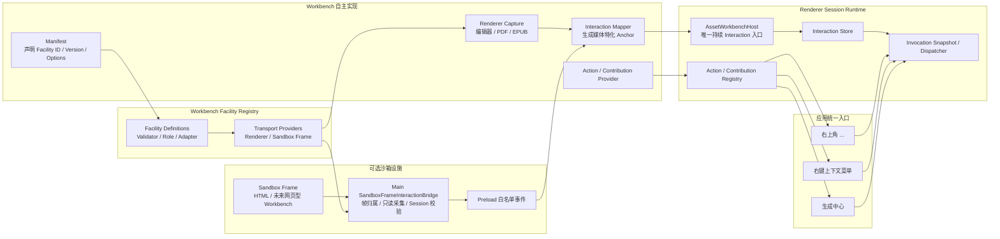

# Workbench 可选交互设施统一设计

> 日期：2026-07-29
>
> 状态：待实现

## 1. 背景

当前 Workbench 已经拥有一套可复用的 Action 与 Surface 架构：

- Workbench 注册 Action 和 Contribution；
- `WorkbenchOverflowHost` 渲染标题栏右上角的 `...`；
- `WorkbenchContextMenuHost` 渲染统一右键菜单；
- `WorkbenchRuntime` 保存当前交互快照，并为 Action 创建不可变的
  Invocation Context。

这套结构的方向正确，但交互信息进入 Runtime 的路径还不统一：

1. 纯文本和 Markdown 会直接调用 `runtime.publishInteraction()`；
2. PDF 和 EPUB 通过 `onSelectionChange()` 交给
   `AssetWorkbenchHost` 发布；
3. HTML 因为运行在不带 `allow-same-origin` 的沙箱 iframe 中，使用
   HTML 专用 Main IPC，并且只有打开右键菜单时才顺便更新选区；
4. 图片、音频和视频可以打开右键菜单，但音视频为了表达当前时间点，
   暂时构造了并非真实文字选区的 Selection；
5. Workbench Manifest 没有明确声明是否支持 `...`、右键菜单和文字
   选区，开发者很容易只完成一半接入。

结果是同一种用户行为存在多条调用链，沙箱能力无法复用，功能是否接入也
只能靠阅读实现代码判断。

本设计把这些能力统一为一组“可选交互设施”。统一的是声明、生命周期、
安全边界和输出契约，不统一各 Workbench 内部如何识别选区、锚点或媒体
上下文。

## 2. 目标

- 每个 Workbench 必须明确声明自己接入的 Surface、Input 和 Transport
  设施。
- Workbench 可以选择 Renderer 本地捕获，也可以使用 Main 端沙箱帧桥接。
- 新增区域选择、时间范围、画布节点等交互类型时，不修改 Manifest 和
  Runtime 的核心字段。
- 所有持续交互状态最终输出为由版本化 Input 组成的
  `WorkbenchInteractionSnapshot`。
- 所有右键菜单仍由统一 Host 渲染，并冻结打开菜单时的交互上下文。
- `...`、右键菜单和生成中心继续共享 Action/Contribution，不重复行为。
- HTML 的文字选区在完成鼠标或键盘选择后立即可用，不再依赖右键动作。
- HTML 专用 IPC 被通用沙箱帧交互事件替代。
- 旧 Session、错误帧和其他 Workbench 的事件不能污染当前 Runtime。
- 内置 Workbench 的能力矩阵能够通过契约测试检查，减少以后漏接公共能力。

## 3. 非目标

本轮不实现：

- AI 生成服务和真实生成中心；
- 图片框选截图、音视频片段截取和真实录屏实现；
- 通用 DOM 编辑器接口；
- 允许沙箱页面访问 Preload、Node.js 或应用 IPC；
- 第三方插件的安装、权限确认和动态代码执行；
- 把所有媒体的交互输入强制抽象成文字；
- 在 Interaction Snapshot 内保存截图、视频等二进制产物。

截图和录屏需要明确分成两个阶段：

1. Interaction Facility 负责选择区域、时间范围、页面或节点，并形成
   可序列化的 Input；
2. Action 调用 Renderer Adapter 或受控 Main Service 产生文件，产物再
   保存为 Asset 或 Attachment。

因此未来增加录屏，不需要把视频数据或录制生命周期塞入 Runtime 的当前
交互快照。

## 4. 方案比较

### 4.1 每个 Workbench 独立接入

Workbench 自己监听事件、维护选区、渲染菜单并决定 IPC。

优点是局部实现直接。缺点是 HTML、EPUB、PDF 和未来的新沙箱查看器会重复
处理 Session、防越权、事件校验和菜单生命周期，当前不一致正是由此产生。

### 4.2 全局 Interaction Manager 接管所有实现

公共管理器直接理解 CodeMirror、Vditor、PDF.js、epub.js 和 iframe DOM，
并为所有 Workbench 计算选区。

优点是调用入口看似统一。缺点是公共层会耦合所有媒体实现，新增 Workbench
必须修改中央管理器，且无法表达 PDF 页码、EPUB CFI、HTML Frame URL 等
差异。

### 4.3 版本化设施注册表 + 可替换捕获器

本设计选择该方案。

- Manifest 使用开放的 `id + version + options` 声明设施；
- Facility Registry 注册配置与事件校验器，端侧 Adapter 由对应
  Workbench Provider 一并注册；
- Workbench 自己或公共捕获器产生原始交互；
- Workbench Adapter 把原始信息映射为自己的 Anchor；
- Host 是持续 Interaction 的唯一发布入口；
- Runtime 和通用 Host 负责 Action 执行与菜单展示；
- Main 端沙箱桥只处理跨安全边界的原始浏览器信息，不理解媒体语义。

这样既能让新 Workbench 复用安全和生命周期设施，也不会把不同查看器写死
在同一个实现中。

## 5. 总体架构



关键边界：

- Facility Registry 决定一个声明是否合法，以及需要装配哪些端侧设施；
- `Renderer Capture` 和 `SandboxFrameInteractionBridge` 是可替换的信息来源；
- `Interaction Mapper` 属于具体 Workbench，因为只有它理解媒体 Anchor；
- `AssetWorkbenchHost` 负责补充并校验当前 Session 身份；
- `WorkbenchRuntime` 不理解 CodeMirror、PDF.js、EPUB CFI 或 HTML DOM；
- 三个 UI Surface 只消费 Contribution 和 Runtime Context。

## 6. 可扩展 Facility 模型

### 6.1 Manifest 只声明设施

`AssetWorkbenchManifest` 不增加 `textSelection`、`regionSelection` 或
`recording` 等固定字段，而是增加开放的设施声明数组：

```ts
interface WorkbenchFacilityDeclaration {
  readonly id: string;
  readonly version: number;
  readonly options?: JsonValue;
}

interface AssetWorkbenchManifest {
  // 原有字段保持不变
  readonly facilities: readonly WorkbenchFacilityDeclaration[];
}
```

设施 ID 必须带命名空间。应用内置设施使用 `core.*`，内置 Workbench 的
特化设施使用 `builtin.<workbench>.*`；未来第三方插件使用其插件 ID 或
反向域名命名空间。

第一批内置设施包括：

```text
core.surface.overflow
core.surface.context-menu
core.input.text-selection
core.transport.renderer
core.transport.sandbox-frame
```

未来可以新增而不改变 Manifest 结构：

```text
core.input.region-selection
core.input.time-range
core.input.canvas-object
core.input.slide-range
core.capture.screenshot
core.capture.screen-recording
```

其中截图和录屏设施负责装配交互与执行入口，真实媒体产物仍由 Action 和
Main Service 创建。

一个普通文本编辑器可以声明：

```ts
facilities: [
  {
    id: 'core.transport.renderer',
    version: 1,
  },
  {
    id: 'core.surface.overflow',
    version: 1,
  },
  {
    id: 'core.surface.context-menu',
    version: 1,
    options: {
      capture: 'core.transport.renderer',
    },
  },
  {
    id: 'core.input.text-selection',
    version: 1,
    options: {
      capture: 'core.transport.renderer',
      publish: 'settled',
    },
  },
]
```

HTML Workbench 把两个 `capture` 改为
`core.transport.sandbox-frame`，其余上层接口保持一致。

### 6.2 Facility Definition

Manifest 中的字符串不能无条件信任。
`WorkbenchFacilityDefinitionRegistry` 为每个 `id + version` 注册
Definition：

```ts
interface WorkbenchFacilityDefinition<
  TOptions extends JsonValue | undefined =
    JsonValue | undefined,
  TEvent extends JsonValue = JsonValue,
> {
  readonly id: string;
  readonly version: number;
  readonly role:
    | 'surface'
    | 'input'
    | 'transport'
    | 'capture';
  readonly validateOptions: (
    value: JsonValue | undefined,
  ) => value is TOptions;
  readonly validateEvent?: (
    value: JsonValue,
  ) => value is TEvent;
  readonly validateInput?: (
    value: JsonValue,
  ) => boolean;
  readonly validateBinding?: (
    value: JsonValue,
  ) => boolean;
  readonly inputCardinality?: 'one' | 'many';
  readonly validateDependencies?: (
    options: TOptions,
    declarations: readonly WorkbenchFacilityDeclaration[],
  ) => boolean;
}
```

实际实现可以通过 `defineWorkbenchFacility()` 泛型辅助函数保留第一方代码的
静态类型。运行时仍必须执行 Definition Validator，因为 Manifest、IPC 和
未来第三方插件都属于外部输入。

Facility Registry 的职责是：

- 拒绝未知或不支持的 `id + version`；
- 校验 `options`；
- 检查依赖的 Transport 是否已声明；
- 把 Surface Contribution 与所需 Facility 对应起来；
- 为 Main 和 Renderer 装配对应 Adapter；
- 校验跨进程 Facility Event；
- 管理 Facility 的 Session 级清理函数。

平台无关的 Definition Registry 只存放声明、Payload 和依赖校验器。需要
访问 Electron 或 React 的实现分别注册到 Main/Renderer Adapter Registry，
二者都以相同的 `id + version` 索引，避免把平台对象放进 shared 层。

共享的 `isAssetWorkbenchManifest()` 只检查声明的基础 JSON 结构。
Main `WorkbenchRegistry` 和 `RendererWorkbenchRegistry` 在注册 Module 时，
再通过已注入的 Facility Registry 完成语义校验。未来加载第三方设施时，
必须先注册 Definition，再注册使用它的 Workbench。

### 6.3 Facility 分类是稳定边界

- `surface`：用户可见入口，例如 `...`、右键菜单和生成中心；
- `input`：可被 Action、AI 或生成中心消费的上下文，例如文字、区域、
  时间范围或节点；
- `transport`：输入和事件跨边界的方式，例如 Renderer 本地事件或沙箱
  Frame；
- `capture`：需要专用交互生命周期的采集流程，例如截图或录屏。

新增“交互种类”通常只增加一个新的 Facility Definition，而不会增加新的
顶层分类。如果未来确实出现无法归入这四类的能力，应先扩展 Registry
Definition 的元数据，而不是给 Manifest 增加一个专用字段。

### 6.4 契约一致性

Registry、Runtime 和测试按以下规则检查：

- 没有声明 `core.surface.overflow` 时，注册 `overflow` Contribution 是
  契约错误；
- 没有声明 `core.surface.context-menu` 时，注册 `context-menu`
  Contribution 或调用 `openContextMenu()` 是契约错误；
- 没有声明 `core.surface.generation-center` 时，注册
  `generation-center` Contribution 是契约错误；
- 发布某类 Input 前，Workbench 必须声明对应 Input Facility；
- Facility Options 指向的 Transport 必须同时存在；
- 声明沙箱 Transport 时，Main Provider 必须为当前 Session 提供对应
  Binding；
- Renderer Module 和 Main Provider 继续引用同一份 Workbench Manifest，
  不复制两份设施配置。

运行时遇到旧 Session 或不匹配事件时直接丢弃。开发者契约错误写入日志，
并在单元测试中失败，不向普通用户显示难以理解的内部错误弹窗。

## 7. 可扩展 Interaction Snapshot

### 7.1 版本化 Input

`RendererWorkbenchViewProps` 的：

```ts
onSelectionChange(selection)
```

替换为：

```ts
onInteractionChange(interaction)
```

Workbench 只传不含身份信息的 `WorkbenchInteractionSnapshot`：

```ts
interface WorkbenchInteractionInput {
  readonly type: string;
  readonly version: number;
  readonly target?: ContentAnchorTarget;
  readonly payload: JsonValue;
}

interface WorkbenchInteractionSnapshot {
  readonly focus?: ContentAnchorTarget;
  readonly inputs: readonly WorkbenchInteractionInput[];
}
```

`focus` 表示当前阅读焦点，例如 PDF 当前页、音频当前时间点或图片当前视野。
`inputs` 表示用户已经明确选择、可以被 Action 消费的输入。Input 使用开放
的 `type + version + payload`，其结构由同名 Facility Definition 校验。

文字选区示例：

```ts
{
  type: 'core.input.text-selection',
  version: 1,
  target: markdownTextRangeAnchor,
  payload: {
    text: '用户选中的文字',
  },
}
```

未来 PDF 区域选择可以表示为：

```ts
{
  type: 'core.input.region-selection',
  version: 1,
  target: pdfPageAnchor,
  payload: {
    x: 0.2,
    y: 0.3,
    width: 0.4,
    height: 0.15,
    coordinateSpace: 'page-normalized',
  },
}
```

区域只保存相对于稳定 Anchor 的归一化几何信息，不把截图字节写入
Snapshot。截图 Action 执行时再根据 Input 和当前内容生成产物。

Facility Definition 可以声明 Input 的
`inputCardinality: 'one' | 'many'`。
Registry 据此检查同一 Snapshot 内是否允许存在多个同类 Input，从而支持
未来的多区域、多页或多个思维导图节点选择。

### 7.2 唯一持续发布入口

`AssetWorkbenchHost` 验证当前 `assetId` 和 `sessionId` 后调用
`runtime.publishInteraction()`。它是持续交互状态的唯一入口。

各 Workbench 不再直接调用 `runtime.publishInteraction()`。这样可以统一：

- 旧 Session 防护；
- Workbench 卸载时清空状态；
- Manifest Facility 声明校验；
- 未来对 Interaction 的节流、审计和调试。

Action 不直接解析不可信的 JSON。每个内置 Facility 导出类型化查询辅助
函数，例如：

```ts
textSelectionFacility.find(snapshot);
regionSelectionFacility.list(snapshot);
```

辅助函数通过 Facility Registry 验证版本和 Payload 后返回类型化结果。
这样开放的 Envelope 不会把类型判断散落到每一个 Action 中。

### 7.3 右键瞬时快照

右键菜单是一次性的事件，仍由 Workbench 在准确的事件时机调用：

```ts
runtime.openContextMenu(
  sessionId,
  position,
  interaction,
  options,
);
```

Runtime 会先更新当前 Interaction，再冻结右键菜单的
Invocation Context。这样打开菜单导致编辑器失焦后，Action 仍然读取打开
瞬间的选区和 Anchor。

### 7.4 截图与录屏工作流

区域截图的未来调用链为：

```text
Region Selection Facility
  -> core.input.region-selection Input
  -> “截取区域” Action
  -> Workbench Renderer Adapter 或受控 Main Capture Service
  -> Asset / Attachment
```

录屏的未来调用链为：

```text
Region / Time Range Input
  -> “开始录制” Action
  -> Main Recording Service
  -> 录制生命周期与权限处理
  -> 视频 Asset / Attachment
```

Runtime 只保存 Action 执行所需的选择上下文。录制状态、临时文件、编码器和
最终媒体文件不进入 `WorkbenchInteractionSnapshot`。

## 8. `...`、右键菜单和生成中心

三者继续使用已有的 Action/Contribution 模型，不引入第二套菜单注册 API。

### 8.1 右上角 `...`

调用链已经符合目标：

```text
Workbench ActionBundle
  -> useWorkbenchContributions()
  -> WorkbenchActionRegistry
  -> WorkbenchOverflowHost
  -> runtime.invokeCurrent('overflow')
```

`WorkbenchOverflowHost` 根据 Contribution 自动显示或隐藏，不接受 Workbench
注入的 React 菜单节点。Manifest 是否声明
`core.surface.overflow` 决定能否接入，Contribution 决定当前实际内容。

`...` 主要承载视图、编码、换行、缩放、重新加载等文档级操作，不放常规
AI 生成操作。

### 8.2 右键上下文菜单

Workbench 负责捕获右键位置和媒体上下文，公共层负责：

- 校验 Workbench 已声明 `core.surface.context-menu`；
- 读取 `context-menu` Contribution；
- 冻结 Invocation Context；
- 统一菜单样式、键盘语义、视口边界和滚动；
- 执行 Renderer Action、Workbench Main Command 或后续 AI Action；
- 在 Workbench/Session 切换时关闭菜单。

### 8.3 生成中心

生成中心仍只消费同一份 Contribution 和当前 Interaction。后续实现时，
Workbench 可以把同一个 Action 同时贡献到右键菜单和生成中心，两处共享
Action ID、Anchor、版本化 Input 和 Session 校验。

公共设施不要求 Action 一定运行在 Renderer 或 Main。Action 自己决定调用
本地 Adapter、`executeCommand()`，还是未来的 Generation Service。

## 9. Main 沙箱帧交互桥

### 9.1 通用 Transport Binding

`WorkbenchProviderOpenResult` 增加可选的 Main-only Transport Binding：

```ts
interface WorkbenchTransportBinding {
  readonly transportId: string;
  readonly transportVersion: number;
  readonly facilities: readonly {
    readonly id: string;
    readonly version: number;
  }[];
  readonly payload: JsonValue;
}
```

HTML 的 Binding 使用 `core.transport.sandbox-frame@1`，Payload 保存当前
受权的根 `contentUrl`，Facilities 列出允许通过该通道发送事件的
`core.surface.context-menu@1` 和 `core.input.text-selection@1`。

Binding 不进入数据库，也不作为 Workbench 业务数据暴露。它只在当前
Workbench Session 生命周期内有效。Transport Definition 负责验证 Binding
Payload，Facility Registry 负责检查列出的 Facility 已在 Manifest 声明。

`WorkbenchSessionManager` 在 Provider `open()` 成功后注册 Binding，在
Session 关闭、被替代或打开失败回滚时注销。注册和注销必须与 Content
Resource 的授权周期一致。

### 9.2 `SandboxFrameInteractionBridge`

Main 端新增通用 `SandboxFrameInteractionBridge`，职责仅包括：

- 保存 `sessionId -> rootUrl + facilities` 的活动 Binding；
- 绑定当前 BrowserWindow 的 `webContents` 浏览器事件；
- 根据 Frame 的父链确认事件属于哪一个已注册根帧；
- 调用已注册的 Sandbox Frame Facility Adapter 采集受限信息；
- 限制字符串长度、校验坐标和 URL；
- 去重连续相同的 Facility Event；
- 通过白名单 IPC 发送带 `sessionId` 的原始交互事件；
- Window、Frame 或 Session 销毁后释放监听和缓存。

Main Facility Adapter Registry 使用
`workbenchId + facilityId + facilityVersion` 作为注册键。Bridge 先由 Frame
归属找到活动 `workbenchId`，再查找该 Workbench 自己注册的 Adapter；同一个
Facility 因此可以由 HTML、未来网页型 EPUB 或其他 Workbench 分别实现，且
互不覆盖。

Adapter 随 `MainWorkbenchProvider.facilityAdapters` 注册。统一 Catalog 会校验
Adapter 的 `workbenchId` 必须与 Provider Manifest 一致，然后完成注册。Host、
Bridge 和 Bootstrap 不再集中列举每种媒体的采集类。

Renderer Workbench 可以复用 CodeMirror 等机械采集 Adapter，但必须由具体
Workbench 主动创建并注入 `createTarget`；Host/Runtime 只接收、按 Manifest
校验和保存 `WorkbenchInteractionSnapshot`，不监听媒体 DOM，也不构造任何
HTML、EPUB、PDF、图片、音视频或思维导图 Anchor。

它不负责：

- 创建 HTML、EPUB 或 PDF Anchor；
- 判断某个 Action 是否可用；
- 渲染菜单；
- 访问 Asset、Attachment 或数据库；
- 向沙箱页面暴露任何本地能力。

HTML Workbench 第一阶段注册两个 Sandbox Frame Adapter：

- `core.surface.context-menu@1`：消费 Electron `context-menu` 参数；
- `core.input.text-selection@1`：在选择手势稳定后从焦点 Frame 只读取得
  文字。

这里的 Adapter 代码归属于 HTML Workbench。它可以在 Electron Main 中借助
`WebFrameMain.executeJavaScript()` 穿过沙箱边界采集，但不因此变成 Host 的
媒体逻辑；Bridge 只把 Adapter 返回的 JSON 当作不透明 Facility Payload。

未来如果沙箱 HTML 需要区域选择，可以注册
`core.input.region-selection@1` 的 Adapter；Bridge 本身不增加新的事件
字段或分支。

### 9.3 通用事件

HTML 专用 `HtmlContextMenuEvent` 和 `onHtmlContextMenu()` 被替换为：

```ts
interface WorkbenchFacilityEvent {
  readonly sessionId: string;
  readonly facilityId: string;
  readonly facilityVersion: number;
  readonly payload: JsonValue;
}
```

Preload 只暴露：

```ts
onWorkbenchFacilityEvent(listener): Dispose
```

并在事件进入 Renderer 前校验 Envelope，在 Facility Registry 中校验具体
Payload。Workbench 再根据 `sessionId`、Facility Definition 和自身媒体
语义，把事件映射为 `WorkbenchInteractionSnapshot`。

事件 Envelope 不包含固定的 `kind` 联合类型。增加区域选择或时间范围时，
只增加新的 Facility Definition 和 Adapter，不修改 Preload API。

### 9.4 Selection 采集

沙箱页面继续不使用 `allow-same-origin`，也不获得 Preload。Main 端在以下
稳定时机采集 Selection：

- 鼠标释放后；
- 键盘选择操作完成后；
- 右键菜单打开时。

文字选择 Adapter 使用固定、不可拼接用户输入的只读脚本，从当前
`focusedFrame`
读取 `globalThis.getSelection()`。执行结果按不可信输入处理，截断为
16 KiB，并验证 Frame 仍属于当前 Binding。

不在每次 `mousemove` 时读取，避免高频跨进程调用。这里的
`settled` 表示一次选择手势完成后更新，而不是拖动过程逐字符更新。

嵌套 iframe 通过 Frame 父链归属到注册的根 `learning-content` URL。
跨源子帧也不能访问应用 API；桥只把受限的文本和浏览器上下文向外传递。

## 10. HTML Workbench 迁移

HTML Workbench 声明：

```ts
facilities: [
  {
    id: 'core.transport.sandbox-frame',
    version: 1,
  },
  {
    id: 'core.surface.overflow',
    version: 1,
  },
  {
    id: 'core.surface.context-menu',
    version: 1,
    options: {
      capture: 'core.transport.sandbox-frame',
    },
  },
  {
    id: 'core.input.text-selection',
    version: 1,
    options: {
      capture: 'core.transport.sandbox-frame',
      publish: 'settled',
    },
  },
]
```

`HtmlWorkbenchProvider.open()` 返回内容 URL，同时返回允许
Context Menu 和 Text Selection Facility 的 Sandbox Transport Binding。

HTML Renderer：

- 订阅通用 Facility Event；
- 严格过滤当前 `bootstrap.sessionId`；
- 通过 Facility Registry 校验 `facilityId + version + payload`；
- 把文字映射成 `html.quote` Anchor；
- 把链接映射成 `html.link` Anchor；
- 右键时由 HTML Main Adapter 探测对应 Frame 中当前 DOM 元素，发布
  `html.element@1` Anchor；该 Anchor 保存 Frame URL、标签、有限长度的
  DOM child-index 路径以及可选 ID、role、aria-label 和文字提示；
- DOM 探测失败时只省略 `html.element`，基础右键上下文仍然发布；
- 收到 `core.input.text-selection` 时立即调用
  `onInteractionChange()`；
- 收到 `core.surface.context-menu` 时调用
  `runtime.openContextMenu()`；
- 不再依赖打开右键菜单来刷新持续选区；
- 卸载或重新加载时清空 Interaction 和 Frame Context。

现有 HTML Action 和 Contribution 保留，只替换事件来源。

## 11. 内置 Workbench Facility 矩阵

| Workbench | Transport | Surface Facilities | Input Facilities | 本轮处理 |
|---|---|---|---|---|
| Plain Text | Renderer | Overflow、Context Menu | Text Selection | 迁移到统一 Interaction 入口 |
| Markdown | Renderer | Overflow、Context Menu | Text Selection | 合并源码与 WYSIWYG 的发布路径 |
| PDF | Renderer | Overflow、Context Menu | Text Selection | 保留 PDF.js 页码和文字 Anchor |
| HTML | Sandbox Frame | Overflow、Context Menu | Text Selection | 使用通用桥并实时发布稳定选区 |
| EPUB | Renderer | Context Menu | Text Selection | 补齐基础右键 Action/Contribution |
| Image | Renderer | Overflow、Context Menu | 暂无 | 只发布图像 Focus |
| Audio | Renderer | Overflow、Context Menu | 暂无 | 时间点作为 Focus，不伪造文字 |
| Video | Renderer | Overflow、Context Menu | 暂无 | 时间点作为 Focus，不伪造文字 |
| Unsupported | 无 | 无 | 无 | 不接入 |

表格只描述本轮注册的 Facility，不构成中央枚举。以后 PDF 增加区域选择，
只需注册 `core.input.region-selection@1` Definition、在 Manifest 中声明并
提供 PDF Adapter；Runtime、Preload 和其他 Workbench 无需修改。

## 12. 三类现有不一致的收敛

### 12.1 能力声明与实际接入不一致

通过 Manifest Facility 声明、Facility Registry、Runtime 守卫和内置
Workbench 契约测试解决。
开发者不再依赖“记得写 `onContextMenu`”才能发现漏接。

### 12.2 Interaction 发布路径不一致

持续状态统一走：

```text
Workbench / Capture Facility
  -> onInteractionChange(snapshot)
  -> AssetWorkbenchHost
  -> WorkbenchRuntime
```

删除 Workbench 直接发布 Runtime 状态的旁路。右键事件继续使用
`openContextMenu()`，因为它需要同步保存事件位置和菜单快照。

### 12.3 HTML 专用 IPC 与选区时机不一致

使用 Session 化的通用 `SandboxFrameInteractionBridge` 和开放的
`WorkbenchFacilityEvent` Envelope。选区更新不再依赖右键菜单副作用，
未来其他沙箱 Workbench 可以注册区域选择等新 Facility 并复用同一安全
通道。

## 13. 生命周期与错误处理

### 13.1 Session 切换

顺序固定为：

1. 关闭当前右键菜单；
2. 清空旧 Interaction；
3. 注销旧沙箱 Binding；
4. 关闭旧 Main Workbench Provider 和 Content Handle；
5. 打开新 Provider；
6. 注册新 Binding；
7. 激活 Renderer Runtime。

任何携带旧 `sessionId` 的延迟事件都会被 Main Transport Binding Registry 和
Renderer Runtime 两次拒绝。

### 13.2 打开失败

如果 Provider 已经注册 Content Resource，但 Binding 注册失败，
Session Manager 必须回滚 Binding、Provider 和 Content Handle，不返回
半初始化 Bootstrap。

### 13.3 Frame 读取失败

Frame 已销毁、正在导航或不允许执行只读采集时：

- 不让 Workbench Session 崩溃；
- 丢弃该次事件；
- 对开发日志记录一次受控警告；
- 后续有效输入仍可继续采集。

### 13.4 契约错误

Manifest 无效、重复 Binding、禁止能力被调用等属于开发错误：

- 注册或测试阶段失败；
- 运行时采取安全失败并记录日志；
- 不弹出面向用户的业务错误确认框。

## 14. 文件结构

计划新增或调整：

```text
src/
├── main/
│   └── workbench/
│       └── interaction/
│           ├── sandbox-frame-interaction-bridge.ts
│           ├── main-facility-adapter-registry.ts
│           ├── sandbox-frame-interaction-triggers.ts
│           └── workbench-transport-binding-registry.ts
├── preload/
│   └── index.ts
├── shared/
│   ├── ipc.ts
│   └── workbench/
│       ├── facilities/
│       │   ├── facility-definition.ts
│       │   ├── facility-declaration.ts
│       │   ├── facility-definition-registry.ts
│       │   ├── context-menu.ts
│       │   ├── text-selection.ts
│       │   └── transports.ts
│       ├── interaction.ts
│       └── manifest.ts
├── renderer/
│   └── workbench/
│       ├── host/
│       │   └── AssetWorkbenchHost.tsx
│       └── runtime/
│           ├── renderer-facility-adapter-registry.ts
│           └── workbench-runtime.ts
└── workbenches/
    ├── html/
    │   ├── main-facility-adapters.ts
    │   ├── facility-events.ts
    │   └── shared.ts
    ├── epub/
    ├── plain-text/
    ├── markdown/
    ├── pdf/
    ├── image/
    ├── audio/
    └── video/
```

`src/main/html-context-menu.ts` 在迁移完成后删除，防止保留两套沙箱事件
路径。

## 15. 测试与验收

### 15.1 契约测试

- Facility Declaration 的 ID、Version 或 Options 无效时校验失败；
- 未注册、版本不支持或缺少依赖 Transport 的 Facility 校验失败；
- 未声明对应 Surface 时不能注册 Contribution 或调用入口；
- 未声明对应 Input 时不能发布该类 Interaction Input；
- 所有内置 Workbench 的 Main/Renderer 共用同一 Manifest；
- 音频和视频不再发布伪文字 Selection。

### 15.2 Runtime 与 Host 测试

- `onInteractionChange()` 只接受当前 Session；
- Snapshot 中每个 Input 都通过 Facility Validator；
- Input `inputCardinality` 约束生效；
- 切换 Workbench 后旧事件不能恢复旧选区；
- 右键 Invocation 冻结打开瞬间的 Interaction；
- 没有 Overflow Contribution 时不显示 `...`；
- 没有 Context Menu Contribution 时不显示空菜单。

### 15.3 沙箱桥测试

- 只接受注册根帧及其子帧事件；
- 不接受相似前缀、其他 Session 或已注销 Frame；
- Facility Event Envelope 和各自 Payload 均被校验；
- Selection 长度、坐标、URL 和媒体类型被校验；
- 相同 Selection 去重，空 Selection 能清除旧状态；
- 未在 Transport Binding 中授权的 Facility Event 被拒绝；
- 嵌套跨源 iframe 能归属到正确根帧；
- Frame 销毁和读取异常不会导致未处理异常；
- Session 关闭后事件监听与缓存被清理。

### 15.4 Workbench 集成测试

- HTML 滑选文字后，不右键也能更新生成中心可见的当前选区；
- HTML 右键菜单保留复制文字、打开链接、重载、文件定位和 AI 占位动作；
- EPUB 可以打开统一基础右键菜单；
- Plain Text、Markdown 和 PDF 的现有选区与菜单行为不回退；
- Image、Audio 和 Video 右键功能保持可用，但没有虚假文字计数。

### 15.5 扩展性契约测试

使用测试专用的 `test.input.region-selection@1` 验证：

- 注册 Definition 后可被 Manifest 声明；
- 未修改 Manifest、Runtime、Preload 类型也能发布和保存 Input；
- 类型化查询 Helper 能读取经过校验的 Payload；
- 注销 Definition 后使用该 Facility 的 Workbench 注册失败；
- Input 只保存区域坐标，不接受二进制截图数据。

### 15.6 全量验证

实现完成后执行：

```text
pnpm check
pnpm package
```

并在 Electron 实机完成 HTML 跨源 iframe、菜单位置、Session 切换和多种
Workbench 的人工冒烟验证。

## 16. 实施分段

实施计划应拆成独立提交：

1. 增加 Facility Declaration/Definition/Registry、开放 Interaction Input
   Envelope 和统一 `onInteractionChange()`，迁移非沙箱 Workbench；
2. 增加 Main Transport Binding Registry、通用 Facility Event IPC 和安全
   测试；
3. 迁移 HTML，删除 HTML 专用 IPC；
4. 补齐 EPUB 右键菜单，并完成内置 Workbench 契约与回归测试。

每段自测通过后单独提交。除非用户明确要求，完成实现后不自动 push。
