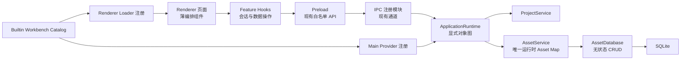

# 架构边界收敛重构设计

> 状态：设计已确认，待实施
>
> 决策日期：2026-07-30
>
> 范围：收敛 Asset 运行时状态所有权、修正 Attachment 文件化契约、
> 统一 Workbench 双端注册、拆分 Main 装配与 Renderer 大型页面，并消除已知循环依赖。

## 1. 背景

Learning Companion 已经形成了较清晰的分层：

```text
React Renderer
    ↓
Preload 白名单 API
    ↓
IPC Handlers
    ↓
Service / Manager
    ↓
Database / Repository / Runtime Registry
```

Workbench、Content Resolver、Asset Artifact 和 External Library 等核心扩展点也已建立。
当前问题不是整体技术路线错误，而是持续迭代后出现了几处职责重叠和装配代码膨胀：

1. `AssetDatabase` 与 `AssetService` 同时持有当前 Project 的 Asset Map；
2. Attachment 骨架仍使用通用 `payload: JsonValue`，与已经确定的文件化内容策略不一致；
3. Main 与 Renderer 分别手动注册内置 Workbench，存在双端漂移风险；
4. `src/main/index.ts` 同时承担 Electron 生命周期、对象装配和 IPC 注册；
5. Home、Project 和 Settings 页面逐渐同时承担视图、状态与业务编排；
6. 文本编码模块和 Workbench Action 模块各存在一处类型循环依赖。

本轮重构选择“分层收敛”方案：完整解决上述边界问题，但不引入容器框架，不重写
Workbench 内部实现，也不改变产品行为。

## 2. 目标

1. `AssetService` 成为当前 Project Asset 运行时状态的唯一所有者。
2. `AssetDatabase` 退化为无状态 SQLite CRUD 适配器。
3. Attachment 的小型元数据与文件化正文拥有明确边界。
4. 内置 Workbench 的 Main Provider 与 Renderer Loader 由同一 Catalog 编排。
5. `src/main/index.ts` 只保留 Electron 应用生命周期职责。
6. Renderer 页面按会话、数据操作和视图组件拆分。
7. 消除当前检测到的两处循环依赖。
8. 保留现有 SQLite 数据、IPC 契约、启动顺序和用户可见行为。

## 3. 非目标

本轮不实现：

- 新的 Attachment 功能或 Attachment 数据库迁移；
- 新的 Workbench、Action、Interaction Facility 或生成中心能力；
- Workspace 导出、迁移或可移植性增强；
- Workbench 内部 Provider、Session、State Repository 的重新设计；
- 全局 Service Locator、IoC 容器或装饰器式依赖注入；
- 页面视觉、交互流程或文案调整；
- SQLite Schema 和现有用户数据格式变更；
- IPC Channel 名称或 Preload 公共 API 变更。

## 4. 总体方案



核心规则：

- Database 和 Repository 只处理持久化，不持有页面生命周期状态；
- Service 持有领域运行时状态并协调持久化；
- Bootstrap 负责对象装配，不承载领域行为；
- Renderer Hook 负责业务编排，页面组件负责布局；
- 双端可执行代码保持分离，共享 Catalog 只保存稳定描述和 Manifest。

## 5. Asset 状态所有权

### 5.1 当前风险

`AssetDatabase` 与 `AssetService` 都维护当前 Project、Asset Map 和部分生命周期状态，
同一个事实存在两个所有者。加载、卸载或异常中断时，两份状态可能发生分歧。

### 5.2 目标边界

```text
AssetDatabase
├── 无 activeProjectId
├── 无 Asset Map
├── 所有查询显式接收 projectId 或 assetId
└── 只负责 SQLite 查询、插入、更新和删除

AssetService
├── 唯一 activeProjectId
├── 唯一当前 Project AssetSnapshot Map
├── availability / checkedTime 等运行时状态
├── lifecycleVersion
└── 加载、卸载、导入、刷新、重定位和删除的业务编排
```

`AssetDatabase` 返回数据库行或纯持久化数据；`AssetService` 负责解析 `contentRef`、
检查可用性并生成面向上层的 `AssetSnapshot`。

### 5.3 Project 切换语义

`AssetService.loadFromProject(projectId)` 按以下顺序执行：

1. 由 `ProjectService` 协调关闭当前 Workbench；
2. 递增 `lifecycleVersion`，使先前异步加载失效；
3. 清空 `activeProjectId` 与运行时 Map，使旧 Project 立即失活；
4. 通过 `AssetDatabase` 查询目标 Project 的持久化 Asset；
5. 在临时 Map 中并行解析内容引用与可用性；
6. 检查 `lifecycleVersion`，确认本次加载仍有效；
7. 一次性提交新的 `activeProjectId` 与运行时 Map。

如果查询或解析失败，Service 保持未激活状态和空 Map，不保留新旧 Project 的混合
数据。被更新请求替代属于 `cancelled`，沿用现有错误分类，不显示用户错误弹窗。

`unloadProject()` 同样递增版本并原子清空运行时状态。SQLite Schema、已有数据和
IPC 契约均不变化。

## 6. Attachment 文件化契约

### 6.1 设计原则

Attachment 是 Asset 上的可扩展学习交互记录。小型索引信息可以进入数据库，但正文、
AI 解答等用户可读内容应位于 Project Workspace 中。数据库负责索引和高速查询，
不成为大块用户内容的唯一来源。

### 6.2 目标模型

```ts
interface AssetAttachment {
  readonly id: string;
  readonly projectId: string;
  readonly assetId: string;
  readonly typeId: string;
  readonly typeVersion: number;
  readonly target: AttachmentTarget;
  readonly metadata: JsonValue;
  readonly content?: {
    readonly ref: ProjectWorkspaceLocalFileContentRef;
    readonly mediaType: string;
  };
  readonly createdTime: string;
  readonly updatedTime: string;
}
```

边界规则：

- 高亮、书签等小型记录可以只使用 `metadata`；
- 用户笔记、AI 解答等正文通过 `content.ref` 指向工作区内文件；
- Attachment 正文不允许使用外部绝对路径；
- `metadata` 只保存类型特化的小型 JSON，不保存大段正文；
- 后续实现 Attachment Service 时，为序列化后的 `metadata` 设置 16 KiB 上限；
- 本轮只修正骨架契约，不创建表、不迁移数据、不实现 Attachment 功能。

## 7. Workbench 双端 Catalog

### 7.1 目录

```text
src/workbenches/catalog/
├── builtin-workbenches.ts
├── register-main-workbenches.ts
├── register-renderer-workbenches.ts
└── builtin-workbenches.test.ts
```

### 7.2 职责

`builtin-workbenches.ts` 只包含稳定 Workbench ID、Manifest 和双端注册描述，不导入
Electron Main Provider 或 React 组件。

`register-main-workbenches.ts` 根据 Catalog 创建并注册 Main Provider。

`register-renderer-workbenches.ts` 根据 Catalog 注册 Renderer 动态 Loader。具体
Workbench 继续懒加载，避免再次触发 Vditor 等重型依赖的启动问题。

`unsupported` Workbench 继续作为 fallback，不强制成为普通内置项。

### 7.3 一致性约束

新增测试保证：

- 每个内置 Workbench ID 都存在 Main 注册；
- 每个内置 Workbench ID 都存在 Renderer 注册；
- 两端引用的 Manifest ID 一致；
- `AssetWorkbenchHost` 不直接识别具体 Workbench。

Catalog 统一注册事实，不把 Main 和 Renderer 可执行代码打入同一个模块。

## 8. Main 启动与装配

### 8.1 目录

```text
src/main/bootstrap/
├── application-runtime.ts
├── create-application-runtime.ts
├── create-external-library-runtime.ts
└── register-application-ipc.ts
```

### 8.2 职责

`create-application-runtime.ts` 使用显式构造函数创建：

- Database 与 Repository；
- Project、Asset、Content、Artifact、External Library 等 Service；
- Workbench Registry、Provider 与 Session Manager；
- Local Protocol 和其他 Main 基础设施。

`register-application-ipc.ts` 集中注册现有 IPC Handler，并返回统一 `dispose()`。
参数校验、错误转换和 Channel 名称保持不变。

`ApplicationRuntime` 持有应用级对象引用，提供明确的 Workbench 关闭、应用
`shutdown()` 和资源 `dispose()` 顺序。

`create-external-library-runtime.ts` 隔离外部运行时 Definition、Downloader 与
安装服务的装配细节，避免再次挤入入口文件。

`src/main/index.ts` 最终只处理：

- Electron `ready`；
- BrowserWindow 创建与恢复；
- macOS activate；
- window-all-closed；
- before-quit；
- 调用 ApplicationRuntime 的创建和释放。

目标是把 `index.ts` 控制在约 100–150 行。依赖仍通过普通 TypeScript
构造函数显式传递，不增加 Service Locator 或 IoC 框架。

## 9. Renderer 页面职责拆分

### 9.1 目录

```text
src/renderer/
├── home/
│   ├── Home.tsx
│   ├── use-projects.ts
│   └── use-home-preferences.ts
│
├── project/
│   ├── ProjectPage.tsx
│   ├── ProjectAssetPanel.tsx
│   ├── AssetActionsMenu.tsx
│   ├── AssetRenameDialog.tsx
│   ├── AssetDeleteDialog.tsx
│   ├── use-project-session.ts
│   └── use-project-assets.ts
│
└── settings/
    ├── SettingsDialog.tsx
    ├── GeneralSettingsSection.tsx
    └── ExternalLibrariesSettingsSection.tsx
```

现有公共入口文件可以暂时保留为薄转发层，减少一次性引用变更。

### 9.2 Home

- `Home.tsx` 只负责首页布局和组件编排；
- `use-projects.ts` 负责列表加载、创建、编辑、置顶和删除；
- `use-home-preferences.ts` 负责排序、视图模式和筛选条件；
- 现有 Card、List、Toolbar 组件保持展示职责。

### 9.3 Project

- `ProjectPage.tsx` 只负责 `2:6:2` 布局、当前选择和组件组合；
- `use-project-session.ts` 负责进入、退出、重试和 Workbench 关闭顺序；
- `use-project-assets.ts` 负责导入、拖拽导入、刷新、重命名、删除、重新定位及
  Asset 操作互斥；
- Asset 菜单和确认对话框拆为纯视图组件；
- Workbench 仍由 `AssetWorkbenchHost` 管理。

### 9.4 Settings

- `SettingsDialog` 只负责弹窗外壳、导航和关闭；
- `GeneralSettingsSection` 负责通用设置；
- `ExternalLibrariesSettingsSection` 负责运行时目录、安装与迁移 UI；
- 已有 External Library Store 和后台任务生命周期不变。

页面局部状态继续使用 React Hook。不会为本次拆分新增 Zustand Store，也不会创建
只把原组件整体搬进去的通用 `Controller` 大对象。拆分期间保持现有 DOM、CSS Class、
可访问性标签、文案和用户操作流程。

## 10. 循环依赖修复

### 10.1 文本编码

文本编码检测移动到内容基础设施：

```text
main/content/text-encoding.ts
        ↑                 ↑
text-content.ts    asset-media-type.ts
```

编码、Detector 和采样常量属于内容读取能力。Asset 媒体类型判断可以依赖 Content，
Content 不再反向依赖 Asset。

### 10.2 Workbench Action

Action 模型拆为单向依赖：

```text
workbench-action.ts
workbench-contribution.ts
          \       /
   workbench-action-bundle.ts
```

- `workbench-action.ts` 定义行为及启用判断；
- `workbench-contribution.ts` 定义 Surface 贡献、展示信息和关闭策略；
- `workbench-action-bundle.ts` 组合 Action 与 Contribution。

两个基础模块不再互相引用。重构完成后重新运行生产源码依赖扫描，目标循环依赖为零。

## 11. 错误处理

- IPC Handler 继续捕获所有异常并使用现有统一错误协议；
- 用户错误继续显示居中确认弹窗；
- 后台操作终态继续通过全局通知系统反馈；
- 生命周期被更新请求替代继续归类为 `cancelled`；
- 内部不变量错误保留技术日志，同时通过统一兜底反馈；
- 本轮不引入新的错误展示组件或错误码体系。

## 12. 验证策略

### 12.1 单元与契约测试

1. `AssetDatabase`：无状态 CRUD、显式 Project 查询和级联清理。
2. `AssetService`：加载、卸载、并发替代、加载失败后的空闲状态。
3. Attachment：`metadata` 和 Workspace 相对内容引用契约。
4. Workbench Catalog：双端注册完整性和 Manifest ID 一致性。
5. Bootstrap：依赖创建、IPC 注册和释放顺序。
6. Renderer：抽出的纯状态逻辑、现有组件静态渲染和交互契约。
7. 依赖扫描：生产代码循环依赖归零。

### 12.2 完整验证

```bash
pnpm check
pnpm smoke:native
pnpm package
pnpm verify
```

与 Native Module 或 Electron 打包相关的测试继续在完整重构结束后执行。各细粒度
提交在提交前运行与改动范围相匹配的测试。

## 13. 实施与提交边界

按以下顺序实施，每项独立提交：

1. 文档：架构边界收敛设计；
2. 重构：消除文本编码与 Action 循环依赖；
3. 重构：由 AssetService 独占运行时 Asset 状态；
4. 重构：收敛 Attachment 文件化契约；
5. 重构：统一 Workbench 双端注册目录；
6. 重构：拆分 Main 启动与 IPC 装配；
7. 重构：拆分 Project 页面职责；
8. 重构：拆分 Home 页面职责；
9. 重构：拆分 Settings 页面职责；
10. 文档：同步 `TECH_STACK.md` 与模块结构。

本轮设计提交后先等待用户审阅。实施完成后也不自动 Push，待本地人工验收通过再由
用户决定是否推送。
