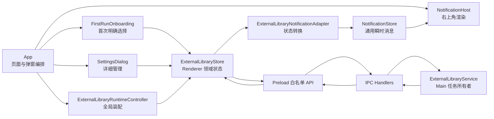

# 后台运行时安装、全局通知与首次引导设计

> 状态：已实施，待真实后台下载安装人工验收
>
> 决策日期：2026-07-30
>
> 范围：把外部运行时安装改为真正的后台任务，建立 Renderer 全局通知设施，
> 并在首次运行时引导用户明确选择是否安装推荐组件。

## 1. 背景

当前外部运行时框架已经可以发现、安装、取消、删除和迁移 LibreOffice。安装任务
由 Electron Main 中的 `ExternalLibraryService` 执行，并持续发布
`ExternalLibrarySnapshot`。

当前 UI 仍有两个问题：

1. `SettingsDialog` 会等待完整安装 Promise，在数百 MB 下载期间禁用关闭按钮；
2. 只有 Settings 在订阅运行时事件，关闭 Settings 后没有全局进度终态和结果反馈。

这使已经具备后台任务基础的 Main 被一个前台模态框绑住。用户第一次进入某个
Office Asset 时，还可能临时遇到长时间下载，打断学习流程。

## 2. 目标

1. 用户启动安装后可以立即关闭 Settings，继续浏览 Project 和 Asset。
2. 安装任务的生命周期由 Main 持有，不依赖任何 Renderer 对话框。
3. 安装成功或失败后，通过统一的右上角通知反馈。
4. 通知设施是通用 Renderer 基础设施，不理解 LibreOffice 或外部运行时。
5. 外部运行时模块只把领域状态转换成通知，不直接渲染 UI。
6. 首次运行时主动介绍推荐组件，让用户选择后台安装或暂不安装。
7. 首次引导不会强迫用户下载，也不会因为当前平台不支持而阻塞应用。
8. Settings、首次引导和未来其他入口共享同一份外部运行时状态。

## 3. 非目标

本阶段不实现：

- 应用退出后继续安装；
- 重启应用后断点续传下载；
- 通知历史、跨启动持久化或操作系统原生通知；
- 为每个新外部运行时自动再次展示完整首次引导；
- 把通知领域模型放到 Main 或通过 IPC 传输；
- 在右上角通知中承载复杂冲突处理、许可证确认或迁移流程；
- LibreOffice 以外的新 External Library Definition。

应用正常退出时，Main 仍取消并等待当前安装任务收尾。关闭 Settings、关闭首次
引导或切换页面不取消安装。

## 4. 核心架构



边界规则：

- `ExternalLibraryService` 只管理运行时，不知道 Settings、引导或通知；
- `ExternalLibraryStore` 只管理 Renderer 中的运行时快照和操作状态；
- `ExternalLibraryNotificationAdapter` 只解释快照状态变化；
- `NotificationStore` 和 `NotificationHost` 只处理通用消息；
- `App` 负责打开 Settings、选择 Settings 目标和决定是否展示首次引导。

## 5. Main 后台任务语义

### 5.1 开始安装

现有 `install(libraryId)` 会等待整个下载安装过程。它改为明确的任务接纳接口：

```ts
interface ExternalLibraryServiceApi {
  startInstallation(libraryId: string): Promise<ExternalLibrarySnapshot>;
}
```

`startInstallation()` 的 Promise 只覆盖以下过程：

1. 初始化 Service；
2. 校验运行时 ID、平台和当前冲突；
3. 刷新磁盘状态；
4. 创建并登记 `ActiveInstallation`；
5. 发布第一个活动 Snapshot；
6. 返回当前 Snapshot。

下载、校验和安装在 Main 拥有的内部 Promise 中继续执行。接口返回不代表安装
完成，只代表 Main 已经接纳任务。

### 5.2 后台任务终态

内部任务必须捕获所有预期失败：

- 成功：发布 `available`；
- 下载、校验或安装失败：发布 `failed` 和稳定 `errorCode`；
- 安装目录异常：发布 `invalid`；
- 用户取消：清理 staging，重新检查磁盘并发布实际状态；
- Main 退出：发出取消信号并等待任务结束。

任务失败不能因为原 Renderer 组件已经卸载而形成未处理的 Promise rejection。
Service 记录技术日志，Renderer 只依赖 Snapshot。

### 5.3 幂等和互斥

- 同一 Library 已有安装任务时，再次开始安装只返回当前 Snapshot；
- 不创建第二个下载；
- 已经 `available` 时返回当前 Snapshot；
- `invalid`、迁移中或目标冲突时拒绝接纳任务；
- 删除、迁移和安装继续遵循现有互斥规则；
- 显式取消是唯一由用户在应用运行期间停止安装的常规入口。

### 5.4 IPC 契约

Preload 暴露的安装入口同步改名：

```ts
startExternalLibraryInstallation(
  request: ExternalLibraryIdRequest,
): Promise<ExternalLibrarySnapshot>;
```

事件通道继续使用 `onExternalLibraryChanged`。Renderer 不轮询进度，也不持有
下载 Promise。

为使首次引导可以稳定处理没有对应安装包的平台，
`ExternalLibraryStatus` 增加 `unsupported`。发现阶段找不到当前
platform/architecture 的 Package 时返回该状态，而不是让整个列表请求失败；
该状态不能开始安装，也不被当作安装失败通知。

`ExternalLibrarySnapshot.expectedSize` 相应改为可选，但只有 `unsupported`
允许缺省；其余状态仍必须携带当前平台 Package 的正整数体积。UI 在 unsupported
状态显示“当前平台无可下载包”，不能借用其他平台的体积误导用户。

## 6. Renderer 外部运行时状态

新增：

```text
src/renderer/external-libraries/
├── external-library-store.ts
├── external-library-notification-adapter.ts
└── ExternalLibraryRuntimeController.tsx
```

### 6.1 ExternalLibraryStore

Store 使用现有 Zustand，负责：

- 启动时调用 `listExternalLibraries()`；
- 在应用根部只建立一组运行时事件订阅；
- 按 ID 合并 Snapshot；
- 暴露 `startInstallation`、`cancelInstallation`、`removeLibrary`、
  `refreshLibrary` 和迁移操作；
- 区分短暂请求状态和长期领域状态；
- 对重复初始化、React Strict Mode 重新挂载和迟到响应保持幂等。

状态至少包括：

```ts
interface ExternalLibraryRendererState {
  readonly librariesById: ReadonlyMap<string, ExternalLibrarySnapshot>;
  readonly initialized: boolean;
  readonly loading: boolean;
  readonly requestPendingById: ReadonlySet<string>;
  readonly loadError?: string;
}
```

`requestPendingById` 只表示“正在等待 Main 接纳命令”，一般持续很短。
`downloading`、`verifying`、`installing` 和 `migrating` 来自 Snapshot，不能继续
被一个 `operationBusy` 混为同一状态。

### 6.2 ExternalLibraryRuntimeController

Controller 是无视觉根组件：

- 在 `App` 根部初始化 Store；
- 建立和清理 Preload 事件订阅；
- 把相邻 Snapshot 交给通知 Adapter；
- 页面切换和 Settings 关闭时保持挂载。

它不渲染进度条，不包含 LibreOffice 文案，也不执行安装业务。

### 6.3 SettingsDialog

Settings 改为 Store 消费者：

- 不再自己请求列表和建立事件订阅；
- Main 接纳安装后即可关闭；
- 下载期间仍显示实时进度；
- 下载期间允许取消；
- 下载期间禁用会冲突的删除和目录迁移；
- 迁移和文件冲突确认仍可作为阻塞式 Settings 操作；
- 前台请求未被 Main 接纳、迁移失败等即时错误继续使用居中的错误反馈。

关闭 Settings 只卸载视图，不改变任何 Main 任务。

## 7. 通知基础设施

新增：

```text
src/renderer/notifications/
├── notification.ts
├── notification-store.ts
├── NotificationHost.tsx
└── NotificationToast.tsx
```

### 7.1 通用模型

通知是 Renderer 内的瞬时 UI 数据，不写入 settings 或 SQLite：

```ts
type NotificationKind = 'success' | 'info' | 'warning' | 'error';

interface AppNotification {
  readonly id: string;
  readonly dedupeKey?: string;
  readonly kind: NotificationKind;
  readonly title: string;
  readonly message?: string;
  readonly durationMs?: number | null;
  readonly action?: {
    readonly label: string;
    readonly invoke: () => void;
  };
}
```

`invoke` 只存在于 Renderer 内存，因此不要求可序列化。具体领域可以通过回调
打开 Settings 或跳转页面，但 Notification Host 不理解该动作的业务含义。

### 7.2 展示规则

- Host 固定在应用内容右上角，不阻塞当前页面；
- 同时最多展示 3 条，其余按队列等待；
- 用户可以手动关闭；
- 自动消失的通知在鼠标悬停时暂停计时；
- 成功通知默认 5 秒后消失；
- 错误通知默认持久显示，直到用户关闭或执行动作；
- 使用 `aria-live`：普通消息为 `polite`，错误为 `assertive`；
- 通知不自动抢占键盘焦点。

`dedupeKey` 防止同一任务终态重复弹出。例如：

```text
external-library:libreoffice:install-success
external-library:libreoffice:install-failed
```

同键新消息替换旧消息。重新开始安装时清除该 Library 的旧失败通知。

### 7.3 外部运行时通知 Adapter

Adapter 观察相邻 Snapshot，而不是只观察当前值：

| 前一状态 | 新状态 | 通知 |
| --- | --- | --- |
| `downloading` / `verifying` / `installing` | `available` | 5 秒成功通知 |
| 活动安装状态 | `failed` / `invalid` | 持久错误通知 |
| 活动安装状态 | `not-installed` | 视为取消，不通知 |
| 应用初始化 `discovering` | `available` | 不通知 |
| 普通刷新 | 状态未变化 | 不通知 |

成功消息示例：“LibreOffice 已安装，可以预览 Office 文档。”

失败消息只提供安全、稳定的用户文案。动作“查看详情”打开 Settings，并把目标
定位到对应 Library；重试仍在 Settings 内执行。技术错误保留在 Main 日志和
`errorCode`，不把任意异常堆栈放进通知。

## 8. 首次运行引导

### 8.1 范围

首次引导不是完整产品教程，只是一个“基础组件设置”步骤：

- 说明推荐组件的用途、来源、版本和预计下载大小；
- 展示当前外部组件目录；
- 提供“更改存储位置”，让用户在开始下载前选择其他磁盘；
- 提供“安装推荐组件”和“暂不安装”两个明确选择；
- 告知目录之后仍可在 Settings 中迁移；
- 不允许通过点击遮罩或 Escape 跳过选择。

“暂不安装”是合法选择。用户之后仍可在 Settings 或需要该能力的 Workbench 中
开始安装。

### 8.2 设置数据

`settings.json` 顶层增加：

```ts
interface StoredSettingsState {
  readonly completedOnboardingVersion: number;
}

const CURRENT_ONBOARDING_VERSION = 1;
```

该字段属于应用初始化元数据，不放进只描述 Home UI 偏好的
`AppPreferences`，也不因此修改 `APP_PREFERENCES_SCHEMA_VERSION`。

缺少该字段的现有设置按 `0` 读取并迁移保存。因此升级到该版本的老用户也会看到
一次基础组件引导。未来只有在确实需要用户重新作出全局初始化选择时才提升
`CURRENT_ONBOARDING_VERSION`，不能因为新增一个普通可选 Library 就自动提升。

SettingsRepository 增加专用方法，Renderer 不能提交任意版本号：

```ts
interface AppSetupSnapshot {
  readonly currentOnboardingVersion: number;
  readonly completedOnboardingVersion: number;
  readonly pendingOnboardingStep:
    | 'external-library'
    | 'agent-provider'
    | null;
  readonly requiresOnboarding: boolean;
}

getAppSetup(): AppSetupSnapshot;
completeExternalLibraryOnboarding(): Promise<AppSetupSnapshot>;
completeAgentProviderOnboarding(): Promise<AppSetupSnapshot>;
```

对应 IPC 只允许读取状态和完成固定步骤。Provider 接入后，两步共享同一个递增的
`completedOnboardingVersion`，Renderer 仍不能提交任意版本号。

### 8.3 引导流程

应用启动：

1. `App` 读取 `AppSetupSnapshot`；
2. 全局 External Library Controller 同时初始化运行时状态；
3. `requiresOnboarding` 为真时显示引导；
4. 引导等待运行时列表完成首次发现后展示准确状态。

“更改存储位置”复用 External Library Store 的目录选择和迁移操作，不在引导中
另写一份文件移动逻辑。目标目录存在冲突时复用与 Settings 相同的冲突确认组件；
迁移完成前不能开始下载。用户取消目录选择只返回引导，不算完成引导。

选择“安装推荐组件”：

1. 调用 Store 的 `startInstallation('libreoffice')`；
2. 等待 Main 接纳任务；
3. 持久化完成当前引导；
4. 关闭引导，安装在后台继续。

选择“暂不安装”：

1. 持久化完成当前引导；
2. 关闭引导；
3. 不创建安装任务。

特殊状态：

- 已经 `available`：显示“组件已就绪”，按钮改为“开始使用”；
- 已在安装：显示“正在后台安装”，允许完成引导并进入应用；
- 状态为 `unsupported`：解释组件暂不可用，允许继续；
- 开始安装在接纳前失败：不标记引导完成，展示居中错误并允许重试或暂不安装；
- 安装已接纳但设置写入失败：安装继续，引导保持打开，明确提示“安装已在后台
  继续，但引导状态未能保存”，允许重试完成写入；
- “暂不安装”的设置写入失败：引导保持打开，不假装已经保存选择。

首次引导中的推荐清单由 Renderer onboarding feature 明确声明。第一阶段只有
`libreoffice`。`ExternalLibraryService` 和 Downloader 不包含“推荐组件”概念，
从而保持运行时框架通用。

## 9. App 装配与 Settings 定位

根部装配顺序：

```tsx
<>
  <ExternalLibraryRuntimeController onOpenSettings={openSettings} />
  <CurrentPage />
  {onboardingRequired && <FirstRunOnboarding />}
  {settingsRequest && <SettingsDialog target={settingsRequest.target} />}
  <NotificationHost />
</>
```

Settings 打开请求使用 Renderer 内部目标：

```ts
type SettingsTarget =
  | { readonly section: 'general' }
  | {
      readonly section: 'external-libraries';
      readonly libraryId?: string;
    };
```

通知 Adapter 只通过注入的 `openSettings(target)` 回调请求导航。通知模块本身
不 import `SettingsDialog`，外部运行时 Store 也不保存对话框开关。

## 10. 错误边界

按错误发生阶段选择反馈方式：

- Main 未接纳的前台命令错误：当前模态上下文中的居中错误；
- 已接纳后台任务的终态失败：持久右上角通知；
- 迁移冲突：Settings 内专用冲突界面；
- 通知渲染自身失败：不能影响运行时 Store 和 Main 任务；
- 初始列表加载失败：Settings 和首次引导显示可重试状态，不发“安装失败”通知；
- 取消安装：不是错误，不弹失败通知。

Main 仍是可信错误分类者。Renderer 不通过解析任意 `Error.message` 猜测错误类型。

## 11. 测试方案

### 11.1 Main 与 IPC

- `startInstallation()` 在受控下载 Promise 完成前返回活动 Snapshot；
- 后台任务最终发布 `available`；
- 后台失败发布 `failed`，且不存在未处理 rejection；
- 重复开始只存在一个下载任务；
- `available`、`invalid`、迁移冲突和不支持平台行为明确；
- 取消和应用退出能清理 staging 并等待收尾；
- IPC 和 Preload 使用新的“开始安装”契约。

### 11.2 Store 与 Adapter

- 初始列表与事件合并；
- React Strict Mode 重挂载不产生重复有效订阅；
- Settings 关闭后 Store 继续收到进度；
- 活动状态到成功只通知一次；
- 活动状态到失败产生持久通知；
- 初始化发现、刷新不变和取消不产生错误通知；
- 重试清理旧失败通知；
- `dedupeKey` 能替换重复终态消息。

### 11.3 通知 UI

- 自动关闭、悬停暂停和手动关闭；
- 错误通知不会自动关闭；
- 同时最多 3 条并正确排队；
- 动作回调只触发一次；
- 键盘和 `aria-live` 行为；
- 通知不会阻塞 Home、Project 或 Workbench 操作。

### 11.4 Settings 与首次引导

- 安装请求被接纳后 Settings 可以关闭；
- 重新打开 Settings 能恢复当前进度；
- 活动安装期间取消可用，删除和迁移禁用；
- 缺失 `completedOnboardingVersion` 按 0 迁移；
- 安装、暂不安装、已安装、安装中和不支持平台流程；
- 开始任务失败和设置写入失败时不错误关闭引导；
- 安装完成通知能打开并定位到正确的 Settings 项。

### 11.5 手工验收

1. 从 Settings 开始安装 LibreOffice；
2. 下载开始后立即关闭 Settings；
3. 在 Home 与 Project 间切换并打开普通 Asset；
4. 重新打开 Settings，确认进度连续；
5. 再次关闭 Settings，等待安装成功通知；
6. 打开 Office Asset，确认预览可用；
7. 重复一次失败或主动断网场景，确认错误通知持续存在并能打开详情；
8. 清除首次引导字段，在“安装”和“暂不安装”两条路径分别验收一次。

## 12. 实施顺序

1. 先修改 Main 的任务接纳语义和 IPC 契约；
2. 再建立全局 External Library Store；
3. 实现通用 Notification Store 与 Host；
4. 接入 External Library Notification Adapter；
5. 把 Settings 改为全局 Store 消费者；
6. 增加 App Setup 设置字段和 IPC；
7. 实现首次运行引导；
8. 执行完整自动化检查和 macOS 手工安装验收。

每一项单独提交。完成前不改变现有 Office Workbench 的运行时依赖边界。
