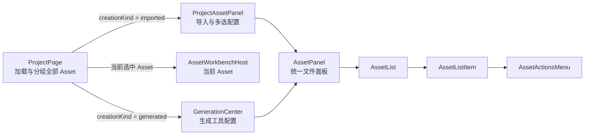

# Project 响应式布局与生成内容栏设计

> 状态：已确认，待实施
>
> 日期：2026-07-31
>
> 2026-08-30：本文中的“当前 Asset Workbench 专属工具”已由
> [Workbench 生成中心 Surface 移除设计](./2026-08-30-workbench-generation-center-surface-removal-design.md)
> 取代；生成中心只保留 Project 级工具、任务和生成内容。
>
> 2026-08-30：右侧布局已由
> [Project 右侧插槽与 Audio 布局收敛设计](./2026-08-30-project-right-panel-and-audio-layout-design.md)
> 补充；生成中心与 AI 问答互斥复用同一个第三栏，三屏宽度和响应式断点不变。

## 1. 背景

当前 Project 页面使用固定三栏与 `min-w-[1080px]`：

- 左侧加载全部 Asset；
- 中间加载当前 Asset 的 Workbench；
- 右侧生成中心只展示占位工具和“当前资料上下文”；
- 三栏比例固定为 `2:6:2`。

该实现存在四个问题：

1. 大屏下两侧栏随比例继续变宽，中间资料的有效显示面积仍然偏小；
2. 窗口变窄后页面横向溢出，右侧栏与顶栏操作可能离开可视区域；
3. 生成内容还没有作为真正的 Asset 列表呈现；
4. 左右 Asset 列表若分别实现，会复制选中、错误状态、时间和菜单逻辑。

## 2. 目标

- 大屏充分利用中间 Workbench，限制左右侧栏的最大宽度。
- 中小窗口通过覆盖式侧栏保持资料阅读体验，不产生横向滚动。
- 顶栏的学习资料、生成中心、打开工作区和设置操作始终可访问。
- 左侧只展示导入 Asset，右侧展示生成 Asset。
- 左右列表共用 Asset 列表项和操作菜单。
- 使用相对时间代替绝对日期，避免跨年显示和日期格式问题。
- 保留现有 Workbench Contribution 形式的 Asset 专属生成工具。

## 3. 非目标

本轮不实现：

- 思维导图、HTML 讲义或其他真实生成流程；
- `AssetReference`、`AssetLink` 与内容内关系 ID 绑定的实际写入；
- NotebookLM 特有的导出、查看 Prompt 等菜单；
- 侧栏宽度拖动；
- Project 布局的 Settings 持久化；
- 移动端应用打包。

覆盖式侧栏已经满足当前桌面产品在不同窗口宽度下的主要交互需求，因此不再引入
拖动宽度和持久化状态。

## 4. 方案选择

### 4.1 根据目录或关系推断 Asset 类型

该方案不修改 Asset 数据结构，但外部链接不位于 Project 目录中，关系也可能尚未
写入。目录重构或关系缺失会让 UI 分类失真。

### 4.2 单独建立 GeneratedContent 模型

该方案能够隔离生成记录，但会重复 Asset 已有的打开、重命名、删除、文件状态和
Workbench 生命周期，不符合当前统一 Asset 模型。

### 4.3 Asset 显式记录创建类型

本设计选择该方案。

```ts
type AssetCreationKind = 'imported' | 'generated';
```

- `imported` 对应用户复制或链接进入 Project 的资料；
- `generated` 对应应用生成并作为 Asset 管理的内容。

`copy | link` 继续描述文件导入方式，`creationKind` 描述 Asset 的创建语义，两者
不混用。

## 5. Asset 数据模型与目录

`Asset`、`AssetSnapshot`、SQLite `assets` 表和相关 IPC 校验增加
`creationKind`。

Project 工作区现有目录与其保持一致：

```text
assets/
├── imported/
└── generated/
```

规则如下：

- 复制导入的文件写入 `assets/imported`，记录为 `imported`；
- 链接外部文件不复制文件，但仍记录为 `imported`；
- 后续生成服务把正式输出写入 `assets/generated`，记录为 `generated`；
- SQLite 字段是 UI 分类的事实源，不能根据路径反向猜测；
- 现有数据库记录迁移时统一补为 `imported`；
- 首版不提前加入没有对应功能和目录的 `authored` 类型。

生成 Asset 仍使用现有 `contentRef`、Availability、Workbench 和 Asset 操作链路。
后续通过 `AssetReference` 保存 generated Asset 的总体来源，通过 `AssetLink`
保存 Asset 级目标，并在对应 content 中保存关系 ID 与具体位置绑定；该关系不属于
本轮实现。
具体结构和 Mind Map 节点 Anchor 以
`2026-08-01-asset-link-mind-map-foundation-design.md` 为准。

## 6. 页面结构与组件边界



共享边界为：

- `AssetPanel`：负责完整侧栏外壳、标题与计数、加载/失败/空状态、按
  `updatedTime` 降序排列、排序说明和列表区域；
- `AssetList`：负责 Asset 集合渲染，以及新增和重排时的移动动画；
- `AssetListItem`：负责媒体图标、名称、Availability、来源徽标、相对时间和选中态；
- `AssetActionsMenu`：负责编辑标题、在文件夹中显示、重新定位和从 Project 移除；
- `formatRelativeTime`：负责统一相对时间文案。

两侧只保留业务差异，并注入同一个 `AssetPanel`：

- `ProjectAssetPanel` 注入添加资料、批量选择和刷新全部资料控件；
- `GenerationCenter` 注入通用生成工具和当前 Workbench 贡献的专属工具；
- 标题栏、计数、加载状态、排序和 Asset 列表不得在两个适配层分别实现。

右侧生成内容的 `...` 不复制 NotebookLM 的全量操作，而是直接使用与左侧相同的
`AssetActionsMenu`。

## 7. GenerationCenter

右侧栏自上而下分为：

1. 通用生成工具；
2. 当前 Asset Workbench 贡献的生成工具；
3. 生成内容列表。

删除“当前资料上下文”卡片。Workbench Interaction 与 Selection 仍保留在 Runtime
中，具体生成工具需要时直接读取，不再用固定预览卡重复显示。

生成内容列表：

- 只消费 `creationKind === 'generated'` 的 Asset；
- 按 `lastUsedTime` 从新到旧排序；
- 点击后更新全局选中 Asset，并在中间打开对应 Workbench；
- 重命名、显示文件、重新定位和删除沿用现有 Asset 流程；
- 没有生成 Asset 时显示真实空状态，不添加假数据。

Project 顶栏分别显示导入资料数与生成内容数。

## 8. 响应式侧栏

页面不再设置固定最小宽度，也不允许横向滚动。

首版使用三个窗口模式：

| 模式 | 默认状态 | 展示方式 |
| --- | --- | --- |
| 宽屏 | 左右展开 | 两侧内联，中间占用剩余空间 |
| 中屏 | 左开、右关 | 左侧内联，右侧以覆盖抽屉打开 |
| 小屏 | 左右关闭 | 左右都以覆盖抽屉打开，二者互斥 |

具体断点作为 Renderer 常量集中维护，并以视觉稿的约 `1180px` 和 `720px` 为初始
值，在 Electron 实测中微调。

行为规则：

- 跨越窗口模式时应用对应默认状态；
- 同一窗口模式内尊重用户手动展开或收起；
- 大屏手动收起侧栏后，中间区域立即吸收空余宽度；
- 中小屏侧栏打开时显示遮罩；
- 点击遮罩或按 `Esc` 关闭抽屉；
- 关闭后焦点返回对应的顶栏按钮；
- 小屏打开一侧时自动关闭另一侧；
- 本轮状态只存在 Renderer 内存，不写入 Settings。

中间 Workbench 始终获得 `min-width: 0` 和剩余可用空间。各 Workbench 根据自己的
查看逻辑响应容器尺寸；PDF/Office 已有 `page-fit` 和 `page-width` 能力，不由
ProjectPage 强制修改内部缩放模式。

## 9. 顶栏操作

顶栏固定提供四个图标操作，不因窗口变窄而隐藏：

1. 展开或收起学习资料；
2. 展开或收起生成中心；
3. 打开 Project 工作区；
4. 打开设置。

每个按钮具有：

- 直观 SVG 图标；
- `aria-label`；
- 对侧栏按钮设置 `aria-expanded`；
- 随当前状态变化的悬浮提示；
- 可见的键盘焦点样式。

极窄窗口无法单行容纳时，操作区整体换行，不吞掉按钮。

## 10. 相对时间

底层继续保存 Unix 毫秒时间戳。Renderer 使用共享纯函数按当前时间格式化：

- 小于一分钟：`just now`；
- 小于一小时：`N min(s) ago`；
- 小于一天：`N hr(s) ago`；
- 其余：`N day(s) ago`。

即使超过一年也继续显示天数，不回退到带年份的绝对日期。ProjectPage 维护一个
低频时间刻度，使可见列表无需其他数据变化也能更新相对时间。

`AssetPanel` 对左右两类 Asset 使用同一套 `updatedTime` 降序规则。已有行的位置
变化使用 FLIP 风格的 Web Animations 位移动画，新插入行使用轻量淡入；系统启用
“减少动态效果”时跳过动画。

## 11. 数据流

```text
ProjectService.openProject
  -> AssetService 返回当前 Project 的全部 AssetSnapshot
  -> ProjectPage 按 creationKind 分组
       -> imported AssetLoadState -> ProjectAssetPanel -> AssetPanel
       -> generated AssetLoadState -> GenerationCenter -> AssetPanel
  -> 两侧共享 AssetListItem 点击
       -> 同一个 selectedAssetId
       -> AssetWorkbenchHost 打开对应 Workbench
```

创建导入 Asset：

```text
添加资料 / 拖拽 / 链接外部文件
  -> AssetService.addLocalFile
  -> AssetDatabase.add({ creationKind: "imported", ... })
```

后续创建生成 Asset：

```text
Generation Service
  -> 输出文件到 assets/generated
  -> AssetDatabase.add({ creationKind: "generated", ... })
```

## 12. 错误与边界

- 数据库出现未知 `creationKind` 时按数据完整性错误处理，不静默归类；
- 数据迁移在数据库初始化事务中完成；
- 生成 Asset 的文件缺失、不可访问或无效时，与导入 Asset 使用相同的红色状态和
  重新定位操作；
- 右侧删除当前打开 Asset 后，沿用现有选中回退和 Workbench 关闭流程；
- 窗口尺寸变化不会修改 Asset 或 Workbench 状态；
- 覆盖抽屉的开关错误不能影响 Project 生命周期和 Asset 数据。

## 13. 测试与验收

### 数据层

- `AssetCreationKind` 校验只接受 `imported | generated`；
- 数据库迁移把历史 Asset 设置为 `imported`；
- AssetDatabase 新增、读取和克隆完整保留 `creationKind`；
- 本地文件导入始终写入 `imported`。

### Renderer

- ProjectPage 正确分组导入与生成 Asset；
- 左右侧栏共用完整 `AssetPanel`、`AssetListItem` 和 `AssetActionsMenu`；
- 两类 Asset 都由 `AssetPanel` 按 `updatedTime` 排序，并在顺序变化时平滑移动；
- 点击任一列表的 Asset 都会更新同一个 Workbench；
- GenerationCenter 不再渲染“当前资料上下文”；
- 生成内容为空时显示空状态；
- 相对时间在边界值和长时间跨度下输出预期文案；
- 模拟 `matchMedia` 验证宽、中、小三种默认状态和断点切换；
- 小屏侧栏互斥，遮罩和 `Esc` 可以关闭并恢复焦点；
- 四个顶栏操作在所有模式下保持可访问。

### 完整检查

- 运行 `pnpm check`；
- 运行相关 Vitest 测试；
- 运行生产构建；
- 在 Electron 中分别验证宽屏、中屏和极窄窗口；
- 检查无横向滚动、无按钮丢失、Workbench 内容可见、左右菜单行为一致。
