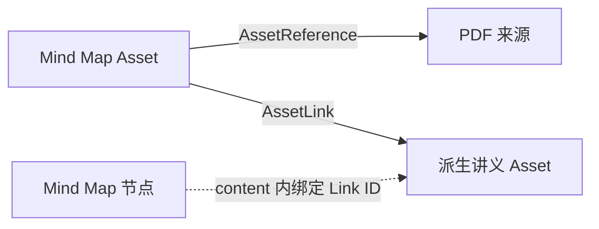

# AssetReference、AssetLink 与 Mind Map 基础结构设计

> 状态：数据结构、Project-scoped Service 与 Mind Map 映射基础已实现；生成编排和
> Renderer 待设计
>
> 日期：2026-08-01

## 1. 核心结论

`AssetReference` 和 `AssetLink` 都是通用的 Asset 级有向关系，但语义不同：

- `AssetReference`：一份 Asset 总体参考过哪些来源资料；
- `AssetLink`：一份 Asset 链接或派生出了哪些目标 Asset；
- 两者分别保存于 SQLite，不互相投影，也不合并成带类型判别的关系表；
- 媒体内部位置不进入通用关系表，由对应 Asset 的 content 保存。



## 2. 通用实体

```ts
interface AssetReference {
  readonly id: string;
  readonly projectId: string;
  readonly assetId: string;
  readonly sourceAssetId: string;
  readonly createdTime: number;
}

interface AssetLink {
  readonly id: string;
  readonly projectId: string;
  readonly assetId: string;
  readonly targetAssetId: string;
  readonly createdTime: number;
}
```

通用实体不保存 `sourceTarget`、Mind Map 节点 ID、PDF 页码或视频时间段。

两种关系都要求：

- 拥有者与另一端 Asset 属于同一个 Project；
- 不允许自引用或自链接；
- 同一个 Project 内的 Asset 对唯一；
- 删除任意一端 Asset 时由外键级联删除关系。

## 3. SQLite

使用两张独立表：

```text
asset_references
    UNIQUE(project_id, asset_id, source_asset_id)

asset_links
    UNIQUE(project_id, asset_id, target_asset_id)
```

Database 类只负责 SQL CRUD、行映射和底层完整性。Project 上下文、幂等创建及
内存投影由 Service 负责。

Migration 10 曾短暂把 `source_target` 放入 `asset_references`。Migration 11 会：

1. 重建不包含格式位置的 Reference 表；
2. 对同一 Asset 对去重并保留最早关系；
3. 丢弃不再允许的自引用；
4. 创建 `asset_links` 表及约束。

## 4. AssetAssociationService

`AssetAssociationService` 是 Reference/Link 的唯一应用层入口。它不是第三种关系
实体，而是两个关系类型的共同用例边界。

Service 以当前活动 Project 为单位加载和卸载：

```text
Project 打开
├── AssetService.loadFromProject
└── AssetAssociationService.loadFromProject

Project 关闭
├── WorkbenchSessionService.closeActive
├── AssetAssociationService.unloadProject
└── AssetService.unloadProject
```

内部维护按 ID、拥有 Asset 和唯一 Asset 对建立的索引。加载时先构造完整下一份
状态，校验成功后一次性替换；失败不会留下半加载状态。`ensureReference()` 和
`ensureLink()` 对相同 Asset 对幂等。

Asset 删除后 SQLite 级联删除关系，`AssetService` 再通知 Association Service
清理内存投影。通知失败不能把已经完成的 Asset 删除误报为失败。

## 5. Mind Map v1 content

Mind Map 是 Project Workspace 中的正式 generated Asset：

```text
mediaType = application/vnd.learning-companion.mindmap+json
contentRef = assets/generated/<name>.mindmap.json
```

第一版文档保存完整节点树和节点级关系绑定：

```ts
interface MindMapDocumentV1 {
  readonly format: 'learning-companion/mindmap';
  readonly version: 1;
  readonly title: string;
  readonly rootNodeId: string;
  readonly nodes: Readonly<Record<string, MindMapNodeV1>>;
  readonly nodeAssociations: Readonly<
    Record<string, MindMapNodeAssociationsV1>
  >;
}

interface MindMapNodeAssociationsV1 {
  readonly references: readonly {
    readonly referenceId: string;
    readonly sourceTarget: AssetTarget;
  }[];
  readonly linkIds: readonly string[];
}
```

`nodeAssociations` 必须覆盖每个节点，没有绑定时保存空数组。一个 Reference 可以
在多个节点使用不同 `sourceTarget`，一个 Link 也可以绑定多个节点。

Mind Map 只保存关系 ID 和格式内位置，不重复保存 `sourceAssetId` 或
`targetAssetId`。`MindMapAssociationMapper` 将这些 ID 与 Project 级关系快照匹配：

- 关系不存在或不属于当前 Mind Map 时记录为失效绑定；
- 失效绑定不阻止文档打开；
- `sourceTarget` 作为不透明值保存，具体解释交给来源 Workbench；
- 后续安全写回时可以清理失效绑定。

## 6. 节点 Anchor

节点继续提供媒体语义 Anchor：

```ts
{
  scope: 'content',
  anchorType: 'mindmap.node',
  anchorVersion: 1,
  anchorPayload: { nodeId: string }
}
```

Anchor 用于 Selection、Attachment、AI 工具输入和跨 Workbench 导航。它不是
AssetReference 或 AssetLink 的替代品。

## 7. 后续生成编排

Generation Service 后续负责跨 SQLite 与文件系统的一致性：

1. 创建或暂存 generated Asset 文件；
2. 创建 Asset 记录；
3. 通过 Association Service 写入总体 Reference/Link；
4. 将关系 ID 和 `sourceTarget` 写入 Mind Map content；
5. 使用原子文件替换、失败补偿或 staging manifest 完成提交。

Codex 只产生经过约束的内容草稿，不直接修改领域数据库或正式 Asset 文件。
