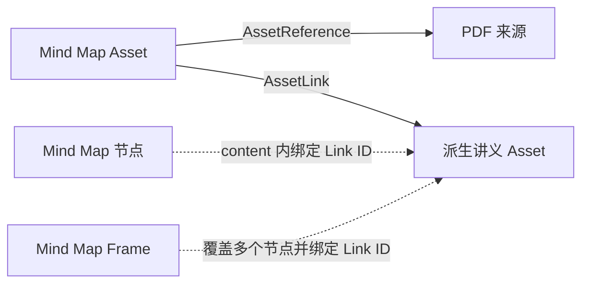

# AssetReference、AssetLink 与 Mind Map 基础结构设计

> 状态：数据结构、Project-scoped Service、媒体映射与基础 Mind Map Workbench
> 已实现；生成编排、Frame 视觉范围和内容编辑待设计
>
> 日期：2026-08-01

## 1. 核心结论

`AssetReference` 和 `AssetLink` 都是通用的 Asset 级有向关系，但语义不同：

- `AssetReference`：一份 Asset 总体参考过哪些来源资料；
- `AssetLink`：一份 Asset 链接或派生出了哪些目标 Asset；
- 两者分别保存于 SQLite，不互相投影，也不合并成带类型判别的关系表；
- 媒体内部位置不进入通用关系表，由对应 Asset 的 content 保存。



## 2. 通用实体

```ts
interface AssetReference {
  readonly id: string;
  readonly projectId: string;
  readonly assetId: string;
  readonly sourceAssetId: string;
  readonly createdTime: number;
}

interface AssetLink {
  readonly id: string;
  readonly projectId: string;
  readonly assetId: string;
  readonly targetAssetId: string;
  readonly createdTime: number;
}
```

通用实体不保存 `sourceTarget`、Mind Map 节点 ID、PDF 页码或视频时间段。

两种关系都要求：

- 拥有者与另一端 Asset 属于同一个 Project；
- 不允许自引用或自链接；
- 同一个 Project 内的 Asset 对唯一；
- 删除任意一端 Asset 时由外键级联删除关系。

## 3. SQLite

使用两张独立表：

```text
asset_references
    UNIQUE(project_id, asset_id, source_asset_id)

asset_links
    UNIQUE(project_id, asset_id, target_asset_id)
```

Database 类只负责 SQL CRUD、行映射和底层完整性。Project 上下文、幂等创建及
内存投影由 Service 负责。

Migration 10 曾短暂把 `source_target` 放入 `asset_references`。Migration 11 会：

1. 重建不包含格式位置的 Reference 表；
2. 对同一 Asset 对去重并保留最早关系；
3. 丢弃不再允许的自引用；
4. 创建 `asset_links` 表及约束。

## 4. AssetAssociationService

`AssetAssociationService` 是 Reference/Link 的唯一应用层入口。它不是第三种关系
实体，而是两个关系类型的共同用例边界。

Service 以当前活动 Project 为单位加载和卸载：

```text
Project 打开
├── AssetService.loadFromProject
└── AssetAssociationService.loadFromProject

Project 关闭
├── WorkbenchSessionService.closeActive
├── AssetAssociationService.unloadProject
└── AssetService.unloadProject
```

内部维护按 ID、拥有 Asset 和唯一 Asset 对建立的索引。加载时先构造完整下一份
状态，校验成功后一次性替换；失败不会留下半加载状态。`ensureReference()` 和
`ensureLink()` 对相同 Asset 对幂等。

Asset 删除后 SQLite 级联删除关系，`AssetService` 再通知 Association Service
清理内存投影。通知失败不能把已经完成的 Asset 删除误报为失败。

## 5. Mind Map v1 content

Mind Map 是 Project Workspace 中的正式 generated Asset：

```text
mediaType = application/vnd.learning-companion.mindmap+json
contentRef = assets/generated/<name>.mindmap
```

第一版文档保存完整节点树、独立 Frame 和稀疏关系绑定：

```ts
interface MindMapDocumentV1 {
  readonly format: 'learning-companion/mindmap';
  readonly version: 1;
  readonly title: string;
  readonly rootNodeId: string;
  readonly nodes: Readonly<Record<string, MindMapNodeV1>>;
  readonly frames: Readonly<Record<string, MindMapFrameV1>>;
  readonly associations: {
    readonly nodes: Readonly<
      Record<string, MindMapSubjectAssociationsV1>
    >;
    readonly frames: Readonly<
      Record<string, MindMapSubjectAssociationsV1>
    >;
  };
}

interface MindMapFrameV1 {
  readonly id: string;
  readonly title: string;
  readonly nodeIds: readonly string[];
}

interface MindMapSubjectAssociationsV1 {
  readonly references: readonly {
    readonly referenceId: string;
    readonly sourceTarget: AssetTarget;
  }[];
  readonly linkIds: readonly string[];
}
```

`nodes` 是文档唯一的知识拓扑，必须形成从 `rootNodeId` 出发的严格有序树。
Frame 不是特殊树节点，而是一个命名的持久化覆盖范围；它通过唯一、有效的
`nodeIds` 精确引用一个或多个知识节点，不改变父子结构。Frame 成员的业务顺序
由知识树的先序遍历决定，而不是由 `nodeIds` 数组另建第二套顺序。

`associations.nodes` 和 `associations.frames` 都是稀疏映射，缺少记录表示对应主体
没有关联。一个 Reference 可以在多个节点或 Frame 使用不同 `sourceTarget`，一个
Link 也可以绑定多个主体。单节点派生内容绑定 Node；一次覆盖多个节点的讲义等
生成结果可以只绑定 Frame，无需把同一 Link ID 重复写入每个成员节点。

Mind Map 只保存关系 ID 和格式内位置，不重复保存 `sourceAssetId` 或
`targetAssetId`。`MindMapAssociationMapper` 分别将 Node/Frame 中的这些 ID 与
Project 级关系快照匹配：

- 关系不存在或不属于当前 Mind Map 时记录为失效绑定；
- 失效绑定不阻止文档打开；
- `sourceTarget` 作为不透明值保存，具体解释交给来源 Workbench；
- 后续安全写回时可以清理失效绑定。

## 6. 节点 Anchor

Node 和 Frame 分别提供媒体语义 Anchor：

```ts
{
  scope: 'content',
  anchorType: 'mindmap.node',
  anchorVersion: 1,
  anchorPayload: { nodeId: string }
}

{
  scope: 'content',
  anchorType: 'mindmap.frame',
  anchorVersion: 1,
  anchorPayload: { frameId: string }
}
```

Node Anchor 用于单节点问答和派生；Frame Anchor 为后续覆盖多个节点的生成操作
预留稳定目标。当前选中目标、右键菜单和展开状态都属于 Workbench Runtime，
不进入 Mind Map content。Anchor 不是 AssetReference 或 AssetLink 的替代品。

节点折叠状态保存到版本化的 `workbench_state`，使用 `collapsedNodeIds` 表达；
失效 ID 在恢复时忽略。坐标、缩放、选中状态和 Renderer 库私有字段同样不进入
Mind Map content。

### 6.1 文件格式与内容访问边界

Mind Map 不引入专用 Handle 或 `ContentHandleManager`。现有通用链路保持不变：

```text
ContentRef
  -> ContentResolver
  -> ContentHandle
  -> MindMapContentAdapter
  -> MindMapDocumentV1
```

代码边界为：

- `document.ts`：文件结构、结构校验与规范化深拷贝；
- `mindmap-content-adapter.ts`：UTF-8 JSON 与 `MindMapDocumentV1` 之间的读写适配；
- `shared.ts`：媒体类型和 Node/Frame Anchor 等 Workbench 共享协议；
- `WorkbenchSessionService`：通用 Handle 的打开、失败回滚和关闭生命周期。

`MindMapContentAdapter` 无状态且不持有、缓存或关闭 Handle。读取返回
`document + revision`；写入要求调用方传回 `expectedRevision`，最终仍由底层
`ContentHandle.writeBytes()` 完成冲突检测与原子文件替换。输出统一使用无 BOM 的
UTF-8、两个空格缩进并以换行结束；读取兼容 UTF-8 BOM，但拒绝非法 UTF-8、损坏
JSON 和不符合当前文档版本的结构。

### 6.2 Workbench 与 Renderer 基线

本地文件映射把单一扩展名 `.mindmap` 识别为正式 Mind Map media type，
Builtin Workbench Catalog 同时注册 Main Provider 与延迟加载的 Renderer。打开路径为：

```text
.mindmap
  -> application/vnd.learning-companion.mindmap+json
  -> MindMapWorkbenchProvider
  -> MindMapContentAdapter + AssetAssociationService + workbench_state
  -> React Flow Renderer + Dagre layout
```

基础 Renderer 只读展示严格树，支持缩放平移、适应窗口、节点选中、子树展开/收起、
右键 Workbench Action 和失效关系提示。左键点击收起节点时只展开直接下一层；节点
展开后才显示内联收起按钮，不提供重复的内联展开按钮。节点选中投影为
`mindmap.node` Anchor；折叠
节点与视口写入版本化 `workbench_state`，选中目标只存在于 Runtime。Frame 已随
Bootstrap 进入 Renderer，但尚不绘制框节点，也不执行生成任务。不存在历史
`workbench_state` 时，Main Provider 默认收起全部含子节点的节点；一旦用户产生视图
状态，则严格恢复该状态。

## 7. 后续生成编排

Generation Service 后续负责跨 SQLite 与文件系统的一致性：

1. 创建或暂存 generated Asset 文件；
2. 创建 Asset 记录；
3. 通过 Association Service 写入总体 Reference/Link；
4. 将关系 ID 和 `sourceTarget` 写入 Node/Frame 的稀疏 Association；
5. 使用原子文件替换、失败补偿或 staging manifest 完成提交。

Codex 只产生经过约束的内容草稿，不直接修改领域数据库或正式 Asset 文件。
