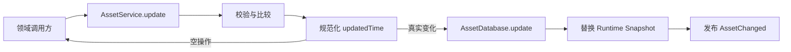

# Asset 统一更新入口与更新时间设计

> 状态：已确认，待实施
>
> 日期：2026-08-01

## 1. 背景

当前 `Asset.lastUsedTime` 的名称与实际产品语义不一致。Project 页面把它展示为
资料的最近时间，但现有代码只在创建 Asset 时赋值，打开、保存、重命名、重定位和
未来 Attachment 变更都没有形成统一规则。

Asset 更新入口也尚未完全收敛：

- 重命名经过 `AssetService.update()`；
- 重定位直接调用 `AssetDatabase.updateContentRef()`；
- Workbench 保存正文只调用 `ContentHandle.writeBytes()`；
- 文件系统检查只更新运行时 Availability，不同步文件修改时间；
- Attachment 目前尚未实现真实 CRUD，未来也可能形成另一条写入路径。

这会让更新时间失真，也会使 Renderer、Workbench 和未来 Attachment 各自承担一部分
Asset 元数据维护责任。

## 2. 目标

- 把 `lastUsedTime` 重命名为 `updatedTime`，只维护一个 Asset 更新时间。
- 让 `AssetService.update()` 成为已有 Asset 持久化字段变更的唯一领域入口。
- 重命名、重定位、Workbench 正文保存和未来 Attachment 变更自动更新时间。
- 在加载、刷新和内容解析时，根据文件系统修改时间修复外部修改造成的时间漂移。
- 让具体 Workbench Provider、Content Resolver 和未来 Attachment 实现不感知更新时间
  规则。
- Main 更新后主动把 authoritative Asset Snapshot 投影到 Renderer，使左右 Asset 列表
  立即更新排序和相对时间。
- 保持 Asset 纯数据、Database 无状态、Service 负责编排的现有架构。

## 3. 非目标

本轮不实现：

- 真实 Attachment 表、Service 和 CRUD；
- 文件系统常驻 Watcher；
- Project 级更新时间；
- Asset 内容 Revision 的持久化；
- 用两个字段分别表达“最近使用”和“最近修改”；
- 因滚动、翻页、播放、打开或选区变化而更新时间。

## 4. 语义定义

`updatedTime` 表示 Asset 聚合最近一次可持久化的有效变化时间，包括：

- Asset 名称变化；
- `contentRef` 变化；
- Workbench 成功保存真实正文；
- 外部程序修改 Asset 文件，并在应用下次加载、刷新或解析内容时被观察到；
- 未来 Attachment 的创建、更新和删除；
- AssetReference 与 AssetLink 的创建和删除；
- 未来其他被定义为 Asset 聚合组成部分的数据变化。

以下操作不更新时间：

- 只打开或阅读 Asset；
- PDF 页码、滚动位置、缩放、音视频进度等 Workbench State；
- Availability 检查本身；
- Workbench 恢复快照写入，但尚未保存到真实 Asset 正文；
- 仅生成可重建的 Artifact；
- 名称或 ContentRef 与现值相同的空操作。

`createdTime` 保持不变。新建 Asset 时 `createdTime === updatedTime`。

## 5. 方案选择

### 5.1 各调用方手动更新时间

Workbench、重定位、Attachment 和文件刷新分别调用数据库或传入时间。实现简单，
但规则会快速散落；新增 Workbench 或 Attachment 类型时很容易遗漏。

### 5.2 独立 ChangeRecorder 维护时间

单独建立全局 Recorder/Event Bus，监听各种行为并回写 Asset。该方案解耦较强，但会
形成与 `AssetService.update()` 并列的第二套修改模型，带来事件顺序、失败恢复和
重复类型定义。

### 5.3 AssetService 唯一更新入口，上层装饰器自动汇合

本设计选择该方案。

- 所有已有 Asset 的持久化字段变化最终经过 `AssetService.update()`；
- `AssetDatabase` 只保存已经规范化的纯数据；
- 正文仍由 `ContentHandle` 写入，成功后由 AssetService 装配的跟踪 Handle 自动回报；
- 未来 Attachment 仍由 AttachmentService 保存，成功后由组合层装饰器自动回报；
- 不新增与 AssetService 平行的有状态 Recorder。

这里的“唯一入口”只约束已有 Asset 的持久化字段，不包含创建、删除和首次加载，也
不要求 AssetService 亲自写正文、Attachment、Workbench State 或运行时状态。

## 6. 数据模型与迁移

共享 `Asset`、Main `AssetInput`、SQLite Schema、IPC 校验和 Renderer 投影统一改为：

```ts
interface Asset {
  readonly id: string;
  readonly projectId: string;
  readonly name: string;
  readonly mediaType: string;
  readonly creationKind: AssetCreationKind;
  readonly contentRef: AssetContentRef;
  readonly createdTime: number;
  readonly updatedTime: number;
}
```

SQLite 增加连续迁移，把 `assets.last_used_time` 原位重命名为
`assets.updated_time`，保留所有已有数值。Fresh Database 仍按历史迁移顺序创建旧列，
最后由新迁移收敛到当前 Schema，确保升级和全新安装走同一条路径。

所有 Shared Clone、Guard、测试 Fixture、排序和相对时间展示同步使用
`updatedTime`。不保留兼容别名，避免开发阶段形成两种名称。

## 7. 统一更新契约

Main 领域层只定义一份更新输入：

```ts
export type AssetUpdateTiming =
  | { readonly mode: 'now' }
  | {
      readonly mode: 'observed';
      readonly observedTime: number;
    };

export interface UpdateAssetInput {
  readonly name?: string;
  readonly contentRef?: AssetContentRef;
  readonly updatedTime?: AssetUpdateTiming;
}

export interface AssetServiceUpdateOptions {
  readonly contentStatus?: AssetContentStatus;
}
```

规则如下：

- 名称或 ContentRef 发生真实变化时，即使调用方没有传 `updatedTime`，Service 也自动
  采用 `now`；
- Workbench 正文保存成功后只传 `{ updatedTime: { mode: 'now' } }`；
- 文件系统检查使用 `{ mode: 'observed', observedTime: mtimeMs }`；
- 同值名称、同值 ContentRef 和不前进的观察时间属于空操作；
- 空操作不写数据库、不替换 Runtime Snapshot，也不发布事件；
- `contentStatus` 是 Relink 和 Refresh 提交已解析运行时结果的可选上下文，不进入
  SQLite，也不属于 `AssetUpdatePort`；
- IPC 不向 Renderer 开放任意修改 `contentRef` 或 `updatedTime` 的能力，现有重命名
  Request 仍只接受名称。

如果未来组合层需要窄接口，使用以下端口直接委托 AssetService，而不复制另一套输入
类型：

```ts
interface AssetUpdatePort {
  update(
    assetId: string,
    input: UpdateAssetInput,
  ): AssetSnapshot;
}
```

### 7.1 时间规范化

Service 持有可注入的 `clock.now()`，按以下规则产生单调、不超前的时间：

```text
now = clock.now()
candidate = now 模式 ? now : min(observedTime, now)
nextUpdatedTime = max(current.updatedTime, candidate)
```

- `observedTime` 必须是合法 Unix 毫秒；
- 未来时间被截断到当前时间，避免错误文件时间污染排序；
- 时间永不倒退；
- 名称或 ContentRef 真实变化时，数据变化仍然提交，即使同一毫秒内时间没有前进。

### 7.2 Database 边界

`AssetDatabase.update()` 接受 Service 已规范化的持久化输入：

```ts
interface PersistAssetUpdateInput {
  readonly name?: string;
  readonly contentRef?: AssetContentRef;
  readonly updatedTime?: number;
}
```

Database 只负责字段白名单、值形状、Project/Asset 归属和 SQLite 写入，不解释
`now`、文件修改时间或业务事件。现有 `updateContentRef()` 删除，其能力合并到通用
`update()`。媒体类型兼容和 Relink 业务校验继续属于 AssetService。

## 8. AssetService 更新流水线



提交顺序固定为：

1. 验证当前 Project 和 Asset；
2. 比较名称与 ContentRef 是否真实变化；
3. 规范化时间；
4. 存在持久化字段变化时写入 SQLite；
5. 用数据库结果和 `options.contentStatus ?? current.contentStatus` 构造新 Snapshot；
6. 替换 Runtime Map；
7. 发布完整 authoritative Snapshot；
8. 返回克隆后的 Snapshot。

只有 `contentStatus` 发生变化时不触碰 SQLite，但仍替换 Runtime Snapshot 并发布
事件。数据库写入失败时不更新 Runtime Map，也不发布事件。事件监听器失败不得回滚
已经成功的领域写入。

异步刷新、解析或 Relink 在等待文件系统期间必须保留开始时的 Asset Snapshot 身份；
提交前若该 Asset 已被另一操作替换，则丢弃过期结果或重新基于最新 Snapshot 合并，
不能用旧 Snapshot 覆盖新的名称、ContentRef 或 `updatedTime`。

## 9. 正文写入自动跟踪

`LocalFileContentHandle` 保持只负责本地文件读写、Revision 检查和原子替换，不导入
AssetService。

AssetService 在 `resolveContent()` 返回前，对具有 `writeBytes` 能力的 Handle 包装
通用 `TrackedContentHandle`：

```text
Workbench Provider
  -> TrackedContentHandle.writeBytes
       -> 原始 ContentHandle.writeBytes
       -> 写入成功
       -> AssetService.update(assetId, { updatedTime: { mode: "now" } })
       -> 返回原始写入结果
```

`TrackedContentHandle` 位于 Content 层，只接收 `onDidWrite` 回调，不依赖
AssetService。它透明转发 Capabilities、读取、流和关闭行为。具体 Plain Text、
Markdown 以及未来可编辑 Workbench 无需添加时间维护代码。

正文写入失败时不更新时间。正文已成功写入、但更新时间同步失败时：

- 保留并返回正文写入成功结果，不能向用户误报“保存失败”；
- Main 记录带 Asset ID 的警告；
- 不发布虚假的新 Snapshot；
- 后续加载、刷新或内容解析根据文件 `mtimeMs` 自动修复。

## 10. 文件系统观察时间

`LocalFileContentInspection` 增加仅 Main 可见的可选 `modifiedTime`。只有成功识别为可
访问普通文件时才返回 `Stats.mtimeMs`；Missing、Inaccessible 和 Invalid 不提供该
值。

以下入口在获得可用内容后执行最佳努力同步：

- `loadFromProject()`；
- `refresh()`；
- `refreshAll()`；
- `resolveContent()`。

同步调用统一更新契约的 `observed` 模式。文件时间没有前进时不会发生数据库写入，
因此普通打开不会被错误记录成“最近修改”。本轮不增加常驻 Watcher；外部修改会在
用户重新进入 Project、刷新资料或再次打开内容时被发现。

`loadFromProject()` 先按现有规则原子提交活动 Project 和 Runtime Map，再对观察时间
做最佳努力收敛。单个时间同步失败不阻止 Project 加载，Runtime 保留数据库中的旧值
并记录警告。

## 11. Relink 与直接修改

Relink 保持现有流程：

```text
选择新文件
→ 解析 ContentRef
→ 检查 Availability
→ 验证媒体类型兼容
→ AssetService.update({ contentRef }, { contentStatus })
→ 自动使用 now 更新时间
→ 一次性提交带新内容状态的 Runtime Snapshot
```

Relink 不再调用 `AssetDatabase.updateContentRef()`。重命名继续调用
`AssetService.update({ name })`，并由 Service 自动更新时间。调用方不显式传时间。
这样 Relink 不会先发布“新 ContentRef + 旧 ContentStatus”的中间状态。

## 12. Attachment 与 Asset Association 扩展边界

当前实现已按以下边界接入，完整关系语义见
[Asset 聚合关系变化与更新时间设计](./2026-08-30-asset-aggregate-mutation-updated-time-design.md)：

- 具体 AttachmentService 只负责 Attachment 数据和正文；
- AttachmentService 与 AssetAssociationService 在真实 mutation 提交后发布统一
  `AssetAggregateMutation`；
- Bootstrap 组合层通过 `trackAssetAggregateMutations()` 连接同一
  `AssetAggregateTouchPort`；
- Attachment Create、Update、Delete 以及 Reference/Link Create、Delete 成功后推进
  owner Asset；
- 查询操作不更新时间；
- Workbench Provider 不需要知道 Attachment 变更会影响 Asset 时间。

如果未来聚合子实体和 Asset 时间位于同一个 SQLite 事务边界，则由上层
领域 Service 把两者放入同一事务；本轮不扩展跨实体事务。

## 13. Main 到 Renderer 的主动投影

Workbench 保存发生在通用命令通道中，Project 页的 Asset 列表不能依赖用户重新加载
才能更新。AssetService 因此增加进程内订阅，并在成功替换 Runtime Snapshot 后发布：

```ts
interface AssetChangedEvent {
  readonly projectId: string;
  readonly asset: AssetSnapshot;
}
```

Main IPC 将事件发送给窗口；Preload 暴露白名单 `onAssetChanged(listener)`。Renderer
的 Project Asset Hook：

- 在页面生命周期内订阅；
- 只接受当前 `projectId` 的事件；
- 按 Asset ID 替换本地 Snapshot；
- 继续由现有投影按 `creationKind` 分栏、按 `updatedTime` 排序；
- 页面卸载时取消订阅。

事件携带完整 authoritative Snapshot，不传 Patch，避免 Renderer 重复领域合并规则。
重复收到与 IPC 返回相同的 Snapshot 是幂等操作。`updatedTime` 变化不能触发当前
Workbench 关闭或重新打开；Workbench 身份仍只由 Asset ID、媒体类型和现有内容生命
周期决定。

## 14. 错误与恢复

| 场景 | 行为 |
| --- | --- |
| 重命名或 Relink 的数据库写入失败 | 整个操作失败，Runtime 和 Renderer 不变 |
| 正文写入失败 | 不更新时间，向上返回原保存错误 |
| 正文成功但时间同步失败 | 保存保持成功，记录警告，等待 mtime 修复 |
| 外部 mtime 同步失败 | 加载、刷新或打开继续，记录警告 |
| 事件发送或监听失败 | 不回滚领域写入，Renderer 下次完整加载修复 |
| Project 已切换 | 拒绝旧 Project 更新，不写数据库 |
| 异步结果已过期 | 不覆盖较新的 Runtime Snapshot |
| 文件时间位于未来 | 截断到当前时间 |
| 文件时间早于当前 updatedTime | 保持当前时间，不倒退 |

## 15. 测试与验收

### 15.1 Shared 与数据库

- Asset Guard、Clone 和 Snapshot 全面使用 `updatedTime`；
- 迁移保留原 `last_used_time` 数值并产生 `updated_time`；
- Fresh Database 与旧版本数据库都迁移成功；
- Database 通用 Update 支持名称、ContentRef 和规范化时间；
- 非白名单字段、非法 ContentRef 和空持久化输入被拒绝；
- `updateContentRef()` 不再存在。

### 15.2 AssetService

- 重命名与 Relink 真实变化自动更新时间；
- 同值更新不写数据库、不替换 Map、不发事件；
- `observedTime` 被未来时间截断且永不倒退；
- 数据库失败时 Runtime Map 不变化；
- 过期 Refresh/Resolve 结果不会覆盖较新 Snapshot；
- 订阅只在成功提交后获得完整 Snapshot；
- Project 切换后旧写入回报被拒绝。

### 15.3 Content

- Tracked Handle 透明保留全部原能力；
- `writeBytes` 成功后只触发一次更新时间；
- 写入失败不触发更新时间；
- 写入成功但回报失败仍返回成功写入结果并记录警告；
- Local File Inspection 只在 Available 时提供 `mtimeMs`。

### 15.4 Renderer 与 IPC

- Preload 过滤非法 Asset Changed Event；
- Project 页忽略其他 Project 的事件；
- 当前 Project 的事件按 ID 替换 Snapshot；
- 左右列表按 `updatedTime` 重新排序并刷新相对时间；
- 时间更新不会重建当前 Workbench；
- 取消订阅后不再更新页面。

### 15.5 回归验收

- 纯文本与 Markdown 保存后，列表时间立即变为 `just now`；
- 重命名和 Relink 后时间立即更新；
- 外部编辑文件后重新进入 Project 或刷新，时间与文件修改时间收敛；
- 只打开、阅读、滚动、翻页和播放不会改变时间；
- `pnpm check` 全部通过；
- `pnpm package` 通过，确认迁移和 Preload 事件未破坏打包产物。
