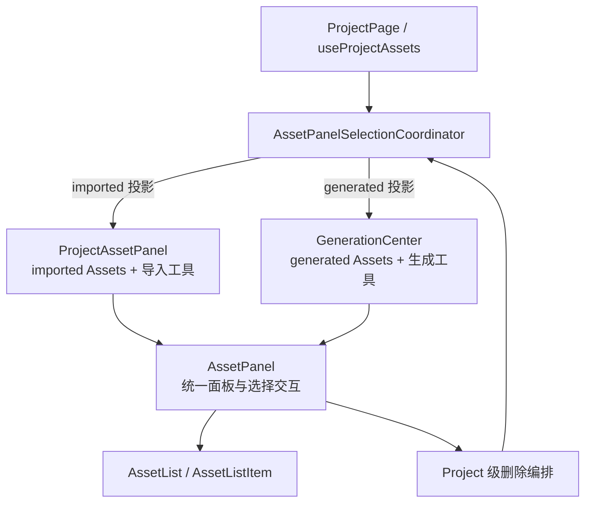

# 左右 Asset 面板选择能力统一设计

> 状态：已实施
>
> 日期：2026-08-02

## 1. 目标

Project 左侧导入资料面板与右侧生成内容面板必须复用同一套 Asset 集合渲染与交互
逻辑。两侧只允许存在以下业务差异：

- 左侧消费 `creationKind === 'imported'` 的 Asset，并提供导入和刷新工具；
- 右侧消费 `creationKind === 'generated'` 的 Asset，并提供通用生成工具和当前
  Workbench 生成工具。

选择入口、选择模式、复选框、全选、已选数量、批量移除、行操作、加载状态、空
状态、排序与动画都属于共享面板能力，不得由左右适配组件分别实现。

## 2. 当前问题

当前 `AssetPanel` 只统一了面板外壳、加载状态、排序与列表渲染。选择状态虽然能传入
共享 `AssetList`，但选择入口、全选工具栏和批量移除仍由 `ProjectAssetPanel` 单独
渲染；`GenerationCenter` 没有相同能力。

同时，`useProjectAssets` 只对 imported Asset 创建选择状态，批量移除完成后的
`exit()` 与部分失败后的 `replace()` 也直接引用该左侧选择实例。这使共享组件停留在
视觉复用，而没有达到行为统一。

## 3. 选择协调器

Project 会话只维护一个 Project-scoped 选择协调器：

```ts
type AssetSelectionScope = 'imported' | 'generated';

interface AssetPanelSelectionCoordinator {
  readonly activeScope: AssetSelectionScope | null;
  readonly selectedAssetIds: ReadonlySet<string>;

  enter(scope: AssetSelectionScope): void;
  exit(scope: AssetSelectionScope): void;
  toggle(scope: AssetSelectionScope, assetId: string): void;
  toggleAll(
    scope: AssetSelectionScope,
    assets: readonly AssetSnapshot[],
  ): void;
  replace(
    scope: AssetSelectionScope,
    assetIds: readonly string[],
  ): void;
  clear(): void;
}
```

具体命名可以在实施时根据现有 Hook 约定调整，但以下语义不可改变：

- 同一时间最多只有一个活动 Scope；
- `enter(scope)` 原子地清空旧选择并切换到新 Scope；
- `exit`、`toggle`、`toggleAll` 和 `replace` 只接受当前活动 Scope，来自旧面板的
  过期调用直接忽略；
- 左右面板互不引用，也不通过回调命令另一侧退出；
- 协调器只认识 Scope、Asset ID 和调用方提供的 Asset 集合，不认识左栏、右栏或
  Generation Center；
- 面板响应式收起不清空选择；
- 切换 Project 时清空 Scope 和选择；
- 不属于当前 Scope Asset 集合的 ID 会从只读投影中自动过滤。

## 4. 共享 AssetPanel 契约

`AssetPanel` 接收一个统一选择模型并负责渲染完整选择交互：

```ts
interface AssetPanelSelectionModel {
  readonly active: boolean;
  readonly selectedAssetIds: ReadonlySet<string>;
  readonly allSelected: boolean;
  readonly selectedCount: number;

  readonly onEnter: () => void;
  readonly onExit: () => void;
  readonly onToggle: (assetId: string) => void;
  readonly onToggleAll: () => void;
  readonly onRemoveSelected: () => void;
}
```

`ProjectAssetPanel` 与 `GenerationCenter` 只负责：

- 传入各自过滤后的 `AssetLoadState`；
- 传入由协调器投影出的相同选择模型；
- 注入普通态业务工具和文案；
- 转发共享单项 Asset 操作。

不得在两个适配组件中复制“选择/完成”、全选、数量、批量移除或复选框渲染。

## 5. 交互规则

- 面板标题保持普通标题，不因进入选择模式改名；
- 标题栏右侧在有 Asset 时显示“选择”，进入后显示“完成”和已选数量；
- 左侧添加资料、右侧生成工具在选择模式下都保持显示和可用；
- 共享选择控制条位于 Asset 列表区域，内容为全选/取消全选、已选数量和移除；
- 选择模式下点击 Asset 行切换复选状态；
- 选择模式下隐藏行三点菜单，退出后恢复；
- 从一个 Scope 进入另一个 Scope 时，旧 Scope 立即退出且旧选择清空；
- 选择模式不改变全局 `selectedAssetId`，只有普通模式点击行才打开 Workbench。

## 6. 批量移除

批量移除请求必须记录发起时的 Scope 与 Asset Snapshot：

```text
共享 AssetPanel
→ onRemoveSelected(scope, selectedAssets)
→ Project 删除确认框
→ 必要时关闭当前 Workbench
→ 单次 Main IPC 批量移除
→ 使用 Main 完整 Asset Snapshot 更新页面
```

结果规则：

- 全部成功：退出发起请求的 Scope；
- 部分失败：保持该 Scope 活动，只选择仍存在的失败项；
- 全部失败：保持该 Scope 和原选择；
- 用户取消确认：保持选择不变；
- 单项菜单删除继续复用同一删除流程，但不主动进入选择模式；
- 删除确认和请求进行期间禁用两个面板的选择模式切换；完成后只更新发起请求的
  Scope，来自旧面板的过期回调由协调器忽略；
- Asset 删除后的全局 Workbench 选择修复仍基于完整 Asset 列表，不按 Scope 另造
  逻辑。

## 7. 组件与数据流



## 8. 测试与验收

### 8.1 协调器测试

- imported 进入选择模式；
- generated 进入时原子替换 imported Scope 并清空旧 ID；
- toggle、toggleAll、replace 和 clear；
- Asset 集合变化后过滤失效 ID；
- 非活动 Scope 的过期操作不能修改当前选择。

### 8.2 AssetPanel 契约测试

同一组参数分别由左侧和右侧适配组件传入时，必须验证：

- 都有选择入口；
- 都能进入和退出选择模式；
- 都显示相同的全选、数量和批量移除控件；
- 都在选择模式隐藏行菜单；
- 都在普通模式恢复行菜单；
- 各自普通业务工具在选择模式仍然存在。

### 8.3 删除流程测试

- 左右两类 Asset 均可批量移除；
- 全成功退出正确 Scope；
- 部分失败只保留正确 Scope 的失败项；
- 全失败保持原选择；
- 取消确认保持原选择；
- 删除当前 Workbench Asset 时正确关闭并选择后继 Asset；
- 删除期间的旧请求结果不能覆盖后进入的新 Scope。

### 8.4 回归标准

- 左右面板不得分别实现选择工具栏；
- `GenerationCenter` 不得缺失 `AssetPanelSelectionModel`；
- 未来新增第三种 Asset 集合面板时，只需提供 Scope、Asset 状态和普通业务工具，
  即可获得完整选择能力；
- `pnpm check` 全部通过。

## 9. 非目标

- 不改变 Main 的批量删除 IPC 或 AssetService 删除语义；
- 不允许一次跨 imported/generated 两个 Scope 混合选择；
- 不持久化选择状态到 Settings 或 Workbench State；
- 不在本次改动中实现生成工具或 Mind Map 生成流程；
- 不改变响应式侧栏的展开、覆盖和焦点行为。
