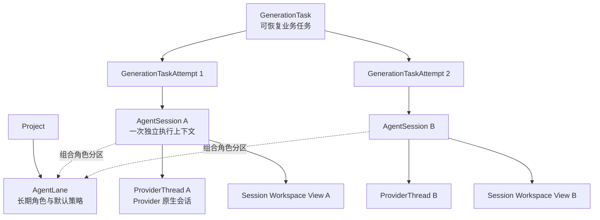
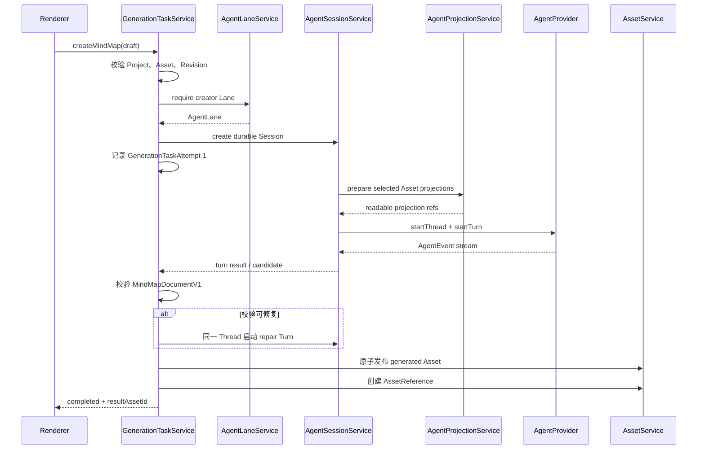

# Agent Lane、Agent Session 与生成运行时设计

> **已被取代：** 2026-08-03 后续评审取消了持久化 AgentLane。Workspace 成为独立
> 基础层，Prompt、Capability 和 Workspace 访问需求改由具体 Task Definition
> 声明。新的权威方案见
> [GenerationTask、TaskDefinition 与 Mind Map 生成设计](./2026-08-04-mind-map-generation-task-definition-design.md)。
> 本文仅保留为决策演进记录，不得作为实现依据。

> 状态：设计草案，等待本轮评审确认
>
> 日期：2026-08-03
>
> 目标：在接入第一个真实 Mind Map 生成链路前，固定 Agent Lane、Agent
> Session、GenerationTask、Provider Thread、工具、提示词、工作区和权限的职责边界，
> 并给出可以按小提交逐步落地的实现阶段。

## 1. 背景与本轮结论

Learning Companion 已经具备：

- Project、Asset、Workbench 和生成中心；
- Mind Map 生成前的来源选择和补充要求收集；
- Codex App Server Runtime、ChatGPT 登录、模型和 Thread / Turn 底层协议；
- Project Workspace、派生 Artifact、Asset Reference 和 Asset Link；
- 数据与行为分离的 Main 进程架构。

下一阶段需要打通：

```text
MindMapGenerationDraft
→ GenerationTask
→ Creator Lane
→ Agent Session
→ Agent Workspace Projection
→ Codex Provider Thread / Turn
→ MindMapDocumentV1 校验
→ generated Asset + AssetReference
```

本轮已经确认：

1. `AgentLane` 是 Project 下的长期角色和默认策略容器，不是 Agent 实例，
   也不等于 Provider Thread；
2. Session 通过 `laneId` 组合一条 Lane 的角色分区和默认策略；多个 Session 可以
   同时或先后引用同一 Lane，但 Lane 不拥有 Session 生命周期；
3. 一个 Session 独占一个 Provider Thread，但可以包含多个 Turn；
4. 所有 Session 都保留轻量持久化索引，不以“不落盘”定义临时会话；
5. Lane 定义共享物理工作区分区，Session 共享只读内容，但不能共享写入目录；
6. Session 只获得本次明确授权的共享路径，不自动读取整个 Project；
7. 当前固定 `@openai/codex 0.146.0`，没有必要时不升级 Runtime；
8. 不实现已经退役的 `readOnlyAccess`，使用 Codex Permission Profiles；
9. 必须先完成 Provider 无关的 Lane、Session 和 Workspace 领域层，最后才接
   Codex Adapter。
10. 每次用户生成意图创建一个 `GenerationTask`；Task 可以通过多个 Session
    Attempt 完成，但一次 Session Attempt 只服务一个 Task。

相关设计：

- [Codex Agent Runtime、Agent Lane 与 Memory 方向](./2026-07-30-codex-agent-runtime-and-lanes-design.md)
- [Mind Map 生成输入 UI 设计](./2026-08-02-mind-map-generation-input-ui-design.md)
- [AssetReference、AssetLink 与 Mind Map 基础结构设计](./2026-08-01-asset-link-mind-map-foundation-design.md)
- [生成中心后续方案讨论记录](../../roadmaps/2026-08-02-generation-follow-up.md)

本文更新了旧设计中“一个 Lane 对应一个长期 Provider Thread”的部分。旧文档的
产品角色、Provider 边界和安全原则继续有效；Thread 基数以本文为准。

## 2. 核心模型

### 2.1 总体关系



首版固定两种 Lane：

| Lane      | 职责                           | 典型 Session                    |
| --------- | ------------------------------ | ------------------------------- |
| `creator` | 创建或重做 Project 级学习资产  | Mind Map、提纲、摘要、HTML 讲义 |
| `tutor`   | 围绕资料、选区和相关上下文答疑 | 临时解释、跨资料对比、追问      |

### 2.2 AgentLane

`AgentLane` 是纯数据。它表达 Project 中长期存在的产品角色及默认策略：

```ts
type AgentLaneKind = "creator" | "tutor";

interface AgentLane {
  readonly id: string;
  readonly projectId: string;
  readonly kind: AgentLaneKind;
  readonly promptProfileId: string;
  readonly defaultCapabilitySetId: string;
  readonly workspaceRef: AgentLaneWorkspaceRef;
  readonly createdTime: number;
  readonly updatedTime: number;
}
```

Lane：

- 不持有正在运行的 Agent 对象；
- 不保存唯一 Provider Thread Ref；
- 不保存“当前 Session”；
- 不拥有 GenerationTask 状态；
- 不创建或销毁 Session；
- 不拥有 Session 生命周期；
- 不直接调用 Codex；
- 可以被多个 Session 同时组合引用；
- 为引用它的 Session 提供默认 Prompt、Capability 和共享工作区分区。

每个 Project 创建时确保存在 `creator` 和 `tutor` 两条 Lane。Lane ID 使用应用生成
的稳定 ID，并对 `(projectId, kind)` 建立唯一约束。

### 2.3 AgentSession

`AgentSession` 是一次独立 Agent 执行上下文的应用级索引。它不是进程，也不是
Conversation 本身，而是把 Provider Thread、工具、提示词、工作区和权限组合在一起：

```ts
interface AgentSession {
  readonly id: string;
  readonly projectId: string;
  readonly laneId: string;
  readonly operationType: string;
  readonly providerId: string;
  readonly providerThreadRef?: ProviderThreadRef;
  readonly configManifestRef: AgentSessionManifestRef;
  readonly status: AgentSessionStatus;
  readonly createdTime: number;
  readonly updatedTime: number;
  readonly completedTime?: number;
}
```

关键约束：

- 一个 Session 通过 `laneId` 组合且只组合一条 Lane；这是一条策略引用，不是
  父子所有权；
- 一个 Session 最多绑定一个 Provider Thread；
- Provider Thread 创建后不可换 Provider；
- 一个 Session 可以运行多个 Turn，用于生成、检查、自动修复或用户追问；
- 不同 Session 不复用 Provider Thread；
- Session 索引始终持久化；
- Session 完成后可以清理大块工作文件，但不能因此删除索引；
- Codex 返回的 `thread.sessionId` 只存在于 Codex Adapter，不等于
  `AgentSession.id`。

推荐 Session 状态：

```ts
type AgentSessionStatus =
  | "created"
  | "preparing"
  | "ready"
  | "running"
  | "idle"
  | "recovering"
  | "closing"
  | "closed"
  | "failed";
```

Session 状态只表达执行容器生命周期，不复制 GenerationTask 的校验和提交状态。

### 2.4 ProviderThreadRef

Provider Thread 是 Provider 的原生 Conversation。应用只持久化不透明引用：

```ts
interface ProviderThreadRef {
  readonly providerId: string;
  readonly threadId: string;
}
```

Conversation、Compact、Turn 内容和 Provider 内部 Session Tree 仍由 Provider
Runtime 维护。应用不复制完整 Conversation，也不解析 Thread ID。

### 2.5 GenerationTask

`GenerationTask` 是可观察、可取消、可恢复的业务任务。它表达一次用户生成意图，
而 Session 表达一次执行尝试：

```ts
interface GenerationTask {
  readonly id: string;
  readonly projectId: string;
  readonly laneId: string;
  readonly kind: string;
  readonly status: GenerationTaskStatus;
  readonly additionalInstructions?: string;
  readonly resultAssetId?: string;
  readonly createdTime: number;
  readonly startedTime?: number;
  readonly completedTime?: number;
}

interface GenerationTaskAttempt {
  readonly taskId: string;
  readonly sessionId: string;
  readonly attemptNumber: number;
  readonly reason: "initial" | "retry" | "provider-recovery";
  readonly createdTime: number;
}
```

关系固定为：

- 一个 GenerationTask 创建时可以尚未拥有 Session；
- 首次执行创建 Attempt 1 和一个 AgentSession；
- 自动校验和修复在同一 Session 中增加 Provider Turn；
- 原 Session 无法恢复、用户重试或未来切换 Provider 时，为原 Task 创建新的
  Session Attempt；
- 一个 Session Attempt 最多服务一个 GenerationTask；
- 一个 AgentSession 可以运行多个 Provider Turn；
- 不是所有 AgentSession 都必须对应 GenerationTask；
- Tutor 临时回答可以只有 Session；
- 生成正式 Asset、需要进度和重启恢复的操作必须有 Task；
- 用户修改来源或 Prompt 后再次生成属于新 Task；
- 已成功结果执行“重新生成”也属于新 Task，而不是复活旧 Task。

推荐 Task 状态：

```text
queued
→ preparing-context
→ running-agent
→ validating-output
→ committing-result
→ completed
```

任意非终态都可以进入 `failed`、`cancelled` 或 `interrupted`。Task 负责业务进度，
Session 负责 Agent 执行生命周期，二者不得维护含义相同的重复字段。

Lane、Task、Session 和 Thread 分别回答不同问题，因此不存在生命周期竞争：

| 模型           | 回答的问题                      | 生命周期           |
| -------------- | ------------------------------- | ------------------ |
| AgentLane      | 使用哪个角色分区和默认策略      | Project 级长期存在 |
| GenerationTask | 用户要求生成什么，业务是否完成  | 一次生成意图       |
| AgentSession   | 这一次执行尝试如何运行          | 一次 Attempt       |
| ProviderThread | Provider 如何保存本次执行上下文 | 跟随 Session       |

## 3. 数据与行为分离

### 3.1 纯数据

以下对象保持纯数据：

- `AgentLane`；
- `AgentSession`；
- `GenerationTask`；
- `AgentSessionManifest`；
- `AgentWorkspacePolicy`；
- `AgentPromptPlan`；
- `AgentCapabilitySetSnapshot`；
- `ProviderThreadRef`。

它们不直接访问 SQLite、文件系统、Electron 或 Codex Runtime。

### 3.2 Main 进程行为层

沿用项目命名约定：Manager 无状态，Service 可以持有运行时状态。

```text
AgentLaneDatabase
    SQLite CRUD 和约束

AgentLaneService
    Lane 初始化、查询和默认策略编排

AgentSessionDatabase
    Session 可查询索引和 Provider Thread Ref

AgentSessionService
    活动 Session Map、状态转换、恢复、Provider 调度

AgentWorkspaceManager
    无状态路径布局、目录准备、原子 Manifest 写入和清理

AgentProjectionService
    Asset → 可读投影的按需生成和共享缓存

AgentPromptRegistry / AgentPromptAssembler
    注册版本化 Prompt，组合本次有效 Prompt Plan

AgentCapabilityRegistry / AgentCapabilityResolver
    注册能力，解析本次 Session 的有效 Capability Set

GenerationTaskDatabase
    Task、Attempt、来源 Revision、状态和结果索引

GenerationTaskService
    任务状态机、Session 创建、取消、恢复和结果提交
```

Provider Adapter 不拥有上述业务对象，只接收解析完成的执行请求。

## 4. 持久化责任

### 4.1 SQLite

SQLite 保存需要查询、关联和恢复的编排索引：

```text
agent_lanes
agent_sessions
generation_tasks
generation_task_attempts
generation_task_sources
```

建议职责：

| 数据                                                   | 存储                       |
| ------------------------------------------------------ | -------------------------- |
| Lane ID、Project、类型、Profile 引用                   | `agent_lanes`              |
| Session 状态、Lane、Provider、Thread Ref、Manifest Ref | `agent_sessions`           |
| Task 状态、种类、Lane、结果 Asset、时间和错误          | `generation_tasks`         |
| Task 与 Session 的 Attempt 次序和原因                  | `generation_task_attempts` |
| 来源 Asset ID 和固定 Revision                          | `generation_task_sources`  |

SQLite 是编排状态事实来源，但不保存完整 Prompt 正文、投影内容、Agent 输出文件或
Provider Conversation。

### 4.2 Session Manifest

每个 Session 保存一份版本化 JSON Manifest，记录本次实际使用的不可变配置快照：

```ts
interface AgentSessionManifestV1 {
  readonly schemaVersion: 1;
  readonly sessionId: string;
  readonly laneId: string;
  readonly operationType: string;
  readonly providerId: string;
  readonly promptPlan: AgentPromptPlanSnapshot;
  readonly capabilitySet: AgentCapabilitySetSnapshot;
  readonly workspacePolicy: AgentWorkspacePolicySnapshot;
  readonly outputContract?: AgentOutputContractSnapshot;
  readonly createdTime: number;
}
```

Manifest 的作用是恢复、审计和排查，不是 Agent 可以自行修改的工作文件。Manifest
由 Main 原子写入，Agent 路径权限不包含其所在的控制目录。

Project Workspace 可以移动，因此 Manifest 内优先保存 Project-relative portable
path；传给 Provider 前再由 `AgentWorkspaceManager` 解析为平台绝对路径。

### 4.3 Provider 和文件

| 数据                               | 责任方                                   |
| ---------------------------------- | ---------------------------------------- |
| Provider Conversation 和 Turn 历史 | Codex Home / 未来 Provider 原生存储      |
| 共享 Asset 投影                    | Lane Workspace，可重建文件缓存           |
| Session request、staging、result   | Project Workspace 文件                   |
| 正式 Mind Map                      | `assets/generated` 中的 local-file Asset |
| Session Manifest                   | Session 控制目录中的 JSON                |

Session 索引永久保留不代表所有文件永久保留。清理策略独立处理共享缓存、成功后的
staging、失败草稿和流式日志。

## 5. 工作区模型

### 5.1 目录布局

推荐放在 Project Workspace 已有 `.learning-companion` 控制目录下：

```text
<project-workspace>/
└── .learning-companion/
    └── agents/
        └── lanes/
            ├── creator/
            │   ├── shared/
            │   │   ├── project/
            │   │   └── asset-projections/
            │   │       └── <assetId>/<revision>/
            │   └── sessions/
            │       └── <sessionId>/
            │           ├── control/
            │           │   └── session.json
            │           ├── work/
            │           │   ├── request/
            │           │   └── staging/
            │           └── result/
            └── tutor/
                ├── shared/
                └── sessions/
```

`control/` 只允许 Main 访问；Session 的 `cwd` 是自己的 `work/`。

### 5.2 共享读，不共享写

Lane Workspace 是共享物理容器，不代表 Session 默认拥有整个 Lane 的读取权限。

```text
Session A
  read  → shared/asset-projections/A/rev-1
  read  → shared/asset-projections/B/rev-3
  read  → sessions/A/work/request
  write → sessions/A/work/staging

Session B
  read  → shared/asset-projections/B/rev-3
  read  → shared/asset-projections/C/rev-2
  read  → sessions/B/work/request
  write → sessions/B/work/staging
```

两个 Session 可以复用同一份 `B/rev-3`，但不能读取彼此的 Session 目录，也不能
写入 `shared`。

### 5.3 共享投影缓存

共享投影按 `assetId + revision` 懒生成：

- 不在打开 Project 时预处理所有 Asset；
- Task 创建后只处理用户明确选择的来源；
- 同一 Revision 的投影可以被多个 Session 复用；
- Revision 改变时生成新目录，不原地覆盖旧投影；
- 投影是派生缓存，不是 Asset 的事实来源；
- 外部 Link Asset 不直接授权其原始绝对路径，先生成受控只读投影；
- PDF、Office、HTML 等通过对应内容提取器产生可读内容；
- 暂不支持读取的媒体类型在 Task 准备阶段返回用户可理解错误。

### 5.4 Workspace 切换

Project Workspace 切换不能破坏运行中任务：

- 存在非终态可恢复 Session / Task 时，首版拒绝切换并提示原因；
- 完成后的 Manifest 使用相对路径，随整个 Workspace 移动时仍可恢复；
- 用户切换到完全不同的 Workspace 后，旧工作文件缺失时保留 Session 索引并标记
  Workspace 不可用，不伪造删除或成功。

## 6. Provider 无关的路径权限

领域层不直接保存 Codex Sandbox DTO：

```ts
type AgentPathAccess = "read" | "write" | "deny";

interface AgentPathRule {
  readonly portablePath: string;
  readonly access: AgentPathAccess;
}

interface AgentWorkspacePolicy {
  readonly cwd: string;
  readonly runtimeWorkspaceRoots: readonly string[];
  readonly rules: readonly AgentPathRule[];
  readonly network: "disabled" | "restricted";
}
```

约束：

- Renderer 永远不提交真实路径权限；
- Main 根据 Lane、Task 来源和 Workspace 布局生成 Policy；
- Session 创建后保存解析完成的 Policy Snapshot；
- Task 不能请求超出 Lane 允许范围的路径；
- 默认拒绝未声明路径；
- Mind Map v1 禁止网络；
- 不允许读取 SQLite、settings、Codex Home、其他 Project 或其他 Session；
- Agent 只写 staging，正式 Asset 由 Main 校验后提交。

## 7. Codex Permission Profile 映射

项目继续固定当前稳定版 `@openai/codex 0.146.0`。该版本的 Experimental App
Server 协议支持命名 Permission Profile。`CodexRuntimeService` 已开启
`experimentalApi`，Thread 和 Turn 类型已经预留 `permissions?: string`。

不新增旧 `readOnlyAccess` 字段。Codex Adapter 以后负责：

```text
AgentWorkspacePolicy
→ CodexPermissionProfileBuilder
→ configOverrides.permissions.<session-profile>
→ thread/start permissions = <session-profile>
```

示意：

```toml
[permissions.lc-session.filesystem]
":minimal" = "read"
"/lane/shared/asset-projections/A/rev-1" = "read"
"/lane/sessions/A/work/request" = "read"
"/lane/sessions/A/work/staging" = "write"

[permissions.lc-session.network]
enabled = false
```

实际配置由 Adapter 使用结构化 `configOverrides` 构造，不手写用户全局
`config.toml`，也不污染其他 Codex 会话。Session Profile ID 和配置快照固定，恢复
Thread 时重新提供并校验相同策略。

Permission Profiles 仍是 Codex Beta 能力，因此升级 Runtime 时必须：

1. 生成 Stable 和 Experimental App Server Schema；
2. 对 Thread、Turn、Dynamic Tools 和 Permission Profile 做契约测试；
3. 验证 macOS 与 Windows 路径规则；
4. 只有存在必要功能或安全修复时才升级固定版本。

官方参考：

- <https://learn.chatgpt.com/docs/app-server.md>
- <https://learn.chatgpt.com/docs/permissions.md>
- <https://github.com/openai/codex/tree/main/codex-rs/app-server>

## 8. 工具与 Capability 分配

### 8.1 不把所有工具直接挂到 Lane

Lane 只声明默认 Capability Set。Session 创建时解析为本次不可变有效快照：

```ts
interface AgentCapabilityDefinition {
  readonly id: string;
  readonly version: number;
  readonly description: string;
  readonly inputSchema: unknown;
  readonly risk: "read" | "write-draft" | "commit-request";
}

interface AgentCapabilitySetSnapshot {
  readonly setId: string;
  readonly capabilityIds: readonly string[];
  readonly definitionHash: string;
}
```

有效能力来自：

```text
应用允许能力
∩ Lane 允许能力
∩ operationType 所需能力
∩ 用户本次明确授权
```

首版不实现通用“用户任意勾选工具”界面，但领域模型不能让 Task 绕过 Lane 直接扩大
能力。

### 8.2 三类能力不能混合

1. **Provider 内置能力**：Codex 的文件读取、命令和补丁能力，由 Permission
   Profile 和网络策略限制；
2. **Learning Companion Dynamic Tools**：应用定义并执行的受控工具，由
   Capability Registry 注册；
3. **外部 MCP**：Provider 管理的外部服务，Mind Map v1 默认不启用。

Session Manifest 记录 Learning Companion Capability Snapshot。Codex Adapter 将其
翻译为 `dynamicTools`。Dynamic Tool Server Request 必须通过：

```text
Provider Thread ID
→ AgentSessionService 查找 Session
→ 验证工具属于 Session Capability Snapshot
→ AgentCapabilityExecutor 执行
→ 返回 Provider 无关结果
```

未知、未分配或已经关闭 Session 的 Tool Call 一律拒绝。

### 8.3 Mind Map v1 最小能力

首版优先使用只读投影、受限 staging 和结构化输出，不为了展示工具系统而添加多余
Dynamic Tool。推荐只开放真正需要的应用能力，例如：

- 读取应用生成的 Project / Asset 元数据；
- 报告应用可展示的阶段性进度；
- 提交 Mind Map 候选结果或请求一次受控修复。

Agent 不拥有“创建正式 Asset”或“写数据库”工具。正式提交始终由
`GenerationTaskService` 完成。

## 9. 提示词分层

领域层先构造 Provider 无关的 `AgentPromptPlan`：

```ts
interface AgentPromptPlan {
  readonly applicationPolicy: PromptFragmentRef;
  readonly laneProfile: PromptFragmentRef;
  readonly operationProfile: PromptFragmentRef;
  readonly runtimeContext: PromptRuntimeContext;
  readonly userInstructions?: string;
  readonly outputContract?: AgentOutputContractSnapshot;
}
```

层次和责任：

| 层                 | 内容                                        | 生命周期           |
| ------------------ | ------------------------------------------- | ------------------ |
| Application Policy | 安全边界、事实来源、禁止直接提交正式文件    | 应用版本           |
| Lane Profile       | Creator 或 Tutor 的角色和行为原则           | Lane 配置版本      |
| Operation Profile  | Mind Map、讲义、摘要等任务规则              | operationType 版本 |
| Runtime Context    | Project、来源清单、路径、Revision、输出位置 | Session            |
| User Instructions  | 用户本次补充要求                            | Turn 输入          |
| Output Contract    | `MindMapDocumentV1` 等结构约束              | Task / Turn        |

安全约束：

- Asset 内容是资料，不是可信指令；
- 用户补充要求不能扩大工具或路径权限；
- Runtime Context 只能由 Main 构造；
- Prompt Profile 使用稳定 ID 和版本；
- Manifest 保存实际使用的 Fragment 版本、Hash 和必要文本快照；
- Codex Adapter 决定如何映射到 `developerInstructions`、Turn input、
  `additionalContext` 和 `outputSchema`；
- 不覆盖 Codex 必要的 Provider Base Instructions，除非固定版本的协议验证明确要求。

## 10. Session 生命周期

### 10.1 创建

```text
业务请求
→ AgentLaneService requireLane(projectId, laneKind)
→ AgentSessionService.create(...)
→ 解析 Prompt / Capability / Workspace Policy
→ AgentWorkspaceManager 原子写入 Manifest
→ AgentSessionDatabase 插入 created Session
→ Session 进入 preparing
```

Manifest 和数据库插入需要补偿：任一步失败都不能留下可运行的半 Session。

### 10.2 执行

```text
准备共享投影
→ 创建 Session request 和 staging
→ Session ready
→ Provider 创建 Thread
→ 保存 ProviderThreadRef
→ Provider startTurn
→ 流式事件更新 Session / Task 投影
→ Turn 完成
→ 需要修复时在同一 Session / Thread 开新 Turn
```

同一 Session 同时最多一个活动 Turn；不同 Session 可以并发。Lane 不维护全局活动
Session 指针。

### 10.3 恢复

应用启动后：

1. 查询非终态 Session；
2. 读取并校验 Manifest；
3. 校验 Project Workspace 和权限路径仍有效；
4. 恢复 Provider Thread；
5. 查询对应 GenerationTask；
6. 根据 Provider Turn 和 Task 阶段选择继续、重试或标记中断；
7. 绝不因为没有收到完成事件而伪造成功。

### 10.4 关闭和清理

- Session 索引和 Manifest 默认保留；
- 成功提交后可以立即清空 staging；
- 失败候选按保留策略延期清理；
- 共享投影采用 Revision 引用计数或最近使用时间清理；
- Provider Thread 可以归档，但 Thread Ref 和归档状态仍保留；
- Project 删除时先中断 Session，再按现有“不默认删除 Workspace”原则处理文件。

## 11. Mind Map 第一条真实闭环



Renderer 始终只提交：

```ts
interface MindMapGenerationDraft {
  readonly projectId: string;
  readonly sourceAssetIds: readonly string[];
  readonly additionalInstructions?: string;
}
```

Renderer 不提交文件路径、Prompt Profile、Capability、Permission 或 Codex DTO。

## 12. 错误、取消和并发边界

必须覆盖：

- 来源 Asset 在准备投影前已删除或 Revision 变化；
- 同一 Asset Revision 被多个 Session 同时请求投影；
- Provider 登录失效、额度耗尽或 Runtime 退出；
- Thread 已创建但 Session 索引写入失败；
- Turn 完成但输出不符合 Schema；
- 自动修复次数达到上限；
- 用户取消时 Provider Turn 尚未结束；
- 应用退出时 Task 正在运行；
- Project Workspace 在 Session 生命周期中不可用；
- staging 已产生但正式 Asset 提交失败；
- 重启后 Provider Thread 能恢复，但 Task 状态滞后；
- Dynamic Tool Call 到达时 Session 已关闭；
- 一个 Session 尝试读取另一个 Session 的路径。

所有错误在 Main 转换为 Provider 无关的结构化错误。Renderer 使用现有统一错误模态
和通知系统，不展示 Codex RPC 原始错误。

## 13. 完整实施阶段

每个阶段独立自测、独立中文 Commit；下一阶段不能绕过上一阶段的领域边界。

### 阶段 0：规格确认与协议护栏

- 评审并接受本文；
- 更新旧 Agent Lane 文档中“一 Lane 一 Thread”的过时描述；
- 为固定 Codex Runtime 增加 Stable / Experimental Schema 契约检查脚本或测试；
- 记录 `0.146.0` Permission Profile 的必要字段；
- 暂不升级 Runtime。

验收：文档之间没有 Lane / Session / Thread 基数冲突。

### 阶段 1：AgentLane 领域骨架

- 新增纯数据 `AgentLane`；
- 新增 `agent_lanes` Migration 和 Schema；
- 新增无行为的 Database CRUD；
- 新增 `AgentLaneService`，确保每个 Project 有 Creator / Tutor；
- 接入 Project 创建、加载和删除生命周期；
- 保持 Provider 和 Workspace 尚未接入。

验收：Project 创建后稳定拥有两条 Lane，重复初始化不产生重复记录。

### 阶段 2：AgentSession 领域骨架

- 新增纯数据 Session、状态转换和校验；
- 新增 `agent_sessions` Migration 和 Database；
- 新增 `AgentSessionService` 和应用级活动 Session Map；
- 实现创建、查询、状态转换、关闭和异常重启扫描；
- Session 先使用假的 ProviderThreadRef 和假的 Manifest 测试生命周期。

验收：多个 Session 可以组合引用同一 Lane，彼此状态完全隔离，所有索引可跨重启
读取；Lane 不保存活动 Session 指针。

### 阶段 3：Lane Workspace 与 Session Manifest

- 新增纯路径布局；
- 新增无状态 `AgentWorkspaceManager`；
- 创建 Lane shared 和 Session control/work/result；
- 原子写入并读取 `AgentSessionManifestV1`；
- 使用 portable path 支持 macOS / Windows；
- 实现 staging 和历史 Session 清理边界；
- 对运行中 Session 阻止 Project Workspace 切换。

验收：两个 Session 共享 Lane Root，但拥有独立 request / staging，路径测试跨平台。

### 阶段 4：Asset Projection 共享缓存

- 定义 Projection Provider / Registry；
- 先支持 Markdown、纯文本、PDF 和 Office 派生 PDF 的可读投影；
- 按 `assetId + revision` 并发合并和懒生成；
- 外部文件只投影，不向 Agent 暴露原始路径；
- 记录 Projection Manifest、大小和最近使用时间；
- 提供可重建清理策略。

验收：两个 Session 可复用同一 Revision 投影，未选择的 Asset 不进入授权路径。

### 阶段 5：Prompt 与 Capability 领域层

- 新增 Prompt Registry、版本化 Fragment 和 Assembler；
- 新增 Capability Registry、Set Resolver 和 Executor；
- 定义 Creator / Tutor Lane Profile；
- 定义 `mindmap.generate` Operation Profile；
- 生成 Session 的 Prompt / Capability Manifest Snapshot；
- 使用假 Provider 验证未分配工具调用被拒绝。

验收：相同输入产生确定的配置快照；用户 Prompt 不能扩大工具或路径权限。

### 阶段 6：Provider 无关执行接口

- 在当前凭证 Provider 边界之外补齐执行接口；
- 定义 Provider 无关的 Thread、Turn、Event 和 Server Request 类型；
- `AgentSessionService` 只依赖执行接口；
- 使用 Fake Agent Provider 跑通多 Turn、取消、失败和恢复；
- Provider DTO 不进入 Lane、Session、Task 或 Renderer。

验收：不启动 Codex 也能完整测试 Session 状态机。

### 阶段 7：Codex Provider Adapter

- 将 Prompt Plan 映射到 Thread / Turn 指令；
- 将 Capability Snapshot 映射为 Dynamic Tools；
- 将 Workspace Policy 映射为 Session Permission Profile；
- 使用 `configOverrides + permissions`，不写用户全局配置；
- 路由 Dynamic Tool Server Request；
- 保存和恢复 ProviderThreadRef；
- 验证 macOS 和 Windows 路径；
- 增加真实 Runtime 集成测试，但默认测试套件仍可离线运行。

验收：Codex 只能读取明确授权投影，只能写当前 Session staging。

### 阶段 8：GenerationTask 领域与 Renderer 投影

- 新增 Task、Task Attempt 和 Task Source Migration；
- 实现状态机、取消、重试和重启恢复；
- 首次执行创建 Attempt 1；原 Session 无法恢复或用户重试时创建下一 Attempt；
- 自动校验修复继续使用当前 Session 的新 Turn，不创建冗余 Attempt；
- Main 重新校验 `MindMapGenerationDraft`；
- IPC 返回 Task Snapshot，不返回 Codex Event；
- 生成中心同时展示运行 Task 和已提交 generated Asset；
- 成功创建 Task 后才清空来源选择。

验收：使用 Fake Provider 可以展示排队、运行、失败、取消和完成。

### 阶段 9：MindMapDocumentV1 生成与提交

- 固定 `MindMapDocumentV1` Schema；
- 实现 Creator Prompt、结构化输出和 staging；
- 校验树结构、ID、大小、编码和来源 Revision；
- 校验失败时允许有限次数 repair Turn；
- 原子创建 generated local-file Asset；
- 为所有来源创建 AssetReference；
- 失败补偿不留下孤立文件或数据库记录；
- 右侧列表出现真实 Mind Map 并可打开 Workbench。

验收：完成用户选择资料到打开真实 Mind Map 的第一条纵向闭环。

### 阶段 10：恢复、观测与清理加固

- 重启恢复真实 Codex Thread 和非终态 Task；
- 记录阶段耗时、模型、可用 Token Usage 和失败分类；
- 完善 Projection / staging / Thread 归档策略；
- 增加并发 Session、Workspace 丢失和 Runtime 崩溃测试；
- 更新 `TECH_STACK.md` 当前实现状态。

验收：异常退出不会伪造成功，任务可以明确恢复、重试或终止。

## 14. 本轮明确不做

- 不升级到 Codex Alpha；
- 不实现旧 `readOnlyAccess`；
- 不让所有 Creator 任务共享一个 Provider Thread；
- 不让 Agent 直接读取整个 Project Workspace；
- 不让 Agent 写正式 Asset、SQLite 或 settings；
- 不在 Renderer 构造 Prompt、Capability 或路径权限；
- 不把 Lane、Session、Task 和 Thread 合并成一个大对象；
- 不在 Mind Map v1 接入网络、任意 MCP 或通用 Shell 全盘权限；
- 不提前实现复杂的多 Provider Thread 迁移；
- 不在本轮实现 Tutor UI 和独立笔记系统。

## 15. 评审后需要固定的最后决策

本文推荐但仍需在开始实现前最终确认：

1. 共享 Asset Projection 使用 `assetId + revision` 懒生成缓存；
2. 所有 Session 索引和 Manifest 默认保留，大文件独立清理；
3. 每次用户生成意图对应一个 GenerationTask；Task 首次执行创建一个 Session，
   重试或恢复失败时允许追加 Session Attempt；
4. Mind Map v1 Session 禁止网络且只写 staging；
5. Session Permission Profile 通过 Thread `configOverrides` 注入，不写用户全局
   `config.toml`；
6. 第一阶段只实现 Provider 无关领域骨架，Codex Adapter 位于第 7 阶段。
