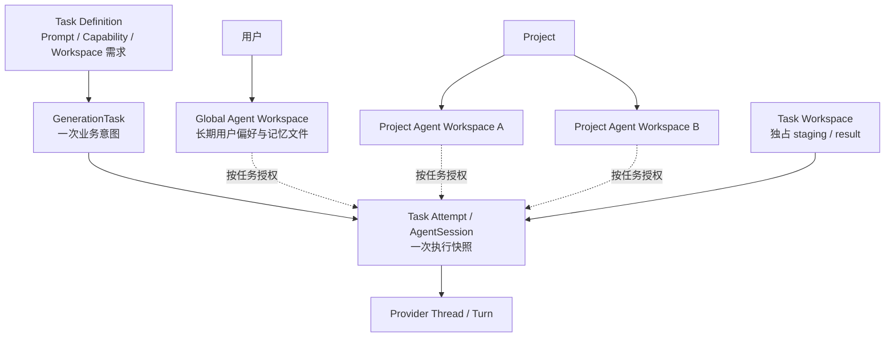

# Agent Workspace 管理设计与实施计划

> 状态：设计草案，等待实施前评审
>
> 日期：2026-08-03
>
> 目标：先完整实现 Provider 无关的 Agent Workspace 管理层，再开始设计
> GenerationTask、AgentSession 和 Codex Adapter。本文取代此前把 AgentLane 作为
> Project 级固定基础实体的方案。

## 1. 背景与结论

此前方案为每个 Project 固定创建 `creator` 和 `tutor` 两条 AgentLane，并让 Lane
同时承载角色、默认 Prompt、Capability 和共享工作区。这会把四个独立变化维度绑在
一起：

- 业务任务需要什么 Prompt；
- 本次执行需要哪些工具；
- 本次执行允许访问哪些路径；
- 多次任务如何复用长期上下文。

新的结论是：

1. 不实现持久化 `AgentLane`，也不为每个 Project 固定创建 Creator / Tutor；
2. 单次 Prompt、Capability 和 Workspace 访问需求由具体 Task Definition 定义；
3. Workspace 本身不声明只读或可写，它只描述身份、范围、位置和生命周期；
4. 执行时解析出的读写权限属于 Attempt / Session 的不可变授权快照；
5. 一个用户拥有一个长期 Global Agent Workspace；
6. 一个 Project 可以拥有零个或多个长期 Project Agent Workspace；
7. 每次 Task Attempt 可以拥有独占的短期 Task Workspace；
8. Agent 修改长期 Workspace 时优先写入 Task staging，再由可信 Main 进程校验和
   原子提交；
9. 先完整落地 Workspace 管理层，不同时搭建 Task、Session 或 Provider 空壳。

## 2. 与现有 Project Workspace 的区别

仓库现有 `ProjectWorkspaceManager` 管理用户 Project 的资料根目录：

```text
Project.workspacePath
├── assets/
├── attachments/
└── .learning-companion/
```

本文新增的 Agent Workspace 是 Agent 可使用的上下文或工作空间：

```text
Global Agent Workspace
Project Agent Workspace 0..N
Task Workspace 0..N
```

二者不能合并：

- Project Workspace 是 Project、Asset 和 Attachment 的文件根；
- Agent Workspace 是 Agent 执行时可被选择和授权的文件空间；
- Project Agent Workspace 可以位于 Project Workspace 的应用元数据目录中；
- Agent 默认看不到整个 Project Workspace；
- Task Definition 只选择需要暴露的 Workspace 或投影内容。

因此保留现有 `ProjectWorkspaceManager`，新增独立的
`AgentWorkspaceManager`。

## 3. 总体关系



Workspace 不知道 Mind Map、Tutor、Codex 或具体工具。后续 Task Definition 负责
声明需要哪些 Workspace；权限解析器负责把合法需求冻结为执行授权。

## 4. 领域模型

### 4.1 长期 AgentWorkspace

`AgentWorkspace` 使用可辨识联合类型，让 Scope 和 `projectId` 的约束直接进入
TypeScript 类型系统，而不是依靠运行时检查一个可选字段：

```ts
interface AgentWorkspaceBase {
  readonly id: string;
  readonly name: string;
  readonly createdTime: number;
  readonly updatedTime: number;
}

interface GlobalAgentWorkspace extends AgentWorkspaceBase {
  readonly scope: 'global';
}

interface ProjectAgentWorkspace extends AgentWorkspaceBase {
  readonly scope: 'project';
  readonly projectId: string;
}

type AgentWorkspace =
  | GlobalAgentWorkspace
  | ProjectAgentWorkspace;
```

约束：

- `global` 类型没有 `projectId`；
- `project` 类型必须拥有 `projectId`；
- 当前每个用户只有一个 Global Workspace；
- 每个 Project 可以有多个 Project Agent Workspace；
- `AgentWorkspace` 不包含 `access`、Prompt、Capability、Provider 或 Thread；
- Workspace 名称可修改，但 ID 和 Scope 不可修改；
- Project Workspace 切换不改变 Agent Workspace ID。

### 4.2 运行时路径解析输入

`AgentWorkspace` 不保存绝对路径，也不再增加与 `scope/id` 重复的位置引用对象。
Global Workspace 的绝对根来自 Settings；Project Agent Workspace 的绝对路径由当前
`Project.workspacePath` 和 `workspace.id` 派生。

调用方必须通过与 Workspace 类型对应的输入提供当前设备路径：

```ts
type ResolveAgentWorkspaceContentRootInput =
  | {
      readonly workspace: GlobalAgentWorkspace;
      readonly globalWorkspacePath: string;
    }
  | {
      readonly workspace: ProjectAgentWorkspace;
      readonly projectWorkspacePath: string;
      readonly expectedProjectId: string;
    };
```

`expectedProjectId` 是调用现场独立提供的安全断言，用于阻止调用方把某个 Project 的
Workspace 放到另一个 Project 根目录解析；它不是持久化字段的第二份副本。

因此类型层面只有“Global 且没有 `projectId`”和“Project 且必须有
`projectId`”两种有效组合，不存在需要相互同步的第二套位置字段。

### 4.3 TaskWorkspaceHandle

Task Workspace 是执行目录，不进入长期 Workspace 列表：

```ts
interface TaskWorkspaceHandle {
  readonly projectId: string;
  readonly taskId: string;
  readonly attemptId: string;
  readonly rootPath: string;
  readonly controlPath: string;
  readonly requestPath: string;
  readonly stagingPath: string;
  readonly resultPath: string;
}
```

它由 `projectId + taskId + attemptId` 唯一派生，表示 Manager 已经准备并校验过的
当前进程运行时句柄，不持久化为长期 Workspace。Task 和 Attempt 领域层以后保存
生命周期索引；Workspace Manager 只负责目录准备、检查和清理。

Handle 中的 ID 用于审计和清理前重新校验，绝对路径是本次解析结果；它们只在当前
进程中同时存在，不构成两个持久化事实来源。任何破坏性清理仍须根据 ID 和 Project
根重新验证 `rootPath`，不能只相信 Handle 中传入的字符串。

### 4.4 权限不属于 Workspace

下面的类型属于未来执行协议，不进入 `AgentWorkspace`：

```ts
interface AgentWorkspaceGrant {
  readonly workspaceId: string;
  readonly access: 'read' | 'read-write';
  readonly allowedPaths: readonly string[];
}
```

未来链路为：

```text
Task Definition 声明 Workspace Requirement
→ Main 校验 Task 是否有权提出该 Requirement
→ 解析为 AgentWorkspaceGrant
→ Attempt / Session Manifest 冻结 Grant
→ Provider Adapter 映射到 Provider 权限
```

Workspace Manager 只验证路径是否属于目标 Workspace，不判断业务任务是否有权调用。

## 5. 文件布局

### 5.1 Global Agent Workspace

默认位置：

```text
<Documents>/Learning Companion/Global Workspace/
├── content/
└── .learning-companion/
    └── workspace.json
```

新增 Settings 字段：

```ts
readonly globalAgentWorkspacePath: string;
```

`content/` 是未来可授权给 Agent 的内容根；`.learning-companion/` 是 Main 管理的
控制区，不能作为普通 Agent 写入根。

本阶段不预设 `memory/`、`preferences/` 等业务目录。Memory 功能实现时再在
`content/` 下定义自己的文件契约，避免 Workspace 基础层理解业务含义。

### 5.2 Project Agent Workspace

```text
<Project.workspacePath>/
└── .learning-companion/
    └── agent-workspaces/
        └── <workspaceId>/
            ├── content/
            └── workspace.json
```

Agent 可以被授权访问 `content/`，不能直接修改 `workspace.json`。

Project Agent Workspace 位于 Project Workspace 内，因此：

- Project Workspace 移动后仍能一起迁移；
- Project Workspace 切换后用同一 Workspace ID 在新根目录重新解析；
- 旧根目录不会被自动删除或迁移；
- 缺失 Workspace 必须报告状态，不能悄悄在错误位置重建已有内容。

### 5.3 Task Workspace

```text
<Project.workspacePath>/
└── .learning-companion/
    └── agent-tasks/
        └── <taskId>/
            └── attempts/
                └── <attemptId>/
                    ├── control/
                    │   └── manifest.json
                    ├── request/
                    ├── staging/
                    └── result/
```

- `control/` 仅由 Main 写入；
- `request/` 保存本次输入投影；
- `staging/` 保存 Agent 提议的修改；
- `result/` 保存结构化生成结果；
- Task 完成后是否清理由未来 Task 生命周期决定；
- Manager 的清理接口必须接收解析完成的显式布局，不能接受宽泛目录或未校验 glob。

## 6. Marker 与事实来源

### 6.1 WorkspaceMarkerV1

```ts
type AgentWorkspaceMarkerV1 = AgentWorkspace & {
  readonly schemaVersion: 1;
};
```

Marker 直接复用领域数据结构，只增加序列化版本，不再复制一套 `id/scope/projectId`
字段声明。反序列化仍须在运行时验证联合类型约束，不能把未经检查的 JSON 直接断言
为该类型。

长期 Agent Workspace 的 Marker 文件是 Workspace 元数据事实来源。本阶段不新增
SQLite `agent_workspaces` 表：

- Workspace 数量预计很小，目录扫描成本可忽略；
- 文件随 Workspace 移动，更符合本地优先和可迁移性；
- Agent 无权修改控制区 Marker；
- 未来如果需要搜索和统计，可建立可重建的 SQLite 索引，但不能反转事实来源。

Marker 使用临时文件、`fsync` 和同目录原子替换写入；解析失败、Schema 不支持、
Scope/Project 不匹配时返回结构化不可用状态，不能覆盖原 Marker。

### 6.2 Task Manifest

Task Manifest 只由 Main 写入，记录路径和执行配置快照。具体 Schema 随 Task / Session
层设计；Workspace Manager 本阶段只提供原子 JSON 文件能力，不提前定义 Provider
字段。

## 7. AgentWorkspaceManager

Manager 无状态，不维护当前 Project、当前 Task 或权限缓存：

```ts
interface AgentWorkspaceManagerApi {
  prepareGlobalWorkspace(
    input: PrepareGlobalAgentWorkspaceInput,
  ): Promise<GlobalAgentWorkspace>;

  inspectGlobalWorkspace(
    globalWorkspacePath: string,
  ): Promise<AgentWorkspaceInspection>;

  listProjectWorkspaces(
    projectId: string,
    projectWorkspacePath: string,
  ): Promise<readonly ProjectAgentWorkspace[]>;

  createProjectWorkspace(
    input: CreateProjectAgentWorkspaceInput,
  ): Promise<ProjectAgentWorkspace>;

  inspectProjectWorkspace(
    input: InspectProjectAgentWorkspaceInput,
  ): Promise<AgentWorkspaceInspection>;

  renameProjectWorkspace(
    input: RenameProjectAgentWorkspaceInput,
  ): Promise<ProjectAgentWorkspace>;

  resolveContentRoot(
    input: ResolveAgentWorkspaceContentRootInput,
  ): string;

  prepareTaskWorkspace(
    input: PrepareTaskWorkspaceInput,
  ): Promise<TaskWorkspaceHandle>;

  writeTaskManifest(
    workspace: TaskWorkspaceHandle,
    manifest: unknown,
  ): Promise<void>;

  cleanupTaskWorkspace(
    workspace: TaskWorkspaceHandle,
  ): Promise<void>;
}
```

本阶段不提供宽泛的 `writeFile(workspaceId, path, data)`。普通文件读写以后通过经过
授权的投影、Task 或 Provider 适配层完成，避免 Workspace Manager 变成绕过领域
边界的万能文件服务。

## 8. 长期 Workspace 生命周期

### 8.1 Global Workspace

应用启动时：

```text
读取 settings.globalAgentWorkspacePath
→ 检查目录和 Marker
→ 首次运行时创建目录、content 和 Marker
→ 已存在但 Marker 非法时记录警告并标记不可用
```

不能为了“自动修复”覆盖用户已有的未知目录。Global Workspace 路径迁移属于独立
设置功能，本阶段只保留可替换路径契约，不实现迁移 UI。

### 8.2 Project Agent Workspace

Project 创建时不固定创建 Agent Workspace。具体 Task 或未来 UI 明确需要时才创建。

创建过程：

```text
校验 Project 与 Project Workspace
→ 生成 Workspace ID
→ 在临时目录创建 content 和 Marker
→ 原子重命名为 <workspaceId>
→ 返回不可变 AgentWorkspace
```

删除长期 Project Agent Workspace 暂不进入首轮接口。它涉及引用检查、Task 历史和
用户文件回收策略，应在真实消费者出现后单独设计；当前不会因为 Project 数据库记录
删除而主动删除这些文件。

### 8.3 Project Workspace 切换

Agent Workspace 通过 Project 当前路径动态解析，不在 Settings 或 SQLite 复制绝对
路径。切换 Project Workspace 后：

- 对新根重新扫描 Marker；
- 同 ID Workspace 存在且 Marker 匹配时正常加载；
- 不存在时报告 `missing`；
- 不从旧根自动复制；
- 旧根内容保持不变。

## 9. Staging 与长期内容提交

Workspace 本身不定义读写权限。未来某个 Task 可以被授权更新 Global 或 Project
Workspace，但推荐采用：

```text
Agent 写 Task Workspace/staging
→ Task Handler 解析变更清单
→ 校验相对路径、文件类型、大小和当前 Revision
→ 生成备份或恢复记录
→ Main 原子提交到长期 Workspace/content
→ GenerationTask 记录结果
```

通用提交需要独立的 `WorkspaceChangeSet` 设计，不在首轮 Workspace Manager 中提前
实现。原因是变更授权、Revision 和业务校验必须由首个真实写入 Task 驱动，不能先造
一个没有消费者约束的万能提交 API。

首轮只保证 Task staging 的目录隔离、Manifest 原子写入和安全清理。

## 10. 错误和安全边界

至少覆盖：

- 路径必须是绝对目录且不能是文件系统根；
- portable 相对路径不能通过 `..`、分隔符差异或符号链接逃逸；
- Workspace ID、Project ID、Task ID 和 Attempt ID 必须经过严格校验；
- Project Marker 的 `projectId` 必须与调用上下文一致；
- Global Marker 不能伪装成 Project Workspace；
- Marker 无法解析时不能自动覆盖；
- Manager 不接收 Provider DTO；
- Renderer 不获得 Workspace 绝对路径；
- Agent 只能看到后续 Grant 显式暴露的内容根；
- 清理只能删除已经验证且位于 `agent-tasks/<taskId>/attempts/<attemptId>` 的目录；
- 所有文件写入使用临时文件和同目录原子替换。

建议新增 Workspace 专用 AppError：

```text
AGENT_WORKSPACE_NOT_FOUND
AGENT_WORKSPACE_UNAVAILABLE
AGENT_WORKSPACE_MARKER_INVALID
AGENT_WORKSPACE_CONTEXT_MISMATCH
AGENT_TASK_WORKSPACE_CONFLICT
```

它们先只存在于 Main；出现 UI 消费者后再补 Renderer 映射。

## 11. 模块结构

```text
src/main/agents/workspaces/
├── agent-workspace.ts
├── agent-workspace-marker.ts
├── agent-workspace-paths.ts
├── agent-workspace-manager.ts
├── agent-workspace.test.ts
├── agent-workspace-marker.test.ts
├── agent-workspace-paths.test.ts
└── agent-workspace-manager.test.ts
```

- `agent-workspace.ts`：纯数据、校验和克隆；
- `agent-workspace-marker.ts`：Marker V1 序列化、反序列化和版本校验；
- `agent-workspace-paths.ts`：无 I/O 的跨平台路径派生和包含关系检查；
- `agent-workspace-manager.ts`：无状态文件系统操作和原子 Marker / Manifest 写入。

本阶段不新增：

```text
AgentWorkspaceDatabase
AgentWorkspaceService
AgentLane
AgentSession
GenerationTask
Provider Adapter
Renderer IPC
```

## 12. 实施顺序

本轮所有提交都只属于 Workspace 层；每一步都产生可测试的真实能力，不创建后续层
空壳。

### 提交 1：纯数据、Marker 与路径规则

- 新增可辨识联合类型 `AgentWorkspace` 和运行时 `TaskWorkspaceHandle`；
- 新增 Marker V1 契约；
- 新增 Global、Project、Task 目录派生；
- 复用现有 `file-system-path-rules`；
- 增加 POSIX / Windows 路径逃逸测试。

验收：给定 Workspace 和上下文可以稳定派生合法路径，所有非法组合在 I/O 前被拒绝。

### 提交 2：长期 Workspace 文件生命周期

- 实现 Global Workspace 首次创建、检查和重复初始化；
- 实现 Project Agent Workspace 创建、扫描、重命名和检查；
- Marker 原子写入；
- 缺失、非法和上下文不匹配状态；
- 临时目录失败回滚。

验收：跨重启扫描获得相同 Workspace ID；重复初始化不覆盖用户文件；一个 Project
可以创建和读取多个 Workspace。

### 提交 3：Task Workspace 文件生命周期

- 实现 `prepareTaskWorkspace`；
- 创建 control / request / staging / result；
- 实现 Provider 无关 Manifest 原子写入；
- 实现严格范围内的 Task Workspace 清理；
- 增加并发准备和清理幂等测试。

验收：不同 Task / Attempt 目录完全隔离，Manager 无法删除任务范围外路径。

### 提交 4：Settings 与 Bootstrap 接入

- 新增 `globalAgentWorkspacePath` Settings 字段及默认值；
- 默认值为 `<Documents>/Learning Companion/Global Workspace`；
- Bootstrap 创建 `AgentWorkspaceManager`；
- 应用启动时初始化或检查 Global Workspace；
- `ApplicationRuntime` 持有必要对象并保持关闭幂等；
- 更新 `TECH_STACK.md` 的最终基线。

验收：首次启动创建 Global Workspace；已有合法 Workspace 不被改写；非法 Marker
不会导致数据库、Workbench 或本地阅读功能失效，并记录明确警告。

## 13. 测试与验证

单元测试至少覆盖：

1. Global / Project 数据约束；
2. Marker V1 往返和非法 Schema；
3. POSIX 与 Windows 路径派生；
4. `..`、绝对相对路径混用和符号链接逃逸；
5. Global Workspace 首次创建与幂等初始化；
6. 已有未知目录不被覆盖；
7. 一个 Project 创建多个 Workspace；
8. Project ID 不匹配拒绝加载；
9. Project Workspace 切换后的 missing 状态；
10. Task / Attempt 目录隔离；
11. Manifest 原子替换；
12. 清理不越过 Task Workspace；
13. I/O 中途失败回滚；
14. Manager 不保存活动 Project 或权限状态。

每个功能提交至少执行对应 Vitest、`pnpm typecheck` 和 `pnpm lint`；Workspace 层
全部完成后执行 `pnpm check`。

## 14. 后续层的依赖方式

Workspace 层完成后，下一层再选择是先实现 Task Definition 还是 GenerationTask。
后续只能通过以下能力依赖 Workspace：

```text
Workspace ID / Scope
Workspace Inspection
安全 Content Root 解析
Task Workspace Handle
原子 Manifest 写入
严格范围清理
```

后续层不能：

- 把读写权限写回 `AgentWorkspace`；
- 让 Workspace Manager 识别 Mind Map、Tutor 或 Provider；
- 让 Renderer 直接拿绝对路径；
- 让 Provider 直接写 Workspace Marker；
- 恢复 AgentLane 作为 Prompt、工具和工作区的固定组合容器。

## 15. 本阶段最终验收

Workspace 层完成的判定不是“类型和文件夹已经建好”，而是：

- 一个 Global Agent Workspace 可以安全创建、重启恢复和检查；
- 一个 Project 可以安全拥有多个长期 Agent Workspace；
- 每次 Task Attempt 可以获得隔离且可清理的 Task Workspace；
- 所有路径都可在 macOS 和 Windows 规则下验证；
- Workspace 不包含权限、Prompt、Capability 或 Provider 逻辑；
- 没有新增 AgentLane、AgentSession 或 GenerationTask 空壳；
- 后续 Task 可以直接组合这些真实能力，而不需要返工 Workspace 数据模型。
