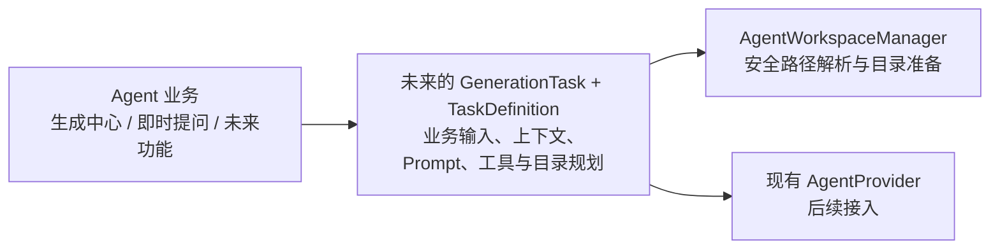

# Agent Workspace Manager 设计与实施计划

> 状态：已确认，进入实现
>
> 日期：2026-08-03
>
> 目标：实现一个所有 Agent 业务都可以复用的安全工作目录 Manager。它不理解
> GenerationTask、用户提问、Project、全局记忆、Prompt、工具或 Provider。

## 1. 结论

不实现固定 AgentLane，也不把 Workspace 分成 `global | project | task`。

“生成中心”“即时提问”“长期记忆”等属于业务模块。它们各自决定在统一 Agent
Workspace 根下使用什么命名空间，并在未来的 TaskDefinition 中定义上下文、Prompt、
工具和权限。

本阶段只实现：

```text
AgentWorkspaceManager
    resolve(segments)
    prepare(segments)
```

不实现：

```text
AgentWorkspace 领域实体
Workspace Marker
Workspace Database / Service
Global / Project / Task Workspace 类型
GenerationTask / Attempt / AgentSession
TaskDefinition
Context Projection
Provider 调用
Renderer IPC
```

## 2. 模块关系



`AgentWorkspaceManager` 不知道调用者属于哪个业务。调用者只传入安全路径段：

```ts
await workspaceManager.prepare([
  'generation-center',
  taskId,
]);

await workspaceManager.prepare([
  'questions',
  questionId,
]);
```

上述目录名和 ID 的业务含义完全由调用者维护。

## 3. API

Manager 在构造时接收一个绝对根目录。根目录是不可变配置，不是活动领域状态。

```ts
interface AgentWorkspaceManagerApi {
  resolve(segments: readonly string[]): string;

  prepare(segments: readonly string[]): Promise<string>;
}
```

语义：

- `resolve()` 只做路径段校验和跨平台路径计算，不访问文件系统；
- `prepare()` 创建根目录和目标目录，验证现有路径不是文件或符号链接逃逸，返回规范化
  绝对路径；
- 重复 `prepare()` 同一路径必须幂等；
- Manager 不生成业务 ID，不保存当前 Workspace，也不建立 Marker。

## 4. 路径约束

根目录必须：

- 是非空绝对路径；
- 不是文件系统根；
- 经过当前平台路径规则规范化。

每个路径段必须：

- 是非空字符串且没有首尾空白；
- 不是 `.` 或 `..`；
- 不包含 `/`、`\` 或 NUL；
- 不包含 Windows 非法文件名字符；
- 不以空格或 `.` 结尾；
- 不是 Windows 保留设备名；
- 组合后仍位于配置根目录内。

`prepare()` 逐层检查和创建目录，不使用一个可能先沿外部符号链接写入的宽泛递归创建。
根目录内部已有符号链接时拒绝继续进入，避免在安全检查之前对根目录外产生副作用。

## 5. 模块结构

首版只新增：

```text
src/main/agents/workspaces/
├── agent-workspace-manager.ts
└── agent-workspace-manager.test.ts
```

路径逻辑尚小，不提前拆出 `agent-workspace-paths.ts`。未来文件明显膨胀时再做纯机械
拆分。

## 6. 测试范围

至少覆盖：

1. POSIX 根目录解析；
2. Windows 盘符和 UNC 根目录解析；
3. 多级安全路径段；
4. 重复 `prepare()` 幂等；
5. 空数组、空字符串、首尾空白、`.` 和 `..`；
6. `/`、`\`、NUL 和 Windows 非法字符；
7. Windows 保留设备名；
8. 根目录是相对路径或文件系统根；
9. 目标路径已存在但不是目录；
10. 根目录内符号链接指向外部时不得在外部创建目录；
11. 并发准备相同目录；
12. Manager 不保存活动业务 Workspace 状态。

实现完成后执行目标 Vitest、`pnpm typecheck`、`pnpm lint`，最后执行 `pnpm check`。

## 7. 后续使用原则

未来业务可以在同一个可配置根下自行规划命名空间，例如生成中心或即时提问，但目录
结构不属于 Manager 契约。

未来的 GenerationTask 持有自己的业务输入和上下文引用；TaskDefinition 负责解释
这些信息并调用 Manager 准备目录。不得把 Task、上下文、权限或 Provider 逻辑反向
加入 WorkspaceManager。
