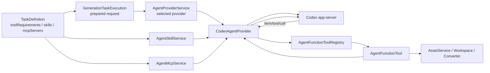

# Agent Function Tool、Skill、MCP 与 Codex 能力适配设计

日期：2026-08-07

状态：Function Tool、Skill 与 MCP 的声明、注册和 Codex 适配链已实现；首个业务能力按需注册

关联设计：

- [GenerationTask、TaskDefinition 与 Mind Map 生成设计](./2026-08-04-mind-map-generation-task-definition-design.md)
- [Agent Workspace 管理设计](./2026-08-03-agent-workspace-management-design.md)
- [Codex Agent Runtime、Agent Lane 与 Memory 方向](./2026-07-30-codex-agent-runtime-and-lanes-design.md)

## 1. 目标与结论

本设计补齐 `TaskDefinition.toolRequirements` 从声明到真实执行的最后一段链路，同时固定
Function Tool、Skill 和 MCP 在 Learning Companion 中的职责边界。

> 2026-08-08 更新：Provider 基础工具改由
> `2026-08-08-provider-default-generation-tools-design.md` 定义。本文的工具声明均指
> TaskDefinition 的额外工具，不再包含重复的 Workspace 基础工具。

最终分工如下：

| 能力 | Source of truth | 定位 | 当前优先级 |
| --- | --- | --- | --- |
| Function Tool | 应用源码中的 Registry | 稳定、受信任、与领域 Service 深度集成的本地能力 | 主路径 |
| Skill | 应用 Documents 目录中的文件 | 方法说明、格式规范、参考材料和脚本使用指导 | 已接通 |
| MCP | 应用 Documents 目录中的定义 + 外部进程 | 第三方、跨应用、可独立部署的扩展能力 | 已接通，按需使用 |

主要决策：

1. `TaskDefinition.toolRequirements` 作为任务工具需求声明，不新增平行的
   `functionTools` 字段；
2. Provider 原生工具和应用 Function Tool 使用同一份 required / optional 语义；
3. Function Tool 使用应用内代码 Registry，不使用文件 Manifest；
4. 工具工厂直接注入所需的具体 Service，不建立全局 Service Locator；
5. 每次调用的 Task、Project、Workspace 和取消信号通过执行上下文传入；
6. Function Tool 是应用内受信任代码，不建设通用审批或插件沙箱；
7. Codex Adapter 只负责协议翻译和调用路由，不拥有工具业务逻辑；
8. Skills 使用应用自己的固定目录，由 TaskDefinition 显式声明，不读取用户
   Codex Home 中的环境 Skills；
9. MCP 定义也由应用自己的固定目录维护，TaskDefinition 显式选择，Codex app-server
   负责连接、工具调用循环与生命周期；
10. `mindmap.generate@1` 首版不强行声明 Function Tool、Skill 或 MCP，继续使用准备好的
    AssetReference 副本、系统提示词和原生 Workspace 读取能力。

## 2. 总体链路与 Agent Loop 边界

Codex app-server 拥有一个 Turn 内部的 Agent Loop：模型推理、决定是否调用工具、连续调用
多个工具、取得结果后继续推理以及形成最终回答，都不由 Learning Companion 重新实现。
Learning Companion 只负责启动 Turn、消费流式事件，并在动态 Function Tool 被调用时执行
一次 handler 回调并返回结果。



领域层只看到 Provider-neutral 的工具声明和执行上下文。Codex 的 namespace、
`dynamicTools`、`item/tool/call` 和 JSON-RPC response 全部留在 Codex Adapter 内。

## 3. Function Tool 领域契约

### 3.1 定义

新增 `src/main/agents/function-tools/agent-function-tool.ts`：

```ts
interface AgentFunctionToolExecutionContext {
  readonly taskId: string;
  readonly projectId: string;
  readonly workspaces: PreparedAgentWorkspaces;
  readonly signal?: AbortSignal;
}

interface AgentFunctionToolDefinition {
  readonly id: string;
  readonly version: number;
  readonly description: string;
  readonly inputSchema: JsonValue;
  readonly deferLoading?: boolean;

  execute(
    input: JsonValue,
    context: AgentFunctionToolExecutionContext,
  ): Promise<JsonValue | AgentFunctionToolContentResult>;
}

type AgentFunctionToolContentItem =
  | { readonly type: "text"; readonly text: string }
  | { readonly type: "image"; readonly url: string };

interface AgentFunctionToolContentResult {
  readonly kind: "content";
  readonly items: readonly AgentFunctionToolContentItem[];
}
```

约束：

- `id` 使用 `^[a-z][a-z0-9_]*$`，例如 `read_asset_anchor`；
- `version` 是正整数；
- `description` 不能为空；
- `inputSchema` 必须是 JSON object Schema；
- 普通结构化输出使用 `JsonValue`，没有输出时返回 `null`；需要把图片直接交回模型时，
  使用 Provider-neutral 的 `AgentFunctionToolContentResult`，由 Provider Adapter 映射为自己的
  text / image content 协议；
- Definition 注册后按只读对象使用；
- Schema 是提供给模型和 Provider 的声明，具体工具仍必须在 handler 内校验输入，
  v1 不为此新增 Ajv 等运行时依赖。

`version` 表达工具协议和语义版本，不进入工具 ID。应用升级工具实现时增加版本，
Session 配置指纹随之变化。

### 3.2 Registry

新增 `AgentFunctionToolRegistry`：

```ts
interface AgentFunctionToolRegistryApi {
  register(definition: AgentFunctionToolDefinition): void;
  get(id: string): AgentFunctionToolDefinition | undefined;
  require(id: string): AgentFunctionToolDefinition;
  list(): readonly AgentFunctionToolDefinition[];
}
```

Registry：

- 是应用生命周期内的内存注册表；
- 不访问数据库或文件；
- 不判断某个 Task 是否允许使用工具；
- 不知道 Codex、Claude Code 等 Provider 协议；
- 拒绝重复 ID，使用现有 `REGISTRATION_CONFLICT`；
- 拒绝非法定义，使用现有 `INVALID_EXTENSION_DEFINITION`；
- 返回按 ID 稳定排序、冻结的快照。

因此这里使用 `Registry`，不使用 `Service`、`Store` 或 `Manager`。

### 3.3 依赖注入

具体工具通过工厂函数捕获稳定依赖：

```ts
function createReadAssetAnchorTool(input: {
  assetService: AssetService;
  contentResourceService: ContentResourceService;
}): AgentFunctionToolDefinition;
```

执行时再获得本次任务范围：

```ts
await tool.execute(argumentsValue, {
  taskId: request.taskId,
  projectId: request.projectId,
  workspaces: request.workspaces,
  signal: request.signal,
});
```

不采用以下方案：

- 把所有 Application Services 塞进一个 `services` 大对象；
- 让工具根据字符串从全局容器查找依赖；
- 把 `AssetService`、数据库或 Electron 对象放进 TaskDefinition；
- 把工具 handler 持久化到数据库或 Documents 目录。

Feature 模块决定注册哪些工具，Registry 只提供注册和查询机制。

## 4. TaskDefinition 工具声明

任务额外工具使用统一的 Provider-neutral 需求：

```ts
interface AgentToolRequirement {
  readonly id: string;
  readonly availability: "required" | "optional";
}
```

示例：

```ts
toolRequirements: [
  { id: "read_asset_anchor", availability: "optional" },
]
```

Provider Adapter 先加入自身默认工具，再把额外声明解析为两类能力：

1. Provider 自己支持的原生工具，例如 Codex 的 `view_image`；
2. `AgentFunctionToolRegistry` 中注册的应用工具。

解析规则：

- required 原生工具不受 Provider 支持：执行前返回 `FEATURE_NOT_SUPPORTED`；
- required Function Tool 未注册：执行前返回 `FEATURE_NOT_SUPPORTED`；
- optional 能力不可用：安静省略；
- 同一工具 ID 不允许重复声明；该约束继续由
  `GenerationTaskDefinitionRegistry` 校验；
- TaskDefinition 不增加 `kind: native | function`，避免把 Provider 支持情况写入领域定义；
- TaskDefinition 只决定本类任务额外需要哪些工具；Provider 默认工具、Registry 是否存在
  某项能力以及 Workspace 权限共同决定本次最终有效工具集。

## 5. Codex 动态工具适配

### 5.1 当前基础与缺口

当前 Runtime 已经具备：

- `CodexDynamicFunctionTool` 和 `CodexDynamicToolNamespace`；
- `thread/start.dynamicTools`；
- `item/tool/call` 服务端请求透传；
- `respondToServerRequest()` 返回能力。

实现前已使用项目固定的 `@openai/codex 0.146.0` 生成 experimental TypeScript
协议并核对 `DynamicToolSpec`、`DynamicToolCallParams` 与
`DynamicToolCallResponse`，没有用更新版文档替代固定 Runtime 的真实契约。

实现前的缺口位于 `CodexAgentProvider`：Generation Turn 收到任意 `server-request` 都会
拒绝并抛出 `FEATURE_NOT_SUPPORTED`。本次实现没有修改底层 JSON-RPC Runtime，而是在
Provider Adapter 补齐动态工具选择、回调派发和结果编码。

### 5.2 Provider 文件边界

新增：

```text
src/main/agents/providers/codex-function-tools.ts
```

它只负责 Codex 适配：

- 区分 Codex 原生工具与 Registry Function Tool；
- 把选中 Definition 转为 Codex dynamic tool；
- 生成稳定的工具配置描述符；
- 解析并校验 `item/tool/call` 参数；
- 调用领域工具并编码 Codex response。

不把这些逻辑继续堆进已经接近 300 行的 `CodexAgentProvider`。Provider 主类继续负责
Turn 生命周期、取消、流式事件和最终结果聚合。

### 5.3 Namespace 与映射

所有应用工具使用一个固定 namespace：

```ts
{
  type: "namespace",
  name: "learning_companion",
  description: "Application tools provided by Learning Companion.",
  tools: [
    {
      type: "function",
      name: "read_asset_anchor",
      description: "...",
      inputSchema: { ... },
    },
  ],
}
```

TaskDefinition 中仍使用内部工具 ID `read_asset_anchor`；`learning_companion` 只属于
Codex wire protocol。这样不会把 Codex namespace 泄漏到 Provider-neutral 领域模型，
也不会与 Codex 内置工具发生名称碰撞。

没有选中 Function Tool 时不发送空 namespace。

### 5.4 配置指纹与 Session

Session 配置描述符增加已启用 Function Tool 的稳定字段：

```text
id
version
description
inputSchema
deferLoading
```

这些字段参与现有 `configurationFingerprint`。工具版本或 Schema 变化后，现有
Session binding 进入配置不兼容分支，不在旧 Provider Thread 上静默继续。

Codex dynamic tools 在 `thread/start` 提供。恢复已有 Thread 时依赖 Codex rollout 中
保存的动态工具定义；Learning Companion 使用指纹保证恢复请求和创建时的声明相同。
当前不扩大 `SelectCodexThreadInput`。

协议参考：<https://learn.chatgpt.com/docs/app-server>

### 5.5 回调派发

收到 `item/tool/call` 后按顺序校验：

1. 当前事件的 thread id 与实际 Session Thread 一致；
2. turn id 与当前 active turn 一致；
3. `callId`、`tool` 是非空字符串；
4. `namespace === "learning_companion"`；
5. 工具已被本次 TaskDefinition 声明并成功解析；
6. `arguments` 是合法 JSON value；
7. 调用对应 Definition 的 `execute()`。

成功响应：

```ts
{
  contentItems: [
    {
      type: "inputText",
      text: typeof result === "string"
        ? result
        : canonicalJson(result),
    },
  ],
  success: true,
}
```

失败边界：

- handler 普通失败：返回经过清理的 `success: false` 文本，允许模型调整或停止；
- `AbortSignal` 取消：中断 Turn，不伪装为工具结果；
- 未声明工具、错误 namespace、错误 thread / turn 或畸形请求：返回 JSON-RPC error，
  并将当前执行标记为 `CODEX_PROTOCOL_ERROR`；
- 其他交互式 server request 继续拒绝，因为 Generation 流程不允许运行时审批或询问。

工具结果不包含内部堆栈、绝对数据库路径、Token 或其他 Service 对象。

### 5.6 流式事件

Function Tool 的开始和完成仍投影为通用 `GenerationAgentEvent` 工具事件。事件名称采用：

```text
dynamic:<tool-id>
```

事件只用于进度和审计，不复制工具完整结果到 GenerationTask 数据库。真实 Provider
Conversation 仍由 Provider 自己保存。

## 6. Workspace 权限与受信任工具

Codex Workspace 原生工具由 Provider 组合，媒体 Function Tool 由所属 Feature 注册：

- `workspace.read/search/write` 映射 Codex 原生 Shell / `apply_patch` 能力；
- `workspace.view_image` 映射 Codex 原生 `view_image`；
- PDF Feature 注册 `workspace_read_pdf` Dynamic Tool，支持页段文字提取和逐页图片；
- `features.shell_tool` 在存在 readable Workspace 时开启；
- 每个 Prepared Workspace 的 `permissions.write` 决定 Codex permission profile 对该路径
  配置 read 还是 write；Shell、脚本与 `apply_patch` 都服从同一边界；
- 跨 Task 复用的命名 Workspace 仍完全服从 TaskDefinition 声明的 `permissions`；
  `instanceKey` 本身不附加只读限制。并发写入冲突由具体业务 Service 负责控制。

应用 Function Tool 在 Electron Main 进程执行，不会自动受到 Codex Sandbox 约束。
这是有意选择：这些工具是 Learning Companion 自己发布和测试的领域能力，可以直接调用
`AssetService`、转换器或 Workspace 组件。

v1 不实现：

- 通用工具权限 DSL；
- OpenAI approval 桥接；
- 每个 Service 的代理接口；
- 任意第三方 JavaScript 插件加载。

但接收路径并直接写文件的工具必须使用一组最小公共守卫：

```text
requireWritableWorkspacePath(workspaces, targetPath)
```

它只负责：

- 目标属于本次 Prepared Workspace；
- 对应 Workspace 允许写；
- 解析父目录和符号链接后没有逃逸根目录。

这是一条防止应用自身实现错误的边界，不是新的产品权限系统。通过 `AssetService` 等领域
入口完成写入的工具继续遵守对应 Service 自身的不变量，不重复做一套权限判断。

第三方或用户提供的未知代码未来必须通过 MCP 或独立进程隔离，不能注册为应用内
Function Tool。

## 7. Skill 设计

### 7.1 TaskDefinition 声明

Function Tool 闭环稳定后，TaskDefinition 增加独立的 Skill 声明：

```ts
interface AgentSkillRequirement {
  readonly id: string;
  readonly availability: "required" | "optional";
}

interface TaskDefinition {
  // existing fields
  readonly skills: readonly AgentSkillRequirement[];
}
```

Skill 与 Tool 分开，因为 Skill 是输入上下文和方法说明，不是可调用函数。required / optional
语义与工具一致。

### 7.2 文件布局

应用维护的能力目录固定在现有 Documents 应用根目录下：

```text
<Documents>/Learning Companion/
└── agent-capabilities/
    └── skills/
        └── <skill-id>/
            ├── learning-companion-skill.json
            ├── SKILL.md
            ├── references/
            └── scripts/
```

路径必须通过现有应用路径组件解析，不在业务模块硬编码 Windows Documents 路径。

`AgentSkillService` 负责：

- 确保根目录存在；
- 安装、替换和移除应用 Skill 文件；
- 按 ID 解析并验证 `SKILL.md`；
- 返回当前 Task 可用的绝对路径；
- 为 required 缺失提供结构化错误；
- 对同一 Skill 的并发文件操作串行化。

`learning-companion-skill.json` 只保存内部格式版本、Skill ID 和正整数内容版本；
Skill 正文、references 和 scripts 不复制进数据库。安装采用同目录 staging + rename，替换失败时
优先恢复旧目录。`SKILL.md` 的 front matter `name` 必须与内部 ID 相同。

Feature 模块决定何时注册或安装某个 Skill；`AgentSkillService` 不自行猜测 Mind Map、PDF
或其他任务需要什么能力。文件目录是事实来源，Service 不把 Skill 正文复制到数据库。

### 7.3 Provider 映射

Codex Adapter 将已解析的 Skill 显式追加为 `turn/start` 输入项，不启用环境中的 ambient
Skills。当前“禁用用户环境 Skills”的隔离逻辑继续保留，只允许本次 Definition 显式声明的
应用 Skill。

显式调用同时发送 `$<skill-id>` 文本和 `{ type: "skill", name, path }` 输入项。Skill 目录以
只读路径加入本次权限 Profile，使 Agent 可以继续读取 references 或执行只读脚本，但不能修改
应用安装的 Skill 本身。

未来 Claude Code Adapter 可以把同一 Requirement 映射为自己的 Skill / instruction 机制，
TaskDefinition 不保存 Codex 专用 path DTO。

`mindmap.generate@1` 当前使用 `skills: []`。其输出结构可以直接写入 system instruction，
不为了形式完整而创建没有复用价值的 Skill。

## 8. MCP 定义与 Provider 映射

MCP 使用同一应用能力根目录：

```text
<Documents>/Learning Companion/agent-capabilities/mcp/
```

每个 `<mcp-id>.json` 保存一份 Provider-neutral Definition：

```ts
interface AgentMcpServerRequirement {
  readonly id: string;
  readonly availability: "required" | "optional";
}

interface AgentMcpServerDefinition {
  readonly id: string;
  readonly version: number;
  readonly description: string;
  readonly transport: StdioTransport | StreamableHttpTransport;
  readonly startupTimeoutMs?: number;
  readonly toolTimeoutMs?: number;
  readonly enabledTools?: readonly string[];
  readonly disabledTools?: readonly string[];
}
```

`AgentMcpService` 只负责定义文件的注册、显式替换、读取、枚举和删除，不启动 MCP 进程，
也不实现 MCP Tool Loop。Codex Adapter 把选中的 Definition 映射到本次 Thread 的
`configOverrides.mcp_servers`，Codex app-server 负责连接、调用和把结果继续交给模型。

映射规则：

- wire name 使用 `learning_companion_<id>`，不泄漏回领域模型；
- required Definition 缺失时在登录检查和 Thread 创建前失败；
- optional Definition 缺失时安静省略；
- required MCP 配置写入 `required: true`，启动失败即阻止本次 Thread；
- TaskDefinition 已明确允许的 MCP 使用 `default_tools_approval_mode: "approve"`，避免
  非交互 Generation 中出现审批请求；
- 用户 Codex Home 中的 ambient MCP 仍逐项禁用，只有本次声明的应用 MCP 被重新启用；
- MCP 工具事件映射为 `mcp:<internal-id>/<tool-name>`；未知 Server 调用视为协议错误；
- 密钥不写进 Definition，优先使用环境变量名、`bearerTokenEnvironmentVariable` 或
  `environmentHeaders`。

当前仍不支持 MCP OAuth 登录 UI 和 elicitation 表单。需要交互认证的 MCP 必须在后续设置页
补齐独立流程；这不影响 stdio、无认证 HTTP 或环境变量认证 MCP。

## 9. Bootstrap 与注册时机

当前 `AgentProviderService` 的创建早于部分 Asset 领域 Service。为了避免强行重排整个
Application Runtime，Bootstrap 使用一个共享 Registry 实例：

```text
create AgentFunctionToolRegistry
→ Workbench capability catalog registers concrete built-in tools
→ pass registry and default requirements to createAgentProviderService
→ create remaining Asset / Workspace / Converter services
→ register IPC and expose application runtime
```

工具实现仍归属具体 Feature；Workbench capability catalog 只是 Composition Root。依赖外部
工具包的能力可在此根据依赖状态条件注册，Provider Adapter 不需要认识 PDF、Video 等领域。

Bootstrap 同时使用 Electron 提供的 `documentsPath` 解析：

```text
<Documents>/Learning Companion/agent-capabilities/
├── skills/
└── mcp/
```

并初始化 `AgentSkillService` 与 `AgentMcpService` 后注入 Provider。它们没有进程资源，应用
关闭时不需要额外 shutdown；具体 Feature 模块仍决定是否安装 Skill 或注册 MCP Definition。

外部请求只能在最后一步后进入，因此 Provider 不会看到半初始化的注册表。没有真实生产工具
需要注册时，Registry 可以保持为空；协议闭环先用测试工具验证。

Registry 不需要放进 `ApplicationRuntime` 的公开属性，也不通过 Renderer IPC 暴露。

## 10. 首轮文件边界

```text
src/main/agents/
├── capabilities/
│   ├── agent-capability-id.ts
│   └── agent-capability-paths.ts
├── function-tools/
│   ├── agent-function-tool.ts
│   ├── agent-function-tool-registry.ts
│   └── agent-function-tool-registry.test.ts
├── skills/
│   ├── agent-skill.ts
│   └── agent-skill-service.ts
├── mcp/
│   ├── agent-mcp-server.ts
│   └── agent-mcp-service.ts
└── providers/
    ├── codex-agent-provider.ts
    ├── codex-generation-capabilities.ts
    ├── codex-function-tools.ts
    ├── codex-function-tools.test.ts
    ├── codex-generation-request.ts
    └── codex-generation-response.ts

src/main/bootstrap/
├── create-agent-provider-service.ts
└── create-application-runtime.ts
```

不新增 `AgentFunctionToolService`、`CapabilityCatalogService` 或通用
`AgentExecutionCapabilityManager`。

## 11. 验收标准

完整能力链完成后必须满足：

1. Registry 校验 ID、版本、Schema 和重复注册；
2. required 未注册工具在环境枚举、Thread 创建和模型请求前失败；
3. optional 未注册工具被省略，不影响任务；
4. Codex 只收到当前 TaskDefinition 声明的 Function Tool；
5. 工具定义变化会改变 Session 配置指纹；
6. `item/tool/call` 能把正确的 Task、Project、Workspace 和 Signal 传给 handler；
7. handler 成功结果返回 Codex，模型可以继续并完成同一 Turn；
8. handler 普通失败不会泄漏内部错误，模型收到失败结果；
9. 未声明调用、错误 namespace 和错误 thread / turn 被视为协议错误；
10. 非动态工具 server request 继续拒绝；
11. 没有 Function Tool 的现有 Generation 流程行为不变；
12. 不需要真实 ChatGPT 登录即可通过模拟 App Server 完成集成测试；
13. 针对性测试、TypeScript、ESLint 和完整 `pnpm check` 通过；
14. required Skill / MCP 缺失在登录、环境枚举和 Thread 创建前失败；
15. Codex Turn 同时收到 `$skill` 标记和显式 Skill path；
16. Skill references 目录只读可见，ambient Skill 仍被禁用；
17. MCP Definition 正确映射 stdio / streamable HTTP 字段和 required / optional 语义；
18. 只有选中的应用 MCP 被启用，MCP 工具事件使用内部 ID；
19. Skill 或 MCP 版本变化会改变 Session 配置指纹。

## 12. 明确延后

- 首个业务 Function Tool、Skill 和 MCP Definition，由真实任务需求驱动，不为 Mind Map
  虚构能力；
- MCP OAuth 登录、elicitation 与设置页管理 UI；
- 用户或第三方 Function Tool 插件；
- 通用工具审批、细粒度 Effect 系统和额外权限 DSL；
- Function Tool 执行结果的长期独立日志；
- 工具级并发限制、超时配置和重试策略；已有 `AbortSignal` 先覆盖取消。
