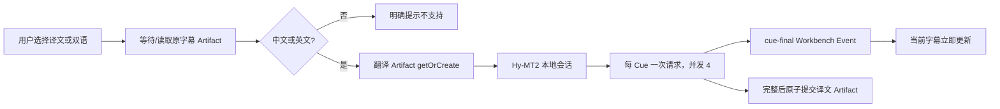

# 视频字幕识别与翻译设计

> 日期：2026-08-16
>
> 状态：已确认，按本文主线实现
>
> 范围：Video Workbench 的本地字幕识别、显示、按需翻译与缓存

## 1. 最终决策

本功能不建立字幕专属数据库表、Job 表、checkpoint 文件或通用媒体任务框架。

只复用三项现有能力：

1. `AssetArtifactService`：保存可重建的识别结果和翻译结果；
2. `Workbench State`：保存用户选择的字幕显示模式；
3. Workbench Main → Renderer Event：传递内存中的状态与逐 Cue 译文。

对应关系如下：

```text
Video Asset
  └─ Source Subtitle Artifact
       └─ Translation Subtitle Artifact

Video Workbench State
  └─ displayMode: off | source | translated | bilingual

VideoSubtitleService（仅内存）
  └─ queued / transcribing / translating / ready / failed
```

核心约束：

- 导入视频后自动开始识别原字幕；旧视频首次打开时也会补做；
- 视频播放不等待识别、翻译或组件安装；
- 用户选择“译文”或“双语”后才启动翻译；
- 原字幕和译文分别是一个现有 Asset Artifact；
- 翻译以完整 Cue 为单位增量显示，不传模型 token delta；
- 进度只在内存中维护；应用退出或进程中断后重新执行；
- Artifact 已完成时由现有指纹缓存直接命中，不重复计算；
- 不把字幕正文保存为 Attachment，也不创建新的 Asset。

模型、安装包与实测数据见：

- [媒体字幕外部依赖与模型总表](./2026-08-16-media-subtitle-runtime-dependencies.md)
- [中英字幕本地翻译模型选型记录](../../../demos/subtitle-translation/docs/model-selection.md)

## 2. 用户体验

### 2.1 导入与播放

1. 用户导入视频；
2. Asset 正常加入列表并可立即播放；
3. Main 后台生成原字幕 Artifact；
4. 完成后字幕按钮可选择“原文”；
5. 用户没有安装字幕组件时，只显示明确安装入口，不阻塞视频。

字幕识别失败不影响视频，也不会创建一个伪成功结果。用户点击重试时重新走同一条
Artifact 生成路径。

### 2.2 四种显示模式

```ts
type VideoSubtitleDisplayMode =
  | 'off'
  | 'source'
  | 'translated'
  | 'bilingual';
```

| 模式 | 展示行为 | 是否触发翻译 |
| --- | --- | --- |
| `off` | 不显示字幕 | 否 |
| `source` | 只显示识别原文 | 否 |
| `translated` | 只显示译文 | 是 |
| `bilingual` | 原文在上、译文在下 | 是 |

当译文尚未完成：

- `translated` 临时显示 `〔原文 · 译文生成中〕原文`；
- `bilingual` 第二行显示 `〔正在翻译…〕`；
- 不会把原文静默伪装成译文；
- 每个 Cue 完成后立即替换对应占位，不等全片翻译结束。

当检测语言不是中文或英文时，译文与双语模式显示明确的“不支持自动翻译”状态，
不会猜测语言后继续运行。

### 2.3 状态恢复

Workbench State V2 只保存：

```ts
interface VideoWorkbenchStateV2 {
  readonly viewState: VideoWorkbenchViewState;
  readonly subtitleState: {
    readonly displayMode: VideoSubtitleDisplayMode;
  };
}
```

V1 状态读取时保留播放位置、音量、静音和倍速，并将字幕模式补为 `off`。

应用重开后：

- 已完成 Artifact 直接恢复；
- 未完成的内存进度不恢复，重新识别或翻译；
- 相同输入与 Producer 版本仍由 Artifact 缓存去重；
- 不需要额外的字幕任务恢复协议。

## 3. 数据结构

### 3.1 原字幕 Artifact

```text
producerId: builtin.media-subtitles.transcription
artifactKey: source.auto
mediaType: application/vnd.learning-companion.subtitle-track+json
source: Video Asset 文件与内容修订
```

```ts
interface SubtitleSourceTrackV1 {
  readonly version: 1;
  readonly kind: 'subtitle-source';
  readonly sourceRevision: string;
  readonly language: 'en' | 'zh-Hans' | 'unknown';
  readonly origin: 'asr';
  readonly engine: SubtitleEngineV1;
  readonly generatedTime: number;
  readonly cues: readonly SubtitleCueV1[];
}

interface SubtitleCueV1 {
  readonly id: string;
  readonly startMs: number;
  readonly endMs: number;
  readonly text: string;
  readonly sourceCueIds: readonly string[];
}
```

### 3.2 译文 Artifact

```text
producerId: builtin.media-subtitles.translation
artifactKey: translation.<source>.<target>.quality
mediaType: application/vnd.learning-companion.subtitle-translation+json
source: 原字幕 Artifact 文件与 Artifact Revision
```

```ts
interface SubtitleTranslationTrackV1 {
  readonly version: 1;
  readonly kind: 'subtitle-translation';
  readonly sourceTrackRevision: string;
  readonly sourceLanguage: 'en' | 'zh-Hans';
  readonly targetLanguage: 'en' | 'zh-Hans';
  readonly profile: 'quality';
  readonly engine: SubtitleEngineV1;
  readonly generatedTime: number;
  readonly cues: readonly {
    readonly sourceCueId: string;
    readonly text: string;
  }[];
}
```

译文不复制时间轴。Renderer 使用 `sourceCueId` 将译文与原 Cue 组合成译文或双语
WebVTT。Service 在读取完成 Artifact 时校验 Cue 数量、顺序和 ID 一一对应。

这种链式 Artifact 已经自然表达：视频变化会重做原字幕，原字幕变化会重做译文；
无需新增 Artifact DAG、字幕表或依赖索引。

## 4. 识别流程

```mermaid
flowchart LR
    IMPORT["Asset 导入或旧视频打开"] --> EVENT["Asset changed"]
    EVENT --> SERVICE["VideoSubtitleService.ensureSource"]
    SERVICE --> CACHE["AssetArtifactService.getOrCreate"]
    CACHE --> NORMALIZE["FFmpeg: 16 kHz mono WAV"]
    NORMALIZE --> ASR["当前安装档位的 ASR"]
    ASR --> ALIGN["模型 Token / VAD 时间"]
    ALIGN --> SEGMENT["稳定 Cue 分段"]
    SEGMENT --> ARTIFACT["原字幕 Artifact 原子提交"]
```



运行时选择由已安装字幕组件决定：

- NVIDIA 档：Whisper `large-v3-turbo-q5_0` + Silero VAD；
- CPU 档：SenseVoice Small Q8 + FSMN-VAD；
- 两者都复用配套 FFmpeg 将输入音轨规范化。

Whisper 使用完整 JSON 中的 DTW Token 对齐点生成字幕 Cue。GPU 转写关闭 Flash
Attention 并启用 `large.v3.turbo` DTW；同时不启用 Whisper 内置 VAD，因为该版本会
压缩静音，却仍把 JSON Token `offsets` 留在压缩后的时间轴上，造成字幕随停顿累计
提前。分段器只使用原音频轴上的 `t_dtw` 对齐点，不按字符比例推算时间：

- 优先选择句末、分句标点和超过 `700 ms` 的语音停顿；
- 其次选择完整中文词或英文单词边界；
- 理想时长为 `2–4.5 s`，可靠 Token 时间存在时不超过 `6 s`；
- 中文理想不超过 `22` 字、硬上限 `30` 字，英文理想不超过 `56` 字符、
  硬上限 `72` 字符；
- 相邻间隔超过 `700 ms` 时不得合并；
- 保留全部原始 Token `sourceCueIds`，且最终 Cue 文本拼接后必须等于原转写文本。
- DTW 点只表示 Token 输出时刻；显示时仅增加固定的 `250 ms` 前置和 `200 ms`
  后置窗口，相邻窗口重叠时在两个真实对齐点之间收口，不填满真实静音。

因此类似 `GPT / 大语言 / 模型` 的连续碎片会合成可读 Cue，单个十九秒长 Segment
也会沿真实 Token 时间拆成字幕。DTW 点缺失、倒序或无法形成合法边界时，回退到
未压缩原音频上的普通 Token `offsets`；Token 数据整体不可用时再回退为基于原始
Segment 的保守聚合，宁可保留较长字幕，也不伪造时间。

当前便携版 SenseVoice C++ Runtime 只暴露识别文本和 FSMN-VAD 段级时间。因此 CPU
档只保存真实 VAD Cue，不再把 VAD 区间按字符数拆分。后续 Runtime 暴露 CTC Token
对齐后，直接复用同一分段器，不建立第二套字幕算法。

## 5. 翻译流程



当前正式链路使用随组件安装的 Hy-MT2 1.8B Q4：

- 一次请求只翻译一个目标 Cue；
- 前一 Cue 和后一 Cue 只作为上下文；
- 输出必须是当前 Cue 的纯译文；
- 并发 `4` 路；
- 所有 Cue 完成并通过校验后才提交 Artifact；
- 失败或取消会关闭本地模型进程，不提交残缺 Artifact。

Bergamot 已属于外部组件资源，但首版不为它再建立第二套执行链。以后若需要快速档，
只增加一个同契约翻译 Producer/Engine，不改变 Workbench 和数据结构。

## 6. 事件与所有权边界

通用层只新增一项能力：

```ts
interface WorkbenchEvent {
  readonly sessionId: string;
  readonly type: string;
  readonly payload: JsonValue;
}
```

边界如下：

- Main Event Bus：校验并发布事件；
- IPC / Preload：只运输事件；
- Host：只按当前 `sessionId` 过滤；
- Video Main：将字幕领域事件映射为 Workbench Event；
- Video Renderer：验证并解释 `video:subtitle-*`；
- 其他 Workbench 不依赖字幕类型。

只使用两个字幕事件：

```text
video:subtitle-snapshot
video:subtitle-cue-final
```

新打开的 Session 从 Bootstrap Payload 得到完整 Snapshot；不依赖重放旧事件。

## 7. 生命周期与并发

`VideoSubtitleService` 只在内存中维护：

- 每个 Asset 的最新 Snapshot；
- 正在执行的原字幕 Promise；
- 正在执行的译文 Promise；
- 活动 Workbench Session 的监听器。

规则：

- 同一 Asset 的相同阶段只启动一次；
- ASR 队列串行，避免多个重模型同时抢 GPU/CPU；
- 翻译队列串行，每个视频内部 Cue 并发；
- Workbench 关闭只取消 UI 订阅，不取消 Asset 级后台工作；
- Asset 删除时现有 `AssetArtifactService.removeByAsset()` 负责取消 Artifact Producer；
- 进程取消通过现有外部命令终止能力释放整棵 Windows 子进程树；
- 失败后“重试”重新进入同一 Producer，不建立第二套恢复状态。

## 8. 文件组织

```text
src/workbenches/media-subtitles/
├── contracts.ts
├── transcription-producer.ts
├── translation-producer.ts
└── external-libraries/
    └── ...运行时定义、安装与路径解析

src/workbenches/video/
├── shared.ts
├── main.ts
├── renderer.tsx
└── subtitles/
    └── video-subtitle-service.ts
```

`media-subtitles` 保存 Video/Audio 可复用的纯字幕处理能力；Video Workbench 保存何时
启动、如何显示和如何与 Session 交互的媒体语义。Audio 后续可以复用 Producer，
但不让 Video 依赖 Audio，也不提前创建媒体 Workbench 基类。

## 9. 首版非目标

本轮不实现：

- 字幕专属数据库表或 Job 表；
- 中断 checkpoint、继续按钮或跨重启进度；
- SRT 导出和字幕编辑器；
- 外挂字幕、内嵌字幕优先级选择；
- 自动翻译；
- Bergamot 快速档切换；
- 云端翻译、Agent 润色和术语修正；
- OCR、说话人分离、声音克隆、摘要或媒体问答；
- Audio Workbench UI 接入。

这些功能只有在真实需求出现后沿现有 Artifact/Workbench 扩展点增加，不能以“以后也许
需要”为理由提前建立新的表、任务系统或全局服务。

## 10. 验收条件

### 数据与缓存

- 导入可用视频会触发原字幕 Artifact；
- 相同视频修订和 Producer 版本命中现有缓存；
- Whisper 长 Segment 按原音频轴上的 DTW Token 对齐点生成 Cue，可靠时间存在时
  单 Cue 不超过 `6 s`；
- Cue 文本完整守恒、时间单调且不重叠，不按字符比例推算时间；
- SenseVoice 未提供 CTC Token 时间时保持真实 VAD 区间；
- 用户只选原文时不启动翻译；
- 用户选译文或双语时创建译文 Artifact；
- 非中英文源轨不启动翻译；
- 译文 Cue 与原 Cue ID、数量、顺序严格一致；
- 失败、取消或不完整结果不提交 Artifact。

### UI

- 视频始终可以先播放；
- 四种模式可切换并写入 Workbench State V2；
- 逐 Cue 译文到达后立即显示；
- 缺失译文有明确占位；
- 未安装、识别中、翻译中、不支持语言和失败状态均有明确提示；
- 切换 Asset 不被后台模型进程阻塞。

### 工程验证

- Shared Contract、两个 Producer、VideoSubtitleService、Video Main/Renderer 和通用
  Event IPC 均有边界测试；
- `pnpm check` 通过；
- Electron package 通过；
- Windows 外部命令取消/超时集成测试通过；
- 已安装字幕组件的机器完成一次真实短视频识别和翻译 smoke test。
