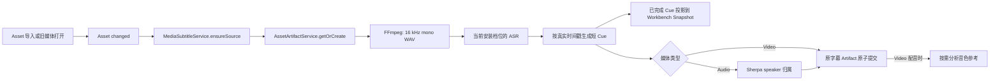
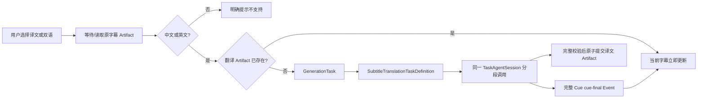

# 视频/音频字幕识别与翻译设计

> 日期：2026-08-16
>
> 状态：已实现；2026-08-28 将本地翻译模型替换为 GenerationTask + Agent；
> 2026-08-29 接入 Audio Workbench；2026-08-31 翻译改用低智能 Provider Selector
>
> 范围：Video/Audio Workbench 的本地字幕识别、显示、按需翻译与缓存

## 1. 最终决策

本功能不建立字幕专属数据库表、Job 表或通用媒体任务框架。翻译复用现有
GenerationTask 的持久化、调用 checkpoint、重试和 Provider Session。

复用四项现有能力：

1. `AssetArtifactService`：保存可重建的识别结果和翻译结果；
2. `Workbench State`：保存用户选择的字幕显示模式；
3. Workbench Main → Renderer Event：传递内存中的原文进度、状态与逐 Cue 译文。
4. `GenerationTask`：执行、恢复并审计分段 LLM 翻译。

对应关系如下：

```text
Media Asset
  └─ Source Subtitle Artifact
       └─ Translation Subtitle Artifact

Audio / Video Workbench State
  └─ displayMode: off | source | translated | bilingual

MediaSubtitleService（仅内存）
  └─ queued / transcribing / translating / provider-required / ready / failed
```

核心约束：

- 导入视频或音频后自动开始识别原字幕；旧 Asset 首次打开时也会补做；
- 媒体播放不等待识别、翻译或组件安装；
- 用户选择“译文”或“双语”后才启动翻译；
- 原字幕和译文分别是一个现有 Asset Artifact；
- ASR 已完成的原文 Cue 先以内存 Snapshot 增量显示，完整成功后才提交 Artifact；
- 翻译以完整 Cue 为单位增量显示，不传模型 token delta；
- 当前 UI 进度在内存中投影；已完成 Agent Call 由 GenerationTask 持久化并可恢复；
- Artifact 已完成时由现有指纹缓存直接命中，不重复计算；
- 不把字幕正文保存为 Attachment，也不创建新的 Asset。

模型、安装包与实测数据见：

- [媒体字幕外部依赖与模型总表](./2026-08-16-media-subtitle-runtime-dependencies.md)
- [视频配音与 LLM 翻译设计](./2026-08-28-video-dubbing-design.md)

## 2. 用户体验

### 2.1 导入与播放

1. 用户导入视频或音频；
2. Asset 正常加入列表并可立即播放；
3. Main 后台生成原字幕 Artifact；
4. 第一批完整 Cue 到达后即可选择“原文”，页面继续显示剩余生成进度；
5. 用户没有安装字幕组件时，只显示明确安装入口，不阻塞媒体播放。

字幕识别失败不影响媒体播放，也不会创建一个伪成功结果。用户点击重试时重新走同一条
Artifact 生成路径。

### 2.2 四种显示模式

```ts
type MediaSubtitleDisplayMode = 'off' | 'source' | 'translated' | 'bilingual';
```

| 模式         | 展示行为           | 是否触发翻译 |
| ------------ | ------------------ | ------------ |
| `off`        | 不显示字幕         | 否           |
| `source`     | 只显示识别原文     | 否           |
| `translated` | 只显示译文         | 是           |
| `bilingual`  | 原文在上、译文在下 | 是           |

当译文尚未完成：

- `translated` 临时显示 `〔原文 · 译文生成中〕原文`；
- `bilingual` 第二行显示 `〔正在翻译…〕`；
- 不会把原文静默伪装成译文；
- 每个 Cue 完成后立即替换对应占位，不等全片翻译结束。

当检测语言不是中文或英文时，译文与双语模式显示明确的“不支持自动翻译”状态，
不会猜测语言后继续运行。

### 2.3 状态恢复

Workbench State V2 只保存：

```ts
interface MediaWorkbenchSubtitleStateFragment {
  readonly subtitleState: {
    readonly displayMode: MediaSubtitleDisplayMode;
  };
}
```

`AudioWorkbenchStateV2` 与 `VideoWorkbenchStateV2` 分别组合这段状态，并各自保留
音频/视频播放状态。

V1 状态读取时保留播放位置、音量、静音和倍速，并将字幕模式补为 `off`。

应用重开后：

- 已完成 Artifact 直接恢复；
- 原字幕依靠 Artifact 恢复；翻译任务依靠 GenerationTask 与稳定 callKey 恢复；
- 相同输入与 Producer 版本仍由 Artifact 缓存去重；
- 不需要额外的字幕任务恢复协议。

## 3. 数据结构

### 3.1 原字幕 Artifact

```text
producerId: builtin.media-subtitles.transcription
artifactKey: source.auto
mediaType: application/vnd.learning-companion.subtitle-track+json
source: Media Asset 文件与内容修订
```

```ts
interface SubtitleSourceTrackV1 {
  readonly version: 1;
  readonly kind: 'subtitle-source';
  readonly sourceRevision: string;
  readonly language: 'en' | 'zh-Hans' | 'unknown';
  readonly origin: 'asr';
  readonly engine: SubtitleEngineV1;
  readonly generatedTime: number;
  readonly cues: readonly SubtitleCueV1[];
}

interface SubtitleCueV1 {
  readonly id: string;
  readonly startMs: number;
  readonly endMs: number;
  readonly text: string;
  readonly sourceCueIds: readonly string[];
}
```

### 3.2 译文 Artifact

```text
producerId: builtin.media-subtitles.translation
artifactKey: translation.<source>.<target>.quality
mediaType: application/vnd.learning-companion.subtitle-translation+json
source: 原字幕 Artifact 文件与 Artifact Revision
```

```ts
interface SubtitleTranslationTrackV1 {
  readonly version: 1;
  readonly kind: 'subtitle-translation';
  readonly sourceTrackRevision: string;
  readonly sourceLanguage: 'en' | 'zh-Hans';
  readonly targetLanguage: 'en' | 'zh-Hans';
  readonly profile: 'quality';
  readonly engine: SubtitleEngineV1;
  readonly generatedTime: number;
  readonly cues: readonly {
    readonly sourceCueId: string;
    readonly text: string;
  }[];
}
```

译文不复制时间轴。Renderer 使用 `sourceCueId` 将译文与原 Cue 组合成译文或双语
WebVTT。Service 在读取完成 Artifact 时校验 Cue 数量、顺序和 ID 一一对应。

这种链式 Artifact 已经自然表达：媒体变化会重做原字幕，原字幕变化会重做译文；
无需新增 Artifact DAG、字幕表或依赖索引。

## 4. 识别流程



运行时选择由已安装字幕组件决定：

- Windows NVIDIA 档：Whisper large-v3-turbo Q5 + whisper.cpp CUDA，使用 fast attention、Silero VAD 与 Token/Offset 时间戳拆分短 Cue；
- Windows CPU 档：SenseVoice Small Q8 + FSMN-VAD，保留真实 VAD 区间；
- 两个档位都安装 Sherpa，但 Video 原字幕不运行 speaker 分析；Audio 原字幕在 ASR 后运行；
- 两个档位只下载当前设备对应的 ASR，并复用配套 FFmpeg 将输入音轨规范化。

Video 的原字幕 Artifact 只有文本与时间轴，不显示 speaker。Audio 的原字幕 Artifact 在
同一协议上可附带 `speakerAnalysis` 与 Cue `speakerId`。配音点击后，Video 对人声分离结果
按需运行同一 Sherpa runtime；这份分析用于声色参考与 phrase 路由，不反写视频字幕。

## 5. 翻译流程



当前正式链路固定使用“低智能”Provider Selector；Selector 只表达任务所需智能强度，
具体 Connection、模型与思考力度仍由用户配置：

- 每段最多 16 个目标 Cue、约 1400 个字符，只沿真实 Cue 边界切分；
- 前 3 个和后 3 个 Cue 只作为上下文，禁止翻译或输出；
- 所有分段复用同一 TaskAgentSession；
- 输出必须是一个 JSON 对象，目标 Cue 的数量、ID 和顺序必须完全一致；
- 格式无效时在同一 Session 内修复一次，仍失败则由 GenerationTask 记录失败；
- 所有 Cue 完成并通过校验后才提交 Artifact；
- 失败或取消不提交残缺 Artifact，重试复用 GenerationTask 的已完成调用。
- 打开媒体时会恢复与当前原字幕版本匹配的完整译文 Artifact；没有缓存时仍只在用户选择
  “译文”或“双语”后启动翻译，不会因为检查配音条件而暗中发起 LLM 任务。
- 登录失效、API Key 缺失或低智能档未配置时进入 `provider-required`，明确引导用户
  到设置中修复，不把 Provider 问题伪装成普通字幕失败。

Bergamot、Hy-MT2 和 llama.cpp 不再属于字幕组件资源。以后若需要完全离线翻译，只增加
同一 TaskDefinition/Artifact 契约下的 Provider，不在媒体 Renderer 中建立第二条链。

## 6. 事件与所有权边界

通用层只新增一项能力：

```ts
interface WorkbenchEvent {
  readonly sessionId: string;
  readonly type: string;
  readonly payload: JsonValue;
}
```

边界如下：

- Main Event Bus：校验并发布事件；
- IPC / Preload：只运输事件；
- Host：只按当前 `sessionId` 过滤；
- Audio/Video Main：分别将字幕领域事件映射为各自的 Workbench Event；
- Audio/Video Renderer：分别验证并解释 `audio:subtitle-*` / `video:subtitle-*`；
- 其他 Workbench 不依赖字幕类型。

只使用两个字幕事件：

```text
audio:subtitle-snapshot | video:subtitle-snapshot
audio:subtitle-cue-final | video:subtitle-cue-final
```

新打开的 Session 从 Bootstrap Payload 得到完整 Snapshot；不依赖重放旧事件。

## 7. 生命周期与并发

每个 Audio/Video Provider 持有自己的 `MediaSubtitleService` 状态；两个服务共享一个
应用生命周期的 ASR 任务队列。服务只在内存中维护：

- 每个 Asset 的最新 Snapshot；
- 正在执行的原字幕 Promise；
- 正在执行的译文 Promise；
- 活动 Workbench Session 的监听器。

规则：

- 同一 Asset 的相同阶段只启动一次；
- 全应用 ASR 队列串行，避免 Audio 与 Video 同时让多个重模型抢 GPU/CPU；单个
  Workbench 不拥有或重载这条队列；
- 正在运行的 ASR 不做危险的硬抢占；当前打开 Asset 会提升其尚未开始任务的优先级，
  排在纯后台导入任务之前；
- 每个翻译 Task 内按段顺序调用同一 Agent Session；不同 Task 的调度由 GenerationTask 负责；
- Workbench 关闭只取消 UI 订阅，不取消 Asset 级后台工作；
- Asset 删除时现有 `AssetArtifactService.removeByAsset()` 负责取消 Artifact Producer；
- 进程取消通过现有外部命令终止能力释放整棵 Windows 子进程树；
- 失败后“重试”重新进入同一 Producer，不建立第二套恢复状态。

## 8. 文件组织

```text
src/workbenches/media-subtitles/
├── contracts.ts
├── media-subtitle-service.ts
├── source-task-queue.ts
├── presentation.ts
├── use-media-subtitles.ts
├── transcription-producer.ts
├── translation-producer.ts
├── subtitle-source-artifact.ts
├── generation/
│   ├── subtitle-translation-instruction.ts
│   └── subtitle-translation-task-definition.ts
└── external-libraries/
    └── ...运行时定义、安装与路径解析

src/workbenches/video/
├── shared.ts
├── main.ts
└── renderer.tsx

src/workbenches/audio/
├── shared.ts
├── main.ts
├── audio-transcript.tsx
└── renderer.tsx
```

`media-subtitles` 保存 Video/Audio 可复用的字幕处理、展示投影与 ASR 调度能力；两个
Workbench 各自保存何时启动、如何布局和如何与 Session 交互的媒体语义。Audio 与
Video 不互相依赖，也不建立包含大量可选分支的通用 Media Workbench 基类。

## 9. 首版非目标

本轮不实现：

- 字幕专属数据库表或 Job 表；
- 字幕专属 checkpoint 或第二套 Job 系统；
- SRT 导出和字幕编辑器；
- 外挂字幕、内嵌字幕优先级选择；
- 自动翻译；
- Bergamot / Hy-MT 本地翻译档切换；
- OCR、真实音轨分离或摘要；
- 字幕全文编辑器或 Audio 波形对齐编辑。

这些功能只有在真实需求出现后沿现有 Artifact/Workbench 扩展点增加，不能以“以后也许
需要”为理由提前建立新的表、任务系统或全局服务。

## 10. 验收条件

### 数据与缓存

- 导入可用视频或音频会触发原字幕 Artifact；
- 相同媒体修订和 Producer 版本命中现有缓存；
- Whisper 按 Token/Offset 时间戳恢复播放器可读的短 Cue；
- Video 原字幕不运行或显示 speaker；
- SenseVoice 未提供 CTC Token 时间时保持真实 VAD 区间；
- Audio 字幕写入有效 `speakerAnalysis`，所有 Cue 都有已知 speaker；
- 用户只选原文时不启动翻译；
- 用户选译文或双语时创建译文 Artifact；
- 非中英文源轨不启动翻译；
- 译文 Cue 与原 Cue ID、数量、顺序严格一致；
- 失败、取消或不完整结果不提交 Artifact。

### UI

- 视频或音频始终可以先播放；
- 四种模式可切换并写入 Workbench State V2；
- 识别中明确显示“字幕生成中”；第一批完整 Cue 到达后显示“生成中 N 段”并允许播放原文，
  不长期停留在“字幕准备中”；
- 逐 Cue 译文到达后立即显示；
- 缺失译文有明确占位；
- 未安装、识别中、翻译中、不支持语言和失败状态均有明确提示；
- 切换 Asset 不被后台模型进程阻塞。

### 工程验证

- Shared Contract、两个 Producer、MediaSubtitleService、全应用 ASR 队列、
  Audio/Video Main/Renderer 和通用 Event IPC 均有边界测试；
- `pnpm check` 通过；
- Electron package 通过；
- Windows 外部命令取消/超时集成测试通过；
- 已安装字幕组件的机器完成一次真实短视频识别，并通过工作台 Selector 完成真实翻译 smoke test。
