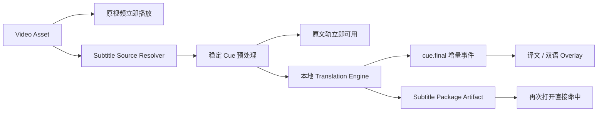

# 视频原文、译文与双语字幕设计

> 日期：2026-08-16
>
> 状态：设计草案，待确认后实施
>
> 范围：Video Workbench 的字幕轨展示、本地中英翻译、后台进度、缓存、导出与可选模型安装。
> 上游 ASR 执行链、声音克隆、视频摘要和媒体问答不在本轮实现范围内；已经完成的
> ASR 模型实测与外部依赖决策记录在
> [媒体字幕外部依赖与模型总表](./2026-08-16-media-subtitle-runtime-dependencies.md)。

## 1. 决策摘要

本轮采用以下主线：

1. Video Workbench 提供 `关闭 / 原文 / 译文 / 双语` 四种明确字幕模式。
2. “双语”不是一份独立维护的文本，而是同一组稳定时间 Cue 上的原文轨与译文轨组合视图。
3. 用户当前看到的模式必须长期可见，不能仅靠一次性 Toast 提示。
4. 双语模式缺少某条译文时，第二行显示“正在翻译…”或明确失败状态；不得静默退化成单语。
5. 翻译采用已经本机验证过的本地模型：
   - 默认快速档：Mozilla Bergamot；
   - 可选高质量档：Tencent Hy-MT2-1.8B Q4；
   - Argos OPUS-MT 只保留为 Demo 性能基线，不进入产品。
6. 字幕翻译是确定性的本地媒体处理，不经过 `TaskDefinition → GenerationTask → AgentProvider`。
7. 播放永远不等待 ASR、翻译或模型安装；所有字幕作业在 Main 侧后台执行。
8. 完成结果是可重建的 Asset Artifact。用户导出的 SRT 才是显式文件；不会为了三种展示模式长期保存三份互相可能漂移的正文。

这一决策取代现有 Media AI 架构图中“字幕翻译可以走 AgentProvider”的早期占位
描述。本地 Engine 是正式主路；未来若增加云端翻译，也只能实现相同的
Translation Engine 契约，不能让 Video Workbench 改走另一套数据模型。

完整模型实测数据见
[中英字幕本地翻译模型选型记录](../../../demos/subtitle-translation/docs/model-selection.md)。

## 2. 背景

现有 Video Workbench 已经支持：

- 原视频立即播放；
- 播放位置、音量、静音和倍速恢复；
- `video.time-range` Anchor；
- Workbench Main / Renderer 双注册与受控内容 URL。

独立 Demo 已经验证：

- SRT 解析、短片段合并和稳定时间轴；
- 中英双向本地翻译；
- 原文、译文和双语 SRT 导出；
- 每条 Cue 完成事件；
- Bergamot、Argos 与 Hy-MT2 的真实耗时、内存和质量差异。

现在需要把 Demo 结论转换成符合 Learning Companion 数据生命周期和
Workbench 所有权边界的正式方案。

## 3. 目标

1. 用户可以随时在四种字幕模式间切换。
2. 原字幕可用后立即显示，不等待整段翻译。
3. 译文以 Cue 为单位增量到达，当前播放位置优先。
4. 明确区分原文、机器译文、双语、生成中和失败状态。
5. 字幕作业不阻塞视频播放、Asset 切换或 Workbench 卸载。
6. 同一视频修订、字幕修订、模型版本和预处理版本命中缓存时不重复计算。
7. 支持取消、继续、失败重试和应用重启后的有限恢复。
8. 支持导出原文、译文和双语 SRT。
9. 默认方案无需独显；高质量模型像 LibreOffice 一样由用户按需安装。
10. 保持 Video Workbench 拥有字幕语义，通用 Host、Preload 和 Artifact 基建只承担运输与生命周期。

## 4. 非目标

本轮不实现：

- ASR 引擎正式产品化；
- OCR、说话人分离或角色标记；
- 云端翻译 API；
- Agent 对字幕进行润色；
- 声音克隆和翻译配音；
- 字幕时间轴编辑器；
- 多人协作字幕；
- 把字幕正文保存为 Attachment；
- 为 Audio Workbench 提前建立通用媒体 Workbench 基类。

Video 的实现稳定后，纯字幕契约和翻译 Engine 可以被 Audio Workbench 复用，
但 Audio 仍保留自己的 Workbench、状态和交互实现。

## 5. 用户体验

### 5.1 字幕模式

```ts
type VideoSubtitleDisplayMode =
  | 'off'
  | 'source'
  | 'translated'
  | 'bilingual';
```

| 模式 | 画面 | 播放器中的持续标识 |
| --- | --- | --- |
| 关闭 | 不显示字幕 | `字幕：关闭` |
| 原文 | 只显示源字幕 | `字幕：原文 · 英语`；ASR 来源追加 `自动识别` |
| 译文 | 只显示目标语言 | `字幕：译文 · 中文 · 机器翻译` |
| 双语 | 第一行原文，第二行译文 | `字幕：双语 · 英→中` |

持续标识放在播放器字幕按钮或紧邻它的模式选择器中。切换时可以额外显示短暂
Toast，但 Toast 不能成为唯一提示。

### 5.2 首次打开规则

按以下顺序决定初始模式：

1. 恢复该 Asset 的 `VideoWorkbenchState`；
2. 没有历史状态且译文已经缓存时，默认选择“双语”；
3. 没有译文但原字幕已经可用时，显示“原文”，并在字幕菜单中明确显示
   `译文尚未生成`；
4. 原字幕也不存在时，显示 `字幕准备中`，视频继续播放；
5. 用户主动选择“关闭”后保持关闭，不因后台任务完成自动打开字幕。

### 5.3 非双语状态的明确反馈

可以，而且必须做到：

- 用户主动选择“原文”：模式选择器持续显示 `原文`，不重复打扰；
- 用户主动选择“译文”：持续显示 `机器翻译`，避免把译文误认为原视频字幕；
- 用户选择“双语”，但某条译文尚未完成：原文正常显示，第二行显示
  `正在翻译…`；
- 用户选择“双语”，翻译任务失败：原文继续显示，第二行显示
  `译文生成失败`，菜单提供“重试”；
- 用户选择“译文”，但当前 Cue 尚未完成：临时显示原文，并带
  `原文 · 译文生成中` 标签，不能无提示地把原文伪装成译文；
- 翻译组件未安装：字幕菜单显示所需体积、当前路径和“安装快速翻译组件”；
- 源语言与目标语言相同：禁用“译文”和“双语”，说明“请选择不同的目标语言”。

### 5.4 字幕排版

- 双语模式固定原文在上、译文在下；
- 两行使用不同但低干扰的字重或颜色，不能只依赖颜色区分；
- 字幕允许换行，不能以省略号截断学习内容；
- 内容过长首先由预处理重新分 Cue，Overlay 只负责安全区内排版；
- 字幕区域随内容向上扩展，不能遮住播放控制条；
- 机器译文标识不需要每个 Cue 重复出现，只需在持续模式标识中展示。

### 5.5 自动预处理

源字幕轨稳定后，如果满足以下条件，自动在后台生成译文：

- 应用设置开启“自动准备翻译字幕”；
- 源语言与默认目标语言不同；
- 所选翻译组件已经安装且可用；
- 当前指纹没有有效缓存或正在运行的同键作业。

组件未安装时不自动弹出阻塞式安装窗口，只在字幕菜单中显示一次明确的安装入口。
`字幕：关闭` 只影响展示，不取消已经开始的后台预处理；用户需要通过“取消翻译”
显式释放作业。

## 6. 总体流程



约束：

- `PLAY` 不依赖图中任何其他节点；
- 只有已经稳定的源 Cue 才进入翻译；
- 当前播放时间附近的 Cue 优先于全片后台 Cue；
- Workbench 关闭只取消订阅，不自动取消 Asset 级后台任务；
- 用户显式取消、Asset 删除或 Project 删除才终止相应任务。

## 7. 字幕来源边界

翻译链只依赖统一的 `SubtitleSourceTrack`，不关心字幕来自哪里：

```ts
type SubtitleTrackOrigin = 'embedded' | 'sidecar' | 'asr';

interface SubtitleSourceCueV1 {
  readonly id: string;
  readonly startMs: number;
  readonly endMs: number;
  readonly text: string;
  readonly sourceCueIds: readonly string[];
}

interface SubtitleSourceTrackV1 {
  readonly version: 1;
  readonly trackId: string;
  readonly language: 'en' | 'zh-Hans';
  readonly origin: SubtitleTrackOrigin;
  readonly revision: string;
  readonly cues: readonly SubtitleSourceCueV1[];
}
```

来源优先级：

1. 用户明确选择的外挂字幕；
2. 视频内嵌且语言匹配的字幕；
3. 已缓存的本地 ASR Artifact；
4. 启动本地 ASR 作业。

语言无法可靠确定时，要求用户选择，不能静默猜测后开始整片翻译。

## 8. Cue 预处理

沿用 Demo 已验证的基线：

- 相邻间隔不超过 `700ms`；
- 合并后持续时间不超过 `8s`；
- 中文默认不超过 `64` 字符；
- 英文默认不超过 `180` 字符；
- 遇到完整句末标点立即结束当前组；
- 保留合并前的 `sourceCueIds`，便于回溯 ASR 和以后局部重算。

这些参数属于 `subtitlePreprocessingVersion`。任何规则变化都必须改变版本，
从而使旧翻译缓存失效。

ASR 可能产生 `生成式 AI → 生成是 AI`、专名同音字等错误。翻译层不承担
猜测和修复源文本的职责。以后可以在预处理阶段加入可版本化的专名词典或用户
校正，但不得把不可追溯的“自动润色”塞进翻译结果。

## 9. Artifact 数据结构

完成结果使用一份自包含的 Subtitle Package：

```ts
type SubtitleTranslationProfile = 'fast' | 'quality';

interface SubtitleTranslationCueV1 {
  readonly sourceCueId: string;
  readonly text: string;
}

interface SubtitleTranslationTrackV1 {
  readonly trackId: string;
  readonly sourceTrackId: string;
  readonly sourceTrackRevision: string;
  readonly sourceLanguage: 'en' | 'zh-Hans';
  readonly targetLanguage: 'en' | 'zh-Hans';
  readonly profile: SubtitleTranslationProfile;
  readonly modelId: string;
  readonly modelVersion: string;
  readonly translations: readonly SubtitleTranslationCueV1[];
}

interface VideoSubtitlePackageV1 {
  readonly version: 1;
  readonly source: SubtitleSourceTrackV1;
  readonly translation: SubtitleTranslationTrackV1;
  readonly preprocessingVersion: string;
  readonly generatedTime: number;
}
```

设计约束：

- 译文只通过 `sourceCueId` 关联原 Cue，不复制时间轴；
- Package 内嵌生成时的源 Cue 快照，保证结果可复现；
- 双语轨在读取时组合，不额外维护第三份正文；
- 原文、译文和双语 SRT 都由同一个 Package 确定性导出；
- 完整 Artifact 不允许缺少 Cue。单 Cue 连续重试失败时，任务保持失败或可继续
  状态，不提交一个看似成功但中间有空洞的翻译 Artifact。

Artifact 标识建议：

```text
producerId: builtin.video.subtitle-package
artifactKey: subtitles.<sourceLanguage>.<targetLanguage>.<profile>
mediaType: application/vnd.learning-companion.video-subtitles+json
```

`sourceRevision` 使用以下内容的稳定 Hash：

```text
video source revision
+ source track revision
+ source language / target language
+ preprocessing version
+ translation profile
+ model id / model version
```

这样模型升级、字幕纠错、视频替换或预处理规则改变都会正确重建；单纯切换
`原文 / 译文 / 双语` 不会触发任何计算。

## 10. 任务状态与增量事件

```ts
type SubtitleTranslationJobState =
  | 'idle'
  | 'runtime-required'
  | 'queued'
  | 'loading-model'
  | 'translating'
  | 'ready'
  | 'cancelled'
  | 'failed';

interface SubtitleTranslationSnapshot {
  readonly assetId: string;
  readonly state: SubtitleTranslationJobState;
  readonly profile: SubtitleTranslationProfile;
  readonly sourceLanguage: 'en' | 'zh-Hans';
  readonly targetLanguage: 'en' | 'zh-Hans';
  readonly completedCues: number;
  readonly totalCues: number;
  readonly translatedCues: Readonly<Record<string, string>>;
  readonly errorCode?: string;
}
```

事件只需要三类：

```text
video:subtitle-snapshot
video:subtitle-cue-final
video:subtitle-job-finished
```

不把模型 token delta 传给 Renderer。字幕展示需要的是完整、可读、可定位的
Cue，而不是每几个字符闪动一次的 token 流。

Workbench IPC 增加一条通用的 Main → Renderer `WorkbenchEvent` 运输通道：

- Event 只包含 `sessionId + type + JsonValue payload`；
- Host、Preload 和 Runtime 只校验并运输，不理解字幕语义；
- Video Workbench 自己验证并解释 `video:subtitle-*`；
- 一个 Asset 有多个活动 Session 时都能收到进度；
- 新 Session 通过 Bootstrap Payload 取得当前完整 Snapshot，不依赖补收旧事件。

## 11. Workbench 状态

`VideoWorkbenchState` 升级为 V2：

```ts
interface VideoSubtitleViewStateV1 {
  readonly displayMode: VideoSubtitleDisplayMode;
  readonly targetLanguage: 'en' | 'zh-Hans';
  readonly profile: SubtitleTranslationProfile;
}

interface VideoWorkbenchStateV2 {
  readonly viewState: VideoWorkbenchViewState;
  readonly subtitleState: VideoSubtitleViewStateV1;
}
```

规则：

- V1 状态读取时补上默认字幕状态，不修改既有播放状态；
- `displayMode` 是 Asset + Workbench 级偏好；
- 默认目标语言和默认质量档可以来自应用设置，但用户在单个 Asset 上的选择写入
  Workbench State；
- 状态只保存用户选择，不保存完整字幕或作业进度；
- 作业 Snapshot 来自 `VideoSubtitleService`，完成正文来自 Artifact。

应用设置只提供新 Asset 的默认值：

```ts
interface SubtitleTranslationPreferences {
  readonly autoPrepare: boolean;
  readonly defaultTargetLanguage: 'en' | 'zh-Hans';
  readonly defaultProfile: SubtitleTranslationProfile;
}
```

默认建议为 `autoPrepare: true`、目标语言跟随应用界面语言、
`defaultProfile: 'fast'`。默认值不会覆盖已经写入某个 Asset Workbench State 的选择。

## 12. 模型与运行时策略

### 12.1 默认快速档：Bergamot

- 本次双向模型和 WASM 运行时约 `120 MiB`；
- 参考机器 CPU 翻译 20 分钟字幕：英→中约 `8.5s`，中→英约 `7.2s`；
- 冷首条约 `0.42–0.58s`；
- 译文可理解，但偶有直译和不自然表达；
- WASM 峰值工作集较高，必须放入一次性 Utility Process，任务结束后销毁，
  不能常驻 Renderer 或 Electron Main。

英中双向包随用户选择的媒体字幕配套包一次安装。其他语言按后续真实需求扩展，
不能因为上游模型目录中存在就宣称已经支持。

### 12.2 可选使用的高质量档：Hy-MT2-1.8B Q4

- 模型和 Vulkan 运行时约 `1.15 GiB`；
- 参考机器 GPU 翻译 20 分钟字幕：英→中约 `17s`，中→英约 `13.3s`；
- 首 Cue 含冷加载约 `1.5–1.7s`；
- CPU 英→中约 `121s`，可以后台使用，但不应描述为快速模式；
- 术语、信息完整性和自然度明显优于 Bergamot。

调用方式必须是：

- 一个目标 Cue 一次请求；
- 前一 Cue 与后一 Cue只作为背景；
- 只允许模型输出当前 Cue 的纯译文；
- 并发 `2–4` 路；
- 不要求一次返回整批 JSON、标记符或固定长度数组。

实测整批结构化输出会合并、遗漏 Cue、用空字符串凑长度，长时间运行后还可能
产生损坏 JSON，因此不能用于正式链路。

### 12.3 不采用 Argos

Argos OPUS-MT 虽然在参考机器上只需约 `2.4–3s` 处理 20 分钟字幕，但出现过
乱码、漏译和明显生硬表达。速度优势不足以抵消字幕可信度问题。

### 12.4 安装体验

字幕能力作为一个完整组件注册到现有 External Library 基建：

```text
视频/音频字幕组件
  自动检测硬件并安装唯一适用的完整配套包
  CPU：SenseVoice + FSMN-VAD                   约 1.50 GiB
  NVIDIA：Whisper Large-v3-turbo + Silero VAD 约 2.43 GiB
```

External Library Definition 需要表达多来源 Bundle 与同组件多运行版本：

- Bergamot 的模型、词表和 shortlist 文件集合；
- Hy-MT2 的 llama.cpp Runtime ZIP 与 GGUF 模型两个来源。

实施时应把 Package 扩展为受信任资源列表，每个资源独立固定 URL、大小和
SHA-256，并增加 `zip`、`gzip` 与普通文件安装能力。LibreOffice 仍走既有
Definition，不保留两套并行下载流程。Renderer 只能提交 Library ID，不能提交
硬件档位或资源 URL。具体资源配置由 Main 的硬件检测结果和 Workbench 注册的内部
Profile 决定。

要求：

- 固定官方来源、精确版本和 SHA-256；
- 沿用 `<Documents>/Learning Companion/externalLib`；
- 设置页只显示一个组件卡片、自动计算的体积、状态、安装、移除和修复；
- 一次安装包含媒体解码、当前硬件唯一适用的识别引擎、快速翻译与高质量翻译；
- Workbench 请求字幕领域能力，不获得任意外部资源 URL；
- 任务选择快速或高质量翻译时不再触发第二次模型安装；
- 不静默从高质量档降级为快速档，除非用户显式开启“不可用时使用快速档”。

## 13. Main 侧职责

第一阶段不建立覆盖所有媒体任务的巨大调度框架，只增加字幕所需的最小模块：

```text
src/workbenches/video/
├── shared.ts
├── main.ts
├── renderer.tsx
├── renderer-actions.ts
└── subtitles/
    ├── contracts.ts
    ├── subtitle-source-track-resolver.ts
    ├── video-subtitle-service.ts
    ├── video-subtitle-artifact-producer.ts
    ├── subtitle-translation-engine.ts
    ├── bergamot-translation-engine.ts
    ├── hymt2-translation-engine.ts
    ├── subtitle-package-file.ts
    ├── subtitle-overlay.tsx
    └── subtitle-controls.tsx
```

所有 Video 特化注册仍从 `src/workbenches/video/main.ts` 和 Renderer 注册入口进入，
应用 Bootstrap 不创建或命名 `Epub/Video` 专属 Service。

### VideoSubtitleService

- 以 Asset 为单位维护活动作业和 Snapshot；
- 解析当前源字幕轨；
- 选择 Translation Engine；
- 当前播放位置附近 Cue 优先；
- 控制并发、取消、继续和失败重试；
- 调用 `AssetArtifactService` 查询与提交最终 Package；
- 调用 `getOrCreate()` 时由 Service 自己持有后台 consumer，不把 Workbench
  Session 的 AbortSignal 当成作业生命周期；
- 将 Snapshot 发布给当前 Video Session；
- Workbench 关闭后仍可继续后台作业；
- Asset / Project 删除时停止任务并清理受控 checkpoint；
- Project 切换或卸载时保存 checkpoint 并停止该 Project 的进程；Project 再次
  激活后按相同作业键恢复，不能为了继续翻译而长期持有已卸载 Project 的数据库。

### VideoSubtitleArtifactProducer

- 实现现有 `AssetArtifactProducer`；
- 通过注入的 `SubtitleSourceTrackResolver` 取得稳定源轨；
- 只在 staging 中写候选 Package；
- 校验 Cue 一一对应、文本非空、顺序与语言元数据；
- 完成后交给 `AssetArtifactService` 原子提交；
- 不直接写数据库，不向 Renderer 暴露路径。

字幕文件很小，Package 内保留一份源 Cue 快照比新增通用 Artifact 依赖图更直接。
本轮不为了这一项功能扩展全局 Artifact DAG 抽象。

## 14. Renderer 与命令

Video Workbench Bootstrap Payload 增加：

```ts
interface VideoWorkbenchPayloadV2 {
  readonly contentUrl: string;
  readonly viewState: VideoWorkbenchViewState;
  readonly subtitleViewState: VideoSubtitleViewStateV1;
  readonly subtitleSnapshot: SubtitleTranslationSnapshot;
  readonly subtitlePackage?: VideoSubtitlePackageV1;
}
```

建议命令：

```text
video:save-view-state
video:set-subtitle-mode
video:set-subtitle-target-language
video:set-subtitle-profile
video:ensure-subtitles
video:cancel-subtitle-job
video:resume-subtitle-job
video:retry-subtitle-job
video:export-subtitles
```

Renderer 只提交枚举值、语言、Session 和导出意图，不提交模型路径、命令行、
下载 URL 或本地视频路径。

## 15. 调度、取消与恢复

作业键：

```text
assetId
+ source track revision
+ source/target language
+ profile
+ model version
+ preprocessing version
```

同键只允许一个活动作业，多个 Workbench Session 共享 Snapshot。

优先级：

1. 当前播放 Cue；
2. 当前时间前后各若干 Cue；
3. 从当前位置向后；
4. 剩余更早 Cue。

Bergamot 足够快，可以直接完成整片；Hy-MT2 仍使用上述优先队列改善跳播体验。

恢复策略：

- 每完成一小批 Cue，将 `sourceCueId → translatedText` 原子写入受控
  `translation.partial.json`；
- checkpoint 位于
  `.learning-companion/recovery/video-subtitles/<assetId>/<jobHash>.partial.json`，
  不进入 Asset 列表；
- 应用重启后只有作业键完全一致才恢复；
- 用户取消后保留 checkpoint，并显示“继续”；
- 用户选择“重新开始”才清除 checkpoint；
- 完整 Package 提交后删除 checkpoint；
- Asset 或 Project 删除时由 VideoSubtitleService 清理对应 checkpoint。

## 16. SRT 导出

导出选项：

```text
原文字幕        <video-name>.<source-language>.srt
翻译字幕        <video-name>.<target-language>.srt
双语字幕        <video-name>.<source>-<target>.bilingual.srt
```

规则：

- 使用同一 Package 和同一时间轴生成；
- 双语 SRT 每个 Cue 固定原文在上、译文在下；
- 不修改源视频文件；
- 导出位置使用现有文件选择目录记忆；
- 译文未完整完成时禁用译文和双语导出，并给出完成数，不生成有空洞的 SRT；
- 导出文件是用户拥有的普通文件，不自动作为新 Asset 导入；后续可以另加
  “导出并加入 Project”。

## 17. 错误与降级

| 错误 | Video 播放 | 原文轨 | UI 行为 |
| --- | --- | --- | --- |
| 没有字幕来源 | 不受影响 | 不可用 | 提供生成原字幕入口 |
| ASR 失败 | 不受影响 | 不可用 | 显示失败原因和重试 |
| 翻译组件未安装 | 不受影响 | 可用 | 原文继续，提示安装 |
| 模型加载失败 | 不受影响 | 可用 | 保留 checkpoint，提供修复/重试 |
| 单 Cue 翻译失败 | 不受影响 | 可用 | 自动有限重试，最终任务失败但可继续 |
| 用户取消 | 不受影响 | 可用 | 显示已取消和“继续” |
| Artifact 损坏 | 不受影响 | 视源轨而定 | 删除失效索引并重建 |

不能使用泛化的“操作未完成”作为唯一错误。至少区分：运行时缺失、模型损坏、
内存不足、设备后端不可用、源语言不支持、用户取消和数据校验失败。

## 18. 性能与资源验收

播放链：

- 打开到可播放时间不得因字幕组件是否安装而变化；
- 翻译进程不得运行在 Renderer；
- 切换 Asset 和 Workbench 不等待模型进程退出。

参考机器基线：

| 档位 | 20 分钟英→中 | 首 Cue（含冷加载） | 验收定位 |
| --- | ---: | ---: | --- |
| Bergamot CPU | 约 8.5s | 约 0.42s | 默认快速档 |
| Hy-MT2 Vulkan | 约 17s | 约 1.53s | 高质量 GPU 档 |
| Hy-MT2 CPU | 约 121s | 约 2.35s | 后台慢速质量档 |

正式验收还要补：

- 8 GiB / 16 GiB 普通 Windows 机器；
- 无独显 Windows；
- macOS ARM64 Metal；
- 课程、访谈、影视、中英混说和技术专名素材；
- 并发播放、字幕翻译和其他后台任务时的 RAM / VRAM 峰值；
- 取消后资源释放和再次启动时间。

## 19. 测试要求

### Shared Contract

- 四种显示模式验证；
- Workbench V1 → V2 默认迁移；
- Subtitle Package、Source Track、Translation Track 验证；
- Cue ID 唯一、一一对应、时间有序和文本非空；
- 非法语言、模型 Profile 和 Snapshot 拒绝。

### 预处理

- 英文碎片合并到完整句；
- 中文无标点内容受到时长和字符上限约束；
- 长静音不合并；
- 保留全部 `sourceCueIds`；
- 不改变首尾时间；
- 空字幕和重叠字幕明确失败。

### Translation Engine

- Fake Engine 验证并发、优先级、取消和重试；
- Bergamot Utility Process 启动、结果、崩溃和内存回收；
- Hy-MT2 Prompt 只翻译当前 Cue；
- Hy-MT2 空结果、带代码块、带标签和超时处理；
- 同一 Cue 不因重试重复提交；
- 不把前后文误写入目标 Cue。

### Artifact 与恢复

- 相同指纹命中缓存；
- 源字幕、模型或预处理版本变化触发重建；
- staging 失败不替换旧 Artifact；
- checkpoint 原子保存和恢复；
- 错误作业键不复用旧 checkpoint；
- 完成后清理 checkpoint；
- Asset / Project 删除清理任务与文件。

### Renderer

- 四种模式画面正确；
- 模式标识持续可见；
- 双语缺译文时显示明确占位；
- 译文模式不会把原文无提示伪装成译文；
- 字幕换行但不省略正文；
- 翻译进行中仍可播放、跳播、切换 Asset；
- 切换模式不触发重复翻译；
- 翻译失败、取消、未安装和完成状态可操作；
- Session 重开从 Bootstrap 恢复当前 Snapshot。

### 可选真实模型测试

真实模型测试只在本机明确安装模型且设置测试环境变量时运行，不进入普通 CI：

- 固定短样本英→中和中→英；
- 验证输出非空、Cue 数一致、时间轴一致；
- 记录模型版本、耗时和峰值工作集；
- 不把大型模型、下载缓存和结果文件提交到 Git。

## 20. 实施顺序

1. 定义 Subtitle Contract、四种显示模式和 Workbench State V2。
2. 使用 Fake Package 完成 Video Subtitle Overlay 与模式状态反馈。
3. 接入 `SubtitleSourceTrackResolver`，先读取现成 SRT / ASR Demo 产物。
4. 建立 `VideoSubtitleService`、通用 Workbench Event 运输和 Fake Engine 测试。
5. 注册一个自动适配硬件的完整字幕组件，接入 External Library 安装与 Utility Process。
6. 生成并缓存正式 Subtitle Package，完成原文、译文和双语 SRT 导出。
7. 接入已随配套包安装的 Hy-MT2 高质量处理、checkpoint、继续与失败重试。
8. 完成普通 Windows、无独显和 macOS ARM64 的性能与资源验收。

## 21. 已确认与待确认

已确认：

- 原文、译文、双语和关闭必须是明确模式；
- 非双语状态必须有持续标识；
- 原文轨始终独立保留，翻译失败不影响播放和原文；
- 默认快速档使用 Bergamot；
- 高质量档使用 Hy-MT2-1.8B Q4，并随所选字幕配套包一次安装；
- 翻译以 Cue final 流式交付，不使用 token delta；
- 翻译结果是 Artifact，不是 GenerationTask 或 Attachment；
- Workbench 关闭不取消 Asset 级后台预处理。

实施前仍需产品确认：

1. 第一次没有历史状态时，译文就绪后是否自动从“原文”切到“双语”。本设计
   建议不自动切换，只在下一次打开时默认双语，避免观看过程中突然改变画面。
2. 字幕导出后是否提供“同时加入当前 Project”。本设计建议首版只导出文件，
   避免把侧车字幕提前建模成新的 Asset 类型。
